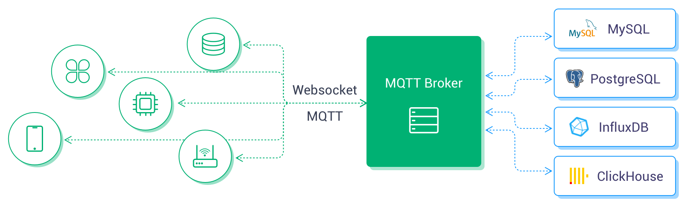
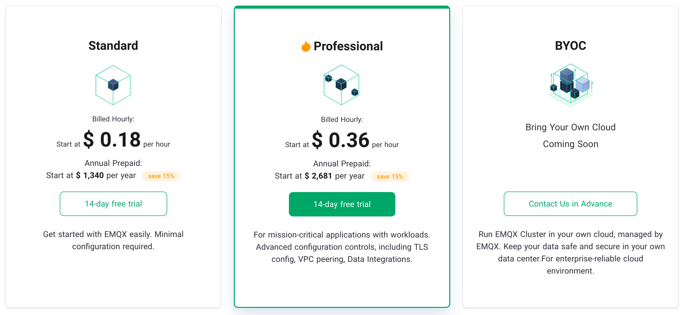
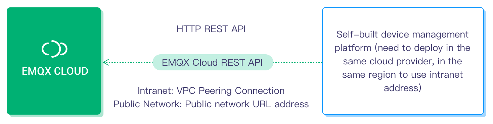

# EMQ X Cloud Product Description

EMQ X Cloud is an MQTT messaging middleware product for the IoT domain from EMQ. As the world's first fully managed MQTT 5.0 public cloud service, EMQ X Cloud provides a one-stop O&M colocation and a unique isolated environment for MQTT messaging services. In the era of the Internet of Everything, EMQ X Cloud can help you quickly build industry applications for the IoT domain and easily collect, transmit, compute, and persist IoT data.

With the infrastructure provided by cloud providers, EMQ X Cloud serves dozens of countries and regions around the world, providing low-cost, secure, and reliable cloud services for 5G and Internet of Everything applications.

## IoT Messaging Model

### *Two-way communication*

EMQ X Cloud supports massive devices and application-side connectivity, providing secure and reliable two-way communication for applications and IoT devices:

In this model, EMQ X Cloud provides MQTT services to connect massive devices and applications. It supports two-way communication between applications and devices and two-way communication between devices and devices. This model is suitable for IoT applications with instant communication requirements, such as the smart home scenario, where the cell phone APP gets the status information of smart devices. Users can send control commands to smart devices through APP. Another example, in industrial scenarios, AGV robots communicate with each other instantly via the MQTT protocol to achieve multi-robot collaboration. The MQTT service supports not only the standard MQTT protocol, but also MQTT over WebSocket, CoAP, MQTT-SN, LwM2M, JT, /T808, etc.

### *Data Collection*

EMQ X Cloud supports device data on the cloud. With the support of massive topics and rule engine, data collection, filtering, transformation, calculation, and persistence can be achieved with low code.

In this model, the MQTT service provided by EMQ X Cloud enables data collection, computation, and persistence. This model is suitable for IoT applications with data collection and persistence requirements, such as: in industrial scenarios, each IoT sensor collects real-time data to the edge gateway, uploads the data to the MQTT server through the edge gateway, and then the rule engine triggers data filtering, transformation, and simple calculation, and forwards the final result to other services or persists to the target database. EMQ X Cloud provides a variety of access solutions for different functionalities of the network, industrial, and edge devices, and supports more than 70 industrial protocols.

### *Hybrid Model*

EMQ X Cloud provides MQTT services to support hybrid applications with two-way communication and data collection models. Through capabilities such as shared subscriptions and rule engines, data is persisted while flowing from object to object and from object to application.

In this model, the MQTT service provided by EMQ X Cloud not only bridges the gap between device and device, device and application but also persists the required data so that non-real-time applications can subsequently make use of the acquired data. Typical of these applications are artificial intelligence applications where the data acquired by the terminal needs to be sent to the cloud, where the computational model running in the cloud is calculated and fed back to the terminal, such as item or face recognition applications. At the same time, a copy of the data needs to be persisted in the database for subsequent offline training and improvement of the AI computational model.

## Product Plans

EMQ X Cloud comes in three plans, each with multiple specifications, and we support the deployment of your own fully managed MQTT service on the world's leading public clouds

1. Basic: For learning and experiencing the MQTT protocol or EMQ X Broker product, and developing lightweight IoT applications.
2. Professional: for building mission-critical IoT applications, this plan provides advanced features such as data persistence, message distribution, VPC peering connection.
3. Unlimited: Suitable for building enterprise-class IoT platform, providing support for multi-location and exclusive hardware deployment, and adding features such as device management, device shadowing, and thing model.

## Product Advantages

### Protocol support is complete

Supports MQTT v3.1, v3.1.1, and v5.0 protocol versions, the world's first public cloud service to support MQTT 5.0, MQTT WebSocket services, and full support for QoS0, QoS1, and QoS2 level MQTT messages.

### Fewer usage restrictions

Most public cloud IoT platforms have multiple usage restrictions, including the number of MQTT topics, message size, message rate, and access/communication modes. EMQ X Cloud has fewer usage restrictions, allowing you to integrate and use it without hindrance.

### Significant cost advantages

Charge per cluster instance and message traffic, not message count, and unlimited API and rule engine usage, so costs remain clear and manageable as your business scales.

### Fully managed operations and maintenance

Create a highly available MQTT clusters in minutes and start accessing devices immediately, followed by up to 7*24 technical support and operations by our global service support team and EMQ experts for the entire life cycle.

### High availability and data security

EMQ X Cloud Professional and Unlimited plans use a highly redundant cluster architecture to ensure high availability of services and guarantee your data security and business stability with a unique isolated environment. Each deployment cluster has its public IP, dedicated VPC network, independent EMQ X servers, and database servers, which is more secure and reliable.

### Multiple protocol access and private customization extensions

Supports multiple communication protocols including MQTT, MQTT-SN, CoAP, LwM2M, and private TCP protocols, covering various industry applications. It can customize private functions according to your special usage scenarios to fully meet business needs.

### Capacity estimation and scaling

Capacity is automatically estimated by the number of connections and message throughput, and the scaling plan is made through close monitoring, and the cluster size can be smoothly adjusted with the business scale.

### Flexible data flow solution

EMQ X Cloud Professional and Unlimited plans support real-time pre-processing of device event and message data, and storage to more than ten kinds of databases and messaging systems such as MySQL, Kafka, InfluxDB on the cloud.

## Product Capabilities

EMQ X Cloud, a fully managed EMQ X access platform service, provides device access, device management, message storage, and other capabilities.

### Device Access

Supports massive device connections to the cloud, providing stable and reliable two-way communication capabilities between devices and devices, and between devices and applications.

- Support standard MQTT protocol (including MQTT over WebSocket), using the standard MQTT client library to connect to the cloud
- Support CoAP, MQTT-SN, LwM2M protocol, and private TCP protocol access to meet the needs of various systems access to the cloud
- Provide different network devices and industrial/edge devices to access the cloud
- Open source multi-lingual/platform access sample code, providing cross-platform migration guidance
- Perfectly fits EMQ [edge computing](https://github.com/lf-edge/ekuiper), [edge industrial IoT](https://www.emqx.com/en/products/neuron) product ecology, supports dozens of industrial protocols to access the cloud

:::tip
Multi-protocol and private protocol support, please contact us by [ticket](./contact.md) for opening.
:::

### Device Management

EMQ X Cloud Basic and Professional plans provide rich REST APIs that allow users to integrate with their device management systems and IoT platforms through APIs and rule engines. The unlimited plan of EMQ X Cloud provides enterprise-class device management capabilities, allowing users to create and manage device objects directly with the enterprise plan, and manage edge endpoint devices and gateway devices with features unique to the unlimited plan such as device shadowing and cloud edge collaboration.

- **Device authentication information management**： The platform could add, delete, search, and update authentication information via REST API

- **Device online status view**：

  - The platform gets the list of online devices through REST API and queries whether the devices are online.
  - The platform rewrites the status of devices in the private database or sends it to the self-built service (Web service) when the devices are online or offline through the rule engine
  - Device offline alarm: Notify the platform when the device is offline and determine whether it needs to be alarmed

- **Device up/down history**:

  - The platform writes the up/down information to the private database or sends it to the self-built service (Web service) when the device is online or offline through the rule engine.
  - ACL Permission Management: The platform adds, deletes, checks, and changes ACL permissions through REST API.

- **Online device kick-off**: The platform kicks off the online device

- **Proxy subscription**: The platform subscribes or unsubscribes topics for online devices through the REST API

- **Publishing messages to devices**: The platform publishes messages to specified topics through REST API or MQTT access, and supports batch operation

- **Business statistics such as messages sent and received and number of connections**: Get the relevant statistics through REST API.

**Professional and Unlimited plans only**

- **Bridging/storage of device messages**: Store device events (up/down, subscribe/unsubscribe, message publishing) and message data to private databases (mainstream relational/non-relational, various temporal databases), message queues Kafka, and self-built web services via rule engine.

**Unlimited Plan only**

- **Device Shadowing**：Indirectly get the status of the device, whether it is offline or not, through device shadowing, and modify the device properties through device shadowing. Automatic synchronization of device shadow status when the device is online.
- **Edge Computing**: Create and manage edge gateways and end devices through the Unlimited plan management platform, and configure edge gateways and devices.

### Message Storage (Rule Engine)

EMQ X Cloud supports the use of the rule engine to configure rules for processing and responding to devise messages and events.

The rule engine not only provides a clear and flexible "configuration-based" business integration solution, but also simplifies the business development process, improves user ease of use, and reduces the coupling between business systems and EMQ X.

- **Send data to HTTP services and other MQTT services**:
  - Send data to Web services
  - Bridge data to MQTT Broker

**Professional and Unlimited plans only**

- **Save device event information, message data to database, drive business data with device events**:
  - Save data to MySQL
  - Save data to PostgreSQL
  - Save data to Cassandra
  - Save data to MongoDB
  - Save data to DynamoDB
  - Save data to Redis
  - Save data to ClickHouse
  - Save data to TDengine
  - Save data to OpenTSDB
  - Save data to TimescaleDB
  - Save data to InfluxDB

**Professional and Unlimited plans only**

- **Bridge data to Kafka, RabbitMQ, and other messaging and stream processing platforms**:
  - Bridge data to Kafka
  - Bridge data to Pulsar
  - Bridge data to RocketMQ
  - Bridge data to RabbitMQ
  - Bridge data to RPC services

**Professional and Unlimited plans only**

- **Consume messages and sent down to device, transaction-level platform commands sent down**
  - Consume messages from Kafka to EMQ X
  - Consume messages from Pulsar to EMQ X

## Use limitations

EMQ X Cloud has fewer usage restrictions than the public cloud IoT Hub platform. The limitations in the table below depend on the number of connections purchased and the hardware performance, and the corresponding parameters have been rigorously tested for performance by EMQ officials.

> The performance of the relevant items depends on the deployment specifications, and the specific data is subject to actual usage scenarios.

### Connected Communications

| **Limitation Description**         | **EMQ X**                                             | **Public Cloud IoT Hub**                     |
| -------------------- | ----------------------------------------------------- | -------------------------------------- |
| The maximum number of simultaneous online long connections  | Depends on specifications, choose from 1000-10M+, more than 200K please send tickets for application| 10K-500K                                 |
| Number of connections established per second     | 10K                                                   | 200-500                                |
| Number of topics subscribed to by a single client   | Unlimited                                                  | 10-100                                 |
| Single-client subscription requests per second  | Unlimited                                                  | 10-10K                                  |
| Single-client upstream message speed | Unlimited                                                  | QoS0: 30 messages/sec；QoS1: 10 messages/sec；QoS2: Not supported |
| Single-client message downstream     | Unlimited                                                  | 50-100 messages/sec                          |
| Single client throughput bandwidth per second | Unlimited                                                  | 512-1024KB                             |
| Single message length         | Default 1024KB 1-256MB. Adjustable on request                      | 256KB                                  |
| Maximum offline message storage length| Unlimited                                              | 1 week

### Topic Limitation

| **Limitation Description**              | **EMQ X**          | **Public Cloud IoT Hub**                              |
| ------------------------- | ------------------ | ----------------------------------------------- |
| Topic number               | Unlimited              | 50 single product                                     |
| Permissions                      | Customize | Devices can only subscribe to a limited number of their own Topics for message distribution |
| Subscribe/unsubscribe response time | Immediate             | 5-10 sec                                          |
