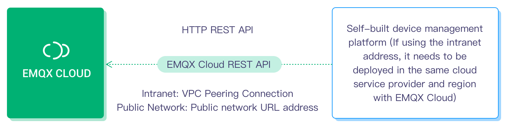

# Introduction of EMQ X Cloud Product 

As the world's first fully hosted MQTT 5.0 public cloud service, EMQ X Cloud provides one-step operation and maintenance management and a unique isolation environment for EMQ X access platform services. For customers who use EMQ X Cloud for the first time, we have prepared an opportunity for you to create a free trial deployment for up to **7** days.

EMQ X Cloud provides secure and reliable two-way communication capabilities for applications and IoT devices:

- It can connect a large number of devices , support device data to the cloud, and device communication;
- It can store device events and message data in various databases and stream processing systems, and supports calling cloud APIs to issue control commands to devices.

With the infrastructure provided by cloud service providers, EMQ X Cloud provides services to dozens of countries and regions around the world, providing low-cost, safe and reliable cloud services for 5G and IoT applications.

## Product capabilities

As a fully hosted EMQ X access platform service, EMQ X Cloud provides functions such as device access, device management, and message storage.

### Device access

It supports massive devices to connect to the cloud, and provides stable and reliable two-way communication capabilities between devices and devices, devices and applications.

- Support standard MQTT protocol (including MQTT over WebSocket), and connect to the cloud with standard MQTT client library
- Support CoAP, MQTT-SN, LwM2M protocol and private TCP protocol access to meet the cloud requirements of various systems
- Provide cloud access solutions on different network equipment, industrial/edge equipment
- Provide open source multi-language/platform access example code for cross-platform migration guidance
<!-- TODO: example 仓库 -->
- Perfectly fit EMQ product ecology of [Edge Computing](https://www.emqx.io/products/kuiper), [Edge Industrial Internet of Things](https://www.emqx.io/products/neuron), Support dozens of industrial protocols to connect to the cloud

::: tip
For multi-protocol and private protocol support, please contact [Tickets](./contact.md) for activation.
:::

### Device management

To ensure flexibility, EMQ X Cloud does not directly provide device management related functions, but opens up capabilities through REST API and rule engine. Users can choose the functions they need to integrate with their own device management system and IoT platform.

- **Device authentication information management: **The platform uses REST API to add, delete, check, and modify authentication information. 
- **View online status of device:**
    - The platform obtains a list of online devices through the REST API to check whether the device is online. 
    - The platform uses the rule engine to rewrite the status of the device in the private database or send it to a self-built service (Web service) when the device is online or offline.
- **Device offline alarm**: Notify the platform when the device is offline to determine whether an alarm is needed.
- **Device online and offline history:**
    - The platform uses the rule engine to write the online and offline information into a private database or send it to a self-built service (Web service) when the device is online or offline.
- **Device publish and subscribe to ACL permission management**: The platform uses the REST API to add, delete, check and modify ACL permissions.
- **Kick online device offline**: The platform kicked off online devices.
- **Proxy subscription**: The platform uses the REST API to subscribe or unsubscribe to topics for **online devices**. 
- **Publish a message to the device**: The platform publishes messages to specified topics through REST API or MQTT access, and supports batch operations.
- **Get device messages for bridging/storing**: Through the rule engine, device events (online and offline, subscription/unsubscription, message publishing) and message data are stored in private databases (mainstream relational/non-relational, various time series databases) , Message queue Kafka and self-built web services.
- **Business(such as message sending and receiving, connections) statistics**: Get relevant statistics through REST API. 

### Message storage (rule engine)

EMQ X Cloud supports the use of a rule engine to configure device message, process event, and response rules.

The rule engine not only provides a clear and flexible "configurable" business integration solution, but also simplifies the business development process, improves user ease of use, and reduces the coupling between the business system and EMQ X.

- **Send to HTTP service and other MQTT services**
  
  - Send data to web service
  - Bridge data to MQTT Broker
  
- **Save device event information and message data to the database, and use device events to drive business data**
  
  - Save data to MySQL
  - Save data to PostgreSQL
  - Save data to Cassandra
  - Save data to MongoDB
  - Save data to DynamoDB
  - Save data to Redis
  - Save data to ClickHouse
  - Save data to TDengine
  - Save data to OpenTSDB
  - Save data to TimescaleDB
  - Save data to InfluxDB
  
- **Bridge data to Kafka, RabbitMQ and other messaging and stream processing platforms**
  
  - Bridge data to Kafka
  - Bridge data to Pulsar
  - Bridge data to RocketMQ
  - Bridge data to RabbitMQ
  - Bridge data to RPC service
  
- **Consumption messages are issued to the device, and transaction-level platform instructions are issued**
  
  - Issue Kafka consumption message to EMQ X
  - Issue Pulsar consumption message to EMQ X
  
  

## Restrictions on use

Compared with the public cloud IoT Hub platform, EMQ X Cloud has fewer usage restrictions. The relevant restrictions in the following table depend on the number of connections purchased and hardware performance. The corresponding parameters have been rigorously tested by EMQ.

> In the following tables, the "no restriction" of EMQ X means that there are no technical restrictions. The performance of related items depends on the deployment specifications, and the specific data is subject to the actual use scenario.

#### Connection communication

| **Restriction description**                         | **EMQ X**                                                    | Public cloud IoT Hub                    |
| --------------------------------------------------- | ------------------------------------------------------------ | --------------------------------------- |
| Maximum number of simultaneous online connections   | It depends on specifications, 1000-1000W+ optional. For more than 20W, please contact us with ticket | 1W-50W                                  |
| Number of connections established per second        | 1W                                                           | 200-500                                 |
| Number of topics subscribed by a single client      | No restriction                                               | 10-100                                  |
| Subscription requests per second by a single client | No restriction                                               | 10-1W                                   |
| Uplink message speed by a single client             | No restriction                                               | QoS0：30/s QoS1：10/s QoS2：not support |
| Downlink message speed by a single client           | No restriction                                               | 50-100/s                                |
| Throughput bandwidth per second for a single client | No restriction                                               | 512-1024KB                              |
| Single message length                               | 1024KB by default. 1-256MB can be applied                    | 256KB                                   |
| Maximum storage time of offline messages            | No restriction by default                                    | 1 week                                  |

### Topic restriction

| **Restriction description**                         | **EMQ X**                       | Public cloud IoT Hub                                         |
| --------------------------------------------------- | ------------------------------- | ------------------------------------------------------------ |
| Number of Topic                                     | No restriction                  | 50 for Single product                                        |
| Permission                                          | Customize any topic permissions | The device can only publish and subscribe to its own limited number of topics |
| Subscription/unsubscription operation response time | immediately                     | 5-10 seconds                                                 |

## Product advantages

### Complete protocol support

It supports MQTT v3.1, v3.1.1 and v5.0 protocol versions. It is the world's first public cloud service that supports MQTT 5.0, supports MQTT WebSocket service, and fully supports QoS0, QoS1 and QoS2 level of MQTT messages.

### Fewer usage restrictions

Most public cloud IoT platforms have various usage restrictions, including the number of MQTT topics, message size, message rate, and access/communication mode. EMQ X Cloud has fewer usage restrictions, allowing you to integrate and use without hindrance.

### Significant cost advantage

It charges based on cluster instance and message traffic, not the number of messages, and the use of API and rule engines is not limited. The cost is still clear and controllable when the business is massively expanded.

### Fully hosted operation and maintenance

It can create a highly available MQTT cluster within a few minutes and immediately start device access. After that, our global service support team and EMQ experts will provide 7*24 uninterrupted operation and maintenance services throughout the entire life cycle. You can use tickets, emails, phone calls at any time to get quick responses.

### High availability and data security

It adopts a highly redundant cluster architecture to ensure high availability of services. It can ensure your data security and business stability through a unique isolation environment. Each deployed cluster has its own public IP, dedicated VPC network, independent EMQ X server and database server , Which is more secure and reliable.

### Multiple protocol access, customize function extension

It supports the access of multiple communication protocols including MQTT, MQTT-SN, CoAP, LwM2M, and private TCP protocols, covering various industry applications; the privatization function can be customized according to your special usage scenarios to fully meet business needs.

### Capacity estimation and scaling

The capacity is automatically estimated through the number of connections and message throughput, and the scaling plan is made through close monitoring. The cluster size can be smoothly adjusted according to the business scale.

### Flexible data stream solution

It supports real-time preprocessing of device event and message data, and store it in more than ten databases and message systems such as MySQL, Kafka, and InfluxDB on the cloud.

