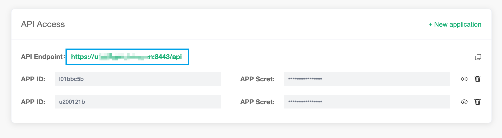
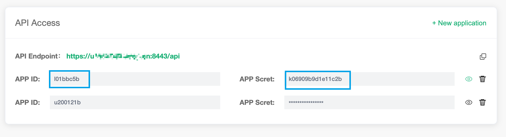

# REST API

EMQ X Cloud API follows the REST architecture, and you can access the functions of EMQ X programmatically.


### API address

You can get the API access address through the deployment details page.



If we want to get the information of all nodes, we can call it like this:

```bash
$ curl -i --basic -u j11c5ff1:qc47fd11fccf1644 -X GET "https://lacd0b7b.test-cn.emqx.cloud:8443/api/brokers"
```


### Interface security

HTTP API uses the method of [Basic authentication](https://en.wikipedia.org/wiki/Basic_access_authentication). The id and password must be filled in AppID and AppSecret respectively. You can modify and add AppID/AppSecret by creating an application access in the API access under the deployment details page.




### Response code

#### HTTP status codes

The EMQ X Broker interface always returns 200 OK when the call is successful, and the response content is returned in JSON format.

The possible status codes are as follows:

| Status Code | Description                                                  |
| ----------- | ------------------------------------------------------------ |
| 200         | Succeed, and the returned JSON data will provide more information |
| 400         | Invalid client request, such as wrong request body or parameters |
| 401         | Client authentication failed , maybe because of invalid authentication credentials |
| 404         | The requested path cannot be found or the requested object does not exist |
| 500         | An internal error occurred while the server was processing the request |

#### Result codes

The response message body of the EMQ X Broker interface is in JSON format, which always contains the returned `code`.

The possible result codes are as follows:

| Return Code | Description                                     |
| ----------- | ----------------------------------------------- |
| 0           | Succeed                                         |
| 101         | RPC error                                       |
| 102         | unknown mistake                                 |
| 103         | wrong user name or password                     |
| 104         | Empty username or password                      |
| 105         | User does not exist                             |
| 106         | Administrator account cannot be deleted         |
| 107         | Missing key request parameters                  |
| 108         | Request parameter error                         |
| 109         | Request parameters are not in legal JSON format |
| 110         | Plug-in is enabled                              |
| 111         | Plugin is closed                                |
| 112         | Client is offline                               |
| 113         | User already exists                             |
| 114         | Old password is wrong                           |
| 115         | Illegal subject                                 |

## API Endpoints

### Broker basic Information

#### Return basic information of all nodes in the cluster.

>  GET /brokers/{node}

**URL Path Parameters:**

| Name | Type   | Required | Description                                                  |
| :--- | :----- | :------- | :----------------------------------------------------------- |
| node | String | False    | Node name, such as "emqx@127.0.0.1".  If not specified, returns all node information |

**Success Response Body (JSON):**

| Name             | Type                    | Description                                                  |
| ---------------- | ----------------------- | ------------------------------------------------------------ |
| code             | Integer                 | 0                                                            |
| data             | Object/Array of Objects | Returns the information of the specified node when the parameter exists,  otherwise, returns the information of all nodes |
| data.datetime    | String                  | Current time, in the format of "YYYY-MM-DD HH: mm: ss"       |
| data.node        | String                  | Node name                                                    |
| data.node_status | String                  | Node status                                                  |
| data.otp_release | String                  | Erlang/OTP version used by EMQ X Broker                      |
| data.sysdescr    | String                  | Software description                                         |
| data.uptime      | String                  | EMQ X Broker runtime, in the format of "H hours, m minutes, s seconds" |
| data.version     | String                  | EMQ X Broker version                                         |

**Examples:**

Get the basic information of all nodes:

```bash
$ curl -i --basic -u j11c5ff1:qc47fd11fccf1644 -X GET "https://lacd0b7b.test-cn.emqx.cloud:8443/api/brokers"

{"data":[{"version":"develop","uptime":"4 hours, 21 minutes, 19 seconds","sysdescr":"EMQ X Broker","otp_release":"R21/10.3.5","node_status":"Running","node":"emqx@127.0.0.1","datetime":"2020-02-19 15:27:24"}],"code":0}
```

Get the basic information of node emqx@127.0.0.1 :

```bash
$ curl -i --basic -u j11c5ff1:qc47fd11fccf1644 -X GET "https://lacd0b7b.test-cn.emqx.cloud:8443/api/brokers/emqx@127.0.0.1"

{"data":{"version":"develop","uptime":"1 minutes, 51 seconds","sysdescr":"EMQ X Broker","otp_release":"R21/10.3.5","node_status":"Running","node":"emqx@127.0.0.1","datetime":"2020-02-20 14:11:31"},"code":0}
```


### Node

#### Get the status of the node

> GET /nodes/{node}

**URL Path Parameters:**

| Name | Type   | Required | Description                                                  |
| :--- | :----- | :------- | :----------------------------------------------------------- |
| node | String | False    | Node name, such as "emqx@127.0.0.1".  If not specified, returns all node information |

**Success Response Body (JSON):**

| Name                   | Type                    | Description                                                  |
| ---------------------- | ----------------------- | ------------------------------------------------------------ |
| code                   | Integer                 | 0                                                            |
| data                   | Object/Array of Objects | Returns node information when node parameter exists, otherwise, returns information about all nodes in an Array |
| data.connections       | Integer                 | Number of clients currently connected to this node           |
| data.load1             | String                  | CPU average load in 1 minute                                 |
| data.load5             | String                  | CPU average load in 5 minute                                 |
| data.load15            | String                  | CPU average load in 15 minute                                |
| data.max_fds           | Integer                 | Maximum file descriptor limit for the operating system       |
| data.memory_total      | String                  | VM allocated system memory                                   |
| data.memory_used       | String                  | VM occupied system memory                                    |
| data.node              | String                  | Node name                                                    |
| data.node_status       | String                  | Node status                                                  |
| data.otp_release       | String                  | Erlang/OTP version used by EMQ X Broker                      |
| data.process_available | Integer                 | Number of available processes                                |
| data.process_used      | Integer                 | Number of used processes                                     |
| data.uptime            | String                  | EMQ X Broker runtime                                         |
| data.version           | String                  | EMQ X Broker version                                         |

**Examples:**

Get the status of all nodes:

```bash
$ curl -i --basic -u j11c5ff1:qc47fd11fccf1644 -X GET "https://lacd0b7b.test-cn.emqx.cloud:8443/api/nodes"

{"data":[{"version":"develop","uptime":"7 seconds","process_used":315,"process_available":2097152,"otp_release":"R21/10.3.5","node_status":"Running","node":"emqx@127.0.0.1","memory_used":"96.75M","memory_total":"118.27M","max_fds":10240,"load5":"2.60","load15":"2.65","load1":"2.31","connections":0}],"code":0}
```

Get the status of the specified node:

```bash
$ curl -i --basic -u j11c5ff1:qc47fd11fccf1644 -X GET "https://lacd0b7b.test-cn.emqx.cloud:8443/api/nodes/emqx@127.0.0.1"

{"data":{"version":"develop","uptime":"2 minutes, 21 seconds","process_used":310,"process_available":2097152,"otp_release":"R21/10.3.5","node_status":"Running","node":"emqx@127.0.0.1","memory_used":101379168,"memory_total":123342848,"max_fds":10240,"load5":"2.50","load15":"2.61","load1":"1.99","connections":0},"code":0}
```


### Manage authentication data

#### View the authentication data that has been added

> GET /auth_user

**URL Query parameter:**

| Name   | Type    | Required | Default | Description                                                  |
| :----- | :------ | :------- | :------ | :----------------------------------------------------------- |
| _page  | Integer | False    | 1       | Page                                                         |
| _limit | Integer | False    | 10000   | The number of data items displayed on each page. If not specified, it is determined by the configuration item `max_row_limit` of the `emqx-management` plugin |

**Success Response Body (JSON):**

| Name                 | Type             | Description                             |
| :------------------- | :--------------- | :-------------------------------------- |
| code                 | Integer          | 0                                       |
| data                 | Array of Objects | All authentication data                 |
| data[0].login        | String           | Login Username                          |
| data[0].password     | String           | Login Password                          |
| data[0].is_superuser | Boolean          | Is super user or not                    |
| meta                 | Object           | 分页信息                                |
| meta.page            | Integer          | Page number                             |
| meta.limit           | Integer          | Number of data items displayed per page |
| meta.count           | Integer          | Total number of data                    |

**Example:**

```bash
$ curl -i --basic -u j11c5ff1:qc47fd11fccf1644 -X GET "https://lacd0b7b.test-cn.emqx.cloud:8443/api/auth_user"

{"meta":{"page":1,"limit":10,"count":3},"data":[{"password":"efa1f375d76194fa51a3556a97e641e61685f914d446979da50a551a4333ffd7","login":"test1","is_superuser":false},{"password":"efa1f375d76194fa51a3556a97e641e61685f914d446979da50a551a4333ffd7","login":"test2","is_superuser":false},{"password":"efa1f375d76194fa51a3556a97e641e61685f914d446979da50a551a4333ffd7","login":"test3","is_superuser":false}],"code":0}
```


#### Add authentication data in batch

> POST /auth_user

**Request message element (json):**

| Name            | Type    | Required | Description          |
| :-------------- | :------ | :------- | :------------------- |
| [0].login       | String  | True     | Login Username       |
| [0].password    | String  | True     | Login Password       |
| [0]is_superuser | Boolean | True     | Is super user or not |

**Success response message element (JSON):**

| Name | Type             | Description                                                  |
| :--- | :--------------- | :----------------------------------------------------------- |
| code | Integer          | 0                                                            |
| data | Array of Objects | Authentication data addition status, `ok` means the corresponding authentication data is added successfully |

**Example:**

```bash
$ curl -i --basic -u j11c5ff1:qc47fd11fccf1644 -X POST "https://lacd0b7b.test-cn.emqx.cloud:8443/api/auth_user" -d '[{"login":"test5","password":"public", "is_superuser": false}]'

{"data":{"test5":"ok"},"code":0}
```


#### Update the added authentication data

> PUT /auth_user/${login}

**Request message element  (json):**

| Name         | Type    | Required | Description          |
| :----------- | :------ | :------- | :------------------- |
| password     | String  | True     | Login Password       |
| is_superuser | Boolean | True     | Is super user or not |

**Success response message element (JSON):**

| Name | Type    | Description |
| :--- | :------ | :---------- |
| code | Integer | 0           |

**Example:**

```bash
$ curl -i --basic -u j11c5ff1:qc47fd11fccf1644 -X PUT "https://lacd0b7b.test-cn.emqx.cloud:8443/api/auth_user/test5" -d '{"password":"public1", "is_superuser": false}'

{"code":0}
```


#### Delete authentication data

> DELETE /auth_user/${login}

**Success response message element(JSON):**

| Name | Type    | Description |
| :--- | :------ | :---------- |
| code | Integer | 0           |

**Example:**

```bash
$ curl -i --basic -u j11c5ff1:qc47fd11fccf1644 -X DELETE "https://lacd0b7b.test-cn.emqx.cloud:8443/api/auth_user/test5"

{"code":0}
```


### Client

#### Get information of all clients in the cluster

> GET /clients

**URL Query Parameters:**

| Name   | Type    | Required | Default | Description                                                  |
| :----- | :------ | :------- | :------ | :----------------------------------------------------------- |
| _page  | Integer | False    | 1       | Page                                                         |
| _limit | Integer | False    | 10000   | The number of data displayed per page. If not specified, it is determined by the configuration item `max_row_limit` of the` emqx-management` plugin |

After version 4.1, multiple conditions and fuzzy queries are supported. The query parameters included are shown below.

| Name              | Type    | Required | Description                                                  |
| ----------------- | ------- | -------- | ------------------------------------------------------------ |
| clientid          | String  | False    | Client identifier                                            |
| username          | String  | False    | Client username                                              |
| zone              | String  | False    | Client configuration group name                              |
| ip_address        | String  | False    | Client IP address                                            |
| conn_state        | Enum    | False    | The current connection status of the client, the possible values are`connected`,`idle`,`disconnected` |
| clean_start       | Bool    | False    | Whether the client uses a new session                        |
| proto_name        | Enum    | False    | Client protocol name, the possible values are`MQTT`,`CoAP`,`LwM2M`,`MQTT-SN` |
| proto_ver         | Integer | False    | Client protocol version                                      |
| _like_clientid    | String  | False    | Fuzzy search of client identifier by substring method        |
| _like_username    | String  | False    | Client user name, fuzzy search by substring                  |
| _gte_created_at   | Integer | False    | Search client session creation time by  less than or equal method |
| _lte_created_at   | Integer | False    | Search client session creation time by  greater than or equal method |
| _gte_connected_at | Integer | False    | Search client connection creation time by  less than or equal method |
| _lte_connected_at | Integer | False    | Search client connection creation time by  greater than or equal method |

**Success Response Body  (JSON):**

| Name                      | Type             | Description                                                  |
| ------------------------- | ---------------- | ------------------------------------------------------------ |
| code                      | Integer          | 0                                                            |
| data                      | Array of Objects | Information for all clients                                  |
| data[0].node              | String           | Name of the node to which the client is connected            |
| data[0].clientid          | String           | Client identifier                                            |
| data[0].username          | String           | User name of client when connecting                          |
| data[0].proto_name        | String           | Client protocol name                                         |
| data[0].proto_ver         | Integer          | Protocol version used by the client                          |
| data[0].ip_address        | String           | Client's IP address                                          |
| data[0].port              | Integer          | Client port                                                  |
| data[0].is_bridge         | Boolean          | Indicates whether the client is connected via bridge         |
| data[0].connected_at      | String           | Client connection time, in the format of "YYYY-MM-DD HH:mm:ss" |
| data[0].disconnected_at   | String           | Client offline time, in the format of "YYYY-MM-DD HH:mm:ss"， This field is only valid and returned when `connected` is`false` |
| data[0].connected         | Boolean          | Whether the client is connected                              |
| data[0].zone              | String           | Indicate the configuration group used by the client          |
| data[0].keepalive         | Integer          | keepalive time, with the unit of second                      |
| data[0].clean_start       | Boolean          | Indicate whether the client is using a brand new session     |
| data[0].expiry_interval   | Integer          | Session expiration interval, with the unit of second         |
| data[0].created_at        | String           | Session creation time, in the format "YYYY-MM-DD HH:mm:ss"   |
| data[0].subscriptions_cnt | Integer          | Number of subscriptions established by this client           |
| data[0].max_subscriptions | Integer          | Maximum number of subscriptions allowed by this client       |
| data[0].inflight          | Integer          | Current length of inflight                                   |
| data[0].max_inflight      | Integer          | Maximum length of inflight                                   |
| data[0].mqueue_len        | Integer          | Current length of message queue                              |
| data[0].max_mqueue        | Integer          | Maximum length of message queue                              |
| data[0].mqueue_dropped    | Integer          | Number of messages dropped by the message queue due to exceeding the length |
| data[0].awaiting_rel      | Integer          | Number of awaiting PUBREC packet                             |
| data[0].max_awaiting_rel  | Integer          | Maximum allowed number of awaiting PUBREC packet             |
| data[0].recv_oct          | Integer          | Number of bytes received by EMQ X Broker (the same below)    |
| data[0].recv_cnt          | Integer          | Number of TCP packets received                               |
| data[0].recv_pkt          | Integer          | Number of MQTT packets received                              |
| data[0].recv_msg          | Integer          | Number of PUBLISH packets received                           |
| data[0].send_oct          | Integer          | Number of bytes sent                                         |
| data[0].send_cnt          | Integer          | Number of TCP packets sent                                   |
| data[0].send_pkt          | Integer          | Number of MQTT packets sent                                  |
| data[0].send_msg          | Integer          | Number of PUBLISH packets sent                               |
| data[0].mailbox_len       | Integer          | Process mailbox size                                         |
| data[0].heap_size         | Integer          | Process heap size with the unit of byte                      |
| data[0].reductions        | Integer          | Erlang reduction                                             |
| meta                      | Object           | Paging information                                           |
| meta.page                 | Integer          | Page number                                                  |
| meta.limit                | Integer          | Number of data displayed per page                            |
| meta.count                | Integer          | Total number of data                                         |

**Examples:**

```bash
$ curl -i --basic -u j11c5ff1:qc47fd11fccf1644 -X GET "https://lacd0b7b.test-cn.emqx.cloud:8443/api/clients?_page=1&_limit=10"

{"meta":{"page":1,"limit":10,"count":1},"data":[{"zone":"external","recv_cnt":2,"max_mqueue":1000,"node":"emqx@127.0.0.1","username":"test","mqueue_len":0,"max_inflight":32,"is_bridge":false,"mqueue_dropped":0,"inflight":0,"heap_size":2586,"max_subscriptions":0,"proto_name":"MQTT","created_at":"2020-02-19 17:01:26","proto_ver":4,"reductions":3997,"send_msg":0,"ip_address":"127.0.0.1","send_cnt":0,"mailbox_len":1,"awaiting_rel":0,"keepalive":60,"recv_msg":0,"send_pkt":0,"recv_oct":29,"clientid":"example","clean_start":true,"expiry_interval":0,"connected":true,"port":64491,"send_oct":0,"recv_pkt":1,"connected_at":"2020-02-19 17:01:26","max_awaiting_rel":100,"subscriptions_cnt":0}],"code":0}
```

Note: After version 4.1, the contents of the returned `meta` were modified:

- `count`：It still represents the total number. However, in multi-condition/fuzzy query, it is fixed at -1.
- `hasnext`：It is a newly added field indicating whether there is a next page.


#### Get the information of the specified client

> GET /clients/{clientid}

**URL Path Parameters:**

| Name     | Type   | Required | Description |
| :------- | :----- | :------- | :---------- |
| clientid | String | True     | ClientID    |

**Success Response Body (JSON):**

| Name | Type             | Description                                                  |
| :--- | :--------------- | :----------------------------------------------------------- |
| code | Integer          | 0                                                            |
| data | Array of Objects | Client information, for details, see [GET /api/clients](https://docs.emqx.net/enterprise/latest/cn/advanced/http-api.html#endpoint-get-clients) |

**Examples:**

Query the specified client

```bash
$ curl -i --basic -u j11c5ff1:qc47fd11fccf1644 -X GET "https://lacd0b7b.test-cn.emqx.cloud:8443/api/clients/example"

{"data":[{"recv_cnt":2,"max_subscriptions":0,"node":"emqx@127.0.0.1","proto_ver":4,"recv_pkt":1,"inflight":0,"max_mqueue":1000,"heap_size":2586,"username":"test","proto_name":"MQTT","subscriptions_cnt":0,"send_pkt":0,"created_at":"2020-02-20 13:38:51","reductions":3978,"ip_address":"127.0.0.1","send_msg":0,"send_cnt":0,"expiry_interval":0,"keepalive":60,"mqueue_dropped":0,"is_bridge":false,"max_inflight":32,"recv_msg":0,"max_awaiting_rel":100,"awaiting_rel":0,"mailbox_len":1,"mqueue_len":0,"recv_oct":29,"connected_at":"2020-02-20 13:38:51","clean_start":true,"clientid":"example","connected":true,"port":54889,"send_oct":0,"zone":"external"}],"code":0}
```


####  Delete the specified client

> DELETE /clients/{clientid}
>
> Note that this operation will terminate the connection with the session.

**URL Path Parameters:**

| Name     | Type   | Required | Description |
| :------- | :----- | :------- | :---------- |
| clientid | String | True     | ClientID    |

**Success Response Body (JSON):**

| Name | Type    | Description |
| :--- | :------ | :---------- |
| code | Integer | 0           |

**Examples:**

Delete the specified client

```bash
$ curl -i --basic -u j11c5ff1:qc47fd11fccf1644 -X DELETE "https://lacd0b7b.test-cn.emqx.cloud:8443/api/clients/example"

{"code":0}
```


#### Get the information of all clients under the specified node

> GET /nodes/{node}/clients

**URL Path Parameters:**

| Name   | Type    | Required | Default | Description                                                  |
| :----- | :------ | :------- | :------ | :----------------------------------------------------------- |
| _page  | Integer | False    | 1       | page number                                                  |
| _limit | Integer | False    | 10000   | The number of data displayed per page, if not specified, it is determined by the configuration item `max_row_limit` of the ` emqx-management` plugin |

**Success Response Body (JSON):**

| Name | Type             | Description                                                  |
| :--- | :--------------- | :----------------------------------------------------------- |
| code | Integer          | 0                                                            |
| data | Array of Objects | Information about all clients, see  [GET /api/clients](https://docs.emqx.net/enterprise/latest/cn/advanced/http-api.html#endpoint-get-clients) for details |

**Examples:**

```bash
$ curl -i --basic -u j11c5ff1:qc47fd11fccf1644 -X GET "https://lacd0b7b.test-cn.emqx.cloud:8443/api/nodes/emqx@127.0.0.1/clients?_page=1&_limit=10"

{"meta":{"page":1,"limit":10,"count":1},"data":[{"recv_cnt":2,"max_subscriptions":0,"node":"emqx@127.0.0.1","proto_ver":4,"recv_pkt":1,"inflight":0,"max_mqueue":1000,"heap_size":2586,"username":"test","proto_name":"MQTT","subscriptions_cnt":0,"send_pkt":0,"created_at":"2020-02-19 18:25:18","reductions":4137,"ip_address":"127.0.0.1","send_msg":0,"send_cnt":0,"expiry_interval":0,"keepalive":60,"mqueue_dropped":0,"is_bridge":false,"max_inflight":32,"recv_msg":0,"max_awaiting_rel":100,"awaiting_rel":0,"mailbox_len":1,"mqueue_len":0,"recv_oct":29,"connected_at":"2020-02-19 18:25:18","clean_start":true,"clientid":"example","connected":true,"port":49509,"send_oct":0,"zone":"external"}],"code":0}
```


#### Get the information of the specified client under the specified node

> GET /nodes/{node}/clients/{clientid}

**URL Path Parameters:**

| Name     | Type   | Required | Description |
| :------- | :----- | :------- | :---------- |
| clientid | String | True     | ClientID    |

**Success Response Body (JSON):**

| Name | Type    | Description                                                  |
| :--- | :------ | :----------------------------------------------------------- |
| code | Integer | 0                                                            |
| data | Object  | Client information, for details, see [GET /api/clients](https://docs.emqx.net/enterprise/latest/cn/advanced/http-api.html#endpoint-get-clients) |

**Examples:**

```bash
$ curl -i --basic -u j11c5ff1:qc47fd11fccf1644 -X GET "https://lacd0b7b.test-cn.emqx.cloud:8443/api/nodes/emqx@127.0.0.1/clients/example"

{"data":[{"recv_cnt":4,"max_subscriptions":0,"node":"emqx@127.0.0.1","proto_ver":4,"recv_pkt":1,"inflight":0,"max_mqueue":1000,"heap_size":2586,"username":"test","proto_name":"MQTT","subscriptions_cnt":0,"send_pkt":3,"created_at":"2020-02-20 13:38:51","reductions":5994,"ip_address":"127.0.0.1","send_msg":0,"send_cnt":3,"expiry_interval":0,"keepalive":60,"mqueue_dropped":0,"is_bridge":false,"max_inflight":32,"recv_msg":0,"max_awaiting_rel":100,"awaiting_rel":0,"mailbox_len":0,"mqueue_len":0,"recv_oct":33,"connected_at":"2020-02-20 13:38:51","clean_start":true,"clientid":"example","connected":true,"port":54889,"send_oct":8,"zone":"external"}],"code":0}
```


#### Query client information through Username

> GET /clients/username/{username}
>
> Since multiple clients may use the same user name, multiple client information may be returned at the same time.

**URL Path Parameters:**

| Name     | Type   | Required | Description |
| :------- | :----- | :------- | :---------- |
| username | String | True     | Username    |

**Success Response Body (JSON):**

| Name | Type             | Description                                                  |
| :--- | :--------------- | :----------------------------------------------------------- |
| code | Integer          | 0                                                            |
| data | Array of Objects | Client information, for details, see [GET /api/clients](https://docs.emqx.net/enterprise/latest/cn/advanced/http-api.html#endpoint-get-clients) |

**Examples:**

```bash
$ curl -i --basic -u j11c5ff1:qc47fd11fccf1644 -X GET "https://lacd0b7b.test-cn.emqx.cloud:8443/api/clients/username/steve"

{"data":[{"clean_start":true,"awaiting_rel":0,"recv_msg":0,"proto_name":"MQTT","recv_cnt":2,"mailbox_len":0,"node":"emqx@127.0.0.1","mqueue_len":0,"max_subscriptions":0,"created_at":"2020-02-20 13:50:11","is_bridge":false,"heap_size":2586,"proto_ver":4,"subscriptions_cnt":0,"clientid":"example","expiry_interval":0,"send_msg":0,"inflight":0,"reductions":4673,"send_pkt":1,"zone":"external","send_cnt":1,"ip_address":"127.0.0.1","keepalive":60,"max_inflight":32,"recv_oct":29,"recv_pkt":1,"max_awaiting_rel":100,"username":"steve","connected_at":"2020-02-20 13:50:11","connected":true,"port":56429,"send_oct":4,"mqueue_dropped":0,"max_mqueue":1000}],"code":0}
```


#### Under the specified node, query the information of the specified client through Username

> GET /nodes/{node}/clients/username/{username}

**URL Path Parameters**

| Name     | Type   | Required | Description |
| :------- | :----- | :------- | :---------- |
| username | String | True     | Username    |

**Success Response Body (JSON):**

| Name | Type             | Description                                                  |
| :--- | :--------------- | :----------------------------------------------------------- |
| code | Integer          | 0                                                            |
| data | Array of Objects | Client information, for details, see [GET /api/clients](https://docs.emqx.net/enterprise/latest/cn/advanced/http-api.html#endpoint-get-clients) |

**Examples:**

```bash
$ curl -i --basic -u j11c5ff1:qc47fd11fccf1644 -X GET "https://lacd0b7b.test-cn.emqx.cloud:8443/api/nodes/emqx@127.0.0.1/clients/username/test"

{"data":[{"clean_start":true,"awaiting_rel":0,"recv_msg":0,"proto_name":"MQTT","recv_cnt":6,"mailbox_len":0,"node":"emqx@127.0.0.1","mqueue_len":0,"max_subscriptions":0,"created_at":"2020-02-20 13:50:11","is_bridge":false,"heap_size":1598,"proto_ver":4,"subscriptions_cnt":0,"clientid":"example","expiry_interval":0,"send_msg":0,"inflight":0,"reductions":7615,"send_pkt":5,"zone":"external","send_cnt":5,"ip_address":"127.0.0.1","keepalive":60,"max_inflight":32,"recv_oct":37,"recv_pkt":1,"max_awaiting_rel":100,"username":"test","connected_at":"2020-02-20 13:50:11","connected":true,"port":56429,"send_oct":12,"mqueue_dropped":0,"max_mqueue":1000}],"code":0}
```


#### Query the ACL cache of the specified client

> GET /clients/{clientid}/acl_cache

**URL Path Parameters:**

| Name     | Type   | Required | Description |
| :------- | :----- | :------- | :---------- |
| clientid | String | True     | ClientID    |

**Success Response Body (JSON):**

| Name                 | Type             | Description             |
| -------------------- | ---------------- | ----------------------- |
| code                 | Integer          | 0                       |
| data                 | Array of Objects | ACL Details             |
| data[0].access       | String           | Publish/Scribe          |
| data[0].topic        | String           | MQTT Topic              |
| data[0].result       | String           | Allow/Deny              |
| data[0].updated_time | Integer          | ACL Cache settling time |

**Examples:**

Querying the ACL cache

```bash
$ curl -i --basic -u j11c5ff1:qc47fd11fccf1644 -X GET "https://lacd0b7b.test-cn.emqx.cloud:8443/api/clients/example/acl_cache"

{"data":[{"updated_time":1582180824571,"topic":"test","result":"allow","access":"publish"}],"code":0}
```


#### Delete the ACL cache of the specified client

> DELETE /clients/{clientid}/acl_cache

**URL Path Parameters:**

| Name     | Type   | Required | Description |
| :------- | :----- | :------- | :---------- |
| clientid | String | True     | ClientID    |

**Success Response Body (JSON):**

| Name | Type    | Description |
| :--- | :------ | :---------- |
| code | Integer | 0           |

**Examples:**

Delete the ACL cache

```bash
$ curl -i --basic -u j11c5ff1:qc47fd11fccf1644 -X DELETE "https://lacd0b7b.test-cn.emqx.cloud:8443/api/clients/example/acl_cache"

{"code":0}
```


### Subscription Information

####  Get all subscription information under the cluster

> GET /subscriptions

**URL Query Parameters:**

| Name   | Type    | Required | Default | Description                                                  |
| :----- | :------ | :------- | :------ | :----------------------------------------------------------- |
| _page  | Integer | False    | 1       | Page number                                                  |
| _limit | Integer | False    | 10000   | The number of data displayed per page, if not specified, it is determined by the configuration item `max_row_limit` of the ` emqx-management` plugin |

After version 4.1, multiple conditions and fuzzy queries are supported: 

| Name         | Type   | Description                    |
| ------------ | ------ | ------------------------------ |
| clientid     | String | Client identifier              |
| topic        | String | congruent query                |
| qos          | Enum   | Possible values are 0`,`1`,`2` |
| share        | String | Shared subscription group name |
| _match_topic | String | Topic Match query              |

**Success Response Body (JSON):**

| Name             | Type             | Description                  |
| ---------------- | ---------------- | ---------------------------- |
| code             | Integer          | 0                            |
| data             | Array of Objects | All subscription information |
| data[0].node     | String           | Node name                    |
| data[0].clientid | String           | Client identifier            |
| data[0].topic    | String           | Subscribe to topic           |
| data[0].qos      | Integer          | QoS level                    |
| meta             | Object           | same as `/api/v4/clients`    |

**Examples:**

```bash
$ curl -i --basic -u j11c5ff1:qc47fd11fccf1644 -X GET "https://lacd0b7b.test-cn.emqx.cloud:8443/api/subscriptions?_page=1&_limit=10"

{"meta":{"page":1,"limit":10000,"count":2},"data":[{"topic":"a/+/c","qos":0,"node":"emqx@127.0.0.1","clientid":"78082755-e8eb-4a87-bab7-8277541513f0"},{"topic":"a/b/c","qos":1,"node":"emqx@127.0.0.1","clientid":"7a1dfceb-89c0-4f7e-992b-dfeb09329f01"}],"code":0}
```

Note: After 4.1, the contents of the returned `meta` were modified:

- `count`：It still represents the total number, but in multi-condition/fuzzy query, it is fixed at -1.
- `hasnext`：It is a newly added field indicating whether there is a next page.


#### Get the subscription information of the specified client in the cluster

> GET /subscriptions/{clientid}

**URL Path Parameters:**

| Name     | Type   | Required | Description |
| :------- | :----- | :------- | :---------- |
| clientid | String | True     | ClientID    |

**Success Response Body (JSON):**

| Name          | Type    | Description                  |
| ------------- | ------- | ---------------------------- |
| code          | Integer | 0                            |
| data          | Object  | All subscription information |
| data.node     | String  | Node name                    |
| data.clientid | String  | Client identifier            |
| data.topic    | String  | Subscribe to topic           |
| data.qos      | Integer | QoS level                    |

**Examples:**

```bash
$ curl -i --basic -u j11c5ff1:qc47fd11fccf1644 -X GET "https://lacd0b7b.test-cn.emqx.cloud:8443/api/subscriptions/123"

{"data":[{"topic":"a/b/c","qos":1,"node":"emqx@127.0.0.1","clientid":"123"}],"code":0}
```


#### Get all subscription information under the specified node

> GET /nodes/{node}/subscriptions

**URL Query Parameters:**

| Name   | Type    | Required | Default | Description                                                  |
| :----- | :------ | :------- | :------ | :----------------------------------------------------------- |
| _page  | Integer | False    | 1       | Page number                                                  |
| _limit | Integer | False    | 10000   | The number of data displayed per page, if not specified, it is determined by the configuration item `max_row_limit` of the ` emqx-management` plugin |

**Success Response Body (JSON):**

| Name             | Type             | Description                  |
| ---------------- | ---------------- | ---------------------------- |
| code             | Integer          | 0                            |
| data             | Array of Objects | All subscription information |
| data[0].node     | String           | Node name                    |
| data[0].clientid | String           | Client identifier            |
| data[0].topic    | String           | Subscribe to topic           |
| data[0].qos      | Integer          | QoS level                    |
| meta             | Object           | Same as `/api/v4/clients`    |

**Examples:**

```bash
$ curl -i --basic -u j11c5ff1:qc47fd11fccf1644 -X GET "https://lacd0b7b.test-cn.emqx.cloud:8443/api/nodes/emqx@127.0.0.1/subscriptions?_page=1&limit=10"

{"meta":{"page":1,"limit":10000,"count":2},"data":[{"topic":"a/+/c","qos":0,"node":"emqx@127.0.0.1","clientid":"78082755-e8eb-4a87-bab7-8277541513f0"},{"topic":"a/b/c","qos":1,"node":"emqx@127.0.0.1","clientid":"7a1dfceb-89c0-4f7e-992b-dfeb09329f01"}],"code":0}
```


#### Query all subscription information of a clientid under the specified node,

> GET /nodes/{node}/subscriptions/{clientid}

**URL Path Parameters:**

| Name     | Type   | Required | Description |
| :------- | :----- | :------- | :---------- |
| clientid | String | True     | ClientID    |

**Success Response Body (JSON):**

| Name          | Type    | Description                  |
| ------------- | ------- | ---------------------------- |
| code          | Integer | 0                            |
| data          | Object  | All subscription information |
| data.node     | String  | Node name                    |
| data.clientid | String  | Client identifier            |
| data.topic    | String  | Subscribe to topic           |
| data.qos      | Integer | QoS level                    |

**Examples:**

```bash
$ curl -i --basic -u j11c5ff1:qc47fd11fccf1644 -X GET "https://lacd0b7b.test-cn.emqx.cloud:8443/api/nodes/emqx@127.0.0.1/subscriptions/sample"

{"data":[{"topic":"a/+/c","qos":0,"node":"emqx@127.0.0.1","clientid":"sample"}],"code":0}
```


### Routes 


#### Get all routes information under the cluster

> GET /routes

**URL Query Parameters:**

| Name   | Type    | Required | Default | Description                                                  |
| :----- | :------ | :------- | :------ | :----------------------------------------------------------- |
| _page  | Integer | False    | 1       | Page number                                                  |
| _limit | Integer | False    | 10000   | The number of data displayed per page, if not specified, it is determined by the configuration item `max_row_limit` of the ` emqx-management` plugin |

**Success Response Body (JSON):**

| Name          | Type             | Description           |
| ------------- | ---------------- | --------------------- |
| code          | Integer          | 0                     |
| data          | Array of Objects | All routes            |
| data[0].topic | String           | MQTT Topic            |
| data[0].node  | String           | Node name             |
| meta          | Object           | see `/api/v4/clients` |

**Examples:**

```bash
$ curl -i --basic -u j11c5ff1:qc47fd11fccf1644 -X GET "https://lacd0b7b.test-cn.emqx.cloud:8443/api/routes"

{"meta":{"page":1,"limit":10000,"count":2},"data":[{"topic":"a/+/c","node":"emqx@127.0.0.1"},{"topic":"a/b/c","node":"emqx@127.0.0.1"}],"code":0}
```


#### Get the routes information of the specified topic under the cluster

> GET /routes/{topic}

**URL Path Parameters:**

| Name  | Type    | Required | Description |
| :---- | :------ | :------- | :---------- |
| topic | Integer | True     | Topic       |

**Success Response Body (JSON):**

| Name       | Type    | Description            |
| ---------- | ------- | ---------------------- |
| code       | Integer | 0                      |
| data       | Object  | All routes information |
| data.topic | String  | MQTT Topic             |
| data.node  | String  | Node name              |

**Examples:**

```bash
$ curl -i --basic -u j11c5ff1:qc47fd11fccf1644 -X GET "https://lacd0b7b.test-cn.emqx.cloud:8443/api/routes/a%2fb%2fc"

{"data":[{"topic":"a/b/c","node":"emqx@127.0.0.1"}],"code":0}
```


### Publish /Subscribe ACL

#### View ACL rules that have been added

> GET /emqx_acl

**URL Query parameter:**

| Name   | Type    | Required | Default | Description                                                  |
| :----- | :------ | :------- | :------ | :----------------------------------------------------------- |
| _page  | Integer | False    | 1       | Page number                                                  |
| _limit | Integer | False    | 10000   | The number of data displayed per page, if not specified, it is determined by the configuration item `max_row_limit` of the ` emqx-management` plugin |

**Success Response Body (JSON):**

| Name           | Type             | Description                           |
| :------------- | :--------------- | :------------------------------------ |
| code           | Integer          | 0                                     |
| data           | Array of Objects | All authentication data               |
| data[0].topic  | String           | Specified topic                       |
| data[0].login  | String           | Specified login user name             |
| data[0].allow  | Boolean          | Whether allowed                       |
| data[0].action | String           | ACL rule action                       |
| meta           | Object           | Paging information                    |
| meta.page      | Integer          | Page number                           |
| meta.limit     | Integer          | The number of data displayed per page |
| meta.count     | Integer          | Total number of data                  |

**Examples:**

```bash
curl -i --basic -u j11c5ff1:qc47fd11fccf1644 -X GET "https://lacd0b7b.test-cn.emqx.cloud:8443/api/emqx_acl"

{"meta":{"page":1,"limit":10,"count":2},"data":[{"topic":"/test1","login":"test1","allow":true,"action":"pubsub"},{"topic":"/test","login":"test2","allow":true,"action":"pubsub"}],"code":0}
```


#### Add ACL rules in batch

> POST /emqx_acl

**Request message element (json):**

| Name           | Type    | Required | Description               |
| :------------- | :------ | :------- | :------------------------ |
| data[0].topic  | String  | True     | Specified topic           |
| data[0].login  | String  | True     | Specified login user name |
| data[0].allow  | Boolean | True     | Whether allowed           |
| data[0].action | String  | True     | ACL rule action           |

**Success Response Body (JSON):**

| Name | Type             | Description                                                  |
| :--- | :--------------- | :----------------------------------------------------------- |
| code | Integer          | 0                                                            |
| data | Array of Objects | ACL rule addition status, `ok` means the corresponding ACL rule is added successfully |

**Examples:**

```bash
curl -i --basic -u j11c5ff1:qc47fd11fccf1644 -X POST "https://lacd0b7b.test-cn.emqx.cloud:8443/api/emqx_acl" -d
'[{"topic":"test","login":"test3","allow":false,"action":"pubsub"}]'

{"data":{"test3":"ok"},"code":0}
```


#### Delete ACL rules 

> DELETE /emqx_acl/${login}/\${topic}

**Success Response Body (JSON):**

| Name | Type    | Description |
| :--- | :------ | :---------- |
| code | Integer | 0           |

**Examples:**

```bash
curl -i --basic -u j11c5ff1:qc47fd11fccf1644 -X DELETE "https://lacd0b7b.test-cn.emqx.cloud:8443/api/emqx_acl/emqx_acl/test3/test"

{"code":0}
```


### Publish message

#### Publish MQTT message

> POST /mqtt/publish

**Request message element (json):**

| Name     | Type    | Required | Default | Description                                                  |
| -------- | ------- | -------- | ------- | ------------------------------------------------------------ |
| topic    | String  | Optional |         | For topic and topics, with at least one of them specified    |
| topics   | String  | Optional |         | Multiple topics separated by `,`. This field is used to publish messages to multiple topics at the same time |
| clientid | String  | Required |         | Client identifier                                            |
| payload  | String  | Required |         | Message body                                                 |
| encoding | String  | Optional | plain   | The encoding used in the message body. Currently only plain and base64 are supported. |
| qos      | Integer | Optional | 0       | QoS level                                                    |
| retain   | Boolean | Optional | false   | Whether it is a retained message                             |

**Success Response Body (JSON):**

| Name | Type    | Description |
| :--- | :------ | :---------- |
| code | Integer | 0           |

**Examples:**

```bash
$ curl -i --basic -u j11c5ff1:qc47fd11fccf1644 -X POST "https://lacd0b7b.test-cn.emqx.cloud:8443/api/mqtt/publish" -d '{"topic":"a/b/c","payload":"Hello World","qos":1,"retain":false,"clientid":"example"}'

{"code":0}
```


#### Publish MQTT message in batch

> POST /mqtt/publish_batch

**Request message element (json):**

| Name     | Type    | Required | Default | Description                                                  |
| -------- | ------- | -------- | ------- | ------------------------------------------------------------ |
| topic    | String  | Optional |         | For topic and topics, with at least one of them specified    |
| topics   | String  | Optional |         | Multiple topics separated by `,`. This field is used to publish messages to multiple topics at the same time |
| clientid | String  | Required |         | Client identifier                                            |
| payload  | String  | Required |         | Message body                                                 |
| encoding | String  | Optional | plain   | The encoding used in the message body. Currently only plain and base64 are supported. |
| qos      | Integer | Optional | 0       | QoS level                                                    |
| retain   | Boolean | Optional | false   | Whether it is a retained message                             |

**Success Response Body (JSON):**

| Name | Type    | Description |
| :--- | :------ | :---------- |
| code | Integer | 0           |

**Examples:**

```bash
$ curl -i --basic -u j11c5ff1:qc47fd11fccf1644 -X POST "https://lacd0b7b.test-cn.emqx.cloud:8443/api/mqtt/publish_batch" -d '[{"topic":"a/b/c","payload":"Hello World","qos":1,"retain":false,"clientid":"example"},{"topic":"a/b/c","payload":"Hello World Again","qos":0,"retain":false,"clientid":"example"}]'

{"code":0}
```


### Subscribe to topic

#### Subscribe to MQTT topic

> POST /mqtt/subscribe

**Request message element  (json):**

| Name     | Type    | Required | Default | Description                                                  |
| -------- | ------- | -------- | ------- | ------------------------------------------------------------ |
| topic    | String  | Optional |         | For topic and topics, with at least one of them specified    |
| topics   | String  | Optional |         | Multiple topics separated by `,`. This field is used to subscribe to multiple topics at the same time |
| clientid | String  | Required |         | Client identifier                                            |
| qos      | Integer | Optional | 0       | QoS level                                                    |

**Success Response Body (JSON):**

| Name | Type    | Description |
| :--- | :------ | :---------- |
| code | Integer | 0           |

**Examples:**

Subscribe to the three topics of `a`, `b`, `c` at the same time

```bash
$ curl -i --basic -u j11c5ff1:qc47fd11fccf1644 -X POST "https://lacd0b7b.test-cn.emqx.cloud:8443/api/mqtt/subscribe" -d '{"topics":"a,b,c","qos":1,"clientid":"example"}'

{"code":0}
```


#### Unsubscribe

> POST /mqtt/unsubscribe

**Request message element (json):**

| Name     | Type   | Required | Default | Description       |
| :------- | :----- | :------- | :------ | :---------------- |
| topic    | String | Required |         | Topic             |
| clientid | String | Required |         | Client identifier |

**Success Response Body (JSON):**

| Name | Type    | Description |
| :--- | :------ | :---------- |
| code | Integer | 0           |

**Examples:**

Unsubscribe to topic `a`

```bash
$ curl -i --basic -u j11c5ff1:qc47fd11fccf1644 -X POST "https://lacd0b7b.test-cn.emqx.cloud:8443/api/mqtt/unsubscribe" -d '{"topic":"a","qos":1,"clientid":"example"}'

{"code":0}
```


#### Subscribe to MQTT topic in batch

> POST /mqtt/subscribe_batch

**Request message element (json):**

| Name         | Type    | Required | Default | Description                                                  |
| :----------- | :------ | :------- | :------ | :----------------------------------------------------------- |
| [0].topic    | String  | Optional |         | For topic and topics, with at least one of them specified    |
| [0].topics   | String  | Optional |         | Multiple topics separated by `,`. This field is used to subscribe to multiple topics at the same time |
| [0].clientid | String  | Required |         | Client identifier                                            |
| [0].qos      | Integer | Optional | 0       | QoS level                                                    |

**Success Response Body (JSON):**

| Name | Type    | Description |
| :--- | :------ | :---------- |
| code | Integer | 0           |

**Examples:**

Subscribe to the three topics of `a`, `b`, `c` at the same time

```bash
$ curl -i --basic -u j11c5ff1:qc47fd11fccf1644 -X POST "https://lacd0b7b.test-cn.emqx.cloud:8443/api/mqtt/subscribe_batch" -d '[{"topic":"a","qos":1,"clientid":"example"},{"topic":"b","qos":1,"clientid":"example"},{"topic":"c","qos":1,"clientid":"example"}]'

{"code":0}
```


#### Unsubscribe in batch

> POST /mqtt/unsubscribe_batch

**Request message element (json):**

| Name         | Type   | Required | Default | Description       |
| :----------- | :----- | :------- | :------ | :---------------- |
| [0].topic    | String | Required |         | Topic             |
| [0].clientid | String | Required |         | Client identifier |

**Success Response Body (JSON):**

| Name | Type    | Description |
| :--- | :------ | :---------- |
| code | Integer | 0           |

**Examples:**

Unsubscribe to the three topics of `a`, `b`, `c` at the same time

```bash
$ curl -i --basic -u j11c5ff1:qc47fd11fccf1644 -X POST "https://lacd0b7b.test-cn.emqx.cloud:8443/api/mqtt/unsubscribe_batch" -d '[{"topic":"a","qos":1,"clientid":"example"},{"topic":"b","qos":1,"clientid":"example"}]'

{"code":0}
```


### Listener


#### Get information about all listeners in the cluster

> GET /listeners

**URL Path Parameters:** None

**Success Response Body (JSON):**

| Name                                | Type             | Description                                |
| ----------------------------------- | ---------------- | ------------------------------------------ |
| code                                | Integer          | 0                                          |
| data                                | Array of Objects | List of listeners for each node            |
| data[0].node                        | String           | Node name                                  |
| data[0].listeners                   | Array of Objects | Listener list                              |
| data[0].listeners[0].acceptors      | Integer          | Number of Acceptor process                 |
| data[0].listeners[0].listen_on      | String           | Listening port                             |
| data[0].listeners[0].protocol       | String           | Plugin description                         |
| data[0].listeners[0].current_conns  | Integer          | Whether plugin is enabled                  |
| data[0].listeners[0].max_conns      | Integer          | Maximum number of allowed connections      |
| data[0].listeners[0].shutdown_count | Array of Objects | Reasons and counts for connection shutdown |

*Normal shutdown_count*

| Name       | Type    | Description                                                  |
| ---------- | ------- | ------------------------------------------------------------ |
| normal     | Integer | Number of normally closed connections, only returned when the count is greater than 0 |
| kicked     | Integer | Number of manually dropped connections, only returned if the count is greater than 0 |
| discarded  | Integer | Number of connections dropped because `Clean Session` or `Clean Start` is `true` |
| takeovered | Integer | Number of connections takeovered because `Clean Session` or `Clean Start` is `false` |

**Examples:**

```bash
$ curl -i --basic -u j11c5ff1:qc47fd11fccf1644 -X GET "https://lacd0b7b.test-cn.emqx.cloud:8443/api/listeners"

{"data":[{"node":"emqx@127.0.0.1","listeners":[{"shutdown_count":[],"protocol":"mqtt:ssl","max_conns":102400,"listen_on":"8883","current_conns":0,"acceptors":16},{"shutdown_count":[],"protocol":"mqtt:tcp","max_conns":1024000,"listen_on":"0.0.0.0:1883","current_conns":13,"acceptors":8},{"shutdown_count":[],"protocol":"mqtt:tcp","max_conns":1024000,"listen_on":"127.0.0.1:11883","current_conns":0,"acceptors":4},{"shutdown_count":[],"protocol":"http:dashboard","max_conns":512,"listen_on":"18083","current_conns":0,"acceptors":4},{"shutdown_count":[],"protocol":"http:management","max_conns":512,"listen_on":"8081","current_conns":1,"acceptors":2},{"shutdown_count":[],"protocol":"https:dashboard","max_conns":512,"listen_on":"18084","current_conns":0,"acceptors":2},{"shutdown_count":[],"protocol":"mqtt:ws:8083","max_conns":102400,"listen_on":"8083","current_conns":1,"acceptors":4},{"shutdown_count":[],"protocol":"mqtt:wss:8084","max_conns":16,"listen_on":"8084","current_conns":0,"acceptors":4}]}],"code":0}
```


#### Get the listener information for the specified node

> GET /nodes/{node}/listeners

**URL Path Parameters:** None

**Success Response Body (JSON):**

| Name                   | Type             | Description                                |
| ---------------------- | ---------------- | ------------------------------------------ |
| code                   | Integer          | 0                                          |
| data                   | Array of Objects | List of listeners for each node            |
| data[0].acceptors      | Integer          | Number of Acceptor process                 |
| data[0].listen_on      | String           | Listening port                             |
| data[0].protocol       | String           | Plugin description                         |
| data[0].current_conns  | Integer          | Whether the plugin is enabled              |
| data[0].max_conns      | Integer          | Maximum number of allowed connections      |
| data[0].shutdown_count | Array of Objects | Reasons and counts for connection shutdown |

**Examples:**

```bash
$ curl -i --basic -u j11c5ff1:qc47fd11fccf1644 -X GET "https://lacd0b7b.test-cn.emqx.cloud:8443/api/nodes/emqx@127.0.0.1/listeners"

{"data":[{"shutdown_count":[],"protocol":"mqtt:ssl","max_conns":102400,"listen_on":"8883","current_conns":0,"acceptors":16},{"shutdown_count":[],"protocol":"mqtt:tcp","max_conns":1024000,"listen_on":"0.0.0.0:1883","current_conns":13,"acceptors":8},{"shutdown_count":[],"protocol":"mqtt:tcp","max_conns":1024000,"listen_on":"127.0.0.1:11883","current_conns":0,"acceptors":4},{"shutdown_count":[],"protocol":"http:dashboard","max_conns":512,"listen_on":"18083","current_conns":0,"acceptors":4},{"shutdown_count":[],"protocol":"http:management","max_conns":512,"listen_on":"8081","current_conns":1,"acceptors":2},{"shutdown_count":[],"protocol":"https:dashboard","max_conns":512,"listen_on":"18084","current_conns":0,"acceptors":2},{"shutdown_count":[],"protocol":"mqtt:ws:8083","max_conns":102400,"listen_on":"8083","current_conns":1,"acceptors":4},{"shutdown_count":[],"protocol":"mqtt:wss:8084","max_conns":16,"listen_on":"8084","current_conns":0,"acceptors":4}],"code":0}
```


### Metrics


#### Get all statistical  metrics under the cluster

> GET /metrics

**URL Path Parameters:** None

**Success Response Body (JSON):**

| Name            | Type             | Description                                |
| :-------------- | :--------------- | :----------------------------------------- |
| code            | Integer          | 0                                          |
| data            | Array of Objects | List of statistical metrics on each node   |
| data[0].node    | String           | Node name                                  |
| data[0].metrics | Object           | Monitoring metrics data, see metrics below |

**metrics：**

| Name                            | Type    | Description                                                  |
| ------------------------------- | ------- | ------------------------------------------------------------ |
| actions.failure                 | Integer | Number of failure executions of the rule engine action       |
| actions.success                 | Integer | Number of successful executions of the rule engine action    |
| bytes.received                  | Integer | Number of bytes received by EMQ X Broker                     |
| bytes.sent                      | Integer | Number of bytes sent by EMQ X Broker on this connection      |
| client.authenticate             | Integer | Number of client authentications                             |
| client.auth.anonymous           | Integer | Number of clients who log in anonymously                     |
| client.connect                  | Integer | Number of client connections                                 |
| client.connack                  | Integer | Number of CONNACK packet sent                                |
| client.connected                | Integer | Number of successful client connections                      |
| client.disconnected             | Integer | Number of client disconnects                                 |
| client.check_acl                | Integer | Number of ACL rule checks                                    |
| client.subscribe                | Integer | Number of client subscriptions                               |
| client.unsubscribe              | Integer | Number of client unsubscriptions                             |
| delivery.dropped.too_large      | Integer | The number of messages that were dropped because the length exceeded the limit when sending |
| delivery.dropped.queue_full     | Integer | Number of messages with a non-zero QoS that were dropped because the message queue was full when sending |
| delivery.dropped.qos0_msg       | Integer | Number of messages with QoS 0 that were dropped because the message queue was full when sending |
| delivery.dropped.expired        | Integer | Number of messages dropped due to message expiration on sending |
| delivery.dropped.no_local       | Integer | Number of messages that were dropped due to the No Local subscription option when sending |
| delivery.dropped                | Integer | Total number of discarded messages when sending              |
| messages.delayed                | Integer | Number of delay- published messages stored by EMQ X Broker   |
| messages.delivered              | Integer | Number of messages forwarded to the subscription process internally by EMQ X Broker |
| messages.dropped                | Integer | Total number of messages dropped by EMQ X Broker before forwarding to the subscription process |
| messages.dropped.expired        | Integer | Number of messages dropped due to message expiration when receiving |
| messages.dropped.no_subscribers | Integer | Number of messages dropped due to no subscribers             |
| messages.forward                | Integer | Number of messages forwarded to other nodes                  |
| messages.publish                | Integer | Number of messages published in addition to system messages  |
| messages.qos0.received          | Integer | Number of QoS 0 messages received from clients               |
| messages.qos2.received          | Integer | Number of QoS 1 messages received from clients               |
| messages.qos1.received          | Integer | Number of QoS 2 messages received from clients               |
| messages.qos0.sent              | Integer | Number of QoS 0 messages sent to clients                     |
| messages.qos1.sent              | Integer | Number of QoS 1 messages sent to clients                     |
| messages.qos2.sent              | Integer | Number of QoS 2 messages sent to clients                     |
| messages.received               | Integer | Number of messages received from the client, equal to the sum of `messages.qos0.received`，`messages.qos1.received` and `messages.qos2.received` |
| messages.sent                   | Integer | Number of messages sent to the client, equal to the sum of `messages.qos0.sent`，`messages.qos1.sent` and `messages.qos2.sent` |
| messages.retained               | Integer | Number of retained messages stored by EMQ X Broker           |
| messages.acked                  | Integer | Number of received PUBACK and PUBREC packet                  |
| packets.received                | Integer | Number of received packet                                    |
| packets.sent                    | Integer | Number of sent packet                                        |
| packets.connect.received        | Integer | Number of received CONNECT packet                            |
| packets.connack.auth_error      | Integer | Number of received CONNECT packet with failed authentication |
| packets.connack.error           | Integer | Number of received CONNECT packet with unsuccessful connections |
| packets.connack.sent            | Integer | Number of sent CONNACK packet                                |
| packets.publish.received        | Integer | Number of received PUBLISH packet                            |
| packets.publish.sent            | Integer | Number of sent PUBLISH packet                                |
| packets.publish.inuse           | Integer | Number of received PUBLISH packet with occupied identifiers  |
| packets.publish.auth_error      | Integer | Number of received PUBLISH packets with failed the ACL check |
| packets.publish.error           | Integer | Number of received PUBLISH packet that cannot be published   |
| packets.publish.dropped         | Integer | Number of messages discarded due to the receiving limit      |
| packets.puback.received         | Integer | Number of received PUBACK packet                             |
| packets.puback.sent             | Integer | Number of sent PUBACK packet                                 |
| packets.puback.inuse            | Integer | Number of received PUBACK packet with occupied identifiers   |
| packets.puback.missed           | Integer | Number of received packet with identifiers.                  |
| packets.pubrec.received         | Integer | Number of received PUBREC packet                             |
| packets.pubrec.sent             | Integer | Number of sent PUBREC packet                                 |
| packets.pubrec.inuse            | Integer | Number of received PUBREC packet with occupied identifiers   |
| packets.pubrec.missed           | Integer | Number of received PUBREC packet with unknown identifiers    |
| packets.pubrel.received         | Integer | Number of received PUBREL packet                             |
| packets.pubrel.sent             | Integer | Number of sent PUBREL packet                                 |
| packets.pubrel.missed           | Integer | Number of received PUBREC packet with unknown identifiers    |
| packets.pubcomp.received        | Integer | Number of received PUBCOMP packet                            |
| packets.pubcomp.sent            | Integer | Number of sent PUBCOMP packet                                |
| packets.pubcomp.inuse           | Integer | Number of received PUBCOMP packet with occupied identifiers  |
| packets.pubcomp.missed          | Integer | Number of missed PUBCOMP packet                              |
| packets.subscribe.received      | Integer | Number of received SUBSCRIBE packet                          |
| packets.subscribe.error         | Integer | Number of received SUBSCRIBE packet with failed subscriptions |
| packets.subscribe.auth_error    | Integer | Number of received SUBACK packet with failed ACL check       |
| packets.suback.sent             | Integer | Number of sent SUBACK packet                                 |
| packets.unsubscribe.received    | Integer | Number of received UNSUBSCRIBE packet                        |
| packets.unsubscribe.error       | Integer | Number of received UNSUBSCRIBE packet with failed unsubscriptions |
| packets.unsuback.sent           | Integer | Number of sent UNSUBACK packet                               |
| packets.pingreq.received        | Integer | Number of received PINGREQ packet                            |
| packets.pingresp.sent           | Integer | Number of sent PUBRESP packet                                |
| packets.disconnect.received     | Integer | Number of received DISCONNECT packet                         |
| packets.disconnect.sent         | Integer | Number of sent DISCONNECT packet                             |
| packets.auth.received           | Integer | Number of received AUTH packet                               |
| packets.auth.sent               | Integer | Number of sent AUTH packet                                   |
| rules.matched                   | Integer | Number of rule matched                                       |
| session.created                 | Integer | Number of sessions created                                   |
| session.discarded               | Integer | Number of sessions dropped because `Clean Session` or `Clean Start` is `true` |
| session.resumed                 | Integer | Number of sessions resumed because `Clean Session` or `Clean Start` is false |
| session.takeovered              | Integer | Number of sessions takeovered because `Clean Session` or `Clean Start` is false |
| session.terminated              | Integer | Number of terminated sessions                                |

**Examples:**

```bash
$ curl -i --basic -u j11c5ff1:qc47fd11fccf1644 -X GET "https://lacd0b7b.test-cn.emqx.cloud:8443/api/metrics"

{"data":[{"node":"emqx@127.0.0.1","metrics":{"messages.dropped.no_subscribers":0,"packets.connack.sent":13,"bytes.received":805,"messages.received":0,"packets.unsuback.sent":0,"messages.delivered":0,"client.disconnected":0,"packets.puback.sent":0,"packets.subscribe.auth_error":0,"delivery.dropped.queue_full":0,"messages.forward":0,"delivery.dropped.qos0_msg":0,"delivery.dropped.expired":0,"bytes.sent":52,"messages.sent":0,"delivery.dropped.no_local":0,"packets.pubrec.received":0,"packets.pubcomp.received":0,"client.check_acl":0,"packets.puback.received":0,"session.takeovered":0,"messages.dropped.expired":0,"actions.success":0,"messages.qos1.sent":0,"messages.retained":0,"packets.pubcomp.inuse":0,"packets.pubrec.sent":0,"packets.received":13,"messages.acked":0,"session.terminated":0,"packets.sent":13,"packets.unsubscribe.error":0,"client.connect":13,"packets.pubrec.missed":0,"packets.auth.sent":0,"packets.disconnect.received":0,"messages.qos2.sent":0,"client.auth.anonymous":13,"packets.auth.received":0,"packets.unsubscribe.received":0,"packets.publish.auth_error":0,"client.connected":13,"rules.matched":0,"packets.disconnect.sent":0,"session.created":13,"packets.pingreq.received":0,"messages.dropped":0,"actions.failure":0,"packets.publish.sent":0,"session.resumed":0,"packets.connack.auth_error":0,"packets.pubrel.sent":0,"delivery.dropped":0,"packets.pubcomp.sent":0,"messages.qos2.received":0,"messages.qos0.received":0,"packets.publish.inuse":0,"client.unsubscribe":0,"packets.pubrel.received":0,"client.connack":13,"packets.connack.error":0,"packets.publish.dropped":0,"packets.publish.received":0,"client.subscribe":0,"packets.subscribe.error":0,"packets.suback.sent":0,"packets.pubcomp.missed":0,"messages.qos1.received":0,"delivery.dropped.too_large":0,"packets.pingresp.sent":0,"packets.pubrel.missed":0,"messages.qos0.sent":0,"packets.connect.received":13,"packets.puback.missed":0,"packets.subscribe.received":0,"packets.puback.inuse":0,"client.authenticate":13,"messages.publish":0,"packets.pubrec.inuse":0,"packets.publish.error":0,"messages.delayed":0,"session.discarded":0}}],"code":0}
```


#### Get all monitoring indicator data under the specified node

> GET /nodes/{node}/metrics

**URL Path Parameters:** None

**Success Response Body (JSON):**

| Name | Type    | Description                                                  |
| :--- | :------ | :----------------------------------------------------------- |
| code | Integer | 0                                                            |
| data | Object  | List of statistical metrics on each node, see [GET /api/metrics](https://docs.emqx.net/enterprise/latest/cn/advanced/http-api.html#endpoint-get-metrics) for details |

**Examples:**

```bash
$ curl -i --basic -u j11c5ff1:qc47fd11fccf1644 -X GET "https://lacd0b7b.test-cn.emqx.cloud:8443/api/nodes/emqx@127.0.0.1/metrics"

{"data":{"bytes.received":0,"client.connected":0,"packets.pingreq.received":0,"messages.delayed":0,"rules.matched":0,"actions.failure":0,"packets.puback.sent":0,"packets.pingresp.sent":0,"packets.publish.auth_error":0,"client.check_acl":0,"delivery.dropped.queue_full":0,"actions.success":0,"packets.publish.error":0,"packets.pubcomp.received":0,"bytes.sent":0,"packets.pubrec.inuse":0,"packets.pubrec.missed":0,"packets.pubrel.sent":0,"delivery.dropped.too_large":0,"packets.pubcomp.missed":0,"packets.subscribe.error":0,"packets.suback.sent":0,"messages.qos2.sent":0,"messages.qos1.sent":0,"packets.pubrel.missed":0,"messages.publish":0,"messages.forward":0,"packets.auth.received":0,"delivery.dropped":0,"packets.sent":0,"packets.puback.inuse":0,"delivery.dropped.qos0_msg":0,"packets.publish.dropped":0,"packets.disconnect.sent":0,"packets.auth.sent":0,"packets.unsubscribe.received":0,"session.takeovered":0,"messages.delivered":0,"client.auth.anonymous":0,"packets.connack.error":0,"packets.connack.sent":0,"packets.subscribe.auth_error":0,"packets.unsuback.sent":0,"packets.pubcomp.sent":0,"packets.publish.sent":0,"client.connack":0,"packets.publish.received":0,"client.subscribe":0,"session.created":0,"delivery.dropped.expired":0,"client.unsubscribe":0,"packets.received":0,"packets.pubrel.received":0,"packets.unsubscribe.error":0,"messages.qos0.sent":0,"packets.connack.auth_error":0,"session.resumed":0,"delivery.dropped.no_local":0,"packets.puback.missed":0,"packets.pubcomp.inuse":0,"packets.pubrec.sent":0,"messages.dropped.expired":0,"messages.dropped.no_subscribers":0,"session.discarded":0,"messages.sent":0,"messages.received":0,"packets.puback.received":0,"messages.qos0.received":0,"messages.acked":0,"client.connect":0,"packets.disconnect.received":0,"client.disconnected":0,"messages.retained":3,"session.terminated":0,"packets.publish.inuse":0,"packets.pubrec.received":0,"messages.qos2.received":0,"messages.dropped":0,"packets.connect.received":0,"client.authenticate":0,"packets.subscribe.received":0,"messages.qos1.received":0},"code":0}
```


### Status

#### Get all status data in the cluster

> GET /stats

**URL Path Parameters:** None

**Success Response Body (JSON):**

| Name          | Type             | Description                      |
| :------------ | :--------------- | :------------------------------- |
| code          | Integer          | 0                                |
| data          | Array of Objects | List of status data on each node |
| data[0].node  | String           | Node name                        |
| data[0].stats | Array            | Status data, see  *stats* below  |

**stats：**

| Name                       | Type    | Description                                                  |
| -------------------------- | ------- | ------------------------------------------------------------ |
| connections.count          | Integer | Number of current connections                                |
| connections.max            | Integer | Historical maximum number of connections                     |
| channels.count             | Integer | `sessions.count`                                             |
| channels.max               | Integer | `session.max`                                                |
| sessions.count             | Integer | Number of current sessions                                   |
| sessions.max               | Integer | Historical maximum number of sessions                        |
| topics.count               | Integer | Number of current topics                                     |
| topics.max                 | Integer | Historical maximum number of topics                          |
| suboptions.count           | Integer | `subscriptions.count`                                        |
| suboptions.max             | Integer | `subscriptions.max`                                          |
| subscribers.count          | Integer | Number of current subscribers                                |
| subscribers.max            | Integer | Historical maximum number of subscribers                     |
| subscriptions.count        | Integer | Number of current subscriptions, including shared subscriptions |
| subscriptions.max          | Integer | Historical maximum number of subscriptions                   |
| subscriptions.shared.count | Integer | Number of current shared subscriptions                       |
| subscriptions.shared.max   | Integer | Historical maximum number of shared subscriptions            |
| routes.count               | Integer | Number of current routes                                     |
| routes.max                 | Integer | Historical maximum number of routes                          |
| retained.count             | Integer | Number of currently retained messages                        |
| retained.max               | Integer | Historical maximum number of retained messages               |

**Examples:**

```bash
$ curl -i --basic -u j11c5ff1:qc47fd11fccf1644 -X GET "https://lacd0b7b.test-cn.emqx.cloud:8443/api/stats"

{"data":[{"stats":{"topics.max":0,"topics.count":0,"subscriptions.shared.max":0,"subscriptions.shared.count":0,"subscriptions.max":0,"subscriptions.count":0,"subscribers.max":0,"subscribers.count":0,"suboptions.max":0,"suboptions.count":0,"sessions.max":0,"sessions.count":0,"rules.max":0,"rules.count":0,"routes.max":0,"routes.count":0,"retained.max":3,"retained.count":3,"resources.max":0,"resources.count":0,"connections.max":0,"connections.count":0,"channels.max":0,"channels.count":0,"actions.max":5,"actions.count":5},"node":"emqx@127.0.0.1"}],"code":0}
```


#### Get the status data on the specified node

>  GET /nodes/{node}/stats

**URL Path Parameters:** None

**Success Response Body (JSON):**

| Name | Type             | Description                                                  |
| :--- | :--------------- | :----------------------------------------------------------- |
| code | Integer          | 0                                                            |
| data | Array of Objects | List of status data on each node, see [GET /api/stats](https://docs.emqx.net/enterprise/latest/cn/advanced/http-api.html#endpoint-get-stats) for details. |

**Examples:**

```bash
$ curl -i --basic -u j11c5ff1:qc47fd11fccf1644 -X GET "https://lacd0b7b.test-cn.emqx.cloud:8443/api/nodes/emqx@127.0.0.1/stats"

{"data":{"topics.max":0,"topics.count":0,"subscriptions.shared.max":0,"subscriptions.shared.count":0,"subscriptions.max":0,"subscriptions.count":0,"subscribers.max":0,"subscribers.count":0,"suboptions.max":0,"suboptions.count":0,"sessions.max":0,"sessions.count":0,"rules.max":0,"rules.count":0,"routes.max":0,"routes.count":0,"retained.max":3,"retained.count":3,"resources.max":0,"resources.count":0,"connections.max":0,"connections.count":0,"channels.max":0,"channels.count":0,"actions.max":5,"actions.count":5},"code":0}
```


### Rule

Query rule engine actions.

#### Get the details of a rule

> GET /rules/{rule_id}

**URL Path Parameters:**

| Name    | Type   | Required | Description                                                  |
| :------ | :----- | :------- | :----------------------------------------------------------- |
| rule_id | String | False    | Optional, Rule ID. If rule_id is not specified then returns all created rules in an array |

**Success Response Body (JSON):**

| Name                      | Type    | Description                                                  |
| ------------------------- | ------- | ------------------------------------------------------------ |
| code                      | Integer | 0                                                            |
| data                      | Object  | Rule object                                                  |
| - data.id                 | String  | Rule ID                                                      |
| - data.rawsql             | String  | SQL statement, consistent with rawsql in the request         |
| - data.for                | String  | Topic list, indicates which topics can be matched by this rule |
| - data.metrics            | Array   | Metrics, see Rule Metrics on Dashboard for details           |
| - data.description        | String  | The description of the rule, consistent with the description in the request |
| - data.actions            | Array   | Action list                                                  |
| - data.actions[0].id      | String  | Action ID                                                    |
| - data.actions[0].params  | Object  | Action parameters, consistent with actions.params in the request |
| - data.actions[0].name    | String  | Action name, consistent with actions.name in the request     |
| - data.actions[0].metrics | Array   | Metrics, see Rule Metrics on Dashboard for details           |

#### Create a rule 

> POST /rules

**Request message element (json):**

| Name                | Type   | Required | Description                                                  |
| ------------------- | ------ | -------- | ------------------------------------------------------------ |
| rawsql              | String | True     | SQL statements of rules                                      |
| actions             | Array  | True     | Action list                                                  |
| - actions[0].name   | String | True     | Action name                                                  |
| - actions[0].params | Object | True     | Action parameters, that is expressed in key-value form.  For details, please refer to the example of adding rules |
| description         | String | False    | Optional, rule description                                   |

**Success Response Body (JSON):**

| Name                      | Type    | Description                                                  |
| ------------------------- | ------- | ------------------------------------------------------------ |
| code                      | Integer | 0                                                            |
| data                      | Object  | Successfully created rule object with Rule ID                |
| - data.id                 | String  | Rule ID                                                      |
| - data.rawsql             | String  | SQL statement, consistent with rawsql in the request         |
| - data.for                | String  | Topic list, indicates which topics can be matched by this rule |
| - data.metrics            | Array   | Metrics, see Rule Metrics on Dashboard for details           |
| - data.description        | String  | The description of the rule, consistent with the description in the request |
| - data.actions            | Array   | Action list, and each action is an Object                    |
| - data.actions[0].id      | String  | Action ID                                                    |
| - data.actions[0].params  | Object  | Action parameters, consistent with actions.params in the request |
| - data.actions[0].name    | String  | Action name, consistent with actions.name in the request     |
| - data.actions[0].metrics | Array   | Metrics, see Rule Metrics on Dashboard for details           |

#### Update the rule

> PUT /rules/{rule_id}

**Request message element (json):**

| Name                | Type   | Required | Description                                                  |
| ------------------- | ------ | -------- | ------------------------------------------------------------ |
| rawsql              | String | True     | Optional, SQL statement of the rule                          |
| actions             | Array  | True     | Optional, action list                                        |
| - actions[0].name   | String | True     | Optional, action name                                        |
| - actions[0].params | Object | True     | Optional, action parameters, that is expressed in key-value form.  For details, please refer to the example of adding rules |
| description         | String | False    | Optional, rule description                                   |

**Success Response Body (JSON):**

| Name                      | Type    | Description                                                  |
| ------------------------- | ------- | ------------------------------------------------------------ |
| code                      | Integer | 0                                                            |
| data                      | Object  | Successfully created rule object with Rule ID                |
| - data.id                 | String  | Rule ID                                                      |
| - data.rawsql             | String  | SQL statement, consistent with rawsql in the request         |
| - data.for                | String  | Topic list, indicates which topics can be matched by this rule |
| - data.metrics            | Array   | Metrics, see Rule Metrics on Dashboard for details           |
| - data.description        | String  | The description of the rule, consistent with the description in the request |
| - data.actions            | Array   | Action list, and each action is an Object                    |
| - data.actions[0].id      | String  | Action ID                                                    |
| - data.actions[0].params  | Object  | Action parameters, consistent with actions.params in the request |
| - data.actions[0].name    | String  | Action name, consistent with actions.name in the request     |
| - data.actions[0].metrics | Array   | Metrics, see Rule Metrics on Dashboard for details           |

#### Delete the rule

> DELETE /rules/{rule_id}

**Parameters:** None

**Success Response Body (JSON):**

| Name | Type    | Description |
| :--- | :------ | :---------- |
| code | Integer | 0           |

**Examples:**

Add a rule to print the rule running parameters for all messages matching the topic "t/a".。

```bash
$ curl -XPOST -d '{
  "rawsql": "select * from \"t/a\"",
  "actions": [{
      "name": "inspect",
      "params": {
          "a": 1
      }
  }],
  "description": "test-rule"
}' --basic -u j11c5ff1:qc47fd11fccf1644 'https://lacd0b7b.test-cn.emqx.cloud:8443/api/rules'

{"data":{"rawsql":"select * from \"t/a\"","metrics":[{"speed_max":0,"speed_last5m":0.0,"speed":0.0,"node":"emqx@127.0.0.1","matched":0}],"id":"rule:7fdb2c9e","for":["t/a"],"enabled":true,"description":"test-rule","actions":[{"params":{"a":1},"name":"inspect","metrics":[{"success":0,"node":"emqx@127.0.0.1","failed":0}],"id":"inspect_1582434715354188116"}]},"code":0}
```

Use the rule ID to get the details of the rule just created:

```bash
$ curl --basic -u j11c5ff1:qc47fd11fccf1644 'https://lacd0b7b.test-cn.emqx.cloud:8443/api/rules/rule:7fdb2c9e'

{"data":{"rawsql":"select * from \"t/a\"","metrics":[{"speed_max":0,"speed_last5m":0.0,"speed":0.0,"node":"emqx@127.0.0.1","matched":0}],"id":"rule:7fdb2c9e","for":["t/a"],"enabled":true,"description":"test-rule","actions":[{"params":{"a":1},"name":"inspect","metrics":[{"success":0,"node":"emqx@127.0.0.1","failed":0}],"id":"inspect_1582434715354188116"}]},"code":0}
```

Get all the rules. Note that the data in the returned value is an array of rule objects:

```bash
$ curl --basic -u j11c5ff1:qc47fd11fccf1644 'https://lacd0b7b.test-cn.emqx.cloud:8443/api/rules'

{"data":[{"rawsql":"select * from \"t/a\"","metrics":[{"speed_max":0,"speed_last5m":0.0,"speed":0.0,"node":"emqx@127.0.0.1","matched":0}],"id":"rule:7fdb2c9e","for":["t/a"],"enabled":true,"description":"test-rule","actions":[{"params":{"a":1},"name":"inspect","metrics":[{"success":0,"node":"emqx@127.0.0.1","failed":0}],"id":"inspect_1582434715354188116"}]}],"code":0}
```

Update the SQL statement of the rule to `select * from "t/b"`:

```bash
$ curl -XPUT --basic -u j11c5ff1:qc47fd11fccf1644 'https://lacd0b7b.test-cn.emqx.cloud:8443/api/rules/rule:7fdb2c9e' -d '{"rawsql":"select * from \"t/b\""}'

{"data":{"rawsql":"select * from \"t/b\"","metrics":[{"speed_max":0,"speed_last5m":0.0,"speed":0.0,"node":"emqx@127.0.0.1","matched":0}],"id":"rule:7fdb2c9e","for":["t/a"],"enabled":true,"description":"test-rule","actions":[{"params":{"a":1},"name":"inspect","metrics":[{"success":0,"node":"emqx@127.0.0.1","failed":0}],"id":"inspect_1582434715354188116"}]},"code":0}
```

Disable the rule:

```bash
$ curl -XPUT --basic -u j11c5ff1:qc47fd11fccf1644 'https://lacd0b7b.test-cn.emqx.cloud:8443/api/rules/rule:7fdb2c9e' -d '{"enabled": false}'

{"data":{"rawsql":"select * from \"t/b\"","metrics":[{"speed_max":0,"speed_last5m":0.0,"speed":0.0,"node":"emqx@127.0.0.1","matched":0}],"id":"rule:7fdb2c9e","for":["t/a"],"enabled":false,"description":"test-rule","actions":[{"params":{"a":1},"name":"inspect","metrics":[{"success":0,"node":"emqx@127.0.0.1","failed":0}],"id":"inspect_1582434715354188116"}]},"code":0}
```

Delete the rule:

```bash
$ curl -XDELETE --basic -u j11c5ff1:qc47fd11fccf1644 'https://lacd0b7b.test-cn.emqx.cloud:8443/api/rules/rule:7fdb2c9e'

{"code":0}
```


### Action

Query the actions of the rule engine. Note that actions can only be provided by emqx and cannot be added.

#### Get the details of an action

> GET /actions/{action_name}

**URL Path Parameters:**

| Name        | Type   | Required | Description                                                  |
| :---------- | :----- | :------- | :----------------------------------------------------------- |
| action_name | String | False    | Optional, the action name. If you do not specify action_name then return all currently supported actions  in an array. |

**Success Response Body (JSON):**

| Name              | Type    | Description                                                  |
| ----------------- | ------- | ------------------------------------------------------------ |
| code              | Integer | 0                                                            |
| data              | Object  | Rule object                                                  |
| - data.types      | String  | Indicate which resource types the current action belongs to  |
| - data.title      | Object  | A brief description of the action, in both English and Chinese. |
| - data.params     | Object  | A list of parameters for the action that are expressed in key-value form.  For details, please refer to the following examples |
| -data.description | Object  | A brief description of the action, in both English and Chinese. |
| - data.app        | String  | Action Provider                                              |

**Examples:**

Query the details of the inspect action:

```bash
$ curl --basic -u j11c5ff1:qc47fd11fccf1644 'https://lacd0b7b.test-cn.emqx.cloud:8443/api/actions/inspect'

{"data":{"types":[],"title":{"zh":"检查 (调试)","en":"Inspect (debug)"},"params":{},"name":"inspect","for":"$any","description":{"zh":"检查动作参数 (用以调试)","en":"Inspect the details of action params for debug purpose"},"app":"emqx_rule_engine"},"code":0}
```

Query all current actions:

```bash
$ curl --basic -u j11c5ff1:qc47fd11fccf1644 'https://lacd0b7b.test-cn.emqx.cloud:8443/api/actions'

{"data":[{"types":[],"title":{"zh":"空动作 (调试)","en":"Do Nothing (debug)"},"params":{},"name":"do_nothing","for":"$any","description":{"zh":"此动作什么都不做，并且不会失败 (用以调试)","en":"This action does nothing and never fails. It's for debug purpose"},"app":"emqx_rule_engine"}, ...],"code":0}
```


### Resource Type 

Query the rule engine's resource type. Note that resource types can only be provided by emqx and cannot be added

#### Get the details of an action

> GET /resource_types/{resource_type_name}

**URL Path Parameters:**

| Name               | Type   | Required | Description                                                  |
| :----------------- | :----- | :------- | :----------------------------------------------------------- |
| resource_type_name | String | False    | Optional, resource type name. If resource_type_name is not specified, all currently supported resource types will be returned as an array. |

**Success Response Body (JSON):**

| Name               | Type    | Description                                                  |
| :----------------- | ------- | ------------------------------------------------------------ |
| code               | Integer | 0                                                            |
| data               | Object  | Rule object                                                  |
| - data.title       | Object  | A brief description of resource types, in both English and Chinese. |
| - data.params      | Object  | A list of parameters for the resource type expressed in key-value form.  For details, please refer to the following examples |
| - data.description | Object  | A brief description of resource types, in both English and Chinese. |
| - data.provider    | String  | Provider of resource type                                    |

**Examples:**

Query details for the web_hook resource type:

```bash
$ curl --basic -u j11c5ff1:qc47fd11fccf1644 'https://lacd0b7b.test-cn.emqx.cloud:8443/api/resource_types/web_hook'

{"data":{"title":{"zh":"WebHook","en":"WebHook"},"provider":"emqx_web_hook","params":{"url":{"type":"string","title":{"zh":"请求 URL","en":"Request URL"},"required":true,"format":"url","description":{"zh":"请求 URL","en":"Request URL"}},"method":{"type":"string","title":{"zh":"请求方法","en":"Request Method"},"enum":["PUT","POST"],"description":{"zh":"请求方法","en":"Request Method"},"default":"POST"},"headers":{"type":"object","title":{"zh":"请求头","en":"Request Header"},"schema":{},"description":{"zh":"请求头","en":"Request Header"},"default":{}}},"name":"web_hook","description":{"zh":"WebHook","en":"WebHook"}},"code":0}
```

Query all current resource types:

```bash
$ curl --basic -u j11c5ff1:qc47fd11fccf1644 'https://lacd0b7b.test-cn.emqx.cloud:8443/api/resource_types'

{"data":[{"title":{"zh":"WebHook","en":"WebHook"},"provider":"emqx_web_hook","params":{"url":{"type":"string","title":{"zh":"请求 URL","en":"Request URL"},"required":true,"format":"url","description":{"zh":"请求 URL","en":"Request URL"}},"method":{"type":"string","title":{"zh":"请求方法","en":"Request Method"},"enum":["PUT","POST"],"description":{"zh":"请求方法","en":"Request Method"},"default":"POST"},"headers":{"type":"object","title":{"zh":"请求头","en":"Request Header"},"schema":{},"description":{"zh":"请求头","en":"Request Header"},"default":{}}},"name":"web_hook","description":{"zh":"WebHook","en":"WebHook"}}, ...],"code":0}
```


### Resource

Manage the resources of the rules engine. A resource is an instance of a resource type and is used to maintain related resources such as database connections.

#### Gets the details of the specified resource

> GET /resources/{resource_id}

**URL Path Parameters:**

| Name        | Type   | Required | Description                                                  |
| :---------- | :----- | :------- | :----------------------------------------------------------- |
| resource_id | String | False    | Optional, the resource ID. If not specified then  returns all the currently supported resource in an array. |

**Success Response Body (JSON):**

| Name               | Type    | Description                                                  |
| ------------------ | ------- | ------------------------------------------------------------ |
| code               | Integer | 0                                                            |
| data               | Object  | Rule object                                                  |
| - data.id          | String  | Rule ID                                                      |
| - data.type        | String  | The name of the resource type to which the resource belongs  |
| - data.config      | Object  | Configuration of resources, and parameters are expressed in key-value form.  For details, please refer to the following examples |
| - data.status      | Array   | Status information for the resource. See the status of resources on the Dashboard for details. |
| - data.description | Object  | A description of the resource, in both English and Chinese.  |

#### Get all resource information

> POST /resources

**Request message element (json):**

| Name        | Type   | Required | Description                                                  |
| :---------- | :----- | :------- | :----------------------------------------------------------- |
| type        | String | True     | Resource type name that specify which resource type to use to create the resource |
| config      | Object | True     | Resource parameters that should conform to the format specified in the params of the corresponding resource type. |
| description | String | False    | Optional, resource description                               |

**Success Response Body (JSON):**

| Name               | Type    | Description                                                  |
| :----------------- | :------ | :----------------------------------------------------------- |
| code               | Integer | 0                                                            |
| data               | Object  | Rule object                                                  |
| - data.id          | String  | Resource ID                                                  |
| - data.type        | String  | The name of the resource type to which the resource belongs  |
| - data.config      | Object  | Configuration of resources, and parameters are expressed in key-value form. For details, please refer to the following examples |
| - data.description | Object  | A description of the resource, in both English and Chinese.  |


#### Delete the resource

> DELETE /resources/{resource_id}

**Parameters:** None

**Success Response Body (JSON):**

| Name | Type    | Description |
| :--- | :------ | :---------- |
| code | Integer | 0           |

**Examples:**

Create a webhook resource with the URL of the webserver [http://127.0.0.1:9910](http://127.0.0.1:9910/) ：

```bash
$ curl -XPOST -d '{
  "type": "web_hook",
  "config": {
      "url": "http://127.0.0.1:9910",
      "headers": {"token":"axfw34y235wrq234t4ersgw4t"},
      "method": "POST"
  },
  "description": "web hook resource-1"
}' --basic -u j11c5ff1:qc47fd11fccf1644 'https://lacd0b7b.test-cn.emqx.cloud:8443/api/resources'

{"data":{"type":"web_hook","id":"resource:b12d3e44","description":"web hook resource-1","config":{"url":"http://127.0.0.1:9910","method":"POST","headers":{"token":"axfw34y235wrq234t4ersgw4t"}}},"code":0}
```

Query the resource you just created using the resource ID:

```bash
$ curl --basic -u j11c5ff1:qc47fd11fccf1644 'https://lacd0b7b.test-cn.emqx.cloud:8443/api/resources/resource:b12d3e44'

{"data":{"type":"web_hook","status":[{"node":"emqx@127.0.0.1","is_alive":false}],"id":"resource:b12d3e44","description":"web hook resource-1","config":{"url":"http://127.0.0.1:9910","method":"POST","headers":{"token":"axfw34y235wrq234t4ersgw4t"}}},"code":0}
```

Query all resources that was currently created:

```bash
$ curl --basic -u j11c5ff1:qc47fd11fccf1644 'https://lacd0b7b.test-cn.emqx.cloud:8443/api/resources'

{"data":[{"type":"web_hook","id":"resource:b12d3e44","description":"web hook resource-1","config":{"url":"http://127.0.0.1:9910","method":"POST","headers":{"token":"axfw34y235wrq234t4ersgw4t"}}}],"code":0}
```

Delete the resources:

```bash
$ curl -XDELETE --basic -u j11c5ff1:qc47fd11fccf1644 'https://lacd0b7b.test-cn.emqx.cloud:8443/api/resources/resource:b12d3e44'

{"code":0}
```

