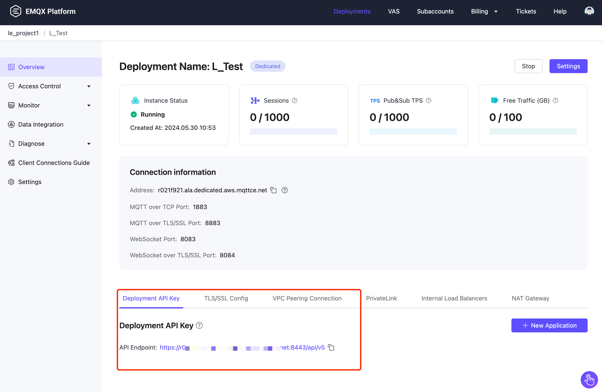

# Deployment API

This section introduces the EMQX Deployment API functionalities and how to create and manage the Deployment API key for secure access control.

## API Function

EMQX Deployment API manages the functionalities at the deployment level, such as client monitoring, message publishing, authentication, authorization, and so on.

| API                                                          | Deployment Type                                 | Description                                                  |
| ------------------------------------------------------------ | ----------------------------------------------- | ------------------------------------------------------------ |
| [Serverless deployment API](./serverless.md)                 | Serverless deployment                           | Managing operations for client, subscription, and message publishing in Serverless deployments. |
| [Dedicated / Premium deployment API](https://docs.emqx.com/en/cloud/latest/api/dedicated) | v5 Dedicated deployment Premium deployment | Managing various operations in v5 Dedicated deployments and Premium deployments. If you need to access the v4 Deployment API, see [v4 API](https://docs.emqx.com/en/cloud/v4/api/dedicated.html). |

## Create and Manage Deployment API Key

Deployment API Keys provide access management at the deployment level. 

To create and manage deployment API Keys, log in to the EMQX Platform and [Create a Deployment](../create/overview.md). Then, go to the Deployment overview page, where you can create and manage **Deployment API Keys**.

