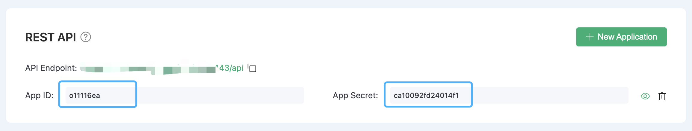

# API

The EMQX Cloud API follows RESTful definitions, providing you with programmatic access to manage deployments in EMQX Cloud. Through the API, you can manage authentication, clients, topics, and access more metric information.

The API has the following features:

- JSON Format: All response content is presented in JSON format.
- HTTPS Only: You can only access the API via HTTPS, ensuring that all data sent over the network is encrypted using TLS.
- Key-based Access and Digest Authentication: Before accessing the EMQX Cloud API, you must generate an API key. All requests are authenticated through HTTP digest authentication, ensuring that the API key is never sent over the network.

## How to Use API

You can get the API access address in the API access section under the deployment details page.

### Authentication

HTTP API uses [Basic authentication](https://en.wikipedia.org/wiki/Basic_access_authentication) method, ID and password must be filled in AppID and AppSecret respectively. You can add and remove AppID/AppSecret by creating new application in the API access under the deployment details page.

### Construct Request

The request address consists of the following parts:

{API}/{resource-path}?{query-string}

## Response code

### HTTP status codes

The EMQX Broker interface always returns 200 OK when the call is successful, and the response content is returned in JSON format.

The possible status codes are as follows:

| Status Code | Description                                                  |
| ----------- | ------------------------------------------------------------ |
| 200         | Success, and the returned JSON data will provide more information. |
| 400         | Invalid client request, such as wrong request body or parameters. |
| 401         | Client authentication failed , maybe because of invalid authentication credentials. |
| 404         | The requested path cannot be found or the requested object does not exist. |
| 500         | An internal error occurred while the server was processing the request. |

### Result codes

The response message body of the EMQX Broker interface is in JSON format, which always contains the returned `code`.

The possible result codes are as follows:

| Return Code | Description                                     |
| ----------- | ----------------------------------------------- |
| 0           | Success.                                        |
| 101         | RPC error.                                      |
| 102         | Unknown mistake.                                |
| 103         | Wrong user name or password.                    |
| 104         | Empty username or password.                     |
| 105         | User does not exist.                            |
| 106         | Administrator account cannot be deleted.        |
| 107         | Missing key request parameters.                 |
| 108         | Request parameter error.                        |
| 109         | Request parameters are not in legal JSON format.|
| 110         | Plug-in is enabled.                             |
| 111         | Plugin is closed.                               |
| 112         | Client is offline.                              |
| 113         | User already exists.                            |
| 114         | Old password is wrong.                          |
| 115         | Illegal subject.                                |

## API Versions

Depending on the different EMQX versions used in EMQX Cloud, the API is also divided into versions based on EMQX 4.x and EMQX 5.x. Please choose the API version that corresponds to the type of deployment you have activated.

- [Serverless API](./serverless.md)
- [Dedicated / BYOC API](./dedicated.md)
