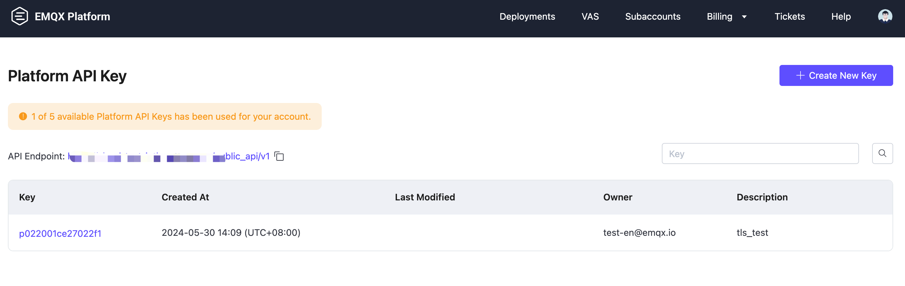
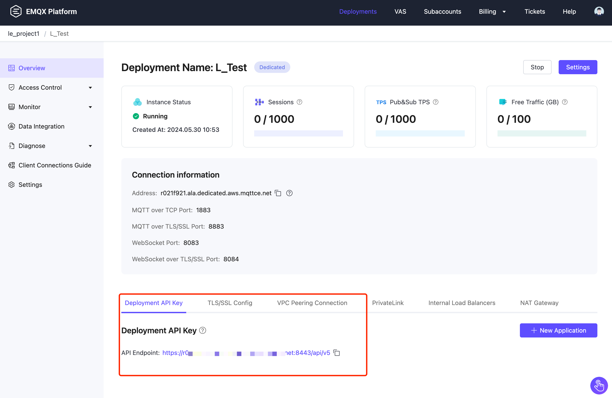

# API Management

The EMQX Platform APIs are used to control and manage EMQX Platform and EMQX deployments, and are categorized into two APIs, Platform Level and Deployment Level, both of which follow RESTful.

To access and manage the Platform API, you need to create an API Key. EMQX Platform API Keys are categorized into **Platform API Key** and **Deployment API Key**, which are designed for platform-level functionality and deployment-level functionality, respectively. Each API Key consists of a Key and a Secret. This page describes these two types of API Keys instructions in detail.

## Platform API
Platform API Key grants access management to platform level. Now we support 1 type of platform API Key: TLS certificate management, and we plan to support more platform level API Keys in the future.

### API Functionality
| API         | Deployment scope    | Description                           |
| ----------- | ---------------|-------------------------------------------- |
|  [TLS Certificate Management](./tls_certificate.md)  |EMQX v5 deployment and  v4（4.4.x）deployment | Manage the lifecycle of TLS certificates. |

### Create and Manage Platform API Key
To create and manage Platform API Key, please log in to EMQX Platform **[Root or Administrator account](../feature/role.md)**, accounts with other roles cannot create and manage Platform API Keys. after logging in, please go to **User in the upper right corner** - **Platform API Key** to enter the Platform API management page.

## Deployment API Key
A Deployment API Key grants access to management at a specified deployment, such as for client monitoring, message publishing, authentication, authorization, and so on. To create a Deployment API Key, create a deployment and then add the API Key in the Deployment Overview page.

### API Functionality
| API         | Deployment scope     | Description                            |
| ----------- | ---------------|-------------------------------------------- |
|  [Serverless deployment API](./serverless.md)  | Serverless deployment | Access to Serverless deployment API。 |
|  [Dedicated deployment API](https://docs.emqx.com/en/cloud/latest/api/dedicated)  | v5 Dedicated deployment | Access to v5 Deployment API. If you need to access to v4 Deployment API, see [v4 API](https://docs.emqx.com/en/cloud/v4/api/dedicated.html). |

### Create and Manage Deployment API Key
To create and manage deployment API Keys, log in to the EMQX Platform and [Create Deployment](../create/overview.md). After the deployment is created, go to the Deployment overview page, where you can create and manage **Deployment API Keys**.

## API usage instructions
The following API usage instructions apply to both the platform and deployment of the 2 APIs.

### Invoke API

Get API access address on the page of [Platform API management](./api_overview.md#create-and-manage-platform-api-key) and [Deployment API management](./api_overview.md#create-and-manage-deployment-api-key). Please access the API via HTTPS and ensure that all data sent over the network is encrypted using TLS.

### Authentication
HTTP API uses [Basic authentication](https://datatracker.ietf.org/doc/html/rfc7617) , which means id and password must be Key and Secret (Platform API), and App ID and App Secret (Deployment API), respectively. All secrets are displayed only once at the time of creation and should be kept in a safe place.

### HTTP Status Codes

The interface returns 200 on a successful call, and the response is returned in JSON format.

Status Code list：

| Status Code | Description                                                  |
| ----------- | ------------------------------------------------------------ |
| 200         | Success, and the returned JSON data will provide more information. |
| 400         | Invalid client request, such as wrong request body or parameters. |
| 401         | Client authentication failed , maybe because of invalid authentication credentials. |
| 404         | The requested path cannot be found or the requested object does not exist. |
| 422         | Wrong properties. |
| 500         | An internal error occurred while the server was processing the request. |

