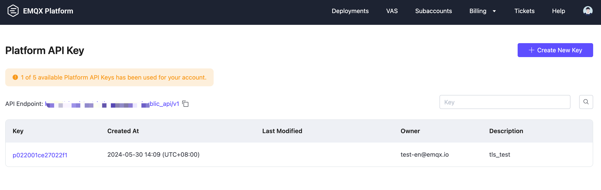

# Platform API

This section introduces the EMQX Platform API functionality for TLS certificate management and how to create and manage the platform API key for secure access control.

## API Function

Currently, the EMQX Platform supports TLS certificate management API. More platform-level APIs will be supported in the future.

| API                                                | Deployment Type                                              | Description                                                  |
| -------------------------------------------------- | ------------------------------------------------------------ | ------------------------------------------------------------ |
| [TLS Certificate Management](./tls_certificate.md) | EMQX v5 deployment and  v4 (4.4.x) deployment created under the Platform account | Manage the lifecycle of TLS certificates for a specified deployment. |

## Create and Manage Platform API Key

Platform API Keys provide access management at the Platform level. You can create and manage Platform API Keys under a Main or Administrator account. Accounts with other [roles](../feature/role.md) cannot create or manage Platform API Keys.

1. Log in to the EMQX Platform with your account.

2. Click the User icon in the upper right corner and select **Platform API Key** to access the Platform API Key page.

   

3. Click **Create New Key**. Enter a description in **API Key Description**. Click **Create Platform API Key**.

4. Select the functionality scope. Currently, only `TLS Certificate Management` is supported. Select the project scope according to your needs. The API can be used within the selected projects. Click **Next**.

5. Store the API key and secret safely. Click **Confirm and Return**.

Now you have created the Platform API key. You can click the key to modify the API info and scope. You can also delete the API key by clicking the deleting icon on the page.

