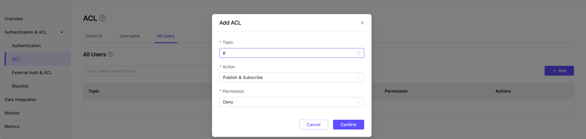

# Configuring and Using Access Control (ACL) in EMQX Platform v4 Deployments

Access Control (ACL) is used to manage client permissions for PUBLISH and SUBSCRIBE operations within EMQX Platform.

This page provides detailed information on client ID, username, and quota restrictions, how to enable whitelisting, use Placeholders, and leverage external ACLs for more advanced access control.

## Adding Access Control Entries

:::tip NOTE

- The **maximum number of entries** for built-in access control is twice the number of deployment connections, with an upper limit of 100,000. If this limit is exceeded, please use an external ACL.
- Fields can include letters, numbers, and certain special characters (_,-,/,+,#,$,%,@,&, and .), with a maximum length of 128 characters.
:::

Access control can be applied at three levels:

1. **Client ID**: Restrict access via the ClientId field.
2. **Username**: Restrict access via the Username field.
3. **All Users**: Apply access control rules to all users.

In the **Add ACL** dialog, fill in the Client ID or Username, the topic, select whether to allow or deny access, then choose the action (sub/pub/pubsub), and finally click the **Add** button to complete the operation.

### Bulk Importing Access Control Entries

You can import access control entries in bulk using either of the following methods:

1. You can bulk import access control entries using a provided CSV template (this is not supported for "All Users"). The import fields are as follows:

   - `clientid`: Client ID

   - `username`: Username

   - `topic`: Topic for access control

   - `action`: Action (sub/pub/pubsub)

   - `access`: Allow or deny (allow/deny)

2. To import ACL rules via API, refer to the [API](../api/acl.md) section.

## Using Placeholders

In the **Topic** field, you can use the following placeholders, which EMQX Platform will automatically replace with client information during requests:

- `%u`: Username
- `%c`: Client ID

If you want to restrict all users to only subscribe to or publish specific topics, you can add an ACL like this for all users:

- Username `%u`, topic `xx/%u/report`
- Client ID `%c`, topic `xx/%c/report`

## How to Enable Whitelist

:::tip NOTE

- By default, access control operates in **blacklist mode** (i.e., all subscriptions and publish are allowed by default).
- The **matching order** for access control is: All Users ACL -> Username/Client ID ACL.
- The combination of ClientId/Username + Topic is unique, meaning that for the same ClientId/Username + Topic, only the most recent record is valid.
:::

To enable whitelisting (i.e., default deny for all subscriptions and publish) in EMQX Platform, you have the following two options:

### 1. Not Using External Access Control

If you are not using external access control, go to the **Authentication & ACL** -> **ACl** menu on the left side of your deployment. In the **All Users** tab, add an authorization entry, enter `#` in the **Topic** field, select `Publish & Subscribe` for the **Action**, and set **Permission** to `Deny` to enable whitelist mode.

### 2. Using External Access Control

If you are using external access control, please submit a [ticket](../feature/tickets.md) to contact us, and we will switch to whitelist mode for you.

## Advanced Access Control with External ACLs

:::tip NOTE

- The Serverless version does not support external access control; however, other versions do.
- Although up to two external extensions are supported simultaneously, it is not recommended to use multiple external access controls for performance reasons.
:::

By enabling [external access control](../deployments/acl_dedicated.md), you can use custom services for authorization. Currently supported external data sources include Redis, MySQL, PostgreSQL, and authorization via HTTP services.

When both built-in and external access control are enabled, EMQX Platform will follow a **chained authorization** process:

- If authorization succeeds at any point, the chain stops, and the client is allowed to publish/subscribe.
- If authorization fails at any point, the chain stops, and the client is denied the ability to publish/subscribe.

When multiple external access control methods are enabled, the system queries according to the **order in which modules are enabled**. For example, if MySQL access control is enabled first, followed by PostgreSQL, the query order is as follows:

- If MySQL returns a result, the system will directly use that result for authorization and will not query PostgreSQL.
- If MySQL does not return a result, the system will proceed to query PostgreSQL, and the PostgreSQL result will be used for authorization.
