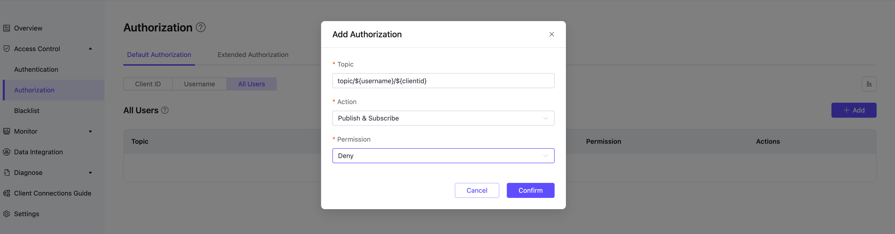

# Configure and Manage Authorization in EMQX Platform v5 Deployments

In EMQX Platform v5, client authorization is used to control the publish and subscribe permissions of MQTT clients. This document provides a detailed guide on configuring client ID, username, quota limits, as well as using whitelists, placeholders, and extended authorization for more advanced permission control.

## Add Authorization Information

:::tip Note

- The **maximum number of entries** for built-in authorization is twice the number of deployment connections, with an upper limit of 100,000. If this limit is exceeded, please use an external ACL.
:::

Authorization can be controlled at three levels:

1. **Client ID**: Authorization validation for a specific client ID.
2. **Username**: Authorization validation for a specific username.
3. **All Users**: Authorization validation based on topics for all users.

When adding authorization information, fill in the client ID or username, topic,  choose an action (sub/pub/pubsub), then select whether to allow, and finally click the **Add** button to complete the operation.

### Import Authorization Information in Batches

You can use the provided CSV template to import authorization information in batches (not supported for "All Users"). The fields for import are as follows:

- `clientid`: Client ID
- `username`: Username
- `topic`: Authorized topic
- `action`: Action (sub/pub/pubsub)
- `access`: Whether to allow (allow/deny)

## Use Placeholders

> Placeholders can only be used to replace an entire field in a topic, such as `a/b/${username}/c/d`, and cannot replace part of a field, such as `a/b${username}c/d`.

When using placeholders in a **topic**, you can dynamically replace the current client information in the topic matching rules. The supported placeholders are:

- `${clientid}`
- `${username}`

If you want to restrict all users to only subscribe to or publish specific topics, you can set it like this:

- Username `${username}`, Topic `xx/${username}/report`
- Client ID `${clientid}`, Topic `xx/${clientid}/report`

## Enable Whitelists

:::tip Note

- By default, authorization uses a **blacklist mode** (i.e., all subscriptions and publish are allowed by default).
- The **order of authorization matching** is: All Users authorization -> Username/Client ID authorization.
- The combination of Client ID/Username and Topic is unique. For multiple records with the same Client ID/Username + Topic, only the most recent record is valid.
- If you have added extended authorization data sources, ensure that "Default Authorization" is placed last in the **Authorization order** on the extended authorization page to enable whitelist mode.
:::

To enable whitelist mode (i.e., all subscriptions and publish are denied by default) in EMQX Platform, go to the **Access Control** -> **Authorization** in the left menu of the deployment. 

On the **All Users** tab, add an authorization entry by clicking the **Add** button. Enter `#` in the **Topic** field, select **Action** as `Publish & Subscribe`, and then set **Permission** to `Deny`. Click **Confirm** to enable whitelist mode.

## Use External Authorization for Advanced Permission Control

:::tip Note

- The Serverless version does not support external authentication and authorization; other versions do.
- Although a maximum of two extended authorizations is supported, it is recommended not to use multiple extended authorizations simultaneously for performance reasons.
:::

By enabling [extended authorization](../deployments/custom_authz), you can use custom services for authentication and authorization. The currently supported external data sources include Redis, MySQL, PostgreSQL, and authentication via HTTP services.

### Authorization Order

After adding extended authorization data sources, you can sort the authorization data sources, supporting a **custom authorization chain**: drag and arrange the authorization data source icons to configure the authorization order.

In the extended authorization page, click **Authorization order** to enter the order page. The deployment will perform authorization checks in the order from **left to right**. By default, the most recently added authorization is placed first, and the default authorization is placed last.

- Actions are matched with permissions, allowing or denying client operations based on permissions
- If actions do not match with permissions, the check is passed to the next authorization checker Custom authorization chain: Authorization data source icons can be dragged and arranged left and right to sequence the authorization order.

