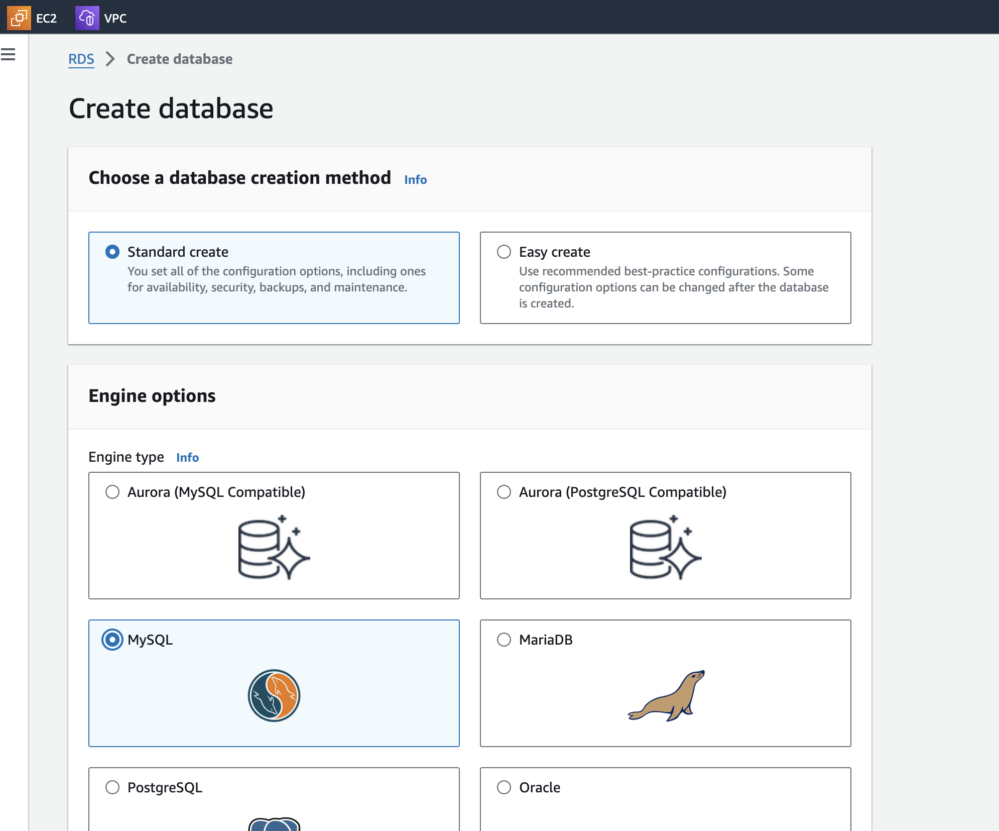
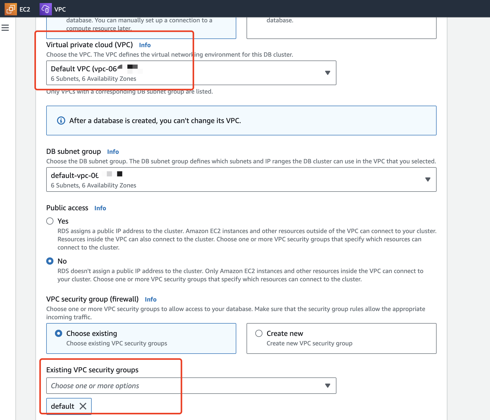
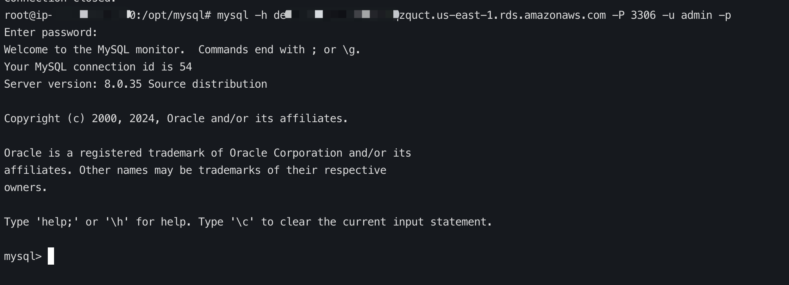
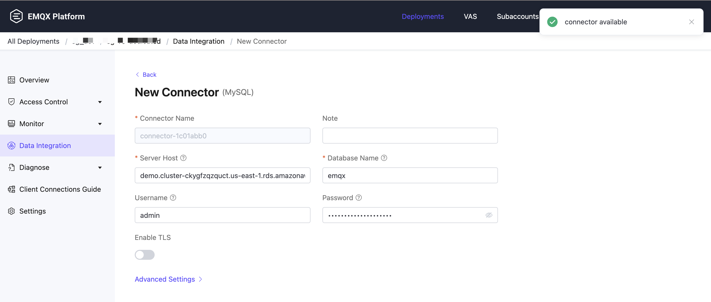

# Forward Device Online/Offline Events to AWS RDS MySQL via Data Integration

[Amazon Relational Database Service ](https://aws.amazon.com/cn/rds/)(AWS RDS ) is a managed relational database service provided by Amazon Web Services (AWS). It allows users to easily create, manage, and scale relational databases in the cloud without worrying about the underlying infrastructure operations. AWS RDS supports multiple database engines, including MySQL, PostgreSQL, Oracle, SQL Server, and Amazon Aurora (a highly compatible database engine with MySQL and PostgreSQL). 

This page introduces the best practices for using [AWS RDS MySQL](https://aws.amazon.com/cn/rds/mysql/). It demonstrates how to use EMQX event topics to monitor device online/offline events and leverage EMQX Dedicated data integration to store the data in AWS RDS MySQL. This will facilitate better handling of MQTT client connection issues. 

## Before You Start

1. Create a Dedicated deployment. For detailed instructions, see [Create a Dedicated Deployment](../create/dedicated.md).
2. Set up the network. 
   - You can create a [VPC Peering Connection](../deployments/vpc_peering.md) for your deployment. After establishing the peering connection, you can log in to the Platform Console via the internal network IP to access the target connector. 
   - Alternatively, set up a [NAT Gateway](../vas/nat-gateway.md) to access the target connector through a public IP.

## Create an AWS RDS MySQL Instance

This section demonstrates how to create an AWS RDS MySQL Instance in AWS and create a database and table.

1. Log in to your AWS account and navigate to the Amazon RDS service. 

2. Create an AWS RDS MySQL instance tailored to your needs.

   

3. Configure the VPC and security group settings carefully, as these will be emphasized in the subsequent steps.

   

3. Use an EC2 instance to connect with your AWS RDS MySQL instance.

   
   
3. Create a database and a table to store device online and offline events.

   ```
   create database emqx; use emqx;
   ```
   
   ```
   CREATE TABLE emqx_client_events (  id INT AUTO_INCREMENT PRIMARY KEY,  clientid VARCHAR(255),  event VARCHAR(255),  created_at TIMESTAMP DEFAULT CURRENT_TIMESTAMP );
   ```

## Configure Data Integration

This section demonstrates how to create a data integration in your Dedicated deployment to forward the event data to the AWS RDS MySQL.

### Create a Connector

Before creating data integration rules, you need to first create a MySQL connector to access the MySQL server.

1. Go to your deployment. Click **Data Integration** from the left-navigation menu.

2. If it is the first time for you to create a connector, select **MySQL** under the **Data Persistence** category. If you have already created connectors, select **New Connector** and then select **MySQL** under the **Data Persistence** category.

3. **Connector name**: The system will automatically generate a connector name.

4. Enter the connection information:

   - **Server Host**: IP address and port of the server.

   - **Database Name**: Enter `emqx`.

   - **Username**: Enter `admin`.

   - **Password**: Enter `<your-own-password>`.

   

5. Advanced Settings (Optional): Refer to [Advanced Configuration](https://docs.emqx.com/en/enterprise/latest/data-integration/data-bridge-mysql.html#advanced-configurations).

6. Click the **Test** button. If the MySQL service is accessible, a success prompt will be returned.

7. Click the **New** button to complete the creation.

### Create a Rule

Next, you need to create a rule to specify the data to be written and add corresponding actions in the rule to forward the processed data to MySQL.

1. Click **New Rule** in Rules area or click the New Rule icon in the **Actions** column of the connector you just created.

2. Enter the rule matching SQL statement in the **SQL Editor**. 

   ```sql
   SELECT
     *
   FROM 
     "$events/client_connected", "$events/client_disconnected"
   ```

   Alternatively, you can click the **New Action (Source)** button on the right to select the events as data inputs. Select **Event** and click **Next**. Select `Client connected` and `Client disconnected`, and click **Confirm**. You can see the events system topics are added to the FROM clause in the SQL Editor.

3. Click **Next** to add an action.

4. Select the connector you just created from the **Connector** dropdown box.

5. Configure the **SQL Template** based on the feature to use:

   Note: This is a preprocessed SQL, so the fields should not be enclosed in quotation marks, and do not write a semicolon at the end of the statements.

   ```sql
   INSERT INTO emqx_client_events(clientid, event, created_at) VALUES (
     ${clientid},
     ${event},
     FROM_UNIXTIME(${timestamp}/1000)
   )
   ```

6. Advanced Settings (Optional): Refer to [Advanced Configuration](https://docs.emqx.com/en/enterprise/latest/data-integration/data-bridge-mysql.html#advanced-configurations).

7. Click the **Confirm** button to complete the rule creation.

8. In the **Successful new rule** pop-up, click **Back to Rules**, thus completing the entire data integration configuration chain.

### Test the Rule

You are recommended to use [MQTTX](https://mqttx.app/) to simulate temperature and humidity data reporting, but you can also use any other client.

1. Use MQTTX to connect to the deployment, then disconnect.

2. View data dump results.

   ```bash
   mysql> select * from emqx_client_events LIMIT 10; +----+----------+---------------------+---------------------+ | id | clientid | event               | created_at          | +----+----------+---------------------+---------------------+ |  1 | 1        | client.connected    | 2024-05-08 07:30:22 | |  2 | 1        | client.disconnected | 2024-05-08 07:31:27 | +----+----------+---------------------+---------------------+ 2 rows in set (0.01 sec)
   ```

3. View operational data in the console. Click the rule ID in the rule list, and you can see the statistics of the rule and the statistics of all actions under this rule.