# Enhance Message Traceability with EMQX Event Topics and TimescaleDB Integration

The EMQX Cloud's message collection and transmission capability can fully utilize the [event topic](https://docs.emqx.com/en/enterprise/latest/data-integration/rule-sql-events-and-fields.html#mqtt-events) feature to enable comprehensive end-to-end message monitoring throughout the transmission process. This capability empowers users to generate detailed logs to track messages from their origin at the publisher, through the EMQX Cloud, to their destination at the subscriber.  The comprehensive monitoring covers various scenarios, allowing the precise detection of any message delays. Moreover, users can have the flexibility to effortlessly transmit critical monitoring data to an external database or message queue through the EMQX Cloud's data integration function. 

This guide demonstrates the setup of an end-to-end message tracing system, with a focus on using the Timescale database as an example. It introduces how to use the EMQX Cloud's data integration with TimescaleDB to observe the latency of MQTT messages throughout the entire transmission process, from the publishing client to the subscribing client.

## Prerequisites

The following conditions must be met before the demonstration:

- **Client Timezone**: EMQX operates in **UTC** timezone; ensure the client's timezone is set to UTC. Adjust the default timezone of time fields in database tables if necessary.
- **Client Time Synchronization**: Ensure synchronization of system clocks across all clients.
- **Message Timestamps**: Configure MQTT clients to include a `publish_at` timestamp in each message.
- **Data Integration**: Set up EMQX data integration to capture `$events/message_delivered` and `$events/message_acked` events, recording them in TimescaleDB.
- **Strategy**: To guarantee the reception of `message_acked events`, use **at least QoS 1 level**.

## Configure Timestamps

1. Message Payload Timestamp (`publish_at`): The timestamp when the client publishes a message.
2. EMQX Received Message Timestamp (`publish_received_at`): The timestamp when EMQX receives the message.
3. EMQX Processing Timestamp (`message_delivered`): The timestamp when EMQX processes the message and places it into the TCP packet.
4. Subscriber Client ACK Timestamp (`message_acked`): The timestamp when the subscribing client receives the message and sends an acknowledgment (ACK).

## Set Up a Timescale Instance

This section demonstrates how to create a Timescale instance and create a table for storing message traces and data monitoring.

1. Log in to Timescale Cloud. On the **Create a service** page, select a region from the **Region** dropdown list. Click **Create service** at the bottom of the page.

   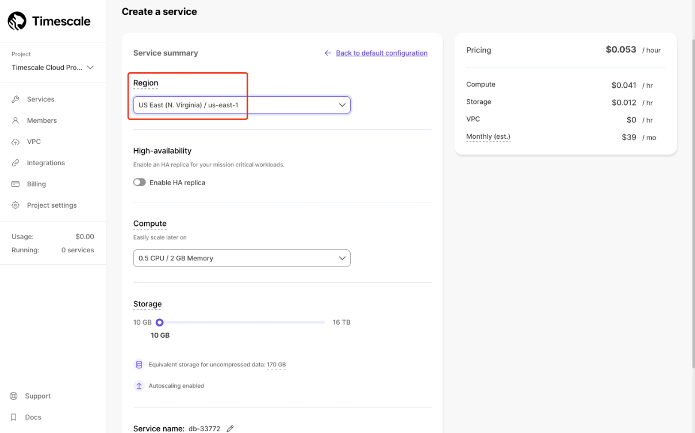

2. After creating the service, follow the instructions on the page to connect to your service. Store your Username and Password properly.

   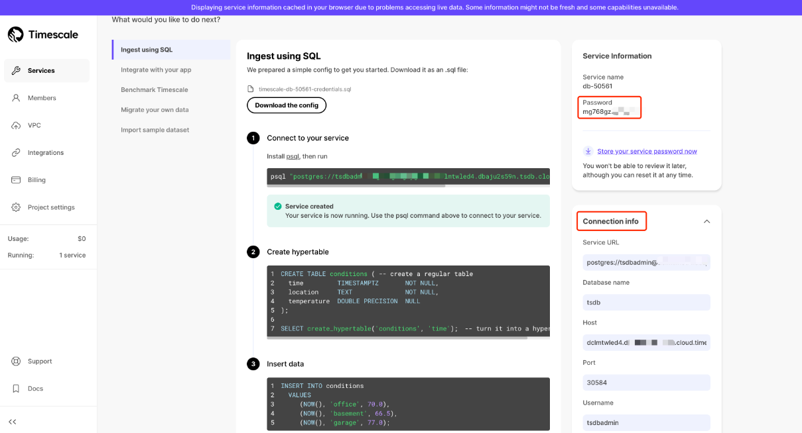

3. Use the following SQL statement to create a new table `mqtt_message_traces` for storing message traces and monitoring data related to MQTT.

   ```sql
   CREATE TABLE mqtt_message_traces
   (
       event_at          TIMESTAMPTZ       NOT NULL,
       event             character varying NOT NULL,
       msg_id            character varying NOT NULL,
       publish_at        bigint,
       emqx_received_at  bigint,
       emqx_delivered_at bigint,
       sub_ack_at        bigint,
       pub_clientid      character varying,
       sub_clientid      character varying,
       topic             character varying NOT NULL,
       qos               integer           NOT NULL,
       payload           text
   );
   ```

4. Turn the `mqtt_message_traces` table into a hypertable by specifying the `event_at` column as the time dimension.

   ```sql
   SELECT create_hypertable(
                  'mqtt_message_traces',
                  'event_at',
                  chunk_time_interval => interval '12 hour',
                  if_not_exists => TRUE
              );
   ```

5. Create 3 indexes to optimize query performance:

   - `emqx_mqtt_message_traces_event_idx` on the `event` column for faster event type lookups.
   - `emqx_mqtt_message_traces_msg_id_event_at_idx` on the `msg_id` and `event_at` in descending order for querying message-specific events over time.
   - `emqx_mqtt_message_traces_pub_clientid_event_at_idx` on the `pub_clientid` and `event_at` in descending order for tracking events related to specific publishers over time.

   ```sql
   CREATE INDEX IF NOT EXISTS "emqx_mqtt_message_traces_event_idx" ON mqtt_message_traces ("event");
   
   CREATE INDEX IF NOT EXISTS "emqx_mqtt_message_traces_msg_id_event_at_idx" ON mqtt_message_traces ("msg_id", "event_at" DESC);
   
   CREATE INDEX IF NOT EXISTS "emqx_mqtt_message_traces_pub_clientid_event_at_idx" ON mqtt_message_traces ("pub_clientid", "event_at" DESC);
   ```

## Configure TimescaleDB Data Integration in EMQX Cloud

This section demonstrates how to create a data inegration with Timescale for forwarding the message traces from the clients to Timescale.

1. Sign in to your Cloud Console and navigate to the deployment details page. 

2. Click **Data Integration** from the left navigation menu. Under **Data Persistence**, select **TimescaleDB**.

3. Fill in the TimescaleDB connection information obtained from creating a Timescale cloud service. Set the Pool Size to `1`. Then click **Test** to test the connection.

4. Under **Configured Resources**, select the configured TimescaleDB resource. Click **New Rule** and enter the following rule to match the SQL statement. The `SELECT` part of the rule includes the following fields:

   - `id`: MQTT message ID
   - `clientid`: Client ID
   - `topic`: MQTT topic
   - `qos`: Enumeration of message QoS 0, 1, 2
   - `event`: Event topic of EMQX
   - `timestamp`: Event Timestamp (ms)
   - `publish_received_at`: Time when PUBLISH message reaches Broker (ms)
   - `up_timestamp`: Time when the pub client reports data (ms)
   - `payload`

   ```sql
   SELECT
   timestamp div 1000 as event_at,
   event,
   id as msg_id,
   payload.publish_at as publish_at,
   publish_received_at as emqx_received_at,
   clientid as pub_clientid,
   topic,
   qos,
   payload
    
   FROM "#"
   ```

   The rule will be triggered when the publishing client sends messages to any topics matching `#`.

5. Click on the **Next** button at the bottom to enter the Action view. Select the TimescaleDB resource and enter the following data to insert into the SQL template.

   ```
   INSERT INTO mqtt_message_traces(event_at,event,msg_id,publish_at,emqx_received_at,emqx_delivered_at,sub_ack_at,pub_clientid,sub_clientid,topic,qos,payload) VALUES ( to_timestamp(${event_at}), ${event}, ${msg_id}, ${publish_at}, ${emqx_received_at}, NULL, NULL, ${pub_clientid}, NULL, ${topic}, ${qos}, ${payload} );
   ```

   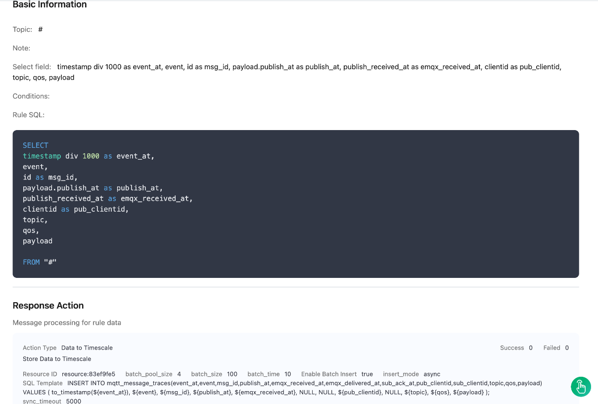

6. Click **Create** to complete the creation.

7. Create the second rule. It must be triggered when a message is delivered by EMQX to a client that subscribes to the topic.

   ```sql
   SELECT
   timestamp div 1000 as event_at,
   event,
   id as msg_id,
   payload.publish_at as publish_at,
   publish_received_at as emqx_received_at,
   timestamp as emqx_delivered_at,
   from_clientid as pub_clientid,
   clientid as sub_clientid,
   topic,
   qos,
   payload
    
   FROM
    "$events/message_delivered"
   ```

8. Click the **Next** button in the bottom to enter the Action view. Select the TimescaleDB resource and enter the following data to insert into the SQL template.

   ```
   INSERT INTO mqtt_message_traces(event_at,event,msg_id,publish_at,emqx_received_at,emqx_delivered_at,sub_ack_at,pub_clientid,sub_clientid,topic,qos,payload) VALUES ( to_timestamp(${event_at}), ${event}, ${msg_id}, ${publish_at}, ${emqx_received_at}, ${emqx_delivered_at}, NULL, ${pub_clientid}, ${sub_clientid}, ${topic}, ${qos}, ${payload} );
   ```

   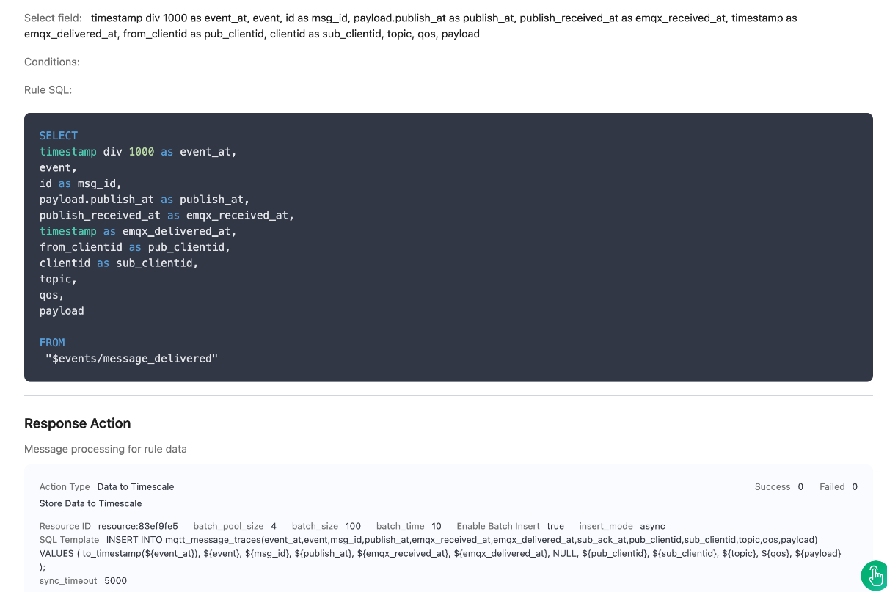

9. Click the **Create** button to complete the creation.

10. Create the third rule. It will be triggered when the message is sent to the client and an acknowledgment is received from the client. The rule will only be triggered when the message QoS is 1 and 2.

    ```sql
    SELECT
    timestamp div 1000 as event_at,
    event,
    id as msg_id,
    payload.publish_at as publish_at,
    publish_received_at as emqx_received_at,
    timestamp as sub_ack_at,
    from_clientid as pub_clientid,
    clientid as sub_clientid,
    topic,
    qos,
    payload
     
    FROM
     "$events/message_acked"
    ```

11. Click the **Next** button in the bottom to enter the Action view. Select the TimescaleDB resource and enter the following data to insert into the SQL template.

    ```
    INSERT INTO mqtt_message_traces(event_at,event,msg_id,publish_at,emqx_received_at,emqx_delivered_at,sub_ack_at,pub_clientid,sub_clientid,topic,qos,payload) VALUES ( to_timestamp(${event_at}), ${event}, ${msg_id}, ${publish_at}, ${emqx_received_at}, NULL, ${sub_ack_at}, ${pub_clientid}, ${sub_clientid}, ${topic}, ${qos}, ${payload} );
    ```

    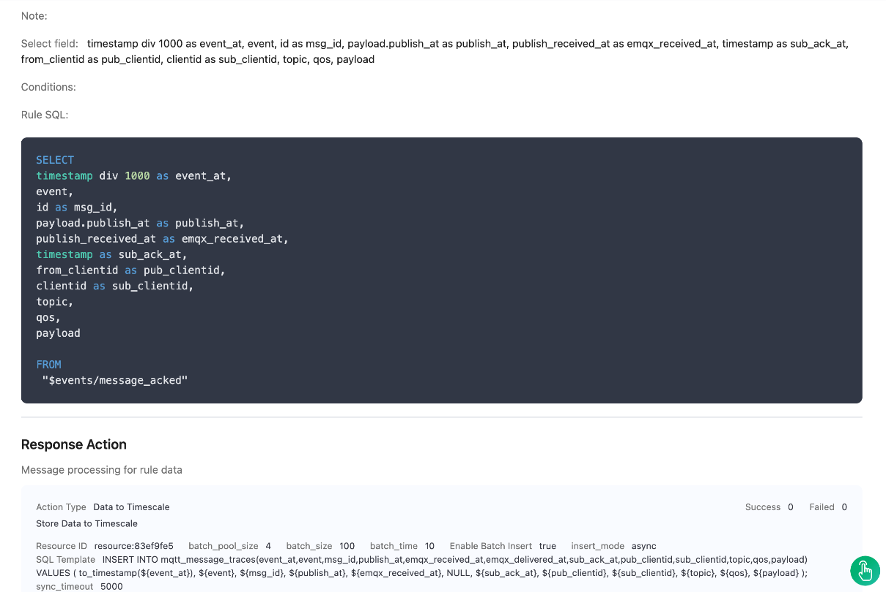

12. Click the **Create** button to complete the creation.

## Use Python SDK to Simulate Message Delivery

1. Use the Python SDK to send messages to the `emqx/test` topic as a publisher. The message QoS level is greater than 0.

   ```python
   # python 3.8
   
   import random
   import time
   from datetime import datetime
   from paho.mqtt import client as mqtt_client
   
   broker = 'x.x.x.x'
   port = 1883
   topic = "emqx/test"
   # generate client ID with pub prefix randomly
   client_id = f'python-mqtt-{random.randint(0, 1000)}'
   username = 'xxx'
   password = 'xxx'
   
   
   def connect_mqtt():
       def on_connect(client, userdata, flags, rc):
           if rc == 0:
               print("Connected to MQTT Broker!")
           else:
               print("Failed to connect, return code %d\n", rc)
   
       client = mqtt_client.Client(client_id)
       # client.tls_set(ca_certs='./server-ca.crt')
       client.username_pw_set(username, password)
       client.on_connect = on_connect
       client.connect(broker, port)
       return client
   
   
   def publish(client):
       msg_count = 0
       while True:
           time.sleep(1)
           timestamp_ms = int(datetime.utcnow().timestamp() * 1000)
           msg = f'{{"publish_at": {timestamp_ms}, "msg": {msg_count}}}'
           result = client.publish(topic, msg, qos=1)
           # result: [0, 1]
           status = result[0]
           if status == 0:
               print(f"Send `{msg}` to topic `{topic}`")
           else:
               print(f"Failed to send message to topic {topic}")
           msg_count += 1
   
   
   def run():
       client = connect_mqtt()
       client.loop_start()
       publish(client)
   
   
   if __name__ == '__main__':
       run()
   ```

   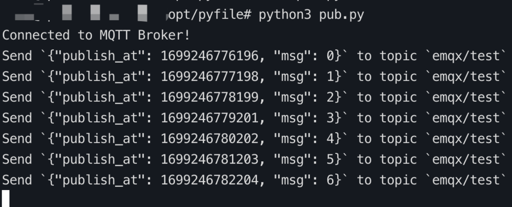

2. Use the Python SDK to subscribe to the topics `emqx/test` as a subscriber. 

   ```python
   # python3.8
   
   import random
   from paho.mqtt import client as mqtt_client
   
   broker = 'x.x.x.x'
   port = 1883
   topic = "emqx/test"
   # generate client ID with pub prefix randomly
   client_id = f'python-mqtt-{random.randint(0, 100)}'
   username = 'xxx'
   password = 'xxx'
   
   
   def connect_mqtt() -> mqtt_client:
       def on_connect(client, userdata, flags, rc):
           if rc == 0:
               print("Connected to MQTT Broker!")
           else:
               print("Failed to connect, return code %d\n", rc)
   
       client = mqtt_client.Client(client_id)
       # client.tls_set(ca_certs='./server-ca.crt')
       client.username_pw_set(username, password)
       client.on_connect = on_connect
       client.connect(broker, port)
       return client
   
   
   def subscribe(client: mqtt_client):
       def on_message(client, userdata, msg):
           print(f"Received `{msg.payload.decode()}` from `{msg.topic}` topic")
   
       client.subscribe(topic, qos=1)
       client.on_message = on_message
   
   
   def run():
       client = connect_mqtt()
       subscribe(client)
       client.loop_forever()
   
   
   if __name__ == '__main__':
       run()
   ```

   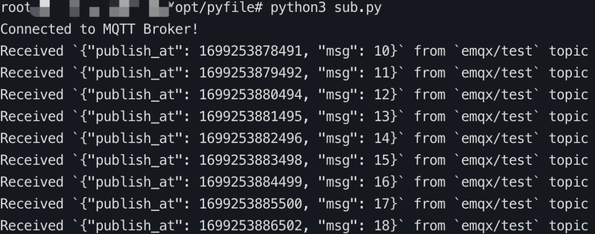

## View Message Latency

This section provides some SQL query statements that can help retrieve the information from TimescaleDB, such as the latency of all messages on the EMQX Cloud platform, including from the publisher to the server, within the server itself, and from the server to the subscriber.

### How to Calculate Delay

- Pub_Client to EMQX Delay: `publish_received_at` minus  `publish_at`.
- EMQX Processing Delay: `message_delivered timestamp` minus `publish_received_at`.
- EMQX to Sub_Client Delay: `message_acked timestamp` minus `message_delivered timestamp`.
- Total Transmission Delay: `message_acked` minus `publish_at`.

::: tip

1. If a message lacks a `publish_at` timestamp, calculating the Client to EMQX Delay is not possible.
2. Without QoS 0, the `message_acked` event will not trigger, making the calculation of EMQX to Subscribing Client Delay impossible.

:::

### Use Query Statement Examples 

1. Query the database to retrieve the average message latency from the database for the past hour.

   ```sql
   SELECT
     AVG(emqx_received_at - publish_at) AS avg_delay
   FROM
     mqtt_message_traces
   WHERE
     event_at >= NOW() - INTERVAL '1 hour'
     AND publish_at IS NOT NULL
     AND emqx_received_at IS NOT NULL;
   ```

   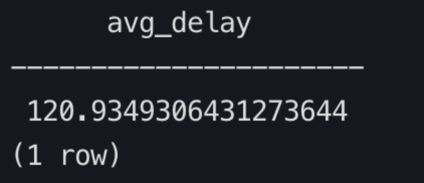

2. Query the database to retrieve the average publishing client delay within the past hour.

   ```sql
   SELECT
       AVG(emqx_received_at - publish_at) AS avg_publish_delay
   FROM
       mqtt_message_traces
   WHERE
       event_at >= NOW() - INTERVAL '1 hour'
       AND publish_at IS NOT NULL
       AND emqx_received_at IS NOT NULL;
   ```

   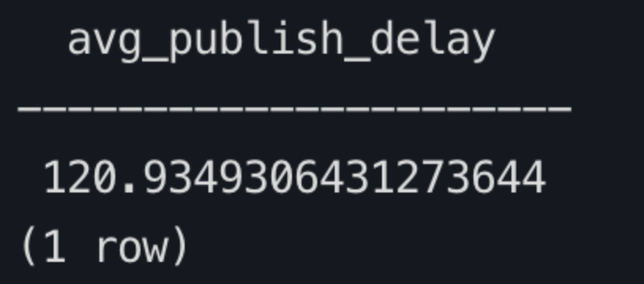

3. Query the database for the average subscription latency of subscribing clients during the past hour and return the top 10 records.

   ```sql
   WITH message_events AS (
     SELECT
       msg_id,
       sub_clientid,  -- Add sub_clientid here
       MAX(CASE WHEN event = 'message.acked' THEN sub_ack_at END) AS event_ma,
       MAX(CASE WHEN event = 'message.delivered' THEN emqx_delivered_at END) AS event_md
     FROM
       mqtt_message_traces
     WHERE
       event IN ('message.acked', 'message.delivered')
       AND event_at >= NOW() - INTERVAL '1 hour'
     GROUP BY
       msg_id, sub_clientid  -- Include sub_clientid in grouping
   )
   SELECT
     msg_id,
     sub_clientid,  -- Include sub_clientid in the result
     AVG(event_ma - event_md) AS avg_subscription_delay
   FROM
     message_events
   WHERE
     event_ma IS NOT NULL
     AND event_md IS NOT NULL
   GROUP BY
     msg_id, sub_clientid  -- Group by msg_id and sub_clientid
   ORDER BY
     avg_subscription_delay DESC
   LIMIT 10;
   ```

   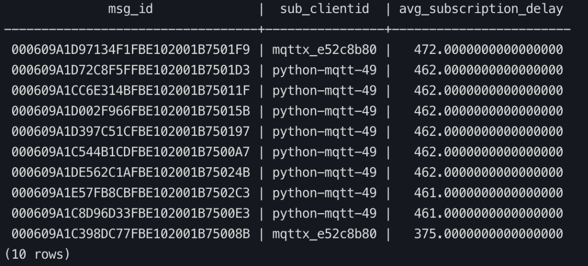

4. Query the database to retrieve the average delay for each message ID across all stages within the past hour. Sort the results in descending order based on the total transmission delay (utilizing publishing delay if there is no acknowledgment delay). Return the top 10 records.

   ```sql
   WITH relevant_messages AS (
     SELECT * 
     FROM mqtt_message_traces 
     WHERE event_at >= NOW() - INTERVAL '1 hour'
   )
   SELECT
     t1.msg_id,
     ROUND(AVG(t1.emqx_received_at - t1.publish_at)) AS client_to_emqx_delay,
     ROUND(AVG(t2.emqx_delivered_at - t1.emqx_received_at)) AS emqx_processing_delay,
     ROUND(AVG(t3.sub_ack_at - t2.emqx_delivered_at)) AS emqx_to_subscriber_delay,
     ROUND(AVG(t3.sub_ack_at - t1.publish_at)) AS total_message_delay
   FROM
     relevant_messages t1
     JOIN relevant_messages t2 ON t1.msg_id = t2.msg_id AND t2.event = 'message.delivered'
     JOIN relevant_messages t3 ON t1.msg_id = t3.msg_id AND t3.event = 'message.acked'
   GROUP BY t1.msg_id
   ORDER BY total_message_delay DESC
   LIMIT 10;
   ```

   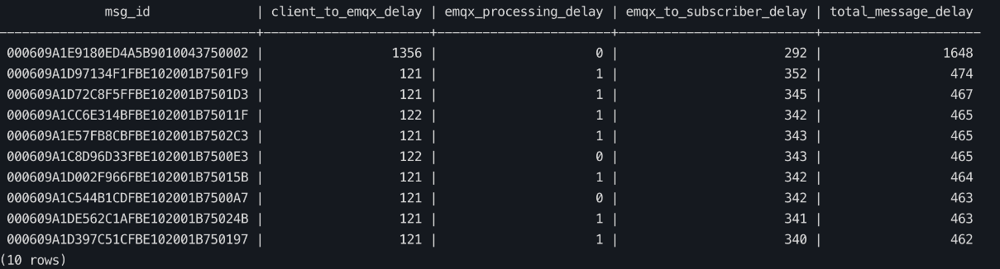

5. Query the database to retrieve the average message delay for each publishing client ID within the past hour from the database. Sort the results in descending order based on the publishing delay and return the top 10 records.

   ```sql
   SELECT
       pub_clientid,
       AVG(emqx_received_at - publish_at) AS avg_publish_delay
   FROM
       mqtt_message_traces
   WHERE
       event_at >= NOW() - INTERVAL '1 hour'
       AND publish_at IS NOT NULL
       AND emqx_received_at IS NOT NULL
   GROUP BY
       pub_clientid
   ORDER BY
       avg_publish_delay DESC
   LIMIT 10;
   ```

   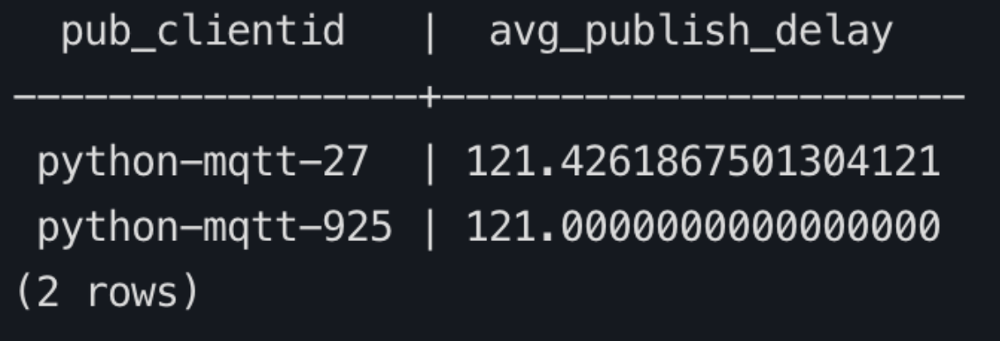

6. Query the database to retrieve the average message delay for each subscribing client ID within the past hour. Return the top 10 records in descending order based on the delay.

   ```sql
   WITH message_events AS (
     SELECT
       sub_clientid,
       MAX(CASE WHEN event = 'message.acked' THEN sub_ack_at END) AS event_ma,
       MAX(CASE WHEN event = 'message.delivered' THEN emqx_delivered_at END) AS event_md
     FROM
       mqtt_message_traces
     WHERE
       event IN ('message.acked', 'message.delivered')
       AND event_at >= NOW() - INTERVAL '1 hour'
       AND sub_clientid IS NOT NULL
     GROUP BY
       sub_clientid
   )
   SELECT
     sub_clientid,
     AVG(event_ma - event_md) AS avg_subscription_delay
   FROM
     message_events
   WHERE
     event_ma IS NOT NULL
     AND event_md IS NOT NULL
   GROUP BY
     sub_clientid
   ORDER BY
     avg_subscription_delay DESC
   LIMIT 10;
   ```

   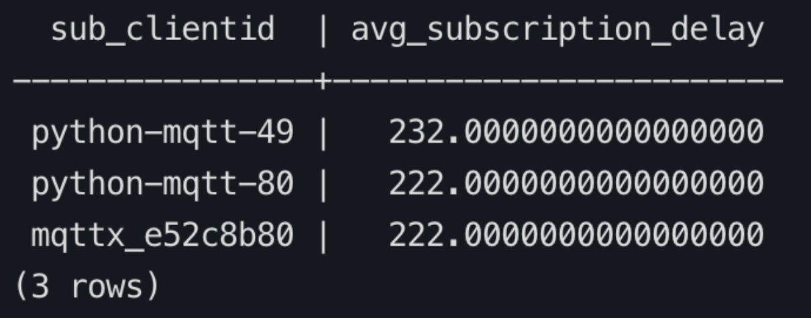

