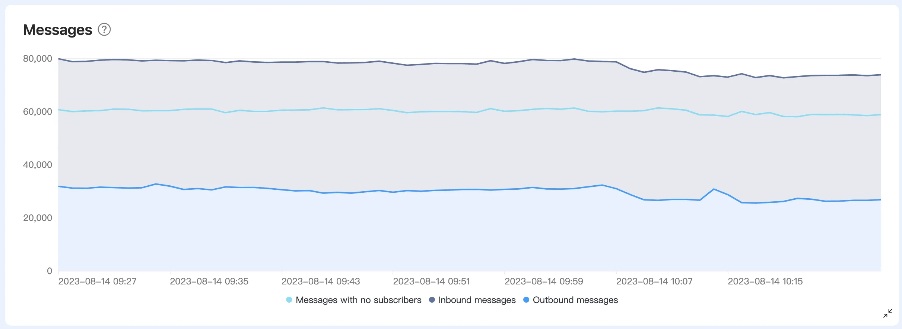
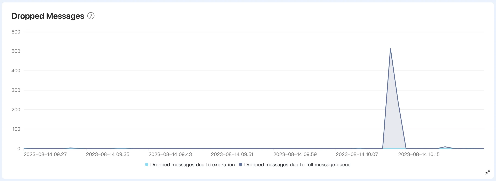
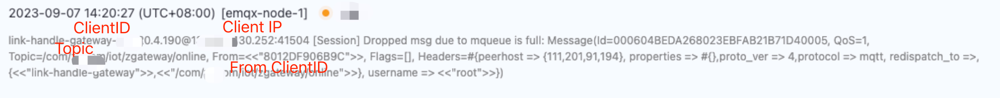

# How to Troubleshoot Message Loss

Message loss typically involves two situations that require careful consideration and tracking.

## Messages Dropped When Not Subscribed in EMQX

This situation occurs when messages have already entered EMQX but are dropped because there are no subscribers. Specific dropped statistics can be viewed in the "Unsubscribed Message Count" under the "Messages" section of the deployment console.



To track these dropped messages, you can use the [event topic](https://docs.emqx.com/en/cloud/latest/rule_engine/rule_engine_events.html#message-events) `$events/message_dropped`. Whenever a message is dropped, an event is triggered, and it sends the relevant message information to this event topic. This allows us to transmit message dropped events to third-party systems for recording and subsequent issue investigation.

## EMQX Drops Messages During Message Delivery

This situation refers to messages being received by subscribers but not successfully delivered for various reasons. These reasons include clients setting Clean Session to False but having an extended offline duration, or the client's message processing capacity being insufficient. The following are potential scenarios that can result in message delivery failure:

**a. Clients set Clean Session to False, leading to message loss due to an extended offline duration**

In this case, even if the client is offline, EMQX will attempt to send messages to it. These unsuccessfully delivered messages accumulate in the client's message queue, waiting for the client to reconnect. If the client's offline duration is too long (default 2 hours for MQTT v3 protocol, determined by the session_expiry_interval value for MQTT v5 protocol), or the client cannot process these messages promptly, they may be dropped.

Solutions for this scenario include setting Clean Session to True to avoid accumulating a large number of device online/offline messages when the client reconnects. If you choose to set Clean Session to False, implement an automatic reconnection mechanism to prevent extended client downtime. Additionally, avoid using random client IDs because if you use random client IDs and set Clean Session to False, the session will change upon client reconnection, potentially leading to message loss.

**b. Client message processing capacity is insufficient**

Specifically, when a client subscribes to messages from multiple topics, these messages share a fixed-length message queue (default is 1,000). If one topic's messages accumulate excessively, exceeding the queue length limit, this can result in message loss. Therefore, insufficient message processing capacity on the client side can lead to some messages not being successfully delivered to subscribers.

Solutions for this scenario include:

- Optimizing client code to improve subscription performance.
- Trying shared subscriptions; more information about shared subscriptions can be found in the [Shared Subscription documentation](https://docs.emqx.com/en/cloud/latest/connect_to_deployments/shared_subscription.html#shared-subscription).

You can check relevant statistics in the "Dropped Messages" section under the "Metrics" part of the deployment console.



Furthermore, in the deployment logs, selecting "Message" as the error type allows you to search for similar records, such as "[Session] Dropped msg due to mqueue is full: Message," to obtain more detailed information.



To track these message loss events, you can use the [event topic](https://docs.emqx.com/en/cloud/latest/rule_engine/rule_engine_events.html#message-events) `$events/delivery_dropped`. Whenever message delivery fails, the system triggers an event and sends the relevant message information to this event topic. Additionally, you can transmit message delivery failure events to third-party systems for recording and subsequent issue investigation.

In summary, you can use the following SQL rule to filter related events:

```sql
SELECT 
*

FROM "$events/message_dropped", "$events/delivery_dropped"

WHERE topic =~ 'xxx'
```

This SQL rule will help you filter message dropped events related to specific topics (e.g., 'xxx') for further analysis and handling. If the message throughput is high, consider adding additional filtering fields, such as client IDs. For available filtering fields, refer to the [Event Topics - Message events](https://docs.emqx.com/en/cloud/latest/rule_engine/rule_engine_events.html#message-eventsdocumentation).
