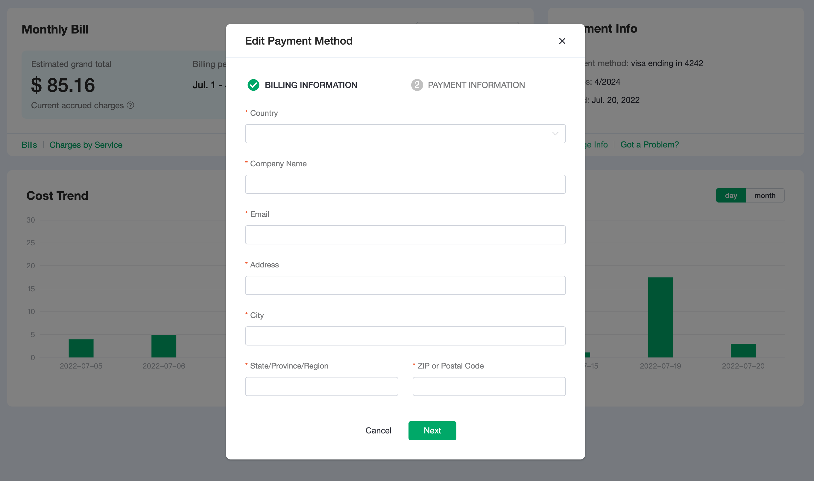

# View and Edit Your Billing Information

To view and update your billing information:

1. Navigate to the Billing Overview page.
2. In the right top section of the page, you can find the Billing Information block.
  - If you haven't added a card, click + button to add a new card.
  - If you have added a card, your card information will be displayed in the block including card last four numbers, expire date, and when the card had been added.
  - Click **Change Info** to update card information.
  - Click **Got a problem?** if you have any issues in updating card information. You can contact us through the **Tickets** in the top menu or by emailing us.

## Add or Update your Billing Information

Please fill the details as needed.
<table>
   <tr>
      <th>Field</th>
      <th>Necessity</th>
      <th>Action</th>
   </tr>
   <tr>
      <td>Country</td>
      <td>Required</td>
      <td>Select the country for your billing address. You can also start typing the name of the country and then select it from the filtered list of countries.</td>
   </tr>
   <tr>
      <td>VAT/GST ID</td>
      <td>Conditional</td>
      <td>The form displays the VAT/GST ID field if you select a country other than the United States. To learn more about VAT/GST, see <a href="./taxation.md">Tax ID</a>.

If your company's billing address is in a country other than the United States (USA), EMQX typically charges VAT if you do not enter a valid VAT ID Number on your billing information.

- If your billing address is in Sweden, EMQX always charges VAT, even with a valid VAT ID Number.
- To learn more about VAT/GST by region, see <a href="./taxation.md">Taxation by Region</a>
</td>
   </tr>
   <tr>
      <td>Company Name</td>
      <td>Required</td>
      <td>Type the company name for the invoice.</td>
   </tr>
   <tr>
      <td>Email</td>
      <td>Required</td>
      <td>Type the email for the invoice.</td>
   </tr>
   <tr>
      <td>Address</td>
      <td>Required</td>
      <td>Type the mailing address for your billing address.</td>
   </tr>
   <tr>
      <td>City</td>
      <td>Required</td>
      <td>Type the name of the city for your billing address.</td>
   </tr>
   <tr>
      <td>State/Province/Region</td>
      <td>Required</td>
      <td>Type the political subdivision in which your billing address exists.</td>
   </tr>
   <tr>
      <td>ZIP or Postal Code</td>
      <td>Required</td>
      <td>Type the ZIP (U.S.) or Postal Code (other countries) for your billing address. If your billing country is United States or Canada, the ZIP will be verified.</td>
   </tr>
</table>

Click *Next* to update card information.

## Edit or Update your Card Information

Please fill the details as needed.
<table>
   <tr>
      <th>Field</th>
      <th>Necessity</th>
      <th>Action</th>
   </tr>
   <tr>
      <td>Name on Card</td>
      <td>Required</td>
      <td>Type the name that appears on your credit card.</td>
   </tr>
   <tr>
      <td>Card Number</td>
      <td>Required</td>
      <td>Type the 16-digit number that appears on your credit card. American Express uses a 15-digit number.</td>
   </tr>
</table>

:::tip
To confirm your credit card information, EMQX Cloud charges $1.00 when you first connect a credit card to your account. After EMQX Cloud confirms your information, it refunds the $1.00 charge. If you encounter any issues with connecting a credit card to your account, reach out to your card provider or banking institution. Verify whether they declined the initial charge, which would prevent EMQX Cloud from confirming your information.
:::

- To accept your changes, click *Submit*.
- To decline your changes, click *Cancel*.
- To edit billing information, click *Previous*.

