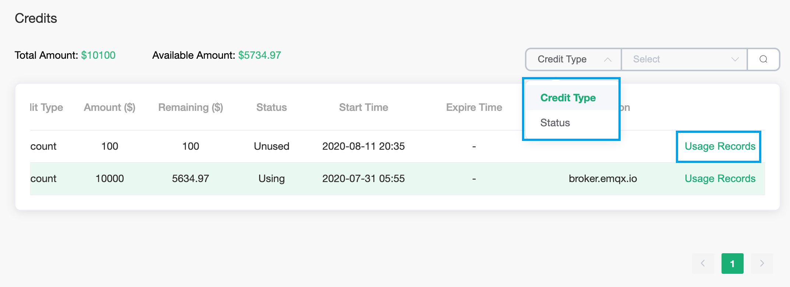
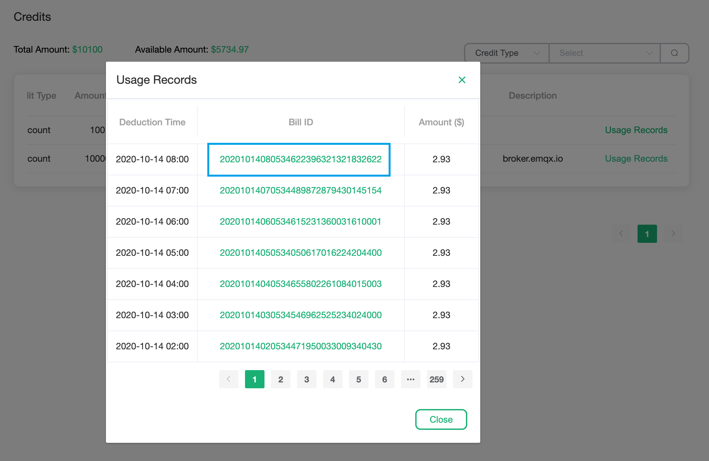

# Credit

The credit will show all the credit owned by the account, including the credit usage record. Click `Financial Management` -> `Credits` in the left menu to enter the credit viewing page

### View credits

1. The credit can be filtered by `credit type` and `status`. Click `Useage History` to view the usage record of the credit

   

2. In the credit usage record, click on the bill ID to view the specific deduction details

   

### Get credits

To obtain credits, you can follow the official website activities or contact our business manager