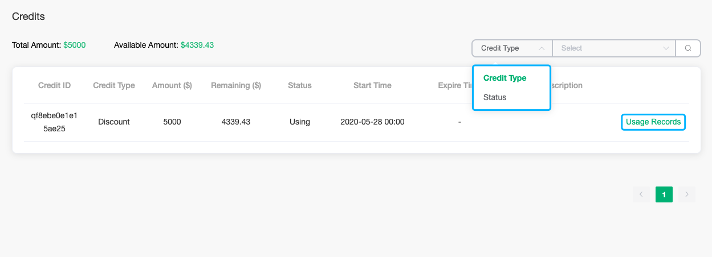
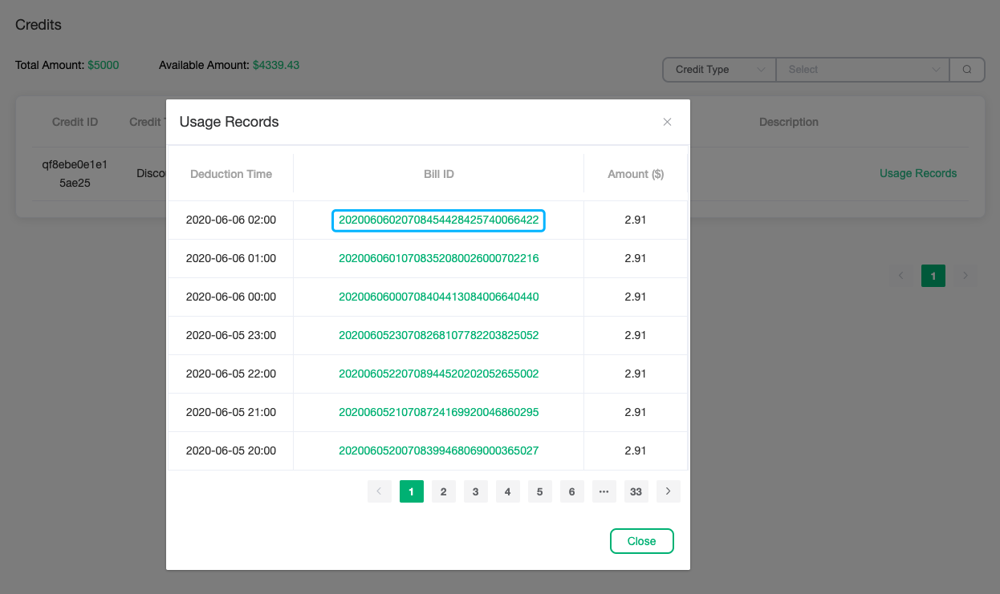

# Credits

The credits page will display all credits owned by the account, including the credits usage record. Click `Billing - > Credits` in the left menu to enter the credits viewing page.

### View credits

1. The credit can be filtered by `Credit Type` and `Status`. Click `Usage Records` to view the usage record of the credit.

   

2. In the credit usage record, click on the bill ID to view the specific deduction details.

   

### Get credits

You can follow the official website activities or contact our business manager to get credits.