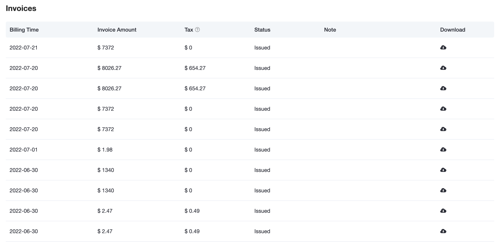
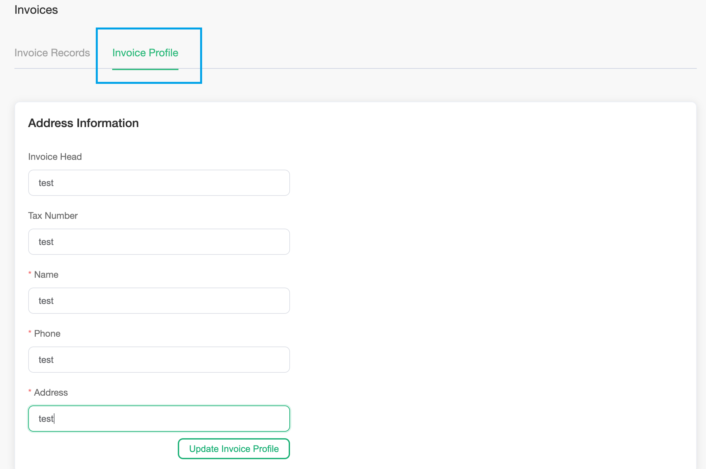

# Invoice

Invoices includes the account invoice record, application for invoice, and address management. Click `Financial Management` -> `Invoices` in the left menu to enter the invoice page

### Application for invoice,

The invoice application must be based on monthly settlement and cannot be split into multiple invoices. But multiple monthly statements can be combined and issued as one invoice

1. Update the billing address information in `Address Management`
2. Click `Apply for invoice` in the `Invoice Records`, and enter the billing amount (the billing amount cannot be less than 100 Yuan)

### View invoice records

The invoice record will show the invoice record of the account and the balance that can be invoiced

### Invoice information management

The invoice information of the account can be updated in the address management

