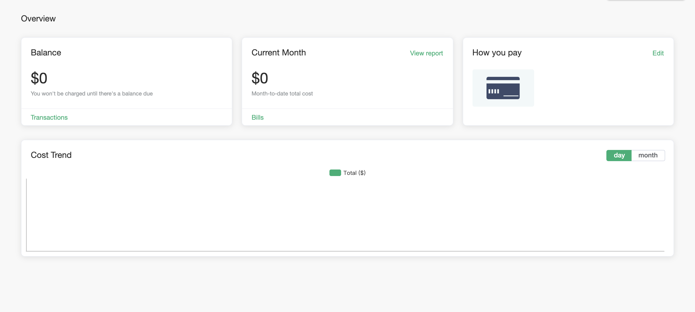
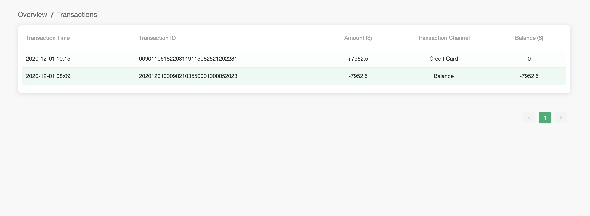
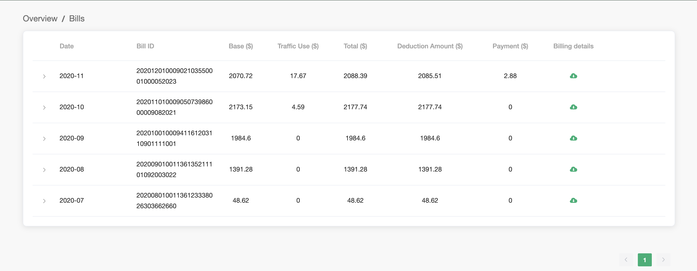
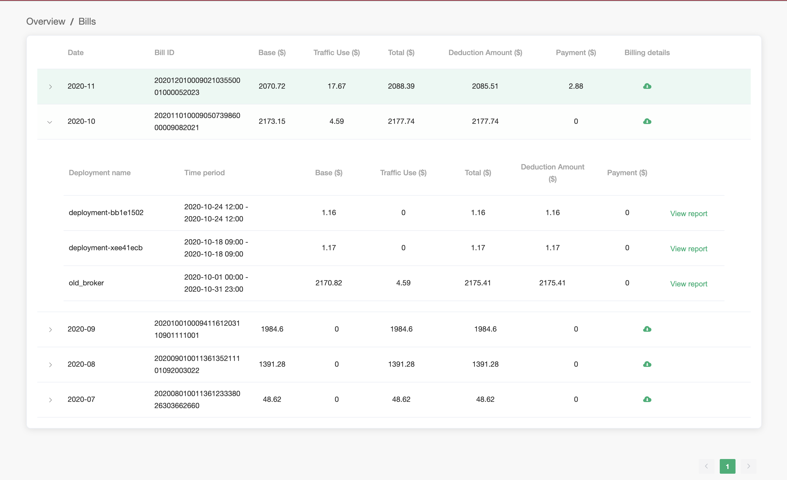
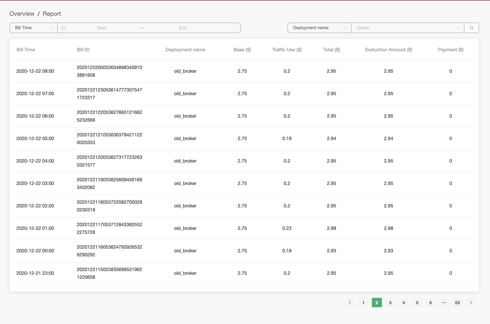
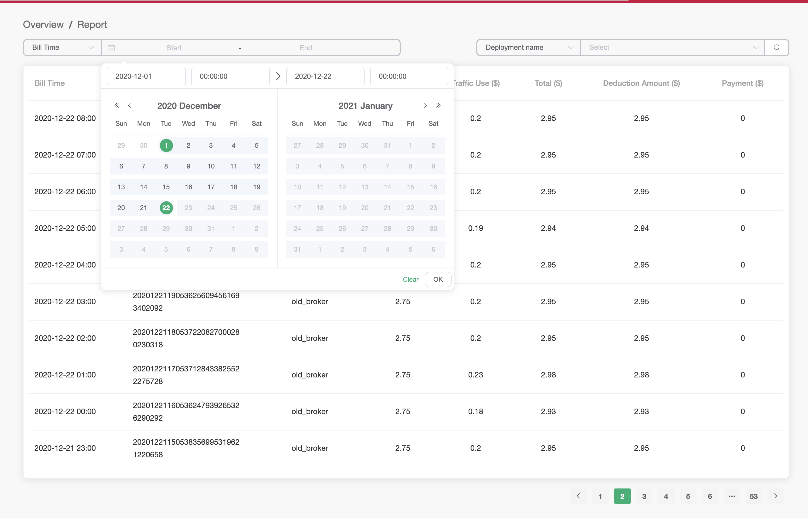
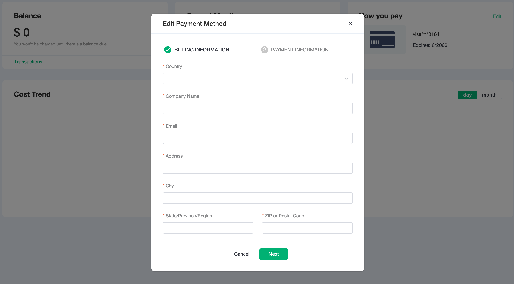

# Overview

The billing overview will introduce you to the recharge of the EMQ X Cloud account, PayPal payment, view transaction records, monthly bills, and expense reports. Click `Billing` -> `Overview` in the left menu to enter the billing overview page.

The overview page displays the following:

1. Balance
2. Billing of the current month (the billing fee from the 1st of the month to the current time)
3. Add or Update the Payment Method
4. Cost trend, you can switch between `day` and `month` to show the corresponding cost trend

## Balance

By default, payments are processed automatically, so you don't have to worry that your service will stop running if you forget to make a payment.

- Balance
  
  Only if the credit card payment fails will the balance show all the charges you have incurred for the previous month's deployment,
  you will need to complete the payment manually or verify that the credit card information is correct.

- Transactions
  
  To view your transaction history, access the Transactions page in the [Billing Transactions](https://cloud.emqx.io/console/billing/transactions)
  

## View Monthly Bills

The monthly bills will show the monthly billing record of the account

1. Click `Bills` to view monthly bills history

   

2. To view the deployment bill associated with the bill, click on the bill record, and it will be displayed below

   

3. To view the detailed report of the deployment bill, click on the `View report` of the deployment expense record

   

## View billing report

The billing report shows all costs incurred per hour of deployment.

1. Click `View Report` on the `Overview` page to enter the billing report page

   

2. The billing report can be filtered by billing time, billing ID, and deployment name

   

## Add or Update a Payment Method

You can use the overview to add a credit card to your account.

- To add a credit card to your EMQ X Cloud account

  1. Sign in to the EMQ X Cloud Console and open the [Billing Overview](https://cloud.emqx.io/console/billing/overview)

  2. Choose an editorial payment method
  3. Enter the credit card information and billing address.
  4. Click `Submit`.

  

- To update your credit card

  1. Sign in to the EMQ X Cloud Console and open the Billing Overview at https://cloud.emqx.io/console/billing/overview.

  2. Choose an editorial payment method

  3. Enter the credit card information and billing address.

  4. Click `Submit`.
