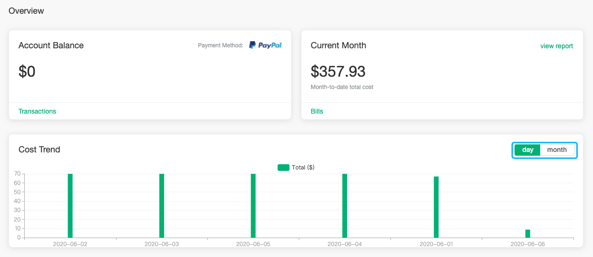
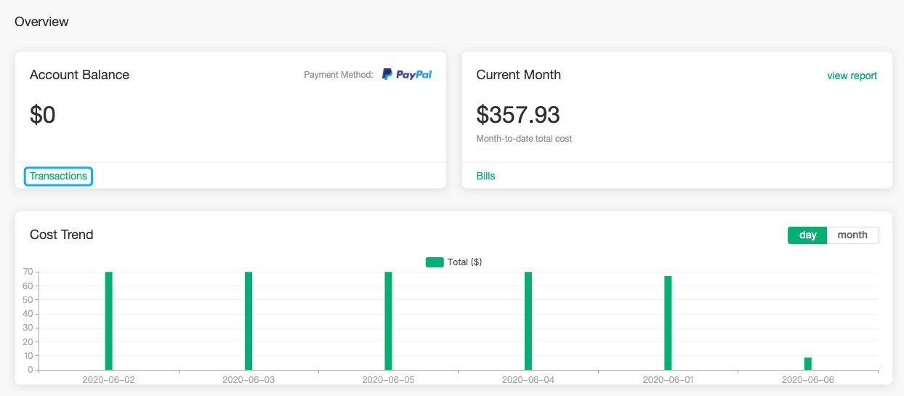
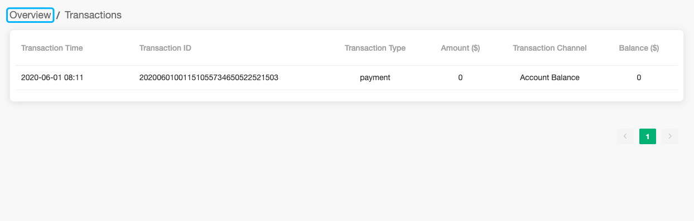
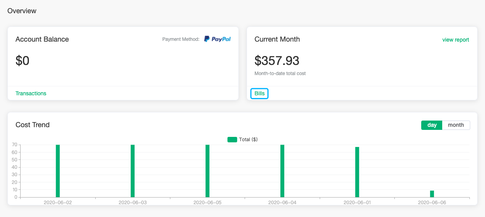
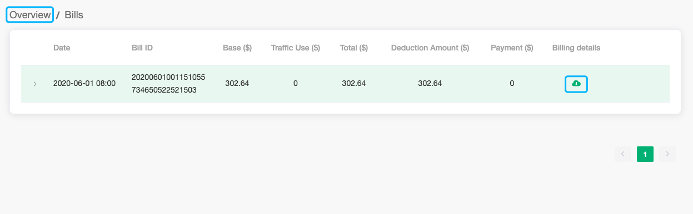
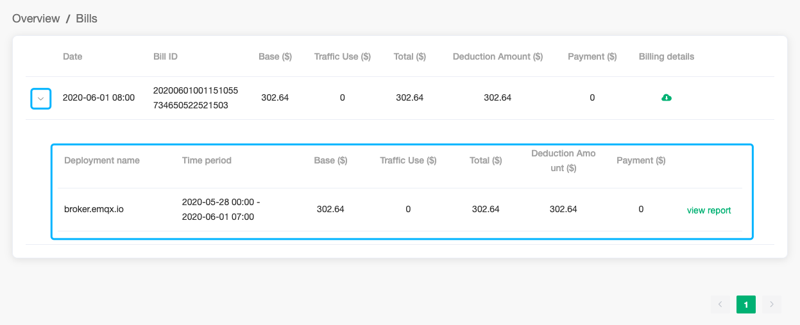
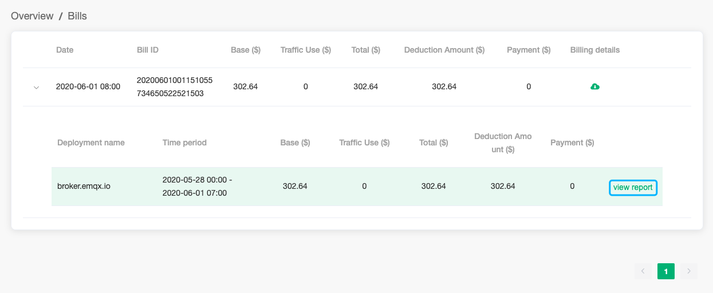
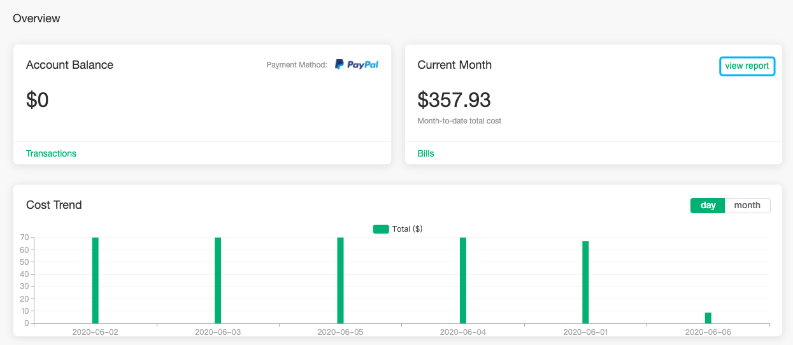
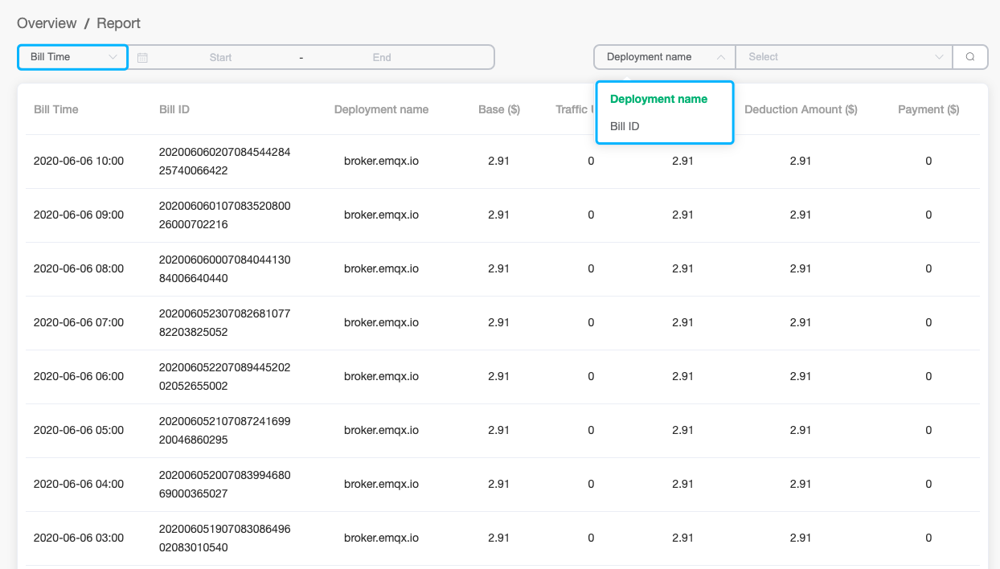

# Overview

The overview will introduce the view of the transaction records, monthly bills, and cost reports. Click `Billing` - > `Overview` in the left menu to enter the bill overview view page

The overview page shows the following three parts:

1. Account Balance

2. Bills of the Current Month (cost from the 1st of this month to the current time)

3. Cost Trend, it can be displayed by switching between `day` and `month`

### Transaction Records

The transaction records will show the recharge and payment records

1. On the overview page, click `transactions` to enter the transaction page

2. Click `Overview` on the transaction record page to return

### Monthly Bills

The monthly bills will show the monthly payment record

1. On the overview page, click `Bills` to enter the bills page

2. To download the bill details, click the download icon in the bill details

3. To view the bills associated with deployment, click the billing record, and it will be displayed at the bottom

4. To view the detailed cost report of deployment, click `view report` of deployment cost record

### Cost Report

The cost report will detail each cost incurred by the deployment

1. On the `Overview`, click `view report` to enter the billing report page

2. You can filter the report by `Bill Time`, `Bill ID` and `Deployment name`

