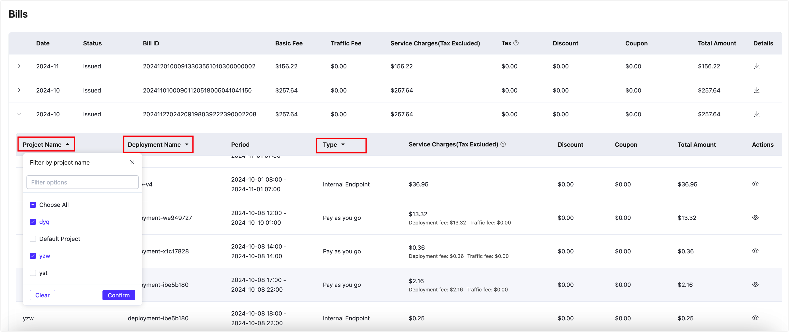

# Overview

The charges for the EMQX Platform are determined by the usage of deployments and other services across your account, encompassing all deployments and services generated by both the root account and subaccounts.

You can either pay as you go on an hourly basis or make an annual prepaid purchase. For the plan pricing details, see the [Product Pricing](../price/pricing.md) page.

## Billing Cycle

Billing for each EMQX Platform deployment and service accrues at hourly intervals. Any usage in less than an hour is billed for the full hour. All billing computations are conducted in Coordinated Universal Time (UTC).

Billing accrues hourly and bills are generated monthly after the usage has occurred. If you remove any deployments that have already accumulated usage charges during the current month, billing for those deployments will stop. However, the charges incurred up to that point in the billing cycle will still appear on your next month's bill and invoice.

On the first day of each month, you will be charged for the usage of the previous month. For instance, if you created a deployment on September 15, the bill for your usage from September 15 to 30 will be generated on October 1.

## Monthly Bill

Bill is issued monthly. In your Cloud Console, select **Billing** -> **Overview** from the top menu and you can see the details about your bill.

The **Monthly Bill** pane displays the cumulative usage amount. To modify the billing period, locate the option in the top right corner of the pane. You can select a billing period ranging from the current month up to the previous 12 months. 

The **Bill status** shows one of the following:

- **Pending**: The monthly bill has not yet been billed.
- **Issued**: The bill has been billed and paid.
- **Overdue**: The bill has been billed and not paid.

The tax on the bills is calculated based on the information you provide to the sales team.

:::tip
Taxes are not included in the estimated total amount for the current month. The total amount, including all taxes and additional charges, will be calculated at the start of the next month.
:::

**Available Credits**

For prepaid users, in the bottom right corner of the **Monthly Bill** pane displays the credits that can be utilized, referred to as **Available Credits**. This feature is particularly beneficial for those who prefer alternative payment methods or do not have a credit card. If you want to select Available Credits as your payment method, please contact us via email or ticket.

### Bills

Click **Bills** at the lower left corner of the **Monthly Bill** pane to navigate to the Bills page. It shows all bills generated throughout the history and provides a breakdown of deployment and service-related costs within a monthly timeframe. Clicking the download button next to each month's entry allows you to download the CSV file of that month's bill.

Clicking the arrow next to the **Date** expands detailed bill items and service records for that month. You can click the arrows next to the **Project Name**, **Deployment Name**, and **Type** headers to filter specific projects, deployments, or billing types, and view the monthly bill filtered accordingly.

### Charges by Service

Click **Charges by Service** next to the **Bills** to navigate to the Charges by Service page to view the details about all the charges generated by deployments and services. 

You can search for billing records within a certain period of time, and also find transaction information related to **Deployment name**, **Project name**, and **Bill ID**.

## Payment Info

You can add or update a payment method on the **Payment Info** pane. See [Billing Information](./billing_information.md) for more details.

## Cost Trend

The **Cost Trend** pane provides a visual representation of the expenses incurred by your account during a specific period, whether it's on a daily or monthly basis. It illustrates the fluctuation and patterns in your usage-related costs.

## Retry a Failed Payment

On the **Bills** page, a message alert will appear if there is an unpaid bill. To view the overdue bill, click on "TRY HERE TO PAY THE OVERDUE BILL(s) MANUALLY." and it will redirect you to the Bills page.

Before proceeding with the transaction, verify the payment method displayed in the **Payment Info** pane. If it is incorrect, click on **Change Info** within that pane.

To retry a failed payment, click either **Overdue** or the card icon. Please note that your payment method may require 3DS verification.

If the payment fails again, please contact your card issuer and ask for more information about the declined payment.

Find more information on [Overdue and Expiry](./overdue.md).
