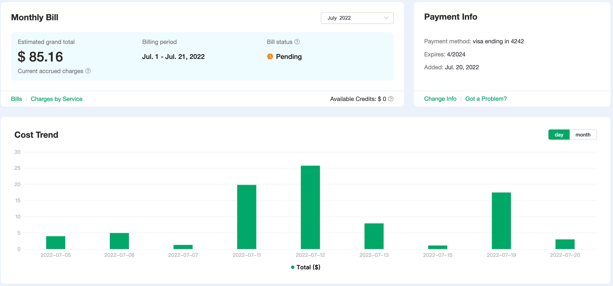

# Overview

The overview will introduce the recharge of the EMQ X Cloud account, PayPal payment, view transaction records, monthly bills and expense reports. Click `Billing` -> `Overview` in the left menu to enter the billing overview page

The overview page displays the following three parts:

1. Account Balance and PayPal Payment
2. Billing of the current month (the billing fee from the 1st of the month to the current time)
3. Expense trend, you can switch between `day` and `month` to show the corresponding expense trend

### Account Balance and PayPal Payment
EMQ X Cloud deducts the cost of last month's bill from your account balance on the 1st of each month. You need to use PayPal to complete last month's bill payment.

* Account Balance
  
  
* PayPal Payment
  
  
* Other Payment Methods
  
  Through [tickets](https://cloud.emqx.io/console/tickets), you can pay using a:
  * Currency other than USD.
  * Method other than a PayPal.

### View monthly bill

The monthly bill will show the monthly billing record of the account

1. Click `Billing` on the `Overview` page to enter the billing page

   

2. To download the bill details, click the download icon in the bill details

   

3. To view the deployment bill associated with the bill, click on the bill record and it will be displayed below

   

4. To view the detailed expense report of the deployment bill, click on the `View report` of the deployment expense record

   

### View expense report

The expense report will show in detail every expense incurred by the deployment

1. Click `View Report` on the `Overview` page to enter the billing report page

   

2. The billing report can be filtered by billing time, billing ID, and deployment name

   

