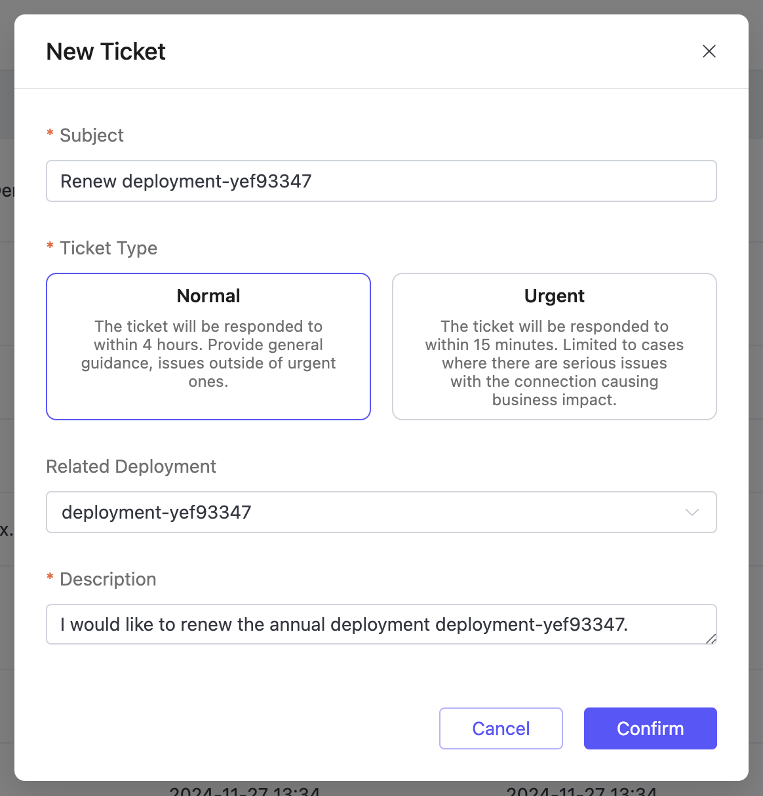

# Subscriptions

The **Subscriptions** page allows you to manage the renewal status of all **annual prepaid deployments** (project managers can only view deployments under their authorized projects). You can access the **Subscriptions** page by navigating to **Billing** -> **Subscriptions** in the top menu of the console. From this page, you can perform renewal operations for deployments.

The renewal status of each deployment is managed independently, allowing you to configure each deployment separately. To renew a deployment, click the **Renew** button in the **Actions** column. In the **New Ticket** dialog that appears, click **Confirm**.

