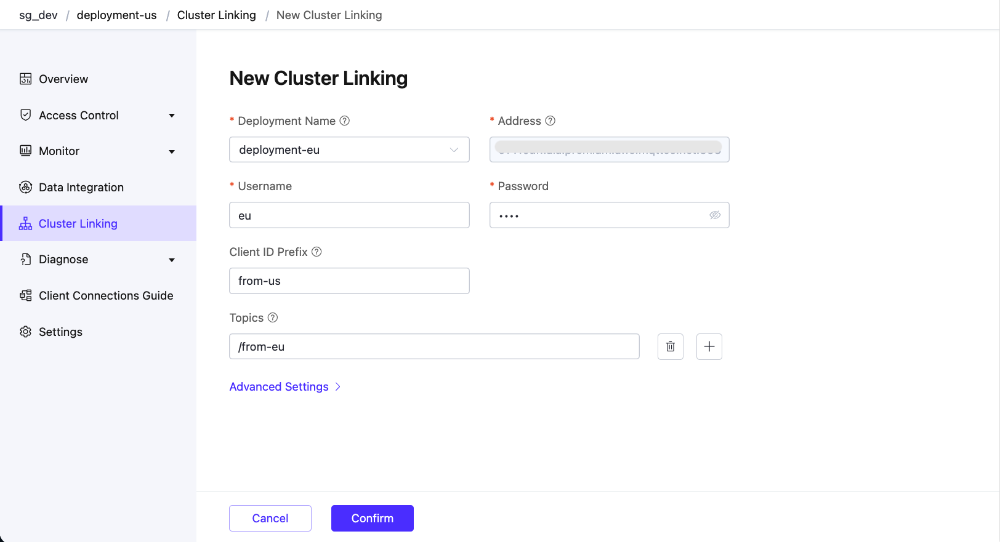
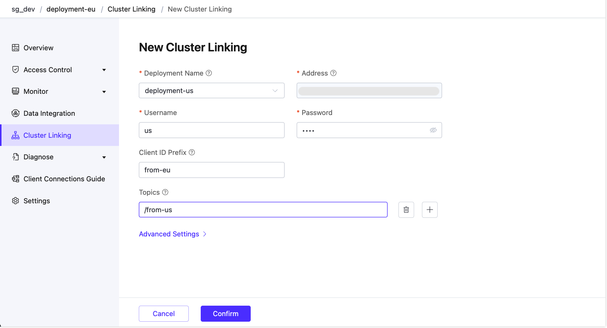

# Cluster Linking

::: tip Note

The Cluster Linking feature is only available in the Premium deployments.

:::

Cluster Linking is a feature that connects multiple, separate EMQX clusters, facilitating communication between clients on different, often geographically dispersed clusters. Compared to traditional MQTT bridging, Cluster Linking is more efficient, reliable, and scalable. It minimizes bandwidth requirements and tolerates network interruptions.

This page introduces the Cluster Linking feature and how to use and configure it in Premium deployments.

## Introduction

A single deployment can serve thousands of geographically distributed MQTT clients effectively. However, when clients are spread globally, issues with high latency and poor network connectivity arise. Creating multiple deployments in different regions can mitigate these problems by serving clients locally, but it introduces a new challenge: enabling seamless communication between clients connected to different deployments.

The traditional solution involves adding an MQTT bridge to each deployment, which forwards all messages between deployments. This approach leads to excessive bandwidth usage and can increase message latency, as many forwarded messages might not be relevant to clients on the other side of the bridge.

Cluster Linking addresses these issues by forwarding only relevant messages between clusters. This optimization reduces bandwidth usage and ensures efficient communication, even during network interruptions.

## Get Started with Cluster Linking

To create the cluster linking between two Premium deployments, you need to set up the cluster linking feature in both deployments. This section demonstrates how to create cluster linking between two Premium deployments. 

Before you start, you need to create two deployments in different regions. For example, you can create two deployments with names as `deployment-us` and `deployment-eu`. For more information on how to create Premium deployments, see [Create a Premium Deployment](../create/premium.md).

### Set Up the Network

To ensure secure and efficient inter-cluster connectivity, the clusters should communicate with each other exclusively through private network connections. You need to set up [NAT Gateway](../vas/nat-gateway.md) for both deployments and the NAT gateway status must be running. 

### Create Cluster Linking in `deployment-us`

1. Click the deployment card of `deployment-us` in your Console.

2. Select **Cluster Linking** from the left navigation menu.

3. Click **New** at the upper right corner. On the **New Cluster Linking** page, configure the following options:
   - **Deployment Name**: Select the deployment name of the Premium deployment that you want to link to. In this demonstration, it is `deployment-eu`. You can find the deployment name information on the deployment **Settings** page.
   
   - **Address**: The MQTT host and port of the deployment to be linked. It is automatically filled when you select the deployment name.
   
   - **Username**: Enter the username for authentication to the `deployment-eu`, if it is configured on its Authentication page.
   
   - **Password**: Enter the password for authentication to the `deployment-eu`, if it is configured on its Authentication page.
   
   - **Client ID Prefix**: Specify a prefix for Client IDs used by MQTT connections to the `deployment-eu`, for example, `from-eu`.
   
     ::: tip
   
     Depending on the cluster size and configuration, multiple MQTT client connections may be established to the remote cluster, and each client must have a unique ClientID. You can control how these ClientIDs are allocated by setting the *Client ID Prefix* for these connections.
   
     :::
   
   - **Topics**: List of MQTT topic filters that specify which messages the local cluster will receive from the remote cluster, for example, `/from-eu`. You can click the plus icon to add more topics.
   
     ::: tip
   
     The local cluster expects to receive messages published to these topics from the remote cluster. This list can be empty, meaning the local cluster will not receive any messages from the remote cluster if no topics are specified.
   
     :::
   
   - **Advanced Settings**: Configure additional settings such as MQTT protocol parameters.
   
4. Click **Confirm**. You will be directed back to the Cluster Linking page and see a new entry is listed and is enabled by default.

### Create Cluster Linking in `deployment-eu`

1. Click the deployment card of `deployment-eu` in your Console.
2. Select **Cluster Linking** from the left navigation menu.
3. Click **New** at the upper right corner. On the **New Cluster Linking** page, configure the following options:
   - **Deployment Name**: Select `deployment-us` from the drop-down list.
   - **Address**: The MQTT host and port of the `deployment-us`. It is automatically filled when you select the deployment name.
   - **Username**: Enter the username for authentication to the `deployment-us`, if it is configured on its Authentication page.
   - **Password**: Enter the password for authentication to the `deployment-us`, if it is configured on its Authentication page.
   - **Client ID Prefix**: Specify a prefix for Client IDs used by MQTT connections to the remote cluster. For example, `from-us`.
   - **Topics**: List of MQTT topic filters that specify which messages the local cluster will receive from the remote cluster, for example, `/from-us`. You can click the plus icon to add more topics.
   - **Advanced Settings**: Configure additional settings such as MQTT protocol parameters.
4. Click **Confirm**. You will be directed back to the Cluster Linking page and see a new entry is listed and is enabled by default.

## Verify Cluster Linking

You can verify if the cluster linking is created successfully using the MQTTX.

1. Create a new connection named `us-client` in MQTTX and connect to `deployment-us`. Create a subscription to the topic `/from-eu`.
2. Create a new connection named `eu-client` in MQTTX and connect to `deployment-eu`. Create a subscription to the topic `/from-us`.
3. Use the client `us-client` to send a message to the topic `/from-us` with the payload as `from us`. 
4. Verify that the client `eu-client` receives the message.
5. Use the client `eu-client` to send a message to the topic `/from-eu` and the client `us-client` should also receive the message.

## Create Asymmetrical Links

To create an asymmetrical link, you just need to modify the cluster linking configuration by setting the **Topics** field empty and keeping other settings the same as before.

For example, you can delete the topics in the cluster linking settings in `deployment-us`. This means that `deployment-us` is now not interested in *any* messages from `deployment-eu`. This makes the cluster link *asymmetrical*, which is useful for one-way message forwarding between clusters.

If you repeat the message publishing and subscribing steps in [Verify Cluster Linking](#verify-cluster-linking), you will notice that the message published from `deployment-eu` is not received by the subscriber on `deployment-us`.

## Manage Cluster Linking

You can view the basic information of the cluster links listed on the Cluster Linking page. 

By clicking the deployment ID, you can view metrics and statistics for the cluster linking execution and message transmission on the **Overview** tab. By clicking the **Settings** tab, you can modify the configurations. Alternatively, you can also click the editing icon in the **Actions** column.

Clicking the delete icon in the **Actions** column will delete the selected cluster linking entry.
