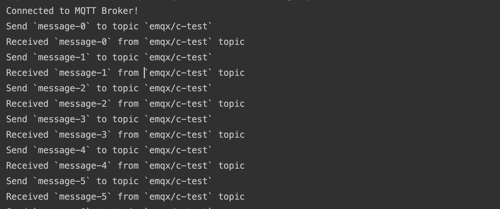

# Connect to Deployment via Paho C

This article mainly introduces how to use `Eclipse Paho C` in the C project, and implement the connection, subscription, messaging, unsubscribing and other functions between the client and MQTT broker.

Eclipse Paho Embedded C can be used on the desktop operating system, but mainly for embedded environments such as mbed, Arduino and FreeRTOS .

## Prerequisites

### Deploy MQTT Broker
- You can use the [free public MQTT broker](https://www.emqx.com/en/mqtt/public-mqtt5-broker) provided by EMQX. This service was created based on the [EMQX Platform](https://www.emqx.com/en/cloud). The information about broker access is as follows:
  - Broker: broker.emqx.io 
  - TCP Port: 1883 
  - TLS/SSL Port: 8883 
- You can [create a deployment](https://docs.emqx.com/en/cloud/latest/create/overview.html) as well. Find connection information in the deployment overview. Make sure the deployment is running. At the same time, you can use WebSocket to test the connection to the MQTT server. If you are creating your own deployment, check [Authentication](https://docs.emqx.com/en/cloud/latest/deployments/auth_overview.html) and set the username and password in Authentication & ACL > Authentication for verification.

## Installation Dependency

```bash
sudo apt-get update
sudo apt-get -y install build-essential git cmake
```

### Building from source

The continuous integration builds can be found on Travis-CI for Linux and Mac, and AppVeyor for Windows.

#### Linux/Mac

```bash
git clone https://github.com/eclipse/paho.mqtt.c.git
cd org.eclipse.paho.mqtt.c.git
make
sudo make install
```

#### Windows

```bash
mkdir build.paho

cd build.paho

call "C:\Program Files (x86)\Microsoft Visual Studio 14.0\VC\vcvarsall.bat" x64

cmake -G "NMake Makefiles" -DPAHO_WITH_SSL=TRUE -DPAHO_BUILD_DOCUMENTATION=FALSE -DPAHO_BUILD_SAMPLES=TRUE -DCMAKE_BUILD_TYPE=Release -DCMAKE_VERBOSE_MAKEFILE=TRUE ..

nmake
```

## Connect over TCP Protocol

This section introduces how to connect to the MQTT Broker over TCP port.

1. Include dependency library

   ```c
   #include "stdlib.h"
   #include "string.h"
   #include "unistd.h"
   #include "MQTTClient.h"
   ```

2. Define connection addresses, authentication information, and message publishing and receiving topic

   ```c
   // Enable or disable SSL/TLS connection (1 for SSL/TLS, 0 for TCP)
   #define USE_SSL 0
   
   #if USE_SSL
   #define ADDRESS "ssl://broker.emqx.io:8883"
   #else
   #define ADDRESS "tcp://broker.emqx.io:1883"
   #endif
   
   #define USERNAME    "emqx"
   #define PASSWORD    "public"
   #define CLIENTID    "c-client"
   #define QOS         0
   #define TOPIC       "emqx/c-test"
   #define TIMEOUT     10000L
   ```

3. Connect to broker

   ```c
   int rc;
   MQTTClient client;
   
   MQTTClient_create(&client, ADDRESS, CLIENTID, 0, NULL);
   MQTTClient_connectOptions conn_opts = MQTTClient_connectOptions_initializer;
   conn_opts.username = USERNAME;
   conn_opts.password = PASSWORD;
   
   if ((rc = MQTTClient_connect(client, &conn_opts)) != MQTTCLIENT_SUCCESS) {
       printf("Failed to connect, return code %d\n", rc);
       exit(-1);
   } else {
       printf("Connected to MQTT Broker!\n");
   }
   ```

## Connect over SSL/TLS Protocol
This section introduces how to connect to the MQTT Broker over SSL/TLS port.

1. Define connection addresses. Set `USE_SSL` to 1.

   ``` c
   // Enable or disable SSL/TLS connection (1 for SSL/TLS, 0 for TCP)
   #define USE_SSL 1
   ```

2. Connect to broker by SSL/TLS

   Set SSL Option by function `configureSSLOptions()`. If you need to configure the server certificate, you can load the certificate by `ssl_opts.trustStore`. If not, set `ssl_opts.enableServerCertAuth` to 0.

   ``` c
   MQTTClient_SSLOptions configureSSLOptions() {
       MQTTClient_SSLOptions ssl_opts = MQTTClient_SSLOptions_initializer;
       ssl_opts.enableServerCertAuth = 1;
       // CA_CERTIFICATE_FILE_Path specify server CA
       // ssl_opts.trustStore = CA_CERTIFICATE_FILE_Path;
       return ssl_opts;
   }
   
   ···
   
   #if USE_SSL
    MQTTClient_SSLOptions ssl_opts = configureSSLOptions();
    conn_opts.ssl = &ssl_opts;
   #endif
   ```

## Publish and Subscribe

This section introduces how to subscribe to topics and publish messages after you successfully connect to the MQTT broker.

### Subscribe to Topics

Set the topic for subscription and the [QoS Level](https://www.emqx.com/en/blog/introduction-to-mqtt-qos) of the topic.

``` c 
// subscribe topic
MQTTClient_subscribe(client, TOPIC, QOS);
```

### Unsubscribe to Topics

Use the following codes to unsubscribe to topics. You need to define the topic for unsubscription.

``` c 
MQTTClient_unsubscribe(client, TOPIC);
```

### Publish Messages

Inform MQTT Broker about the topic and payload when publishing messages.

```c
void publish(MQTTClient client, char *topic, char *payload) {
    MQTTClient_message message = MQTTClient_message_initializer;
    message.payload = payload;
    message.payloadlen = strlen(payload);
    message.qos = QOS;
    message.retained = 0;
    MQTTClient_deliveryToken token;
    MQTTClient_publishMessage(client, topic, &message, &token);
    MQTTClient_waitForCompletion(client, token, TIMEOUT);
    printf("Send `%s` to topic `%s` \n", payload, TOPIC);
}

// Call the `publish` function in a loop to finish publishing the message
char payload[16];
for (int i = 0; i < 100; i += 1) {
    // publish message to broker
    snprintf(payload, 16, "message-%d", i);
    publish(client, TOPIC, payload);
    sleep(1);
}
```

### Receive Messages

The following code specifies that the client listens for message events and executes a callback function after receiving a message, printing the received message and its topic to the console.

``` c 
MQTTClient_setCallbacks(client, NULL, NULL, on_message, NULL);
···
// Define the on_message callback function to print the content of the messages received by the subscribed topic
int on_message(void *context, char *topicName, int topicLen, MQTTClient_message *message) {
    char *payload = message->payload;
    printf("Received `%s` from `%s` topic \n", payload, topicName);
    MQTTClient_freeMessage(&message);
    MQTTClient_free(topicName);
    return 1;
}
```

### Disconnect from MQTT Broker
If the client wants to disconnect actively, use the following code:

``` c 
MQTTClient_disconnect(client, TIMEOUT);
MQTTClient_destroy(&client);
```

The above section only lists some key code, the complete code of the project can be found at: [mqtt-client-C-paho]https://github.com/emqx/MQTT-Client-Examples/tree/master/mqtt-client-C-paho), you can download and experience it.

### The full code

```c
#include "stdlib.h"
#include "string.h"
#include "unistd.h"
#include "MQTTClient.h"

// Enable or disable SSL/TLS connection (1 for SSL/TLS, 0 for TCP)
#define USE_SSL 1

#if USE_SSL
#define ADDRESS "ssl://broker.emqx.io:8883"
#else
#define ADDRESS "tcp://broker.emqx.io:1883"
#endif

#define USERNAME    "emqx"
#define PASSWORD    "public"
#define CLIENTID    "c-client"
#define QOS         0
#define TOPIC       "emqx/c-test"
#define TIMEOUT     10000L

MQTTClient_SSLOptions configureSSLOptions() {
    MQTTClient_SSLOptions ssl_opts = MQTTClient_SSLOptions_initializer;
    ssl_opts.enableServerCertAuth = 1;
    ssl_opts.trustStore = CA_CERTIFICATE_FILE;
    return ssl_opts;
}


void publish(MQTTClient client, char *topic, char *payload) {
    MQTTClient_message message = MQTTClient_message_initializer;
    message.payload = payload;
    message.payloadlen = strlen(payload);
    message.qos = QOS;
    message.retained = 0;
    MQTTClient_deliveryToken token;
    MQTTClient_publishMessage(client, topic, &message, &token);
    MQTTClient_waitForCompletion(client, token, TIMEOUT);
    printf("Send `%s` to topic `%s` \n", payload, TOPIC);
}

int on_message(void *context, char *topicName, int topicLen, MQTTClient_message *message) {
    char *payload = message->payload;
    printf("Received `%s` from `%s` topic \n", payload, topicName);
    MQTTClient_freeMessage(&message);
    MQTTClient_free(topicName);
    return 1;
}

int main(int argc, char *argv[]) {
    int rc;
    MQTTClient client;

    MQTTClient_create(&client, ADDRESS, CLIENTID, 0, NULL);
    MQTTClient_connectOptions conn_opts = MQTTClient_connectOptions_initializer;
    conn_opts.username = USERNAME;
    conn_opts.password = PASSWORD;

#if USE_SSL
    MQTTClient_SSLOptions ssl_opts = configureSSLOptions();
    conn_opts.ssl = &ssl_opts;
#endif

    MQTTClient_setCallbacks(client, NULL, NULL, on_message, NULL);
    if ((rc = MQTTClient_connect(client, &conn_opts)) != MQTTCLIENT_SUCCESS) {
        printf("Failed to connect, return code %d\n", rc);
        exit(-1);
    } else {
        printf("Connected to MQTT Broker!\n");
    }
    // subscribe topic
    MQTTClient_subscribe(client, TOPIC, QOS);
    
    char payload[16];
    for (int i = 0; i < 10; i += 1) {
        // publish message to broker
        snprintf(payload, 16, "message-%d", i);
        publish(client, TOPIC, payload);
        sleep(1);
    }
    MQTTClient_unsubscribe(client, TOPIC);
    MQTTClient_disconnect(client, TIMEOUT);
    MQTTClient_destroy(&client);
    return rc;
}
```

## Test

1. Write the CMakeLists.txt file
   ```
   cmake_minimum_required(VERSION 3.17)
   find_package(eclipse-paho-mqtt-c 1.3.9 REQUIRED)
   project(mqtt_c C)
   include_directories(/usr/local/include)
   link_directories(/usr/local/lib)
   set(CMAKE_C_STANDARD 99)
   add_executable(mqtt_c main.c)
   target_link_libraries(mqtt_c paho-mqtt3c)
   ```
2. Compile and run code
   
   
## More

In summary, we have implemented the creation of an MQTT connection in a C project, simulated subscribing, sending and receiving messages, unsubscribing, and disconnecting between the client and MQTT broker. You can download the source code of the example [here](https://github.com/emqx/MQTT-Client-Examples/tree/master/mqtt-client-c), and you can also find more demo examples in other languages on [GitHub](https://github.com/emqx/MQTT-Client-Examples).
