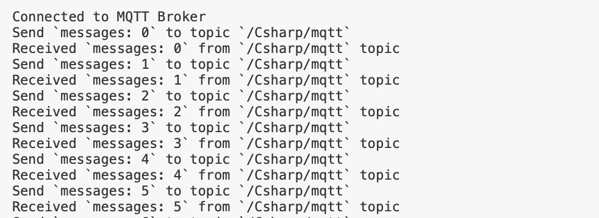

# Connect to the Deployment with C# SDK

[C#](https://docs.microsoft.com/en-us/dotnet/csharp/) is an **object-oriented** programming language provided by Microsoft that runs on **.NET Framework**.

This article mainly introduces how to use the **paho.mqtt.m2mqtt** client library in a C# project to connect, subscribe, publish and receive messages from the client to the MQTT server.

## Preconditions

>1. The deployment has been created. You can view connection-related information under [Deployment Overview](../deployments/view_deployment.md). Please make sure that the deployment status is running. At the same time, you can use WebSocket to test the connection to the MQTT server.
>2. Set the user name and password in `Authentication & ACL` > `Authentication` for connection verification.

This project uses .NET 5.0 to develop and test. You can use the following commend to confirm the .NET version.
```bash
~ dotnet --version            
5.0.301
```

### Choose the MQTT client
[paho.mqtt.m2mqtt](https://www.eclipse.org/paho/clients/dotnet/) is a MQTT client available for all .NET platforms with support for both MQTT v3.1 and v3.1.1.

### .NET CLI install M2Mqtt 
Use the following command in the root of the project to install M2Mqtt.
```bash
dotnet add package M2Mqtt --version 4.3.0
```


## Connection

>Please find the relevant address and port information in the [Deployment Overview](../deployments/view_deployment.md) of the Console. Please note that if it is the basic edition, the port is not 1883 or 8883, please confirm the port.

### Connect to the MQTT broker
This article will use [the free public MQTT broker](https://www.emqx.com/en/mqtt/public-mqtt5-broker) provided by EMQX. This service is created based on [MQTT IoT cloud platform](https://www.emqx.com/en/cloud) to create. The accessing information of the broker is as follows:
- Broker: **broker.emqx.io**
- TCP Port: **1883**
- WebSocket Port: **8083**

### Import the M2Mqtt
```csharp
using uPLibrary.Networking.M2Mqtt;
```

### Set the parameter of MQTT Broker connection
Set the address, port and topic of MQTT Broker connection. At the same time, we call the C# `Guid.NewGuid()` to randomly generate uid as the MQTT client id.
```csharp
string broker = "broker.emqx.io";
int port = 1883;
string topic = "Csharp/mqtt";
string clientId = Guid.NewGuid().ToString();
// If the broker requires authentication, set the username and password
string username = "emqx";
string password = "public";
```

### Write the MQTT connect method
Write static class method ConnectMQTT to create an MQTT client and connect it to the specified broker. We can determine whether the client is connected successfully according to the client's property of `IsConnected`. In the end, the client is returned.
```csharp
static MqttClient ConnectMQTT(string broker, int port, string clientId, string username, string password)
{
    MqttClient client = new MqttClient(broker, port, false, MqttSslProtocols.None, null, null);
    client.Connect(clientId, username, password);
    if (client.IsConnected)
    {
        Console.WriteLine("Connected to MQTT Broker");
    }
    else
    {
        Console.WriteLine("Failed to connect");
    }
    return client;
}
```

### Publish messages
We define a while loop. In this loop we will set the MQTT client `Publish` method to publish messages to the specified topic every second.
```csharp
static void Publish(MqttClient client, string topic)
{
    int msg_count = 0;
    while (true)
    {
        System.Threading.Thread.Sleep(1*1000);
        string msg = "messages: " + msg_count.ToString();
        client.Publish(topic, System.Text.Encoding.UTF8.GetBytes(msg));
        Console.WriteLine("Send `{0}` to topic `{1}`", msg, topic);
        msg_count++;
    }
}
```

### Subscribe to a topic
Write the static method `client_MqttMsgPublishReceived`. This method will be called after the client received messages from the MQTT Broker. In this method, we will print the topic and payload of the messages.
```csharp
static void Subscribe(MqttClient client, string topic)
{
    client.MqttMsgPublishReceived += client_MqttMsgPublishReceived;
    client.Subscribe(new string[] { topic }, new byte[] { MqttMsgBase.QOS_LEVEL_AT_MOST_ONCE });
}
static void client_MqttMsgPublishReceived(object sender, MqttMsgPublishEventArgs e)
{
    string payload = System.Text.Encoding.Default.GetString(e.Message);
    Console.WriteLine("Received `{0}` from `{1}` topic", payload, e.Topic.ToString());
}
```

### The complete code
```csharp
using System;
using uPLibrary.Networking.M2Mqtt;
using uPLibrary.Networking.M2Mqtt.Messages;

namespace csharpMQTT
{
    class Program
    {
        static MqttClient ConnectMQTT(string broker, int port, string clientId, string username, string password)
        {
            MqttClient client = new MqttClient(broker, port, false, MqttSslProtocols.None, null, null);
            client.Connect(clientId, username, password);
            if (client.IsConnected)
            {
                Console.WriteLine("Connected to MQTT Broker");
            }
            else
            {
                Console.WriteLine("Failed to connect");
            }
            return client;
        }

        static void Publish(MqttClient client, string topic)
        {
            int msg_count = 0;
            while (true)
            {
                System.Threading.Thread.Sleep(1*1000);
                string msg = "messages: " + msg_count.ToString();
                client.Publish(topic, System.Text.Encoding.UTF8.GetBytes(msg));
                Console.WriteLine("Send `{0}` to topic `{1}`", msg, topic);
                msg_count++;
            }
        }

        static void Subscribe(MqttClient client, string topic)
        {
            client.MqttMsgPublishReceived += client_MqttMsgPublishReceived;
            client.Subscribe(new string[] { topic }, new byte[] { MqttMsgBase.QOS_LEVEL_AT_MOST_ONCE });
        }
        static void client_MqttMsgPublishReceived(object sender, MqttMsgPublishEventArgs e)
        {
            string payload = System.Text.Encoding.Default.GetString(e.Message);
            Console.WriteLine("Received `{0}` from `{1}` topic", payload, e.Topic.ToString());
        }

        static void Main(string[] args)
        {
            string broker = "broker.emqx.io";
            int port = 1883;
            string topic = "Csharp/mqtt";
            string clientId = Guid.NewGuid().ToString();
            string username = "emqx";
            string password = "public";
            MqttClient client = ConnectMQTT(broker, port, clientId, username, password);
            Subscribe(client, topic);
            Publish(client, topic);
        }
    }
}
```

## Test
Run the code, the console output is as follows. 