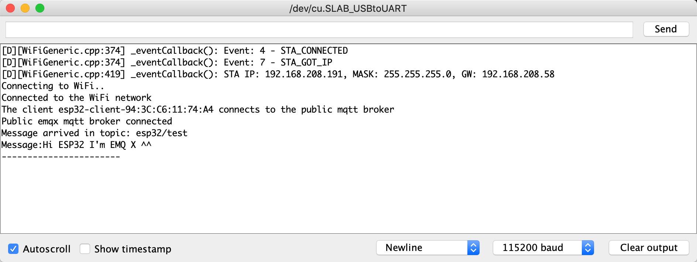
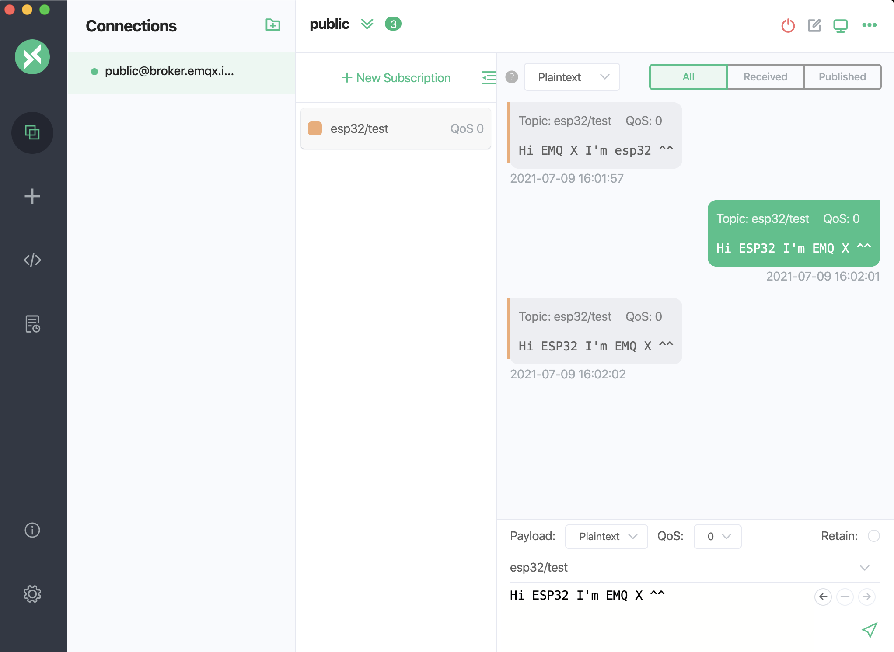

# Connect with ESP32

This article mainly introduces how to use `PubSubClient` in the ESP32 project, including implementing the connection, subscription, messaging, and other functions between the client and MQTT broker.

As an upgraded version of ESP8266, [ESP32](https://www.espressif.com/en/products/socs/esp32) is an ideal choice for IoT projects. In addition to the Wi-Fi module, this module also includes a Bluetooth 4.0 module. The dual-core CPU operates at a frequency of 80 to 240 MHz. It contains two Wi-Fi and Bluetooth modules and various input and output pins.

This article demonstrates how to connect an ESP32 client to MQTT broker via the TCP port and TLS/SSL port respectively. For Serverless deployments, see the demonstration on TLS/SSL port connection. Settings for connections over TCP port are different from those for connections over TLS/SSL port, but the code used in the publishing and subscribing functions is the same.

## Prerequisites

Before the connection, you need to get the broker and client ready.

### Get MQTT Broker

You can use the [free public MQTT broker](https://www.emqx.com/en/mqtt/public-mqtt5-broker) provided by EMQX. This service was created based on the [EMQX Cloud](https://www.emqx.com/en/cloud). The information about broker access is as follows:
- Broker: **broker.emqx.io**
- TCP Port: **1883**
- SSL/TLS Port: **8883**

You can [create a deployment](../create/overview.md) as well. Find connection information in deployment overview. Make sure the deployment is running. Use the TCP port or TLS/SSL port to test the connection to the MQTT server.

If you are creating your own deployment, check [Authentication](../deployments/auth_overview.md) and set the username and password in `Authentication & ACL` > `Authentication` for verification.

### Arduino IDE
This article uses the [Arduino IDE](https://www.arduino.cc/en/software) as the code editor and uploader. The open-source Arduino Software (IDE) makes it easy to write code and upload it to the board. This software can be used with any Arduino board.

## Installation Dependencies

In Arduino IDE, complete the following installations:

1. Install ESP32 development board.
   Click **Tools** -> **Development Board** -> **Development Board Management**. Search ESP32 and click **Install**.
2. Install PubSub client.
   Click **Project** -> **Load library** -> **Library manager...**. Search PubSubClient and Install PubSubClient by Nick O’Leary.


## Connect over TCP Port
This section describes how to connect an ESP32 client to MQTT broker over TCP port in Arduino IDE.

1. Import the WiFi and PubSubClient libraries.

```c
#include <WiFi.h>
#include <PubSubClient.h>
```

2. Set the Wi-Fi name and password, as well as the MQTT server connection address and port, and set the topic to `esp32/test.`

> The sample code will use a public MQTT server to connect, and the public MQTT server does not require a username and password. If you create a deployment, please refer to [Serverless Auth](../deployments/auth_serverless.md) or [Dedicated Auth](../deployments/auth_dedicated.md) to set username and password.


```c
// WiFi
const char *ssid = "mousse"; // Enter your WiFi name
const char *password = "qweqweqwe";  // Enter WiFi password

// MQTT Broker
const char *mqtt_broker = "broker.emqx.io";// broker address
const char *topic = "esp32/test"; // define topic 
const char *mqtt_username = "emqx"; // username for authentication
const char *mqtt_password = "public";// password for authentication
const int mqtt_port = 1883;// port of MQTT over TCP
```

3. Open a serial connection to output the results of the program and connect to the Wi-Fi network.

```c
// Set software serial baud to 115200;
Serial.begin(115200);
// connecting to a WiFi network
WiFi.begin(ssid, password);
while (WiFi.status() != WL_CONNECTED) {
    delay(500);
    Serial.println("Connecting to WiFi..");
}
```

4. Use PubSubClient to connect to the public MQTT broker.

```c
client.setServer(mqtt_broker, mqtt_port);
client.setCallback(callback);
while (!client.connected()) {
    String client_id = "esp32-client-";
    client_id += String(WiFi.macAddress());
    Serial.printf("The client %s connects to the public mqtt broker\n", client_id.c_str());
    if (client.connect(client_id.c_str(), mqtt_username, mqtt_password)) {
        Serial.println("Public emqx mqtt broker connected");
    } else {
        Serial.print("failed with state ");
        Serial.print(client.state());
        delay(2000);
    }
}
```

5. After the MQTT server is successfully connected, ESP32 will publish messages on topic `esp32/test` to the MQTT server and subscribe to messages on topic `esp32/test`.

```c
// publish and subscribe
client.publish(topic, "Hi EMQX I'm ESP32 ^^"); // publish to the topic
client.subscribe(topic); // subscribe from the topic
```

6. Set the callback function to print the topic name to the serial port and print the message received from the `esp32/test` topic.

```c
void callback(char *topic, byte *payload, unsigned int length) {
    Serial.print("Message arrived in topic: ");
    Serial.println(topic);
    Serial.print("Message:");
    for (int i = 0; i < length; i++) {
        Serial.print((char) payload[i]);
    }
    Serial.println();
    Serial.println("-----------------------");
}
```

The complete code is displayed as follows:

```c
#include <WiFi.h>
#include <PubSubClient.h>

// WiFi
const char *ssid = "mousse"; // Enter your WiFi name
const char *password = "qweqweqwe";  // Enter WiFi password

// MQTT Broker
const char *mqtt_broker = "broker.emqx.io";// broker address
const char *topic = "esp32/test"; // define topic 
const char *mqtt_username = "emqx"; // username for authentication
const char *mqtt_password = "public";// password for authentication
const int mqtt_port = 1883;// port of MQTT over TCP

WiFiClient espClient;
PubSubClient client(espClient);

void setup() {
 // Set software serial baud to 115200;
 Serial.begin(115200);
 // connecting to a WiFi network
 WiFi.begin(ssid, password);
 while (WiFi.status() != WL_CONNECTED) {
     delay(500);
     Serial.println("Connecting to WiFi..");
 }
 Serial.println("Connected to the WiFi network");
 //connecting to a mqtt broker
 client.setServer(mqtt_broker, mqtt_port);
 client.setCallback(callback);
 while (!client.connected()) {
     String client_id = "esp32-client-";
     client_id += String(WiFi.macAddress());
     Serial.printf("The client %s connects to the public mqtt broker\n", client_id.c_str());
     if (client.connect(client_id.c_str(), mqtt_username, mqtt_password)) {
         Serial.println("Public emqx mqtt broker connected");
     } else {
         Serial.print("failed with state ");
         Serial.print(client.state());
         delay(2000);
     }
 }
 // publish and subscribe
 client.publish(topic, "Hi EMQX I'm ESP32 ^^");
 client.subscribe(topic);
}

void callback(char *topic, byte *payload, unsigned int length) {
 Serial.print("Message arrived in topic: ");
 Serial.println(topic);
 Serial.print("Message:");
 for (int i = 0; i < length; i++) {
     Serial.print((char) payload[i]);
 }
 Serial.println();
 Serial.println("-----------------------");
}

void loop() {
 client.loop();
}
```

## Connect over TLS/SSL Port
This section describes how to connect an ESP32 client to MQTT broker over TLS/SSL port in Arduino IDE. Settings for connections over TLS/SSL ports are different from those for connections over TCP port, but the code is the same in the publishing and subscribing functions.

1. Import libraries ESP32WiFi and PubSubClient.

```c
#include <WiFi.h>
#include <PubSubClient.h>
#include <WiFiClientSecure.h>
```

2. Set Wi-Fi name and password, and connection address and port.

> The sample code will use a public MQTT server to connect, and the public MQTT server does not require a username and password. If you create a deployment, please refer to [Serverless Auth](../deployments/auth_serverless.md) or [Dedicated Auth](../deployments/auth_dedicated.md) to set username and password.


```c
// WiFi
const char *ssid = "mousse"; // Enter your WiFi name
const char *password = "qweqweqwe";  // Enter WiFi password

// MQTT Broker
const char *mqtt_broker = "broker.emqx.io";// broker address
const char *topic = "esp32/test"; // define topic 
const char *mqtt_username = "emqx"; // username for authentication
const char *mqtt_password = "public";// password for authentication
const int mqtt_port = 8883;// port of MQTT over TLS/SSL
```

3. Set server-side certificate.

   If you are using a public MQTT broker, [download CA certificate](https://assets.emqx.com/data/emqxsl-ca.crt) here for TLS/SSL port connection with Serverless or Standard deployment. If you are using Professional deployment, use your own server-side certificate.

```c
// load DigiCert Global Root CA ca_cert
const char * ca_cert = \
  "-----BEGIN CERTIFICATE-----\n"\
"MIIDrzCCApegAwIBAgIQCDvgVpBCRrGhdWrJWZHHSjANBgkqhkiG9w0BAQUFADBh\n"\
"MQswCQYDVQQGEwJVUzEVMBMGA1UEChMMRGlnaUNlcnQgSW5jMRkwFwYDVQQLExB3\n"\
"d3cuZGlnaWNlcnQuY29tMSAwHgYDVQQDExdEaWdpQ2VydCBHbG9iYWwgUm9vdCBD\n"\
"QTAeFw0wNjExMTAwMDAwMDBaFw0zMTExMTAwMDAwMDBaMGExCzAJBgNVBAYTAlVT\n"\
"MRUwEwYDVQQKEwxEaWdpQ2VydCBJbmMxGTAXBgNVBAsTEHd3dy5kaWdpY2VydC5j\n"\
"b20xIDAeBgNVBAMTF0RpZ2lDZXJ0IEdsb2JhbCBSb290IENBMIIBIjANBgkqhkiG\n"\
"9w0BAQEFAAOCAQ8AMIIBCgKCAQEA4jvhEXLeqKTTo1eqUKKPC3eQyaKl7hLOllsB\n"\
"CSDMAZOnTjC3U/dDxGkAV53ijSLdhwZAAIEJzs4bg7/fzTtxRuLWZscFs3YnFo97\n"\
"nh6Vfe63SKMI2tavegw5BmV/Sl0fvBf4q77uKNd0f3p4mVmFaG5cIzJLv07A6Fpt\n"\
"43C/dxC//AH2hdmoRBBYMql1GNXRor5H4idq9Joz+EkIYIvUX7Q6hL+hqkpMfT7P\n"\
"T19sdl6gSzeRntwi5m3OFBqOasv+zbMUZBfHWymeMr/y7vrTC0LUq7dBMtoM1O/4\n"\
"gdW7jVg/tRvoSSiicNoxBN33shbyTApOB6jtSj1etX+jkMOvJwIDAQABo2MwYTAO\n"\
"BgNVHQ8BAf8EBAMCAYYwDwYDVR0TAQH/BAUwAwEB/zAdBgNVHQ4EFgQUA95QNVbR\n"\
"TLtm8KPiGxvDl7I90VUwHwYDVR0jBBgwFoAUA95QNVbRTLtm8KPiGxvDl7I90VUw\n"\
"DQYJKoZIhvcNAQEFBQADggEBAMucN6pIExIK+t1EnE9SsPTfrgT1eXkIoyQY/Esr\n"\
"hMAtudXH/vTBH1jLuG2cenTnmCmrEbXjcKChzUyImZOMkXDiqw8cvpOp/2PV5Adg\n"\
"06O/nVsJ8dWO41P0jmP6P6fbtGbfYmbW0W5BjfIttep3Sp+dWOIrWcBAI+0tKIJF\n"\
"PnlUkiaY4IBIqDfv8NZ5YBberOgOzW6sRBc4L0na4UU+Krk2U886UAb3LujEV0ls\n"\
"YSEY1QSteDwsOoBrp+uvFRTp2InBuThs4pFsiv9kuXclVzDAGySj4dzp30d8tbQk\n"\
"CAUw7C29C79Fv1C5qfPrmAESrciIxpg0X40KPMbp1ZWVbd4="\
"-----END CERTIFICATE-----\n";

// init secure wifi client
WiFiClientSecure espClient;
// use wifi client to init mqtt client
PubSubClient client(espClient); 
```

4. Open a serial connection to output of the result of the program and connect to the Wi-Fi network.

```c
// Set software serial baud to 115200;
Serial.begin(115200);
// connecting to a WiFi network
WiFi.begin(ssid, password);
while (WiFi.status() != WL_CONNECTED) {
    delay(500);
    Serial.println("Connecting to WiFi..");
}
Serial.println("Connected to the WiFi network");
```

5. Set certificate, and MQTT broker, write callback function, and print connection information on the serial monitor at the same time.

```c
// set root ca cert
espClient.setCACert(ca_cert);
// connecting to a mqtt broker
client.setServer(mqtt_broker, mqtt_port);
client.setCallback(callback);
while (!client.connected()) {
    String client_id = "esp32-client-";
    client_id += String(WiFi.macAddress());
    Serial.printf("The client %s connects to the public mqtt broker\n", client_id.c_str());
    if (client.connect(client_id.c_str(), mqtt_username, mqtt_password)) {
        Serial.println("Public emqx mqtt broker connected");
    } else {
        Serial.print("failed with state ");
        Serial.print(client.state());
        delay(2000);
    }
}
```

6. After successfully connecting to the MQTT broker, ESP32 will publish messages and subscribe to the MQTT broker.

```c
// publish and subscribe
client.publish(topic, "Hi EMQX I'm ESP32 ^^"); // publish to the topic
client.subscribe(topic); // subscribe from the topic
```

7. Print the topic name to the serial port and then print every byte of received messages.

```c
void callback(char *topic, byte *payload, unsigned int length) {
    Serial.print("Message arrived in topic: ");
    Serial.println(topic);
    Serial.print("Message:");
    for (int i = 0; i < length; i++) {
        Serial.print((char) payload[i]);
    }
    Serial.println();
    Serial.println("-----------------------");
}
```

The complete code is displayed as follows:

```c
#include <WiFi.h>
#include <PubSubClient.h>
#include <WiFiClientSecure.h>

// WiFi
const char *ssid = "mousse"; // Enter your WiFi name
const char *password = "qweqweqwe";  // Enter WiFi password

// MQTT Broker
const char *mqtt_broker = "broker.emqx.io";// broker address
const char *topic = "esp32/test"; // define topic 
const char *mqtt_username = "emqx"; // username for authentication
const char *mqtt_password = "public";// password for authentication
const int mqtt_port = 8883;// port of MQTT over TLS/SSL

// load DigiCert Global Root CA ca_cert
const char* ca_cert= \
"-----BEGIN CERTIFICATE-----\n" \
"MIIDrzCCApegAwIBAgIQCDvgVpBCRrGhdWrJWZHHSjANBgkqhkiG9w0BAQUFADBh\n" \
"MQswCQYDVQQGEwJVUzEVMBMGA1UEChMMRGlnaUNlcnQgSW5jMRkwFwYDVQQLExB3\n" \
"d3cuZGlnaWNlcnQuY29tMSAwHgYDVQQDExdEaWdpQ2VydCBHbG9iYWwgUm9vdCBD\n" \
"QTAeFw0wNjExMTAwMDAwMDBaFw0zMTExMTAwMDAwMDBaMGExCzAJBgNVBAYTAlVT\n" \
"MRUwEwYDVQQKEwxEaWdpQ2VydCBJbmMxGTAXBgNVBAsTEHd3dy5kaWdpY2VydC5j\n" \
"b20xIDAeBgNVBAMTF0RpZ2lDZXJ0IEdsb2JhbCBSb290IENBMIIBIjANBgkqhkiG\n" \
"9w0BAQEFAAOCAQ8AMIIBCgKCAQEA4jvhEXLeqKTTo1eqUKKPC3eQyaKl7hLOllsB\n" \
"CSDMAZOnTjC3U/dDxGkAV53ijSLdhwZAAIEJzs4bg7/fzTtxRuLWZscFs3YnFo97\n" \
"nh6Vfe63SKMI2tavegw5BmV/Sl0fvBf4q77uKNd0f3p4mVmFaG5cIzJLv07A6Fpt\n" \
"43C/dxC//AH2hdmoRBBYMql1GNXRor5H4idq9Joz+EkIYIvUX7Q6hL+hqkpMfT7P\n" \
"T19sdl6gSzeRntwi5m3OFBqOasv+zbMUZBfHWymeMr/y7vrTC0LUq7dBMtoM1O/4\n" \
"gdW7jVg/tRvoSSiicNoxBN33shbyTApOB6jtSj1etX+jkMOvJwIDAQABo2MwYTAO\n" \
"BgNVHQ8BAf8EBAMCAYYwDwYDVR0TAQH/BAUwAwEB/zAdBgNVHQ4EFgQUA95QNVbR\n" \
"TLtm8KPiGxvDl7I90VUwHwYDVR0jBBgwFoAUA95QNVbRTLtm8KPiGxvDl7I90VUw\n" \
"DQYJKoZIhvcNAQEFBQADggEBAMucN6pIExIK+t1EnE9SsPTfrgT1eXkIoyQY/Esr\n" \
"hMAtudXH/vTBH1jLuG2cenTnmCmrEbXjcKChzUyImZOMkXDiqw8cvpOp/2PV5Adg\n" \
"06O/nVsJ8dWO41P0jmP6P6fbtGbfYmbW0W5BjfIttep3Sp+dWOIrWcBAI+0tKIJF\n" \
"PnlUkiaY4IBIqDfv8NZ5YBberOgOzW6sRBc4L0na4UU+Krk2U886UAb3LujEV0ls\n" \
"YSEY1QSteDwsOoBrp+uvFRTp2InBuThs4pFsiv9kuXclVzDAGySj4dzp30d8tbQk\n" \
"CAUw7C29C79Fv1C5qfPrmAESrciIxpg0X40KPMbp1ZWVbd4=" \
"-----END CERTIFICATE-----\n";


// init secure wifi client
WiFiClientSecure espClient;
// use wifi client to init mqtt client
PubSubClient client(espClient); 


void setup() {
    // Set software serial baud to 115200;
    Serial.begin(115200);
    // connecting to a WiFi network
    WiFi.begin(ssid, password);
    while (WiFi.status() != WL_CONNECTED) {
        delay(500);
        Serial.println("Connecting to WiFi..");
    }
    Serial.println("Connected to the WiFi network");

    // set root ca cert
    espClient.setCACert(ca_cert);
    // connecting to a mqtt broker
    client.setServer(mqtt_broker, mqtt_port);
    client.setCallback(callback);
    while (!client.connected()) {
        String client_id = "esp32-client-";
        client_id += String(WiFi.macAddress());
        Serial.printf("The client %s connects to the public mqtt broker\n", client_id.c_str());
        if (client.connect(client_id.c_str(), mqtt_username, mqtt_password)) {
            Serial.println("Public emqx mqtt broker connected");
        } else {
            Serial.print("Failed to connect to MQTT broker, rc=");
            Serial.print(client.state());
            Serial.println("Retrying in 5 seconds.");
            delay(5000);
        }
    }
    // publish and subscribe
    client.publish(topic, "Hi EMQX I'm ESP32 ^^"); // publish to the topic
    client.subscribe(topic); // subscribe from the topic
}

void callback(char* topic, byte* payload, unsigned int length) {
    Serial.print("Message arrived in topic: ");
    Serial.println(topic);
    Serial.print("Message:");
    for (int i = 0; i < length; i++) {
        Serial.print((char) payload[i]);
    }
    Serial.println();
    Serial.println("-----------------------");
}

void loop() {
  if (!client.connected()) {
    reconnect();
  }
  client.loop();
}
```


## Test Connection

After the ESP32 client has successfully connected to the MQTT broker, you can use the Arduino IDE and MQTT X to test the connection.

1. Open the serial monitor, select 115200 baud rate, and check the ESP32 connection status.
   
2. Establish the connection between MQTT X client and MQTT broker, and send messages to ESP32.
   

## More

In summary, we have created an MQTT connection in an ESP32 project, and simulated the connecting, subscribing, sending and receiving messages between the client and MQTT broker. You can download the source code of the example [here](https://github.com/emqx/MQTT-Client-Examples/tree/master/mqtt-client-ESP32), and you can also find more demo examples in other languages on [GitHub](https://github.com/emqx/MQTT-Client-Examples).

