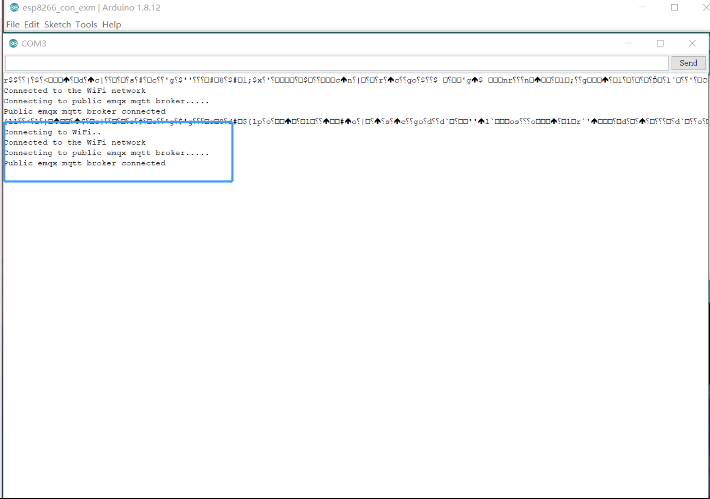
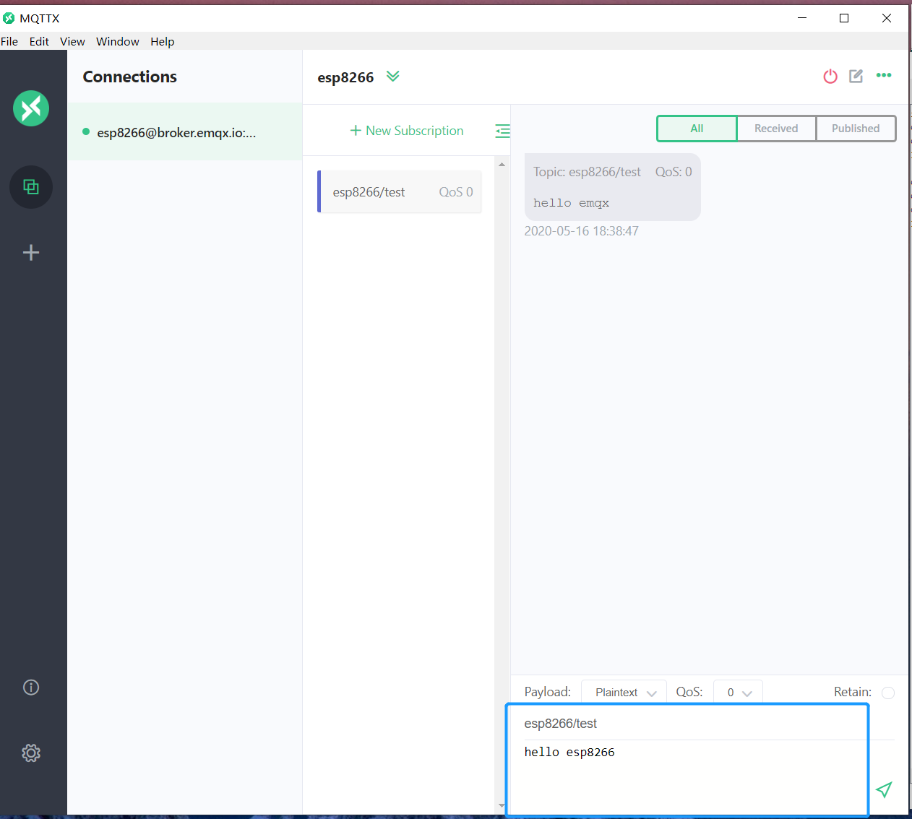
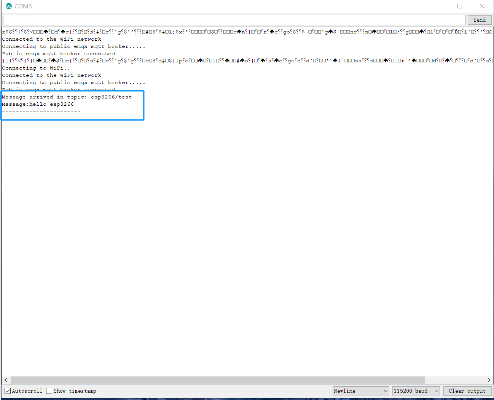

# Connect with ESP8266

This article mainly introduces how to use `PubSubClient` in the ESP8266 project,  including implementing the connection, subscription, messaging, and other functions between the client and MQTT broker.

[ESP8266](https://www.espressif.com/en/products/modules/esp8266) provides a highly integrated Wi-Fi SoC solution. Its low-power, compact design, and high stability can meet user's requirements. ESP8266 has a complete and self-contained Wi-Fi network function, which can be applied independently or can run as a slave at another host MCU.

This article demonstrates how to connect an ESP8266 client to MQTT broker via the TCP port and TLS/SSL port respectively. For Serverless deployments, see the demonstration on TLS/SSL port connection. Settings for connections over TCP port are different from those for connections over TLS/SSL port, but the code used in the publishing and subscribing functions is the same.

## Prerequisites

Before the connection, you need to get the broker and client ready.

### Get MQTT Broker

You can use the [free public MQTT broker](https://www.emqx.com/en/mqtt/public-mqtt5-broker) provided by EMQX. This service was created based on the [EMQX Platform](https://www.emqx.com/en/cloud). The information about broker access is as follows:
- Broker: **broker.emqx.io**
- TCP Port: **1883**
- SSL/TLS Port: **8883**

You can [create a deployment](../create/overview.md) as well. Find connection information in deployment overview. Make sure the deployment is running. Use the TCP port or TLS/SSL port to test the connection to the MQTT server.

If you are creating your own deployment, check Access Control -> [Authentication](../deployments/default_auth.md) and set the username and password for verification.

### Arduino IDE
This article uses the [Arduino IDE](https://www.arduino.cc/en/software) as the code editor and uploader. The open-source Arduino Software (IDE) makes it easy to write code and upload it to the board. This software can be used with any Arduino board.

## Installation Dependencies

In Arduino IDE, complete the following installations:

1. Install ESP8266 development board.
   Click **Tools** -> **Development Board** -> **Development Board Management**. Search ESP8266 and click **Install**.
2. Install PubSub client.
   Click**Project** -> **Load library** -> **Library manager...**. Search PubSubClient and Install PubSubClient by Nick O’Leary.

## Connect over TCP Port
This section describes how to connect an ESP8266 client to MQTT broker over TCP port in Arduino IDE.

1. Import libraries ESP8266WiFi and PubSubClient.

```c
#include <ESP8266WiFi.h>
#include <PubSubClient.h>
```

2. Set Wi-Fi name and password, and connection address and port.

> The sample code will use a public MQTT server to connect, and the public MQTT server does not require a username and password. If you create a deployment, please refer to [Client Authentication](../deployments/auth_overview.md) to set username and password.


```c
// WiFi settings
const char *ssid = "WIFI_SSID";             // Replace with your WiFi name
const char *password = "WIFI_PASSWORD";   // Replace with your WiFi password

// MQTT Broker settings
const char *mqtt_broker = "broker.emqx.io";  // EMQX broker endpoint
const char *mqtt_topic = "emqx/esp8266";     // MQTT topic
const char *mqtt_username = "emqx";  // MQTT username for authentication
const char *mqtt_password = "public";  // MQTT password for authentication
const int mqtt_port = 1883;  // MQTT port (TCP)
```

1. Open a serial connection to output the result of the program and connect to the Wi-Fi network.

```c
void setup() {
    Serial.begin(115200);
    connectToWiFi();
    mqtt_client.setServer(mqtt_broker, mqtt_port);
    mqtt_client.setCallback(mqttCallback);
    connectToMQTTBroker();
}

void connectToWiFi() {
    WiFi.begin(ssid, password);
    Serial.print("Connecting to WiFi");
    while (WiFi.status() != WL_CONNECTED) {
        delay(500);
        Serial.print(".");
    }
    Serial.println("\nConnected to the WiFi network");
}
```

4. Set MQTT broker, write callback function, and print connection information on the serial monitor at the same time.

```c
void connectToMQTTBroker() {
    while (!mqtt_client.connected()) {
        String client_id = "esp8266-client-" + String(WiFi.macAddress());
        Serial.printf("Connecting to MQTT Broker as %s.....\n", client_id.c_str());
        if (mqtt_client.connect(client_id.c_str(), mqtt_username, mqtt_password)) {
            Serial.println("Connected to MQTT broker");
            mqtt_client.subscribe(mqtt_topic);
            // Publish message upon successful connection
            mqtt_client.publish(mqtt_topic, "Hi EMQX I'm ESP8266 ^^");
        } else {
            Serial.print("Failed to connect to MQTT broker, rc=");
            Serial.print(mqtt_client.state());
            Serial.println(" try again in 5 seconds");
            delay(5000);
        }
    }
}
```

5. After successfully connecting to the MQTT broker, ESP8266 will publish messages on topic `esp8266/test` to the MQTT server and subscribe to messages on topic `esp8266/test`.

```c
mqtt_client.subscribe(mqtt_topic);
// Publish message upon successful connection
mqtt_client.publish(mqtt_topic, "Hi EMQX I'm ESP8266 ^^");
```

6. Print the topic name to the serial port and then print every byte of received messages.

```c
void mqttCallback(char *topic, byte *payload, unsigned int length) {
    Serial.print("Message received on topic: ");
    Serial.println(topic);
    Serial.print("Message:");
    for (unsigned int i = 0; i < length; i++) {
        Serial.print((char) payload[i]);
    }
    Serial.println();
    Serial.println("-----------------------");
}
```

The complete code is displayed as follows:

```c
#include <ESP8266WiFi.h>
#include <PubSubClient.h>

// WiFi settings
const char *ssid = "WIFI_SSID";             // Replace with your WiFi name
const char *password = "WIFI_PASSWORD";   // Replace with your WiFi password

// MQTT Broker settings
const char *mqtt_broker = "broker.emqx.io";  // EMQX broker endpoint
const char *mqtt_topic = "emqx/esp8266";     // MQTT topic
const char *mqtt_username = "emqx";  // MQTT username for authentication
const char *mqtt_password = "public";  // MQTT password for authentication
const int mqtt_port = 1883;  // MQTT port (TCP)

WiFiClient espClient;
PubSubClient mqtt_client(espClient);

void connectToWiFi();

void connectToMQTTBroker();

void mqttCallback(char *topic, byte *payload, unsigned int length);

void setup() {
    Serial.begin(115200);
    connectToWiFi();
    mqtt_client.setServer(mqtt_broker, mqtt_port);
    mqtt_client.setCallback(mqttCallback);
    connectToMQTTBroker();
}

void connectToWiFi() {
    WiFi.begin(ssid, password);
    Serial.print("Connecting to WiFi");
    while (WiFi.status() != WL_CONNECTED) {
        delay(500);
        Serial.print(".");
    }
    Serial.println("\nConnected to the WiFi network");
}

void connectToMQTTBroker() {
    while (!mqtt_client.connected()) {
        String client_id = "esp8266-client-" + String(WiFi.macAddress());
        Serial.printf("Connecting to MQTT Broker as %s.....\n", client_id.c_str());
        if (mqtt_client.connect(client_id.c_str(), mqtt_username, mqtt_password)) {
            Serial.println("Connected to MQTT broker");
            mqtt_client.subscribe(mqtt_topic);
            // Publish message upon successful connection
            mqtt_client.publish(mqtt_topic, "Hi EMQX I'm ESP8266 ^^");
        } else {
            Serial.print("Failed to connect to MQTT broker, rc=");
            Serial.print(mqtt_client.state());
            Serial.println(" try again in 5 seconds");
            delay(5000);
        }
    }
}

void mqttCallback(char *topic, byte *payload, unsigned int length) {
    Serial.print("Message received on topic: ");
    Serial.println(topic);
    Serial.print("Message:");
    for (unsigned int i = 0; i < length; i++) {
        Serial.print((char) payload[i]);
    }
    Serial.println();
    Serial.println("-----------------------");
}

void loop() {
    if (!mqtt_client.connected()) {
        connectToMQTTBroker();
    }
    mqtt_client.loop();
}
```

## Connect over TLS/SSL Port
This section describes how to connect an ESP8266 client to MQTT broker over TLS/SSL port in Arduino IDE. Settings for connections over TLS/SSL ports are different from those for connections over TCP port, but the code is the same in the publishing and subscribing functions.

1. Import libraries ESP8266WiFi, PubSubClient, time.

```c
#include <ESP8266WiFi.h>
#include <PubSubClient.h>
#include <time.h>
```

2. Set Wi-Fi name and password, and connection address and port.

> The sample code will use a public MQTT server to connect, and the public MQTT server does not require a username and password. If you create a deployment, please refer to [Client Authentication](../deployments/auth_overview.md) to set username and password.


```c
// WiFi credentials
const char *ssid = "WIFI_SSID";             // Replace with your WiFi name
const char *password = "WIFI_PASSWORD";   // Replace with your WiFi password

// MQTT Broker settings
const int mqtt_port = 8883;  // MQTT port (TLS)
const char *mqtt_broker = "broker.emqx.io";  // EMQX broker endpoint
const char *mqtt_topic = "emqx/esp8266";     // MQTT topic
const char *mqtt_username = "emqx";  // MQTT username for authentication
const char *mqtt_password = "public";  // MQTT password for authentication
```

3. Set Server and SSL certificate

```c
// NTP Server settings
const char *ntp_server = "pool.ntp.org";     // Default NTP server
// const char* ntp_server = "cn.pool.ntp.org"; // Recommended NTP server for users in China
const long gmt_offset_sec = 0;            // GMT offset in seconds (adjust for your time zone)
const int daylight_offset_sec = 0;        // Daylight saving time offset in seconds

// WiFi and MQTT client initialization
BearSSL::WiFiClientSecure espClient;
PubSubClient mqtt_client(espClient);

// SSL certificate for MQTT broker
// Load DigiCert Global Root G2, which is used by EMQX Public Broker: broker.emqx.io
static const char ca_cert[]
PROGMEM = R"EOF(
-----BEGIN CERTIFICATE-----
MIIDjjCCAnagAwIBAgIQAzrx5qcRqaC7KGSxHQn65TANBgkqhkiG9w0BAQsFADBh
MQswCQYDVQQGEwJVUzEVMBMGA1UEChMMRGlnaUNlcnQgSW5jMRkwFwYDVQQLExB3
d3cuZGlnaWNlcnQuY29tMSAwHgYDVQQDExdEaWdpQ2VydCBHbG9iYWwgUm9vdCBH
MjAeFw0xMzA4MDExMjAwMDBaFw0zODAxMTUxMjAwMDBaMGExCzAJBgNVBAYTAlVT
MRUwEwYDVQQKEwxEaWdpQ2VydCBJbmMxGTAXBgNVBAsTEHd3dy5kaWdpY2VydC5j
b20xIDAeBgNVBAMTF0RpZ2lDZXJ0IEdsb2JhbCBSb290IEcyMIIBIjANBgkqhkiG
9w0BAQEFAAOCAQ8AMIIBCgKCAQEAuzfNNNx7a8myaJCtSnX/RrohCgiN9RlUyfuI
2/Ou8jqJkTx65qsGGmvPrC3oXgkkRLpimn7Wo6h+4FR1IAWsULecYxpsMNzaHxmx
1x7e/dfgy5SDN67sH0NO3Xss0r0upS/kqbitOtSZpLYl6ZtrAGCSYP9PIUkY92eQ
q2EGnI/yuum06ZIya7XzV+hdG82MHauVBJVJ8zUtluNJbd134/tJS7SsVQepj5Wz
tCO7TG1F8PapspUwtP1MVYwnSlcUfIKdzXOS0xZKBgyMUNGPHgm+F6HmIcr9g+UQ
vIOlCsRnKPZzFBQ9RnbDhxSJITRNrw9FDKZJobq7nMWxM4MphQIDAQABo0IwQDAP
BgNVHRMBAf8EBTADAQH/MA4GA1UdDwEB/wQEAwIBhjAdBgNVHQ4EFgQUTiJUIBiV
5uNu5g/6+rkS7QYXjzkwDQYJKoZIhvcNAQELBQADggEBAGBnKJRvDkhj6zHd6mcY
1Yl9PMWLSn/pvtsrF9+wX3N3KjITOYFnQoQj8kVnNeyIv/iPsGEMNKSuIEyExtv4
NeF22d+mQrvHRAiGfzZ0JFrabA0UWTW98kndth/Jsw1HKj2ZL7tcu7XUIOGZX1NG
Fdtom/DzMNU+MeKNhJ7jitralj41E6Vf8PlwUHBHQRFXGU7Aj64GxJUTFy8bJZ91
8rGOmaFvE7FBcf6IKshPECBV1/MUReXgRPTqh5Uykw7+U0b6LJ3/iyK5S9kJRaTe
pLiaWN0bfVKfjllDiIGknibVb63dDcY3fe0Dkhvld1927jyNxF1WW6LZZm6zNTfl
MrY=
-----END CERTIFICATE-----
)EOF";

// Load DigiCert Global Root CA ca_cert, which is used by EMQX Serverless Deployment
/*
static const char ca_cert[] PROGMEM = R"EOF(
-----BEGIN CERTIFICATE-----
MIIDrzCCApegAwIBAgIQCDvgVpBCRrGhdWrJWZHHSjANBgkqhkiG9w0BAQUFADBh
MQswCQYDVQQGEwJVUzEVMBMGA1UEChMMRGlnaUNlcnQgSW5jMRkwFwYDVQQLExB3
d3cuZGlnaWNlcnQuY29tMSAwHgYDVQQDExdEaWdpQ2VydCBHbG9iYWwgUm9vdCBD
QTAeFw0wNjExMTAwMDAwMDBaFw0zMTExMTAwMDAwMDBaMGExCzAJBgNVBAYTAlVT
MRUwEwYDVQQKEwxEaWdpQ2VydCBJbmMxGTAXBgNVBAsTEHd3dy5kaWdpY2VydC5j
b20xIDAeBgNVBAMTF0RpZ2lDZXJ0IEdsb2JhbCBSb290IENBMIIBIjANBgkqhkiG
9w0BAQEFAAOCAQ8AMIIBCgKCAQEA4jvhEXLeqKTTo1eqUKKPC3eQyaKl7hLOllsB
CSDMAZOnTjC3U/dDxGkAV53ijSLdhwZAAIEJzs4bg7/fzTtxRuLWZscFs3YnFo97
nh6Vfe63SKMI2tavegw5BmV/Sl0fvBf4q77uKNd0f3p4mVmFaG5cIzJLv07A6Fpt
43C/dxC//AH2hdmoRBBYMql1GNXRor5H4idq9Joz+EkIYIvUX7Q6hL+hqkpMfT7P
T19sdl6gSzeRntwi5m3OFBqOasv+zbMUZBfHWymeMr/y7vrTC0LUq7dBMtoM1O/4
gdW7jVg/tRvoSSiicNoxBN33shbyTApOB6jtSj1etX+jkMOvJwIDAQABo2MwYTAO
BgNVHQ8BAf8EBAMCAYYwDwYDVR0TAQH/BAUwAwEB/zAdBgNVHQ4EFgQUA95QNVbR
TLtm8KPiGxvDl7I90VUwHwYDVR0jBBgwFoAUA95QNVbRTLtm8KPiGxvDl7I90VUw
DQYJKoZIhvcNAQEFBQADggEBAMucN6pIExIK+t1EnE9SsPTfrgT1eXkIoyQY/Esr
hMAtudXH/vTBH1jLuG2cenTnmCmrEbXjcKChzUyImZOMkXDiqw8cvpOp/2PV5Adg
06O/nVsJ8dWO41P0jmP6P6fbtGbfYmbW0W5BjfIttep3Sp+dWOIrWcBAI+0tKIJF
PnlUkiaY4IBIqDfv8NZ5YBberOgOzW6sRBc4L0na4UU+Krk2U886UAb3LujEV0ls
YSEY1QSteDwsOoBrp+uvFRTp2InBuThs4pFsiv9kuXclVzDAGySj4dzp30d8tbQk
CAUw7C29C79Fv1C5qfPrmAESrciIxpg0X40KPMbp1ZWVbd4=
-----END CERTIFICATE-----
)EOF";
*/
```

4. Open a serial connection to output the result of the program and connect to the Wi-Fi network.

```c
void setup() {
    Serial.begin(115200);
    connectToWiFi();
    syncTime();  // X.509 validation requires synchronization time
    mqtt_client.setServer(mqtt_broker, mqtt_port);
    mqtt_client.setCallback(mqttCallback);
    connectToMQTT();
}

void connectToWiFi() {
    WiFi.begin(ssid, password);
    while (WiFi.status() != WL_CONNECTED) {
        delay(1000);
        Serial.println("Connecting to WiFi...");
    }
    Serial.println("Connected to WiFi");
}
```

5. Set fingerprint and MQTT broker. Write callback function, and print connection information on the serial monitor at the same time.

```c
void connectToMQTT() {
    BearSSL::X509List serverTrustedCA(ca_cert);
    espClient.setTrustAnchors(&serverTrustedCA);
    while (!mqtt_client.connected()) {
        String client_id = "esp8266-client-" + String(WiFi.macAddress());
        Serial.printf("Connecting to MQTT Broker as %s.....\n", client_id.c_str());
        if (mqtt_client.connect(client_id.c_str(), mqtt_username, mqtt_password)) {
            Serial.println("Connected to MQTT broker");
            mqtt_client.subscribe(mqtt_topic);
            // Publish message upon successful connection
            mqtt_client.publish(mqtt_topic, "Hi EMQX I'm ESP8266 ^^");
        } else {
            char err_buf[128];
            espClient.getLastSSLError(err_buf, sizeof(err_buf));
            Serial.print("Failed to connect to MQTT broker, rc=");
            Serial.println(mqtt_client.state());
            Serial.print("SSL error: ");
            Serial.println(err_buf);
            delay(5000);
        }
    }
}
```

6. After successfully connecting to the MQTT broker, ESP8266 will publish messages and subscribe to the MQTT broker.

```c
mqtt_client.subscribe(mqtt_topic);
// Publish message upon successful connection
mqtt_client.publish(mqtt_topic, "Hi EMQX I'm ESP8266 ^^");
```

7. Print the topic name to the serial port and then print every byte of received messages.

```c
void mqttCallback(char *topic, byte *payload, unsigned int length) {
    Serial.print("Message received on topic: ");
    Serial.print(topic);
    Serial.print("]: ");
    for (int i = 0; i < length; i++) {
        Serial.print((char) payload[i]);
    }
    Serial.println();
}
```

The complete code is displayed as follows:

```c
#include <ESP8266WiFi.h>
#include <PubSubClient.h>
#include <time.h>

// WiFi credentials
const char *ssid = "WIFI_SSID";             // Replace with your WiFi name
const char *password = "WIFI_PASSWORD";   // Replace with your WiFi password

// MQTT Broker settings
const int mqtt_port = 8883;  // MQTT port (TLS)
const char *mqtt_broker = "broker.emqx.io";  // EMQX broker endpoint
const char *mqtt_topic = "emqx/esp8266";     // MQTT topic
const char *mqtt_username = "emqx";  // MQTT username for authentication
const char *mqtt_password = "public";  // MQTT password for authentication

// NTP Server settings
const char *ntp_server = "pool.ntp.org";     // Default NTP server
// const char* ntp_server = "cn.pool.ntp.org"; // Recommended NTP server for users in China
const long gmt_offset_sec = 0;            // GMT offset in seconds (adjust for your time zone)
const int daylight_offset_sec = 0;        // Daylight saving time offset in seconds

// WiFi and MQTT client initialization
BearSSL::WiFiClientSecure espClient;
PubSubClient mqtt_client(espClient);

// SSL certificate for MQTT broker
// Load DigiCert Global Root G2, which is used by EMQX Public Broker: broker.emqx.io
static const char ca_cert[]
PROGMEM = R"EOF(
-----BEGIN CERTIFICATE-----
MIIDjjCCAnagAwIBAgIQAzrx5qcRqaC7KGSxHQn65TANBgkqhkiG9w0BAQsFADBh
MQswCQYDVQQGEwJVUzEVMBMGA1UEChMMRGlnaUNlcnQgSW5jMRkwFwYDVQQLExB3
d3cuZGlnaWNlcnQuY29tMSAwHgYDVQQDExdEaWdpQ2VydCBHbG9iYWwgUm9vdCBH
MjAeFw0xMzA4MDExMjAwMDBaFw0zODAxMTUxMjAwMDBaMGExCzAJBgNVBAYTAlVT
MRUwEwYDVQQKEwxEaWdpQ2VydCBJbmMxGTAXBgNVBAsTEHd3dy5kaWdpY2VydC5j
b20xIDAeBgNVBAMTF0RpZ2lDZXJ0IEdsb2JhbCBSb290IEcyMIIBIjANBgkqhkiG
9w0BAQEFAAOCAQ8AMIIBCgKCAQEAuzfNNNx7a8myaJCtSnX/RrohCgiN9RlUyfuI
2/Ou8jqJkTx65qsGGmvPrC3oXgkkRLpimn7Wo6h+4FR1IAWsULecYxpsMNzaHxmx
1x7e/dfgy5SDN67sH0NO3Xss0r0upS/kqbitOtSZpLYl6ZtrAGCSYP9PIUkY92eQ
q2EGnI/yuum06ZIya7XzV+hdG82MHauVBJVJ8zUtluNJbd134/tJS7SsVQepj5Wz
tCO7TG1F8PapspUwtP1MVYwnSlcUfIKdzXOS0xZKBgyMUNGPHgm+F6HmIcr9g+UQ
vIOlCsRnKPZzFBQ9RnbDhxSJITRNrw9FDKZJobq7nMWxM4MphQIDAQABo0IwQDAP
BgNVHRMBAf8EBTADAQH/MA4GA1UdDwEB/wQEAwIBhjAdBgNVHQ4EFgQUTiJUIBiV
5uNu5g/6+rkS7QYXjzkwDQYJKoZIhvcNAQELBQADggEBAGBnKJRvDkhj6zHd6mcY
1Yl9PMWLSn/pvtsrF9+wX3N3KjITOYFnQoQj8kVnNeyIv/iPsGEMNKSuIEyExtv4
NeF22d+mQrvHRAiGfzZ0JFrabA0UWTW98kndth/Jsw1HKj2ZL7tcu7XUIOGZX1NG
Fdtom/DzMNU+MeKNhJ7jitralj41E6Vf8PlwUHBHQRFXGU7Aj64GxJUTFy8bJZ91
8rGOmaFvE7FBcf6IKshPECBV1/MUReXgRPTqh5Uykw7+U0b6LJ3/iyK5S9kJRaTe
pLiaWN0bfVKfjllDiIGknibVb63dDcY3fe0Dkhvld1927jyNxF1WW6LZZm6zNTfl
MrY=
-----END CERTIFICATE-----
)EOF";

// Load DigiCert Global Root CA ca_cert, which is used by EMQX Serverless Deployment
/*
static const char ca_cert[] PROGMEM = R"EOF(
-----BEGIN CERTIFICATE-----
MIIDrzCCApegAwIBAgIQCDvgVpBCRrGhdWrJWZHHSjANBgkqhkiG9w0BAQUFADBh
MQswCQYDVQQGEwJVUzEVMBMGA1UEChMMRGlnaUNlcnQgSW5jMRkwFwYDVQQLExB3
d3cuZGlnaWNlcnQuY29tMSAwHgYDVQQDExdEaWdpQ2VydCBHbG9iYWwgUm9vdCBD
QTAeFw0wNjExMTAwMDAwMDBaFw0zMTExMTAwMDAwMDBaMGExCzAJBgNVBAYTAlVT
MRUwEwYDVQQKEwxEaWdpQ2VydCBJbmMxGTAXBgNVBAsTEHd3dy5kaWdpY2VydC5j
b20xIDAeBgNVBAMTF0RpZ2lDZXJ0IEdsb2JhbCBSb290IENBMIIBIjANBgkqhkiG
9w0BAQEFAAOCAQ8AMIIBCgKCAQEA4jvhEXLeqKTTo1eqUKKPC3eQyaKl7hLOllsB
CSDMAZOnTjC3U/dDxGkAV53ijSLdhwZAAIEJzs4bg7/fzTtxRuLWZscFs3YnFo97
nh6Vfe63SKMI2tavegw5BmV/Sl0fvBf4q77uKNd0f3p4mVmFaG5cIzJLv07A6Fpt
43C/dxC//AH2hdmoRBBYMql1GNXRor5H4idq9Joz+EkIYIvUX7Q6hL+hqkpMfT7P
T19sdl6gSzeRntwi5m3OFBqOasv+zbMUZBfHWymeMr/y7vrTC0LUq7dBMtoM1O/4
gdW7jVg/tRvoSSiicNoxBN33shbyTApOB6jtSj1etX+jkMOvJwIDAQABo2MwYTAO
BgNVHQ8BAf8EBAMCAYYwDwYDVR0TAQH/BAUwAwEB/zAdBgNVHQ4EFgQUA95QNVbR
TLtm8KPiGxvDl7I90VUwHwYDVR0jBBgwFoAUA95QNVbRTLtm8KPiGxvDl7I90VUw
DQYJKoZIhvcNAQEFBQADggEBAMucN6pIExIK+t1EnE9SsPTfrgT1eXkIoyQY/Esr
hMAtudXH/vTBH1jLuG2cenTnmCmrEbXjcKChzUyImZOMkXDiqw8cvpOp/2PV5Adg
06O/nVsJ8dWO41P0jmP6P6fbtGbfYmbW0W5BjfIttep3Sp+dWOIrWcBAI+0tKIJF
PnlUkiaY4IBIqDfv8NZ5YBberOgOzW6sRBc4L0na4UU+Krk2U886UAb3LujEV0ls
YSEY1QSteDwsOoBrp+uvFRTp2InBuThs4pFsiv9kuXclVzDAGySj4dzp30d8tbQk
CAUw7C29C79Fv1C5qfPrmAESrciIxpg0X40KPMbp1ZWVbd4=
-----END CERTIFICATE-----
)EOF";
*/


// Function declarations
void connectToWiFi();

void connectToMQTT();

void syncTime();

void mqttCallback(char *topic, byte *payload, unsigned int length);


void setup() {
    Serial.begin(115200);
    connectToWiFi();
    syncTime();  // X.509 validation requires synchronization time
    mqtt_client.setServer(mqtt_broker, mqtt_port);
    mqtt_client.setCallback(mqttCallback);
    connectToMQTT();
}

void connectToWiFi() {
    WiFi.begin(ssid, password);
    while (WiFi.status() != WL_CONNECTED) {
        delay(1000);
        Serial.println("Connecting to WiFi...");
    }
    Serial.println("Connected to WiFi");
}

void syncTime() {
    configTime(gmt_offset_sec, daylight_offset_sec, ntp_server);
    Serial.print("Waiting for NTP time sync: ");
    while (time(nullptr) < 8 * 3600 * 2) {
        delay(1000);
        Serial.print(".");
    }
    Serial.println("Time synchronized");
    struct tm timeinfo;
    if (getLocalTime(&timeinfo)) {
        Serial.print("Current time: ");
        Serial.println(asctime(&timeinfo));
    } else {
        Serial.println("Failed to obtain local time");
    }
}

void connectToMQTT() {
    BearSSL::X509List serverTrustedCA(ca_cert);
    espClient.setTrustAnchors(&serverTrustedCA);
    while (!mqtt_client.connected()) {
        String client_id = "esp8266-client-" + String(WiFi.macAddress());
        Serial.printf("Connecting to MQTT Broker as %s.....\n", client_id.c_str());
        if (mqtt_client.connect(client_id.c_str(), mqtt_username, mqtt_password)) {
            Serial.println("Connected to MQTT broker");
            mqtt_client.subscribe(mqtt_topic);
            // Publish message upon successful connection
            mqtt_client.publish(mqtt_topic, "Hi EMQX I'm ESP8266 ^^");
        } else {
            char err_buf[128];
            espClient.getLastSSLError(err_buf, sizeof(err_buf));
            Serial.print("Failed to connect to MQTT broker, rc=");
            Serial.println(mqtt_client.state());
            Serial.print("SSL error: ");
            Serial.println(err_buf);
            delay(5000);
        }
    }
}

void mqttCallback(char *topic, byte *payload, unsigned int length) {
    Serial.print("Message received on topic: ");
    Serial.print(topic);
    Serial.print("]: ");
    for (int i = 0; i < length; i++) {
        Serial.print((char) payload[i]);
    }
    Serial.println();
}

void loop() {
    if (!mqtt_client.connected()) {
        connectToMQTT();
    }
    mqtt_client.loop();
}
```

## Test Connection

After the ESP8266 client has successfully connected to the MQTT broker, you can use the Arduino IDE and MQTTX to test the connection.

1. Use Arduino IDE to upload the complete code to ESP8266 and open the serial monitor.
   
2. Establish the connection between MQTTX client and MQTT broker, and send messages to ESP8266.
   
3. View the messages ESP8266 received in the serial monitor.
   

## More

In summary, we have implemented the creation of an MQTT connection in an ESP8266 project, and simulated connecting, subscribing, sending and receiving messages between the client and MQTT broker.  You can download the source code of the example [here](https://github.com/emqx/MQTT-Client-Examples/tree/master/mqtt-client-ESP8266), and you can also find more demo examples in other languages on [GitHub](https://github.com/emqx/MQTT-Client-Examples).

