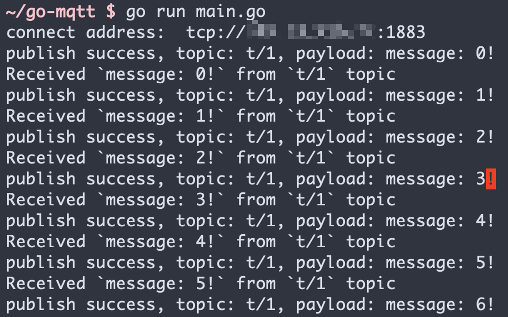

# Connect to Deployment via Paho Go

This article guides you to use the `paho.mqtt.golang` Library in go project to realize the functions of connecting, subscribing, sending, and receiving messages between a MQTT client and a MQTT broker.


[Go](https://go.dev/) it's Google Developed a programming language with strong static type, compilation type, parallel style, and garbage collection function. `paho.mqtt.golang` is an mqtt library, which provides a simple API for connecting to the mqtt server and sending and receiving messages in the go project.

## Prerequisites

### Deploy MQTT Broker
- You can use the [free public MQTT broker](https://www.emqx.com/en/mqtt/public-mqtt5-broker) provided by EMQX. This service was created based on the [EMQX Cloud](https://www.emqx.com/en/cloud). The information about broker access is as follows:
   - Broker: broker.emqx.io
   - TCP Port: 1883
   - TLS/SSL Port: 8883
- You can [create a deployment](https://docs.emqx.com/en/cloud/latest/create/overview.html) as well. Find connection information in the deployment overview. Make sure the deployment is running. At the same time, you can use WebSocket to test the connection to the MQTT server. If you are creating your own deployment, check [Authentication](https://docs.emqx.com/en/cloud/latest/deployments/auth_overview.html) and set the username and password in Authentication & ACL > Authentication for verification.

## Installation Dependency

The project uses go version 1.15.13 for development and testing. The following commands can be used to confirm the go version.

``` bash
➜ ~ go version
go version go1.15.13 darwin/amd64
```

1. Create a new folder `go-mqtt`, enter the folder and run the following command

    ``` bash
    ➜ ~ go mod init go-mqtt
    go: creating new go.mod: module go-mqtt
    ```

2. Use the `go get <Library>` command to install `paho.mqtt.golang`

    ``` bash
    ➜ ~ go get github.com/eclipse/paho.mqtt.golang
    go: downloading github.com/eclipse/paho.mqtt.golang v1.3.5
    go: github.com/eclipse/paho.mqtt.golang upgrade => v1.3.5
    ```

3. Create the `main.go` file and import the `paho.mqtt.golang` client

    ``` go
    package main
    
    import (
        mqtt "github.com/eclipse/paho.mqtt.golang"
    )
    
    func main(){
    }
    ```

## Connect over TCP Protocol

This section introduces how to connect to MQTT Broker over TCP Protocol.

1. Connection settings

   The example code will use a public MQTT server for connection.
   If you have created your own deployment, please find the corresponding connection address in the deployment console and set the username and password accordingly.

   ``` go
   const protocol = "tcp"
   const broker = "broker.emqx.io" // MQTT Broker address
   const port = 1883
   const topic = "t/1"
   const username = "emqx"
   const password = "******"
   ```

2. The Key Code of Connection

   We write a function to create and return a mqtt client.


    ``` go
    func createMqttClient() mqtt.Client {
        connectAddress := fmt.Sprintf("%s://%s:%d", protocol,broker, port)
        client_id := fmt.Sprintf("go-client-%d", rand.Int())
    
        fmt.Println("connect address: ", connectAddress)
        opts := mqtt.NewClientOptions()
        opts.AddBroker(connectAddress)
        opts.SetUsername(username)
        opts.SetPassword(password)
        opts.SetClientID(client_id)
        opts.SetKeepAlive(time.Second * 60)
        client := mqtt.NewClient(opts)
        token := client.Connect()
        // if connection failed, exit
        if token.WaitTimeout(3*time.Second) && token.Error() != nil {
            log.Fatal(token.Error())
        }
        return client
    }
    ```

## Connect over SSL/TLS Protocol

This section introduces how to connect to MQTT Broker over SSL/TLS Protocol.

1. Connection settings
   
   Set port to 8883 and protocol type to "ssl".

   ``` go
    const protocol = "ssl"
    const port = 8883
    ```

2. The Key Code of Connection

   If you need to configure the server certificate, you can load the certificate using function `loadTLSConfig()`.
   If not, the connection code is the same as TCP protocol.


    ``` go
    func createMqttClient() mqtt.Client {
        connectAddress := fmt.Sprintf("%s://%s:%d", protocol, broker, port)
        client_id := fmt.Sprintf("go-client-%d", rand.Int())
    
        fmt.Println("connect address: ", connectAddress)
        opts := mqtt.NewClientOptions()
        opts.AddBroker(connectAddress)
        opts.SetUsername(username)
        opts.SetPassword(password)
        opts.SetClientID(client_id)
        opts.SetKeepAlive(time.Second * 60)
    
        // Optional: set server CA
        // opts.SetTLSConfig(loadTLSConfig("caFilePath"))
    
        client := mqtt.NewClient(opts)
        token := client.Connect()
        if token.WaitTimeout(3*time.Second) && token.Error() != nil {
            log.Fatal(token.Error())
        }
        return client
    }
    
    func loadTLSConfig(caFile string) *tls.Config {
        // load tls config
        var tlsConfig tls.Config
        tlsConfig.InsecureSkipVerify = false
        if caFile != "" {
            certpool := x509.NewCertPool()
            ca, err := ioutil.ReadFile(caFile)
            if err != nil {
                log.Fatal(err.Error())
            }
            certpool.AppendCertsFromPEM(ca)
            tlsConfig.RootCAs = certpool
        }
        return &tlsConfig
    }
    ```

## Publish and Subscribe

This section introduces how to subscribe to topics and publish messages after you successfully connect to the MQTT broker.

### Publish Message

Defines a publish function for publishing messages.

In this function, we define an unconditional loop to publish a message every 1s. Count the number of published messages through `msgCount`.
``` go
func publish(client mqtt.Client) {
    qos := 0
    msgCount := 0
    for {
        payload := fmt.Sprintf("message: %d!", msgCount)
        if token := client.Publish(topic, byte(qos), false, payload); token.Wait() && token.Error() != nil {
            fmt.Printf("publish failed, topic: %s, payload: %s\n", topic, payload)
        } else {
            fmt.Printf("publish success, topic: %s, payload: %s\n", topic, payload)
        }
        msgCount++
        time.Sleep(time.Second * 1)
    }
}
```

### Subscribe Topic

Define subscription function to subscribe to messages. This function prints the topic and payload of the message on the console.

``` go
func subscribe(client mqtt.Client) {
    qos := 0
    client.Subscribe(topic, byte(qos), func(client mqtt.Client, msg mqtt.Message) {
        fmt.Printf("Received `%s` from `%s` topic", msg.Payload(), msg.Topic())
    })
}
```

### UnSubscribe Topic

Unsubscribe by the following code. 
You should specify the topic for unsubscription.

``` go
client.Unsubscribe(topic)
```

### Disconnection

If the client wishes to actively disconnect, it can be done with the following code.

``` go
// the parameter specify the waiting time before disconnection
client.Disconnect(250)
```

### Complete code

``` go
package main

import (
	"crypto/tls"
	"crypto/x509"
	"fmt"
	"io/ioutil"
	"log"
	"math/rand"
	"time"

	mqtt "github.com/eclipse/paho.mqtt.golang"
)

const protocol = "tcp"
const broker = ""
const port = 1883
const topic = "t/1"
const username = ""
const password = ""

func main() {
	client := createMqttClient()
	go subscribe(client)        // we use goroutine to run the subscription function
	time.Sleep(time.Second * 1) // pause 1s to wait for the subscription function to be ready
	publish(client)
}

func createMqttClient() mqtt.Client {
	connectAddress := fmt.Sprintf("%s://%s:%d", protocol, broker, port)
	client_id := fmt.Sprintf("go-client-%d", rand.Int())

	fmt.Println("connect address: ", connectAddress)
	opts := mqtt.NewClientOptions()
	opts.AddBroker(connectAddress)
	opts.SetUsername(username)
	opts.SetPassword(password)
	opts.SetClientID(client_id)
	opts.SetKeepAlive(time.Second * 60)

	// Optional: set server CA
	// opts.SetTLSConfig(loadTLSConfig("caFilePath"))

	client := mqtt.NewClient(opts)
	token := client.Connect()
	if token.WaitTimeout(3*time.Second) && token.Error() != nil {
		log.Fatal(token.Error())
	}
	return client
}

func publish(client mqtt.Client) {
	qos := 0
	msgCount := 0
	for {
		payload := fmt.Sprintf("message: %d!", msgCount)
		if token := client.Publish(topic, byte(qos), false, payload); token.Wait() && token.Error() != nil {
			fmt.Printf("publish failed, topic: %s, payload: %s\n", topic, payload)
		} else {
			fmt.Printf("publish success, topic: %s, payload: %s\n", topic, payload)
		}
		msgCount++
		time.Sleep(time.Second * 1)
	}
}

func subscribe(client mqtt.Client) {
	qos := 0
	client.Subscribe(topic, byte(qos), func(client mqtt.Client, msg mqtt.Message) {
		fmt.Printf("Received `%s` from `%s` topic\n", msg.Payload(), msg.Topic())
	})
}

func loadTLSConfig(caFile string) *tls.Config {
	// load tls config
	var tlsConfig tls.Config
	tlsConfig.InsecureSkipVerify = false
	if caFile != "" {
		certpool := x509.NewCertPool()
		ca, err := ioutil.ReadFile(caFile)
		if err != nil {
			log.Fatal(err.Error())
		}
		certpool.AppendCertsFromPEM(ca)
		tlsConfig.RootCAs = certpool
	}
	return &tlsConfig
}
```

## Test

Execution procedure

``` bash
➜ ~ go run main.go
connect address:  tcp://***.***.***.***:1883
publish success, topic: t/1, payload: message: 0!
Received `message: 0!` from `t/1` topic
publish success, topic: t/1, payload: message: 1!
Received `message: 1!` from `t/1` topic
publish success, topic: t/1, payload: message: 2!
Received `message: 2!` from `t/1` topic
publish success, topic: t/1, payload: message: 3!
Received `message: 3!` from `t/1` topic
publish success, topic: t/1, payload: message: 4!
Received `message: 4!` from `t/1` topic
publish success, topic: t/1, payload: message: 5!
Received `message: 5!` from `t/1` topic
publish success, topic: t/1, payload: message: 6!
```



## More Information

In summary, we have implemented the creation of an MQTT connection in a Go project, simulated subscribing, sending and receiving messages, unsubscribing, and disconnecting between the client and MQTT broker. You can download the source code of the example [here](https://github.com/emqx/MQTT-Client-Examples/tree/master/mqtt-client-Go), and you can also find more demo examples in other languages on [GitHub](https://github.com/emqx/MQTT-Client-Examples).