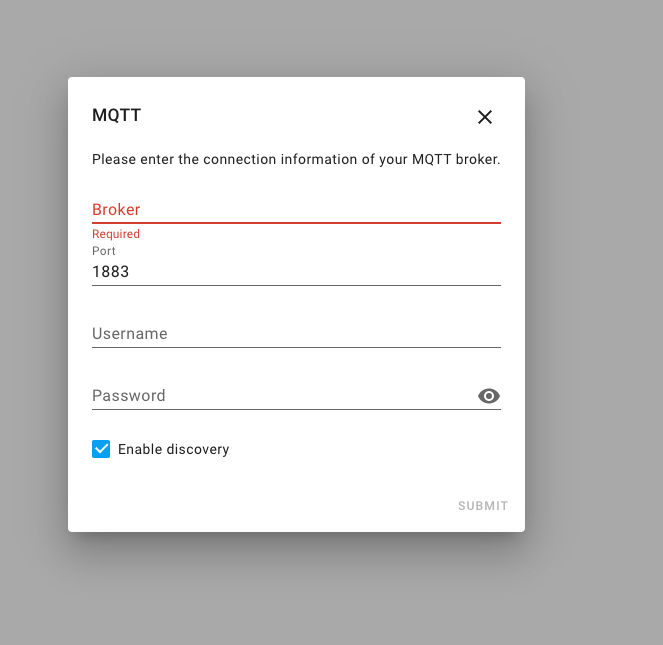
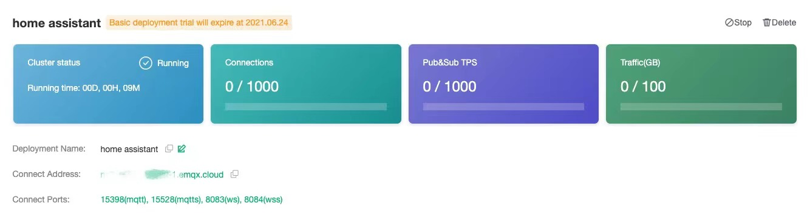
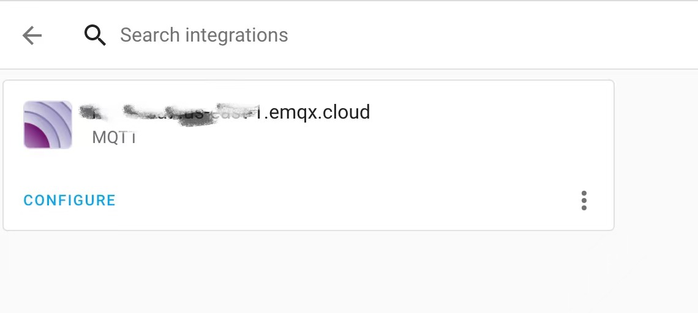

# Easily Integrate EMQ X Cloud MQTT Broker with Home Assistant

In recent years, as people's demand for home security, convenience, comfort and artistry has increased, home automation has become more and more popular. [Home Assistant](https://www.home-assistant.io/), a popular open-source home automation platform, provides a secure and convenient central control system. In this article, we will introduce you how to use EMQ X Cloud MQTT Broker to connect with Home Assistant.

## What is MQTT Broker

MQTT is a lightweight, publish-subscribe network protocol that transports messages between devices. An MQTT broker is a server that receives all messages from the clients and then routes the messages to the appropriate destination clients. 

## Why EMQ X Cloud?

[EMQ X Cloud](https://www.emqx.com/en/cloud) is an MQTT messaging middleware product for the IoT domain from EMQ. As the world's first fully managed MQTT 5.0 public cloud service, EMQ X Cloud provides a one-stop O&M colocation and a unique isolated environment for MQTT messaging services. It serves dozens of countries and regions around the world, providing low-cost, secure, and reliable cloud services for 5G and Internet of Everything applications. 

EMQ X Cloud is available in three plans: Basic, Professional, and Unlimited, which offers a variety of flexible product specifications to support the deployment of fully managed MQTT services exclusively for you on the world's leading public clouds. Need more information with EMQ X Cloud's product plan? Click [here](https://docs.emqx.io/en/cloud/latest/pricing.html).

Such a powerful product is a great choice to integrate with Home Assistant. You could check out the [documentation](https://docs.emqx.io/en/cloud/latest/) to get more information regarding EMQ X Cloud

## Set up Home Assistant with EMQ X Cloud

If it's your first time using EMQ X Cloud, don't worry. We will guid you through to connect Home Assistant with EMQ X Cloud.

1. [Create](https://www.emqx.com/en/signup?continue=https://www.emqx.com/cn/cloud) a EMQ X Cloud Account.

2. Login to EMQ X Cloud [console](https://cloud.emqx.io/console/) and start a new deployment.

   ```tip
   For first-time EMQ X Cloud customers, we have an opportunity for you to create a free trial deployment of up to 30 days in length. The free trial deployment is an ideal way for you to learn and explore the features of EMQ X Cloud. 
   ```

3. After the new deployment is created and the status is **running**, add the client authentication information (you could choose to add manually or import from the file.  

   

4. Go to Home Assistant's configuration to add integration.

5. Select MQTT and fill in the deployment information

   

   

   You should enter the `Connect Address` for Broker and the `Connect Port (mqtt)` for Port. Enter the username and password you created in the authentication page. 

6. Click `Submit` button

7. Your EMQ X Cloud deployment is now integrating with Home Assistant, congratulations!

   