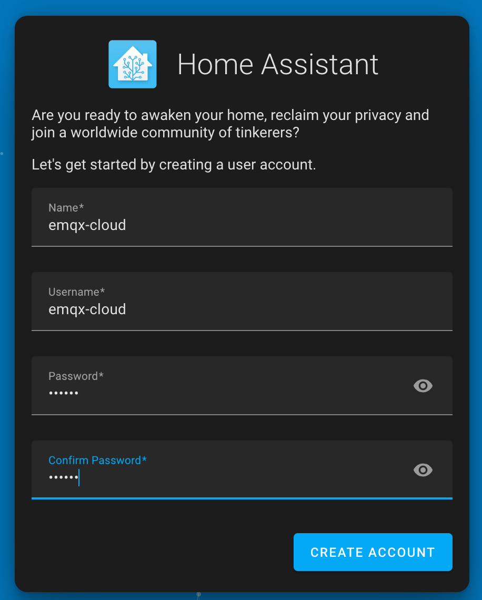
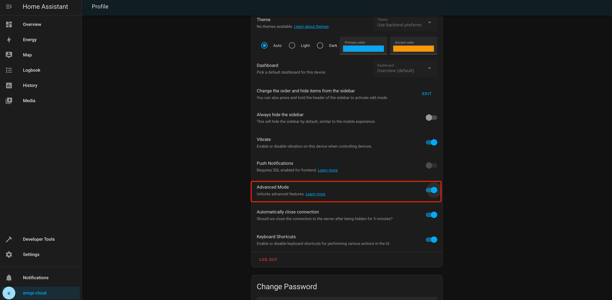
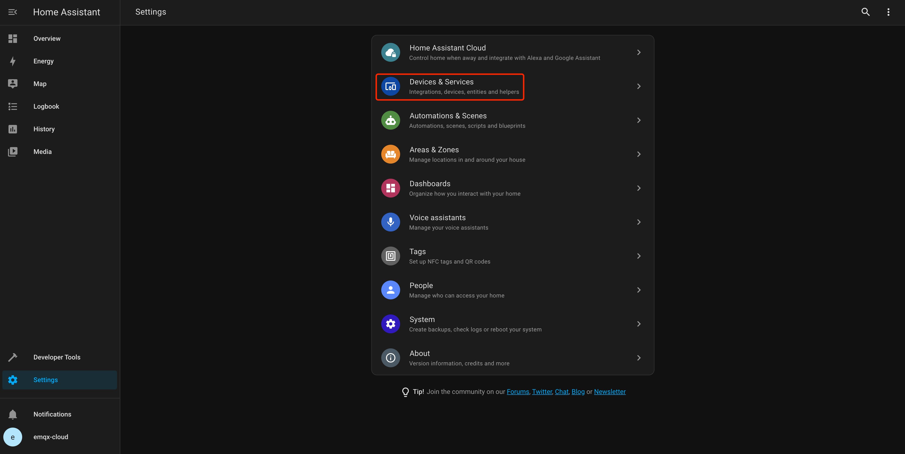
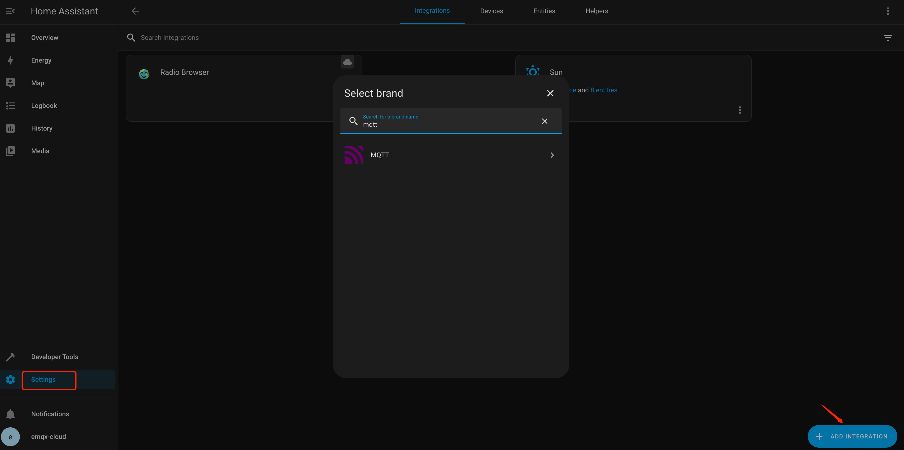
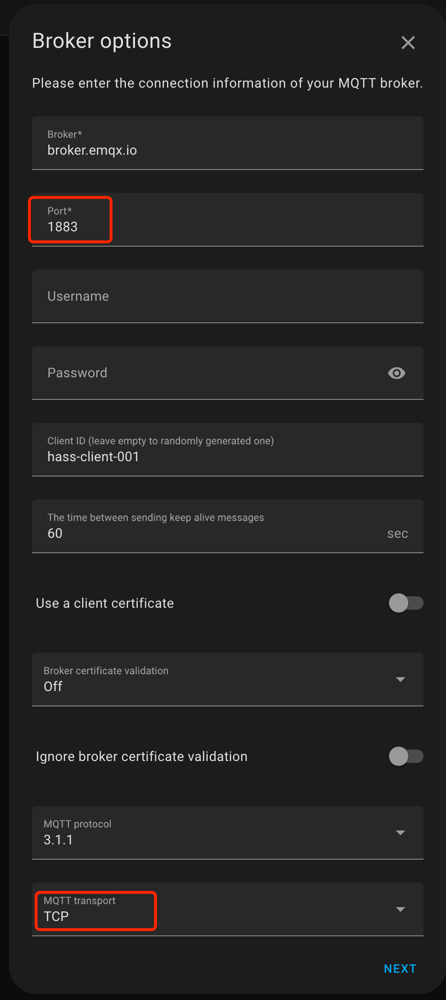
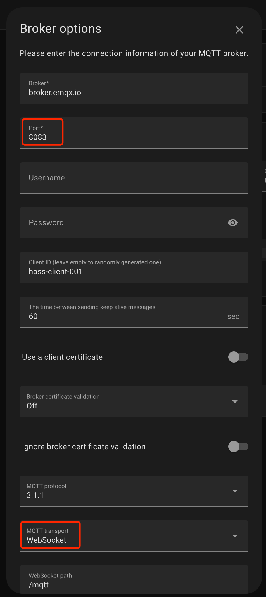
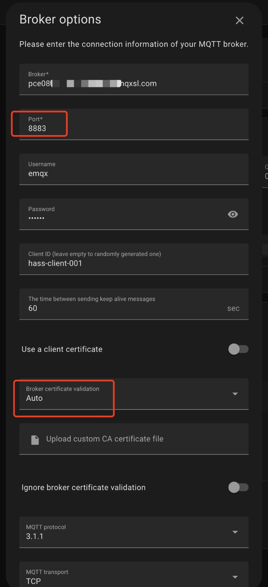
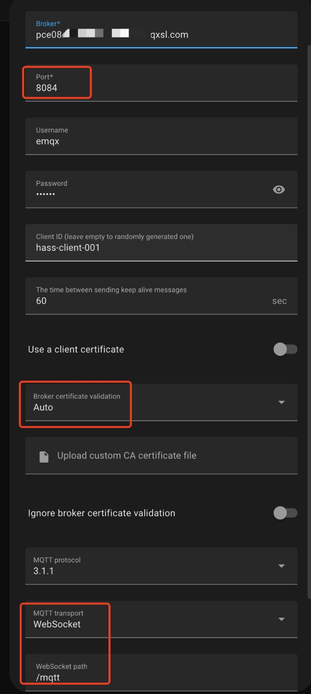
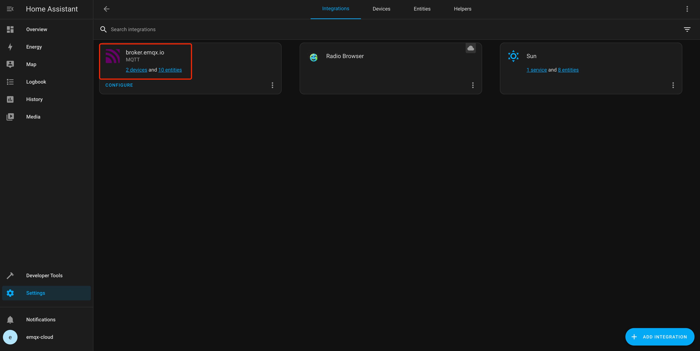
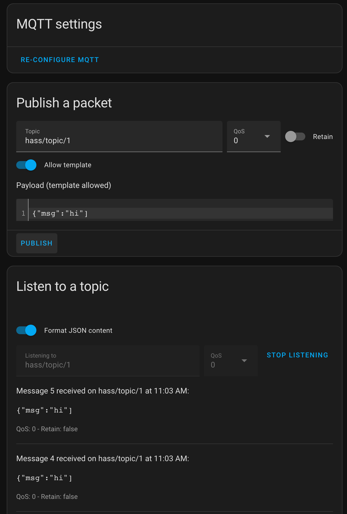

# Connect with Home Assistant

In recent years, as people's demand for home security, convenience, comfort and artistry has increased, home automation has become more and more popular. [Home Assistant](https://www.home-assistant.io/), a popular open-source home automation platform, provides a secure and convenient central control system. In this article, we will introduce you how to use EMQX Platform MQTT Broker to connect with Home Assistant.

## Prerequisites

### Get MQTT Broker

You can use the [free public MQTT broker](https://www.emqx.com/en/mqtt/public-mqtt5-broker) provided by EMQX. This service was created based on the [EMQX Platform](https://www.emqx.com/en/cloud). The information about broker access is as follows:

- Broker: **broker.emqx.io**
- MQTT Port: **1883**
- WebSocket Port: **8083**
- MQTT over TLS/SSL Port: **8883**
- WebSocket over TLS/SSL Port: **8084**

You can [create a deployment](../create/overview.md) as well. Find connection information in deployment overview. Make sure the deployment is running. Use the TCP port or TLS/SSL port to test the connection to the MQTT server.

If you are creating your own deployment, check [Authentication](../deployments/auth_overview.md) and set the username and password in `Access Control` > `Authentication` for verification.

## Home Assistant Initialization

If you are using MQTT for Home Assistant for the first time, please refer to the [quick start](https://www.home-assistant.io/integrations/mqtt).

1. Install Home Assistant

   In this example, we use Docker to quickly install Home Assistant.

   ```bash
   docker run -d --name="home-assistant" -v /opt/homeassistant/config:/config -p 8123:8123 homeassistant/home-assistant
   ```

   Then access the Home Assistant service via the local IP with the corresponding port, e.g., x.x.x.x:8123, to create an account.

   

2. Enable advanced mode (**optional**)

   Advanced broker options are accessible only when advanced mode is enabled, such as MQTT features, Websocket, and TLS/SSL verification.

   

3. Add Integration

   Go to Home Assistant's settings, choose `Devices & Services`.

   

   Click `+ Add Integration` and fill in MQTT.

   

   Then you could enter the `Connection information` for the broker.

## Connect over TCP Port

   This section describes how to connect a homeassistant client to MQTT broker over TCP port.

1. MQTT connection

   - Fill in the broker address, port, username and password (if it exists).
   - Select `TCP` for MQTT transport.

   

2. WebSocket connection

   - Fill in the broker address, port, username, and password (if they exist).
   - Select `WebSocket` for MQTT transport and fill in the WebSocket path as `/mqtt`.

   

## Connect over TLS/SSL Port

   This section describes how to connect a homeassistant client to MQTT broker over TLS/SSL port.

1. MQTT over TLS/SSL connection

   - Fill in the broker address, port, username, and password (if they exist).
   - Select `Auto` for broker certificate verification.
   - Select `TCP` for MQTT transport.

   

2. WebSocket over TLS/SSL connection

   - Fill in the broker address, port, username, and password (if they exist).
   - Select `Auto` for broker certificate verification.
   - Select `WebSocket` for MQTT transport and fill in the WebSocket path as `/mqtt`.

   

## Test Connection

   After filling in the connection information, click the `Submit` button. Your EMQX Platform deployment is now integrating with Home Assistant. Congratulations!

   

   Click `Configure` to complete the publish or subscribe topic.

   
