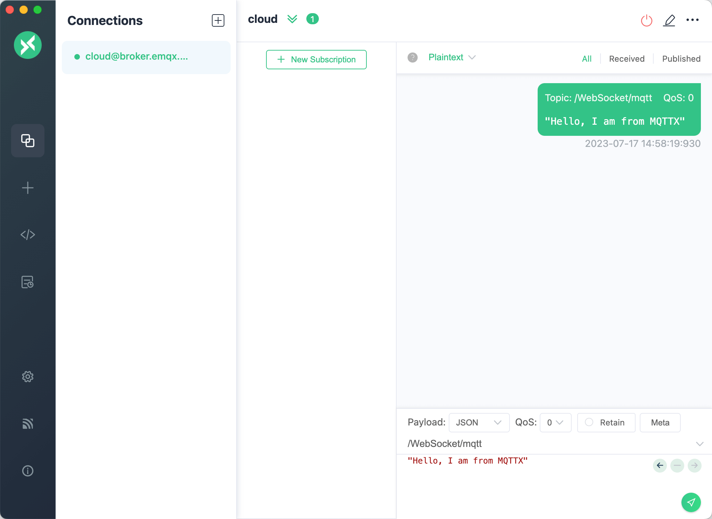
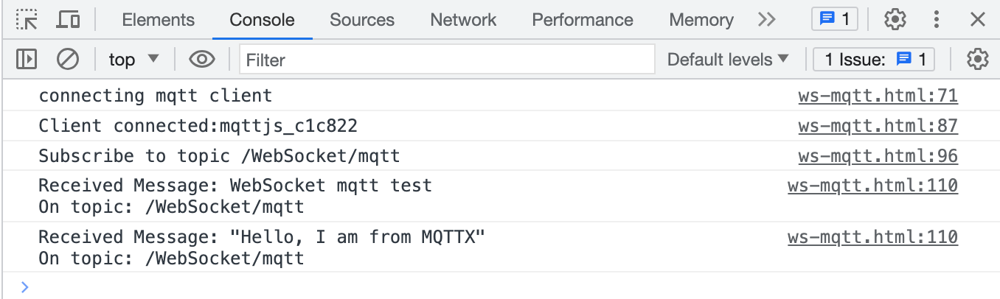

# Connect to Deployment using JavaScript via MQTT.js SDK

This article mainly introduces how to use `MQTT.js` in JavaScript to implement the connection, subscription, messaging, unsubscribing, and other functions between the client and MQTT broker.

## Prerequisites

### Deploy MQTT Broker

- You can use the [free public MQTT broker](https://www.emqx.com/en/mqtt/public-mqtt5-broker) provided by EMQX. This service was created based on the [EMQX Cloud](https://www.emqx.com/en/cloud). The information about broker access is as follows:

  - Address: **broker.emqx.io**
  - WebSocket Port: **8083**
  - WebSocket over TLS/SSL Port: **8084**

- You can also [create your own MQTT broker](../create/overview.md). After the deployment is in running status, you can find connection information on the deployment overview page. And for the username and password required in the later client connection stage, you can navigate to the **Authentication & ACL** -> **Authentication** section for the setting.

## Install Dependencies

[MQTT.js](https://github.com/mqttjs/MQTT.js) is a fully open-source client-side library for the MQTT protocol, written in JavaScript and available for Node.js and browsers. For more information and usage of `MQTT.js`, please refer to the [MQTT.js GitHub](https://github.com/mqttjs/MQTT.js#table-of-contents).

MQTT.js can be installed via NPM or Yarn, or can be imported through CDN or relative path. This example will import MQTT.js through CDN.

- Using NPM or Yarn：

  Install MQTT.js

  ```shell
  # NPM
  npm install mqtt
  # or Yarn
  yarn add mqtt
  ```

  After successful installation, you still need to import MQTT.js.

  ```js
  import * as mqtt from 'mqtt/dist/mqtt.min'
  ```

- Using MQTT.js from CDN:

  ```html
  <script src="https://unpkg.com/mqtt/dist/mqtt.min.js"></script>
  ```

- Download and place it in a project, then import it using a relative path:

  ```html
  <script src="/your/path/to/mqtt.min.js"></script>
  ```

## Connect over WebSocket Port

MQTT-WebSocket uniformly uses `/path` as the connection path, which needs to be specified when connecting, while EMQX Broker uses `/mqtt` as the path.

You can set a client ID, username, and password with the following code. The client ID should be unique.

```js
const clientId = 'emqx_test_' + Math.random().toString(16).substring(2, 8)
const username = 'emqx_test'
const password = 'emqx_test'
```

You can establish a connection between the client and the MQTT broker using the following code:

```js
const client = mqtt.connect('ws://broker.emqx.io:8083/mqtt', {
  clientId,
  username,
  password,
  // ...other options
})
```

## Connect over WebSocket Secure Port

If TLS/SSL encryption is enabled, the connection [parameter options](https://github.com/mqttjs/MQTT.js#mqttclientstreambuilder-options) are the same as for establishing a connection via the WebSocket port, you just need to be careful to change the protocol to `wss` and match the correct port number.

You can establish a connection between the client and the MQTT broker using the following code:

```js
const client = mqtt.connect('wss://broker.emqx.io:8084/mqtt', {
  clientId,
  username,
  password,
  // ...other options
})
```

## Subscribe and Publish

### Subscribe to Topics

Specify a topic and the corresponding [QoS level](https://www.emqx.com/en/blog/introduction-to-mqtt-qos) to be subscribed.

```js
const topic = '/WebSocket/mqtt'
const qos = 0

client.subscribe(topic, { qos }, (error) => {
  if (error) {
    console.log('subscribe error:', error)
    return
  }
  console.log(`Subscribe to topic '${topic}'`)
})
```

### Unsubscribe to Topics

You can unsubscribe using the following code, specifying the topic and corresponding QoS level to be unsubscribed.

```js
const topic = '/WebSocket/mqtt'
const qos = 0
client.unsubscribe(topic, { qos }, (error) => {
  if (error) {
    console.log('unsubscribe error:', error)
    return
  }
  console.log(`unsubscribed topic: ${topic}`)
})
```

### Publish Messages

When publishing a message, the MQTT broker must be provided with information about the target topic and message content.

```js
// Set the theme, message, and QoS for publishing
const topic = '/WebSocket/mqtt'
const payload = 'WebSocket mqtt test'
const qos = 0

client.publish(topic, payload, { qos }, (error) => {
  if (error) {
    console.error(error)
  }
})
```

### Receive Messages

The following code listens for message events and prints the received message and topic to the console when a message is received.

```js
client.on('message', (topic, payload) => {
  console.log(
    'Received Message: ' + payload.toString() + '\nOn topic: ' + topic
  )
})
```

### Disconnect from MQTT Broker

To disconnect the client from the broker, use the following code:

```js
if (client.connected) {
  try {
    client.end(false, () => {
      console.log('disconnected successfully')
    })
  } catch (error) {
    console.log('disconnect error:', error)
  }
}
```

The above section only shows some key code snippets, for the full project code, please refer to [MQTT-Client-WebSocket](https://github.com/emqx/MQTT-Client-Examples/tree/master/mqtt-client-WebSocket). You can download and try it out yourself.

## Test Connection

To view the demonstration result, simply open the HTML file in a browser and check the console as follows:


We see that the client has successfully connected to the [MQTT broker](https://www.emqx.io) and subscribed to the topic, received and published messages successfully. At this point, we will use [MQTT 5.0 Client Tool - MQTTX](https://mqttx.app) as another client for the message publishing and receiving test.



We can see that the message sent by MQTTX is printed in the console.



## FAQ

1. How to use self-signed certificates? How to use two-way TLS/SSL authentication?

   Due to the browser limitations, it is not supported temporarily. For more details, please refer to the MQTT.js issue: [How to use TLS/SSL two-way authentication connections in browser?](https://github.com/mqttjs/MQTT.js/issues/1515) and [Two-way authentication is available in Node.js, but not supported in browsers](https://github.com/mqttjs/mqtt.js/issues/741).

## More

In conclusion, we have implemented creating MQTT connections in JavaScript and simulated scenarios of subscribing, publishing messages, unsubscribing, and disconnecting between clients and MQTT servers. You can download the complete example source code on the [MQTT-Client-WebSocket page](https://github.com/emqx/MQTT-Client-Examples/tree/master/mqtt-client-WebSocket), and we also welcome you to explore more demo examples in other languages on the [MQTT Client example page](https://github.com/emqx/MQTT-Client-Examples).
