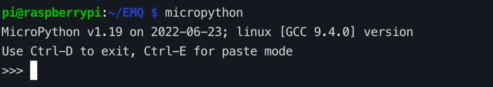
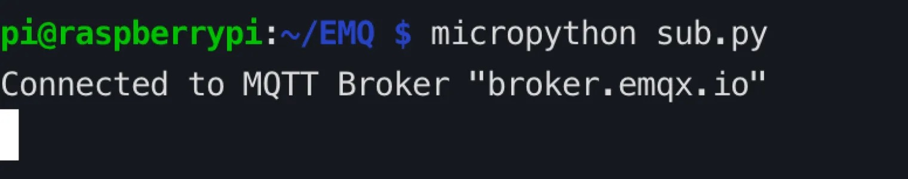
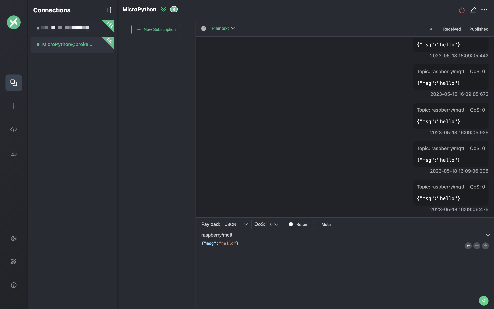
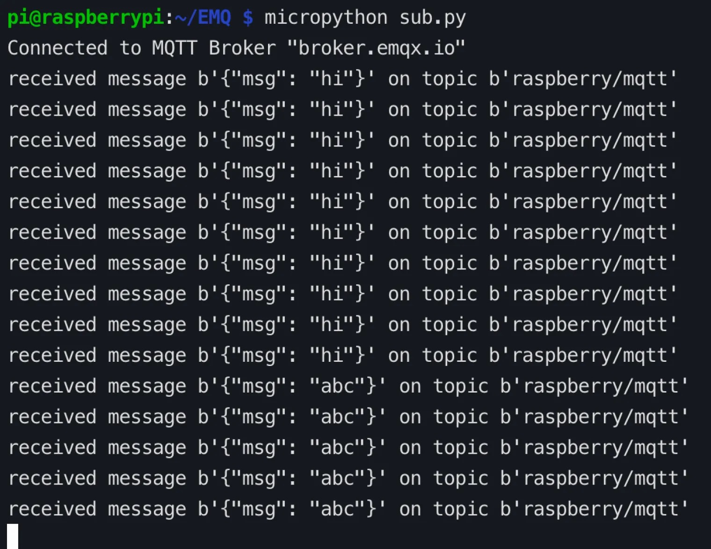
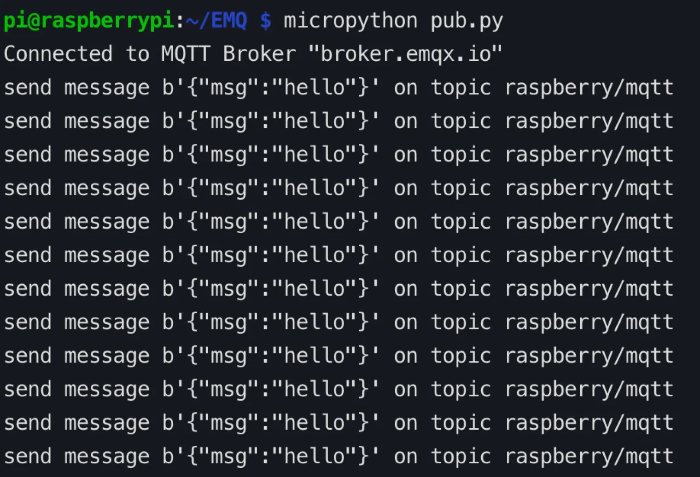
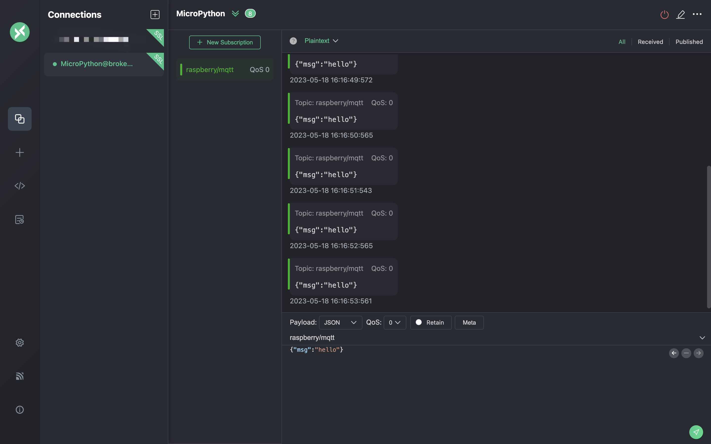

# Connect with MicroPython + Raspberry Pi

This article mainly introduces the use of MicroPython on the Raspberry Pi (Raspberry Pi 4) to realize the functions of connecting, subscribing, and publishing messages between the client and the MQTT server.

[MicroPython](https://en.wikipedia.org/wiki/MicroPython)  is a complete software implementation of the Python 3 programming language, written in C and optimized for a full Python compiler and runtime system running on top of MCU (microcontroller unit) hardware, providing the user with an interactive prompt (REPL) to immediately execute the supported commands. In addition to selected core Python libraries, MicroPython includes modules that give programmers access to low-level hardware, and is a streamlined implementation of the Python 3 language that includes a small portion of the Python standard library optimized to run on microcontrollers and in constrained environments.

[Raspberry Pi](https://www.raspberrypi.org/) developed by the Raspberry Pi Foundation in the UK, is an ARM-based microcomputer motherboard. It provides a USB interface and Ethernet interface to connect the keyboard, mouse and network cable. The motherboard has the basic functions of a PC, while Raspberry Pi has integrated Wi-Fi, Bluetooth and many GPIOs, and is widely used in teaching, home entertainment, IoT, etc.

This article demonstrates how to connect a MicroPython client on a Raspberry Pi 4 to a MQTT broker via the TCP port and the TLS/SSL port, respectively. For serverless deployments, see the demonstration on TLS/SSL port connections. Settings for connections over TCP ports are different from those for connections over TLS or SSL ports, but the code used in the publishing and subscribing functions is the same.

## Prerequisites

Before the connection, you need to get the broker and client ready.

### Get MQTT Broker

You can use the [free public MQTT broker](https://www.emqx.com/en/mqtt/public-mqtt5-broker) provided by EMQX. This service was created based on the [EMQX Platform](https://www.emqx.com/en). The information about broker access is as follows:

- Broker: **broker.emqx.io**
- TCP Port: **1883**
- SSL/TLS Port: **8883**

You can [create a deployment](../create/overview.md) as well. Find connection information in deployment overview. Make sure the deployment is running. Use the TCP port or TLS/SSL port to test the connection to the MQTT server.

If you are creating your own deployment, check Access Control -> [Authentication](../deployments/default_auth.md) and set the username and password for verification.

### MicroPython Installation

To install and write code using MicroPython, we need to complete the following installation on the Raspberry Pi 4. The Raspberry Pi operating system used in this article is Raspberry Pi OS with desktop (Debian version: 10, 64-bit).

1. When the OS used by the Raspberry Pi is based on Debian version: 10 (buster), you can install MicroPython directly with the following command.

    ```bash
    sudo apt-get update
    sudo apt-get -y install micropython
    ```

    ::: tip
    If you get an E: Unable to locate package micropython error during installation, you can use the snap or build from [source code](https://docs.micropython.org/en/latest/develop/gettingstarted.html) to install.
    :::

2. If your Raspberry Pi OS is based on Debian version: 11 (bullseye), you can install MicroPython using snap.

    ```bash
    sudo apt update
    sudo apt install snapd
    sudo reboot
    sudo snap install core
    sudo snap install micropython
    ```

After the installation is complete, execute micropython in the terminal, and if MicroPython x.x (x means number) is returned, the installation is successful.



### Install the MQTT client library

In order to easily connect to the MQTT server, we need to install the umqtt.simple library.

```bash
micropython -m upip install umqtt.simple
```

## Connect over TCP Port

This section introduces how to connect MicroPython and MQTT servers through the TCP port on the Raspberry Pi. The complete code example is as follows:

### Subscribe

Open any editor, type the following code and save it as a sub.py file:

```python
# sub.py
import time
from umqtt.simple import MQTTClient

SERVER="broker.emqx.io"
ClientID = f'raspberry-sub-{time.time_ns()}'
user = "emqx"
password = "public"
topic = "raspberry/mqtt"
msg = b'{"msg":"hello"}'

def sub(topic, msg):
    print('received message %s on topic %s' % (msg, topic))

def main(server=SERVER):
    client = MQTTClient(ClientID, server, 1883, user, password)
    client.set_callback(sub)
    client.connect()
    print('Connected to MQTT Broker "%s"' % (server))
    client.subscribe(topic)
    while True:
        if True:
            client.wait_msg()
        else:
            client.check_msg()
            time.sleep(1)

if __name__ == "__main__":
    main()
```

### Publish

Open any editor, type the following code, and save it as a pub.py file:

```python
# pub.py
import time
from umqtt.simple import MQTTClient

server="broker.emqx.io"
ClientID = f'raspberry-pub-{time.time_ns()}'
user = "emqx"
password = "public"
topic = "raspberry/mqtt"
msg = b'{"msg":"hello"}'

def connect():
    print('Connected to MQTT Broker "%s"' % (server))
    client = MQTTClient(ClientID, server, 1883, user, password)
    client.connect()
    return client

def reconnect():
    print('Failed to connect to MQTT broker, Reconnecting...' % (server))
    time.sleep(5)
    client.reconnect()

try:
    client = connect()
except OSError as e:
    reconnect()

while True:
  print('send message %s on topic %s' % (msg, topic))
  client.publish(topic, msg, qos=0)
  time.sleep(1)
```

## Connect over TLS/SSL Port

This section introduces how to connect MicroPython and MQTT servers through the TLS/SSL port on the Raspberry Pi. The TCP port and TLS/SSL port connections are slightly different in the connection setup part, and the publish and subscribe part codes are the same. The complete code example is as follows:

### Subscribe

Open any editor, type the following code, and save it as a sub-tls.py file:

```python
# sub-tls.py
import time
import ussl
from umqtt.simple import MQTTClient

SERVER="broker.emqx.io"
ClientID = f'raspberry-sub-{time.time_ns()}'
user = "emqx"
password = "public"
topic = b'raspberry/mqtt'
msg = b"hello"

def sub(topic, msg):
    print('received message %s on topic %s' % (msg, topic))

def main(server=SERVER):
    client = MQTTClient(ClientID, server, 8883, user, password, ssl=True, ssl_params={'server_hostname': server})
    client.set_callback(sub)
    client.connect()
    print('Connected to MQTT Broker "%s"' % (server))
    client.subscribe(topic)
    while True:
        if True:
            client.wait_msg()
        else:
            client.check_msg()
            time.sleep(1)

if __name__ == "__main__":
    main()
```

### Publish

Open any editor, type the following code, and save it as a pub-tls.py file:

```python
# pub-tls.py
import time
import ussl
from umqtt.simple import MQTTClient

server = "broker.emqx.io"
ClientID = f'raspberry-pub-{time.time_ns()}'
user = "emqx"
password = "public"
topic = b'raspberry/mqtt'
msg = b'{"msg":"hello"}'

def connect():
    print('Connected to MQTT Broker "%s"' % server)
    client = MQTTClient(ClientID, server, 8883, user, password, ssl=True, ssl_params={'server_hostname': server})
    try:
        client.connect()
        return client
    except Exception as e:
        print('Failed to connect to MQTT broker:', e)
        raise

def reconnect():
    print('Failed to connect to MQTT broker. Reconnecting...')
    time.sleep(5)
    client = connect()
    return client

try:
    client = connect()
except Exception:
    client = reconnect()

while True:
    try:
        print('Sending message %s on topic %s' % (msg, topic))
        client.publish(topic, msg, qos=0)
        time.sleep(1)
    except Exception as e:
        print('Failed to publish message:', e)
        client = reconnect()
```

## Testing

We use the MQTT 5.0 client tool [MQTTX](https://mqttx.app/) for the following tests:
### Test subscribe

After successfully connecting to the MQTT server, you can use the Raspberry Pi and MQTTX to test the connection.

1. Open the terminal, run the MicroPython code, and listen for messages.

    ```bash
    micropython sub.py
    ```

    

2. Use the MQTTX client to establish a connection with the MQTT server and send messages to the topic `raspberry/mqtt`.

   

3. View messages received by MicroPython on the Raspberry Pi.

   

### Test publish

1. Subscribe to the `raspberry/mqtt` topic in the MQTTX client.

2. Run the MicroPython code in the terminal, publish the message.

    ```bash
    micropython pub.py
    ```

    

3. In the MQTTX client, view the messages sent by the Raspberry Pi.

   

## More

To sum up, we have created an MQTT connection in the MicroPython project and simulated the scenario of using the client to connect, subscribe, and send and receive messages to the MQTT server. You can download the source code of the example at [here](https://github.com/emqx/MQTT-Client-Examples/tree/master/mqtt-client-Micropython), and you can also download it at [GitHub](https://github.com/emqx/MQTT-Client-Examples) to find more demo examples in other languages.
