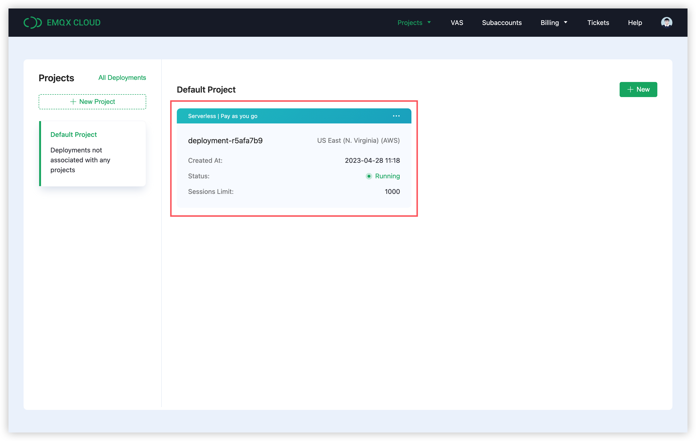
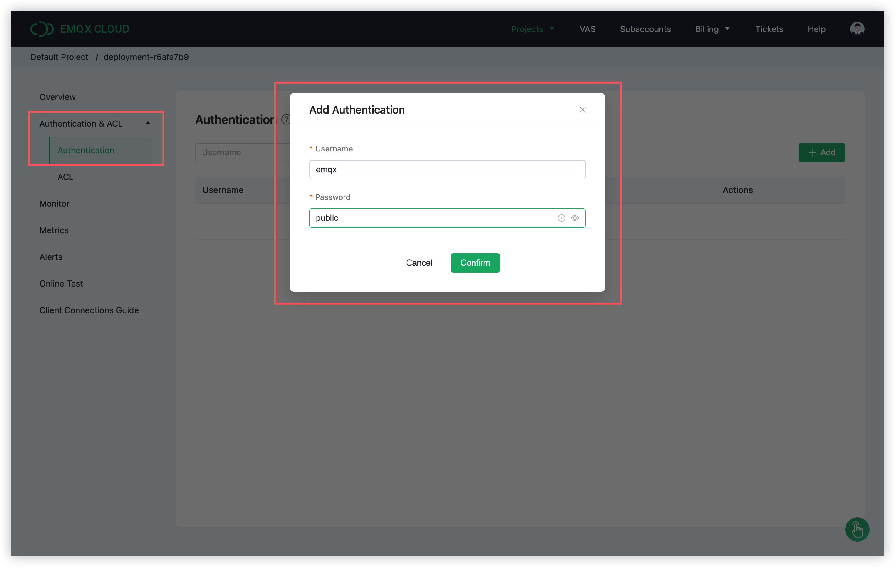
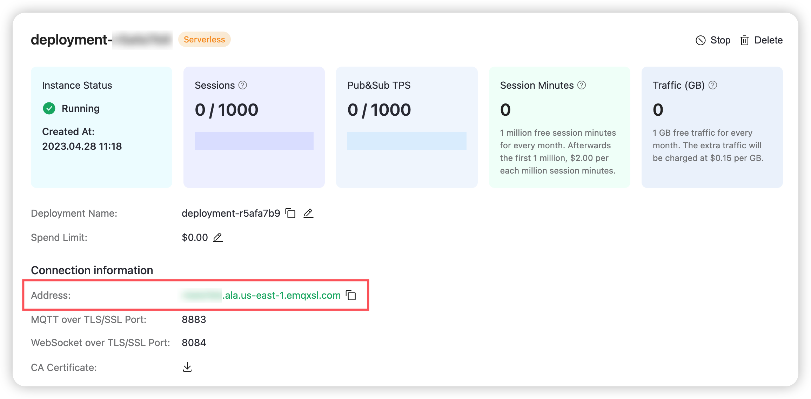

## Introduction

[MicroPython](https://micropython.org/) is a lean and efficient implementation of the Python3 programming language, written in C, optimized to run on microcontrollers. MicroPython includes a selection of core Python standard libraries, and also provides specific libraries such as bluetooth and machine to use common APIs to control the underlying hardware in different hardware platforms such as ESP32 and Raspberry Pi Pico.

[umqtt](https://github.com/micropython/micropython-lib/tree/master/micropython/umqtt.simple) is a simple MQTT client for MicroPython that supports message callbacks and provides two implementations of blocking and non-blocking for receiving messages. But currently it only supports MQTT v3.1.1 and does not support QoS 2 yet.

This article will mainly introduce how to use the `umqtt` library in MicroPython to realize the functions of connecting, subscribing, sending and receiving messages between the client and the MQTT server.

## Prerequisites

### 1. Install MicroPython Firmware

How to install MicroPython on hardware platforms such as ESP32, ESP8266, and Raspberry Pi Pico is not the focus of this article, but it is necessary. If you have not installed MicroPython, you can refer to here first:

[How to install MicroPython on ESP32?](https://docs.micropython.org/en/latest/esp32/tutorial/intro.html#)

[How to install MicroPython on ESP8266?](https://docs.micropython.org/en/latest/esp8266/tutorial/intro.html#intro)

[How to install MicroPython on Raspberry Pi Pico?](https://www.raspberrypi.com/documentation/microcontrollers/micropython.html#drag-and-drop-micropython)

### 2. Access Network

After flashing the MicroPython firmware, we also need to connect the device to the WiFi network, so as to install the client library and connect to the external MQTT Server.

We can create a `wifi.py` file and add the following code, then replace "NAME OF YOUR WIFI NETWORK" and "PASSWORD OF YOUR WIFI NETWORK" with your own WiFi network name and password:

```
import network
import time

def connect():
	ssid = 'NAME OF YOUR WIFI NETWORK'
	password = 'PASSWORD OF YOUR WIFI NETWORK'
	wlan = network.WLAN(network.STA_IF)
	wlan.active(True)
	wlan.connect(ssid, password)
	while wlan.isconnected() == False:
		print('Waiting for connection...')
		time.sleep(1)
	print('Connected on {ip}'.format(ip=wlan.ifconfig()[0]))
```

We can reference this module in our `main.py` file and run `wifi.connect()` to have the device automatically connect to the network after each boot:

```
import wifi

wifi.connect()
```

> `main.py` needs to be created by yourself.

## Start

### Create an EMQX Cloud Serverless instance

On the homepage of [EMQX Cloud](https://www.emqx.com/en/cloud) official website, click `Get Started Free`, and after registering a free EMQX Cloud account, you can create an EMQX Cloud Serverless instance with a free quota of **1 million** connection minutes per month:


After the creation is successful, we will see a Serverless instance running:



Since the client must pass identity verification to access Serverless, we also need to enter the authentication page and add authentication information for the client. Here we add an authentication information with the username `emqx` and the password `public`:



### Client Code

First, we import the modules that will be used in this example, namely `random`, `time`, `json`, `wifi`, and `umqtt.simple`:

```
import random
import time
import json
import wifi

from umqtt.simple import MQTTClient
```

#### Connect

Next, we need to initialize some connection information, which are the MQTT server address, port, and the Client ID, username, and password used for connection. Finally, there is a topic that we will use later on for publish-subscribe:

```
SERVER = "xxxx.ala.cn-hangzhou.emqxsl.cn"
PORT = 8883
CLIENT_ID = 'micropython-client-{id}'.format(id=random.getrandbits(8))
USERNAME = 'emqx'
PASSWORD = 'public'
TOPIC = "raspberry/mqtt"
```

We can get the connection address and port of the MQTT server by viewing the serverless instance details.



For the sake of communication security, EMQX Cloud Serverless only accepts TLS connections. We can click the download button on the right side of `CA Certficate` in the serverless instance details to download the CA certificate that issued the serverless certificate, and then trust this certificate in the client.

MicroPython currently only supports certificates in PEM format, so we don't need to convert the certificate format. The following code indicates that we set `cadata` to the content of the read CA certificate file, which means we trust the CA certificate, and set `cert_reqs` to `ssl.CERT_REQUIRED`, which means that the client will ask the server to send a certificate during the handshake.

Finally, we also need to set SNI as our connection address through the `server_hostname` option. This step is very necessary, because Serverless needs to distinguish tenants based on SNI, and MicroPython will not send SNI by default, which will cause our connection to fail::

```
with open('emqxsl-ca.crt', 'rb') as f:
    cadata = f.read()
ssl_params = dict()
ssl_params["cert_reqs"] = ssl.CERT_REQUIRED
ssl_params["cadata"] = cadata
ssl_params["server_hostname"] = SERVER
```

In addition to SSL-related connection parameters, we also need to specify the connection address, Client ID and other information. The complete connection code is as follows:

```python
def connect():
  	with open('emqxsl-ca.crt', 'rb') as f:
        cadata = f.read()
    ssl_params = dict()
    ssl_params["cert_reqs"] = ssl.CERT_REQUIRED
    ssl_params["cadata"] = cadata
    ssl_params["server_hostname"] = SERVER
    client = MQTTClient(CLIENT_ID, SERVER, PORT, USERNAME, PASSWORD, ssl = True, ssl_params = ssl_params)
    client.connect()
    print('Connected to MQTT Broker "{server}"'.format(server=SERVER))
    return client
```

Here we are using MicroPython 1.20.0, this version supplements the previously missing `cert_reqs`, `cadata` parameters. If you are using a version lower than 1.20.0, then you will not need to specify the SSL parameter, like this:

```
client = MQTTClient(CLIENT_ID, SERVER, PORT, USERNAME, PASSWORD, ssl = True)
```

Of course, this also means that the client will not have the ability to verify the identity of the server, which will introduce a certain risk of man-in-the-middle attacks.

#### Set a callback and subscribe to a topic

Next, we implement the `on_message` callback function whose sole purpose is to print the subject and content of the message when it arrives. We need to set the client's callback to the `on_message` function before subscribing to the topic, so as not to miss the message:

```python
def on_message(topic, msg):
    print("Received '{payload}' from topic '{topic}'\n".format(
        payload=msg.decode(), topic=topic.decode()))

def subscribe(client):
    client.set_callback(on_message)
    client.subscribe(TOPIC)
```

#### Cyclically Publish and Receive

In this example, we will use the same client for cyclic message publishing and receiving. The main function of the following code is to continuously construct and publish new message content, and then call `wait_msg()` to block and wait for the message forwarded from the MQTT server.

Once the message arrives, the `on_message` callback will be triggered to print the message content. After the callback finishes we will wait a second before entering the next loop:

```
def loop_publish(client):
    msg_count = 0
    while True:
        msg_dict = {
            'msg': msg_count
        }
        msg = json.dumps(msg_dict)
        result = client.publish(TOPIC, msg)
        print("Send '{msg}' to topic '{topic}'".format(msg=msg, topic=TOPIC))
        client.wait_msg()
        msg_count += 1
        time.sleep(1)
```

#### Main Function

In the main function, we first call `wifi.connect()` to connect the device to the network, and then call the connection, subscription, and cyclic publishing functions implemented earlier in sequence:

```
def run():
    wifi.connect()
    client = connect()
    subscribe(client)
    loop_publish(client)

if __name__ == "__main__":
    run()
```

### Test

Run the code, the console output is as follows:

```
Connected on 192.168.0.32
Connected to MQTT Broker "broker.emqx.io"
Send '{"msg": 0}' to topic 'raspberry/mqtt'
Received '{"msg": 0}' from topic 'raspberry/mqtt'

Send '{"msg": 1}' to topic 'raspberry/mqtt'
Received '{"msg": 1}' from topic 'raspberry/mqtt'

Send '{"msg": 2}' to topic 'raspberry/mqtt'
Received '{"msg": 2}' from topic 'raspberry/mqtt'
```

## More

Now, we have successfully demonstrated how to use `umqtt` client library to connect to EMQX Cloud Serverless in MicroPython, you can download the sample code at [here](https://github.com/emqx/MQTT-Client-Examples/tree/master/mqtt-client-Micropython). At the same time, you can also find more demo examples in other languages on [GitHub](https://github.com/emqx/MQTT-Client-Examples).
