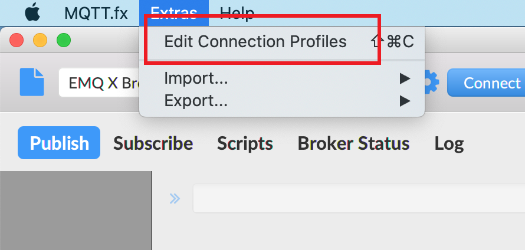

# Connect with MQTT.fx

This article will take [MQTT.fx](http://www.mqttfx.jensd.de/) as [MQTT client](https://www.emqx.com/en/blog/introduction-to-the-commonly-used-mqtt-client-library) test tool to connect the deployment of EMQX Platform.

[MQTT.fx](http://www.mqttfx.jensd.de/) is the most popular MQTT desktop client tool currently. The major version of MQTT.fx 1.0 is developed by [Jens Deters](https://www.jensd.de/wordpress/) using [JavaFX](https://en.wikipedia.org/wiki/JavaFX) technology, which is a Java virtual machine application. Unfortunately, the maintenance of MQTT.fx has now stopped maintenance and Softblade company has sponsored the development and released its commercial version MQTT.fx® 5.0, which is operated with a fee-based license. MQTT.fx in this article refers to version 1.0 without special instructions.

TCP and TLS protocols are supported **but WebSocket**.

## Preconditions

> 1. [Install](http://www.mqttfx.jensd.de/index.php/download) MQTT.fx client
> 2. Already Create Deployment in EMQX Platform, and the deployment status is **running**

## Connection configuration

### Broker information

Get the connection address and port in the Deployment Overview (the following **xxxxx represents a random port**, the specific port information **please refer to the information on the deployment overview page**).

- Dedicated plan address: IP; port: 1883(mqtt), 8083(ws) is enabled by default, you can enable port 8883(mqtts) and 8084(wss) by configuring TLS/SSL
- BYOC plan address: the domain name specified at deployment time; port: 1883 (mqtt), 8083 (ws), 8883 (mqtts), 8884 (wss)

### Authentication

All deployments of the EMQX Platform have user authentication enabled, so when using MQTT.fx to test the connection, **you need to fill in the Username and Password fields**.

> Set the Username and Password in `Access Control` > `Authentication`, which can be added one by one, or can be imported at once.

## Connect

1. Open connection profile

   

2. Create a new connection configuration and fill in the relevant configuration

   

3. Connect to MQTT broker

   

## More

For more subscription, publishing and other functions, please refer to: [Using MQTT.fx to connect to EMQX Platform](https://www.emqx.com/en/blog/connecting-to-emqx-cloud-with-mqttfx).
