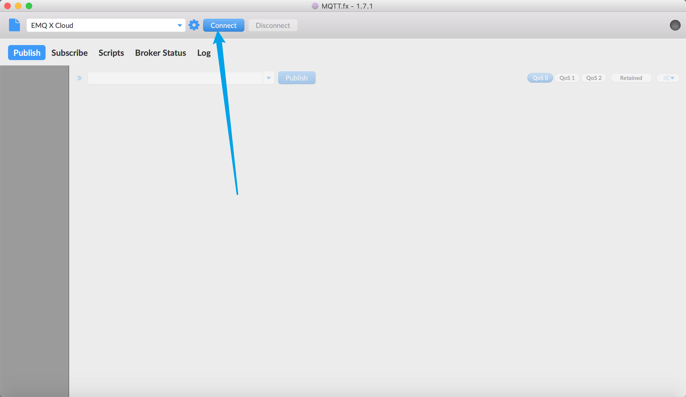

# Connect to deployments with MQTT.fx

[MQTT.fx](https://mqttfx.jensd.de/) is an cross-platform MQTT desktop client, which supports macOS, Linux, Windows.

TCP and TLS protocols are supported **but websocket**.

## Precondition

* Already [Create Deployment](../deployments/create_deployment.md) in EMQ X Cloud, and the deployment status is **running**
* Install MQTT.fx client

## Connection configuration example

1. Open connection profile

    

2. Create a new connection configuration and fill in the relevant configuration

    

3. Connect to MQTT broker

    

