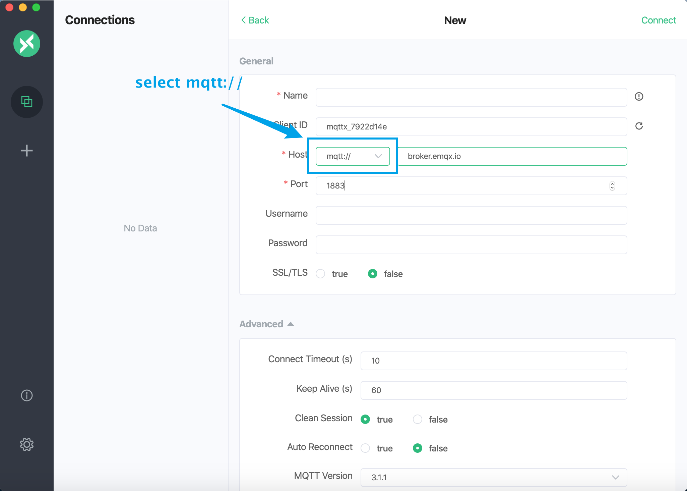
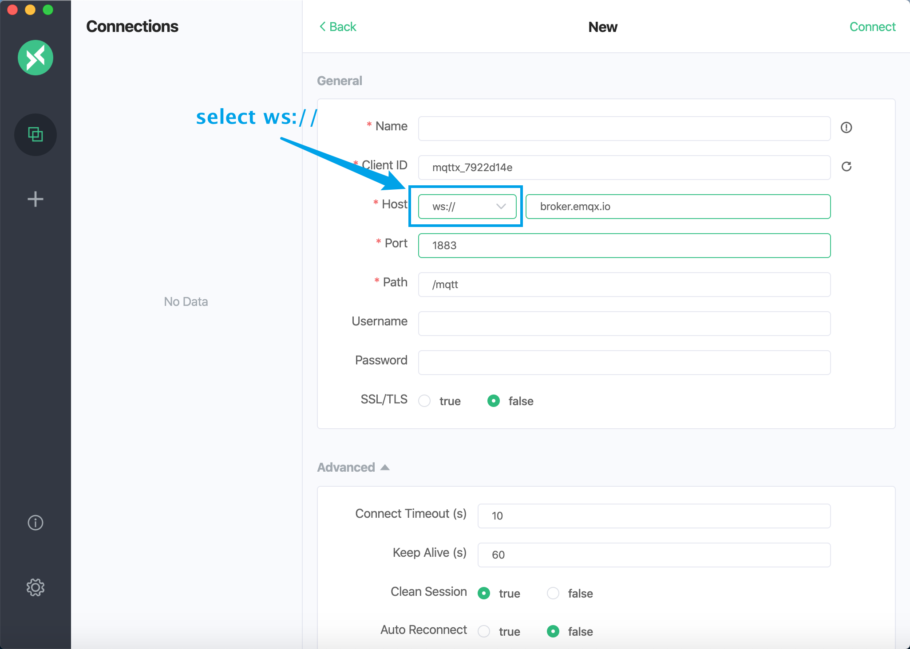
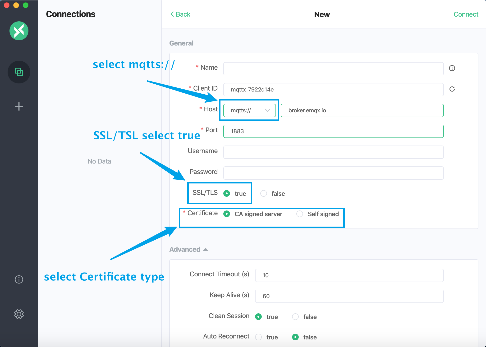
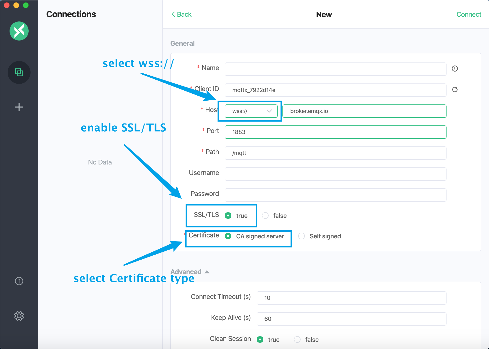

# Connect to deployments with MQTT X

[MQTT X](https://mqttx.app) is an elegant cross-platform MQTT 5.0 desktop client open sourced by [EMQ](http://emqx.io), which supports macOS, Linux, Windows.

The UI of [MQTT X](https://mqttx.app) adopts the chat interface form, which simplifies the page operation logic. Users can quickly create connections. It allows multiple clients to be saved, which is convenient for users to quickly test `MQTT/MQTTS` connection, and subscribe and publish `MQTT` messages.

Before downloading and installing, please visit our [website](https://mqttx.app/) or [GitHub](https://github.com/emqx/MQTTX) to get the latest version information. The latest version helps to improve the using experience. If you are familiar with this project, you can also directly clone [MQTT X](https://mqttx.app/)  repository source code, package and use it yourself. During useing, if you have any questions, you can go to [GitHub issues](https://github.com/emqx/MQTTX/issues) to post questions and opinions or Fork our project, and submit a revised PR to us, We will carefully review and reply.

## Precondition

* Already [Create Deployment](../deployments/create_deployment.md) in EMQ X Cloud, and the deployment status is **running**
* Install MQTT X client

## Connection configuration example

* Connect to deployment with MQTT protocol

* Connect to the deployment and subscribe to messages with the Websocket protocol

* Connect to deployment and subscribe to messages with MQTT over TLS/SSL protocol

* Connect to deployment and subscribe to messages with Websocket over TLS/SSL protocol

