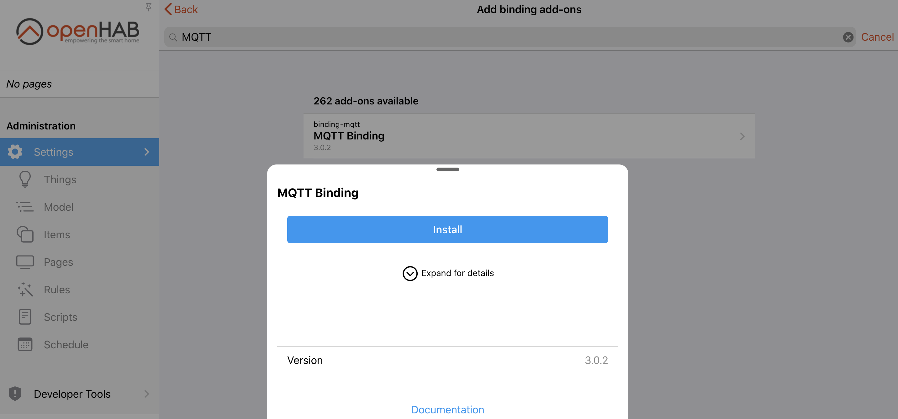
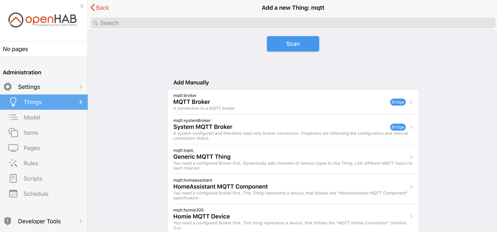
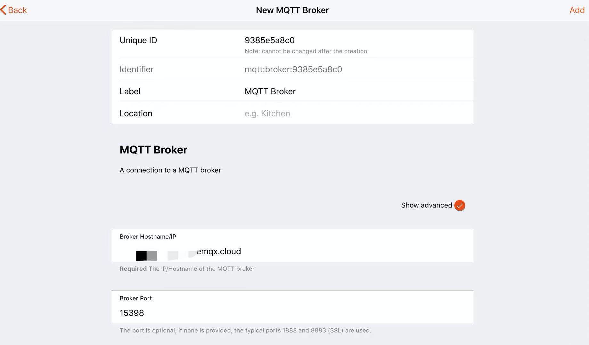
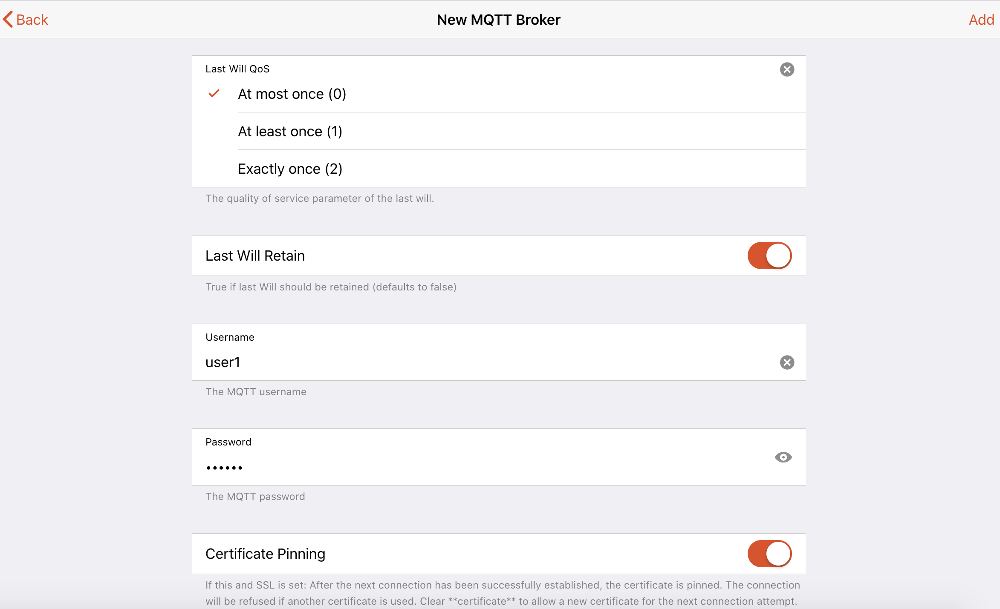
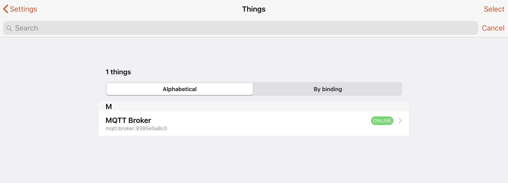
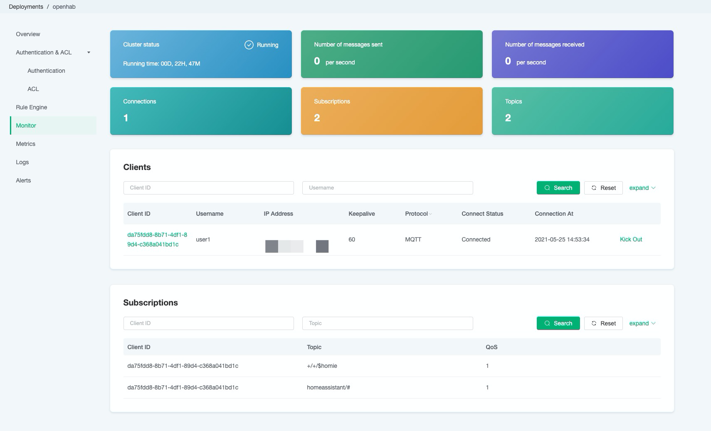

# Set up EMQ X Cloud MQTT Broker with openHAB

[OpenHAB](https://www.openhab.org/) also known as open Home Automation Bus, is an open-source home automation software written in Java. With the strengths of integrating various devices, providing a clear user interface, and supporting the most flexible tools, openHAB becomes one of the most outstanding platforms in the field of home automation.

With the high flexibility and ease of use, openHAB provides a particular binding for users to connect MQTT Broker. In this article, we will introduce to you the process of setting up EMQ X Cloud MQTT Broker with openHAB.


## What is MQTT?

MQTT, known as Message Queuing Telemetry Transport, is a lightweight IoT messaging protocol based on the publish/subscribe model and is becoming the standard for IoT communications with its simplicity, QoS support, lightweight and bandwidth-saving features.


## Why EMQ X Cloud MQTT?

[EMQ X Cloud](https://www.emqx.com/en/cloud) is an MQTT messaging middleware product for the IoT domain from EMQ. As the world's first fully managed MQTT 5.0 public cloud service, EMQ X Cloud provides a one-stop O&M colocation and a unique isolated environment for MQTT messaging services. It serves dozens of countries and regions around the world, providing low-cost, secure, and reliable cloud services for 5G and Internet of Everything applications.

EMQ X Cloud is available in three plans: Basic, Professional, and Unlimited, which offers a variety of flexible product specifications to support the deployment of fully managed MQTT services exclusively for you on the world's leading public clouds. Need more information with EMQ X Cloud's product plan? Click[ here](https://docs.emqx.io/en/cloud/latest/pricing.html).

Such a powerful product is a great choice to integrate with openHAB. You could check out the[ documentation](https://docs.emqx.io/en/cloud/latest/) to get more information regarding EMQ X Cloud。


## Binding EMQ X MQTT Broker with openHAB 3

If it's your first time using EMQ X Cloud, don't worry. We will guide you through connecting Home Assistant with EMQ X Cloud.

1. [Create](https://www.emqx.com/en/signin?continue=https://www.emqx.com/en/cloud) an EMQ X Cloud Account.

2. Login to EMQ X Cloud [console](https://cloud.emqx.io/console/) and start a new deployment.

   ```tip
   For the first-time EMQ X Cloud customers, we have an opportunity for you to create a free trial deployment of up to 14 days in length. The free trial deployment is an ideal way for you to learn and explore the features of EMQ X Cloud. 
   ```

3. After the new deployment is created, and the status is **running**, add the client authentication information (you could choose to add manually or import from the file).  

   

4. Install openHAB. You could easily get openHAB installed by following the steps shown [here](https://www.openhab.org/docs/installation/). OpenHAB could be run on various systems based on your preference. 

5. After the openHAB is installed, run the openHAB and go to [console](http://localhost:8080/).

6. Go to `Settings` and install MQTT Binding:

   

7. Add MQTT to `Things`

   

8. Select `MQTT Broker` and fill in the information of the deployment we created before.

   

   For the username and password, fill in the authentication information as mentioned before.

   

   

9. When there is a little green label shows `ONLINE`, you are successfully connecting openHAB with EMQ X Cloud. Congrats!

   

   You could also check the status from the EMQ X Cloud's monitor page.

   

