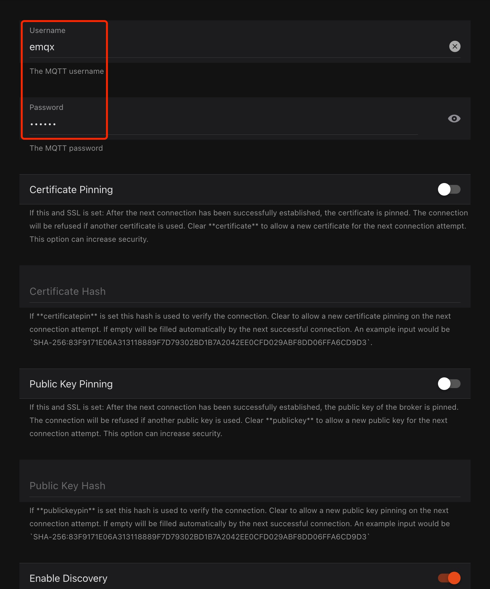

# Connect with OpenHAB

[OpenHAB](https://www.openhab.org/) also known as open Home Automation Bus, is an open-source home automation software written in Java. With the strengths of integrating various devices, providing a clear user interface, and supporting the most flexible tools, openHAB becomes one of the most outstanding platforms in the field of home automation.

With the high flexibility and ease of use, openHAB provides a particular binding for users to connect MQTT Broker. In this article, we will introduce to you the process of setting up EMQX Cloud MQTT Broker with openHAB.

## Prerequisites

### Get MQTT Broker

You can use the [free public MQTT broker](https://www.emqx.com/en/mqtt/public-mqtt5-broker) provided by EMQX. This service was created based on the [EMQX Cloud](https://www.emqx.com/en/cloud). The information about broker access is as follows:

- Broker: **broker.emqx.io**
- MQTT Port: **1883**
- MQTT over TLS/SSL Port: **8883**

You can [create a deployment](../create/overview.md) as well. Find connection information in deployment overview. Make sure the deployment is running. Use the TCP port or TLS/SSL port to test the connection to the MQTT server.

If you are creating your own deployment, check [Authentication](../deployments/auth_overview.md) and set the username and password in `Authentication & ACL` > `Authentication` for verification.

## OpenHAB Initialization

If you are using MQTT for OpenHAB for the first time, please refer to the [quick start](https://www.openhab.org/addons/bindings/mqtt/).

1. Install OpenHAB

   In this example, we use Docker to quickly install OpenHAB.

   ```bash
   docker run -d --name=openhab --restart=always --network=host \
    -v /opt/openhab/conf:/openhab/conf \
    -v /opt/openhab/userdata:/openhab/userdata \
    -v /opt/openhab/addons:/openhab/addons \
    openhab/openhab
   ```

   Then access the OpenHAB service via the local IP with the corresponding port, e.g., x.x.x.x:8080, to create an account.

   

   Next, you can select language, region, time zone, location of your home. Once configuration is finished, you will be redirected to openHAB console.

   

2. Install Bindings

   Go to `Settings` ---> `Bingdings` ---> `MQTT Binding` and install MQTT Binding:

   

3. Add `MQTT Broker` to `Things`

   

   Then select `MQTT Broker` and fill in the information of the deployment we created before.

   

## Connect over TCP Port

This section describes how to connect a openhab client to MQTT broker over TCP port.

- Fill in the broker address, port, username and password (if it exists).
- Select `TCP` for MQTT transport.


## Connect over TLS/SSL Port

This section describes how to connect a openhab client to MQTT broker over TLS/SSL port.

- Fill in the broker address, port, username, and password (if they exist).
- Enable `Secure Connection`.
- Select `TCP` for MQTT transport.




## Test Connection

Go to `Settings` ---> `Things` ---> `MQTT Broker`, when there is a little green label that says "online, you are successfully connecting openHAB with EMQX Cloud. Congrats!


You can also check the status from the EMQX Cloud's monitor page.


