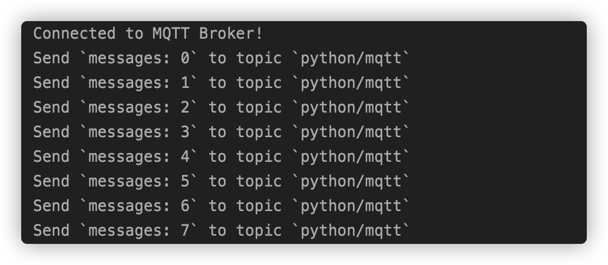
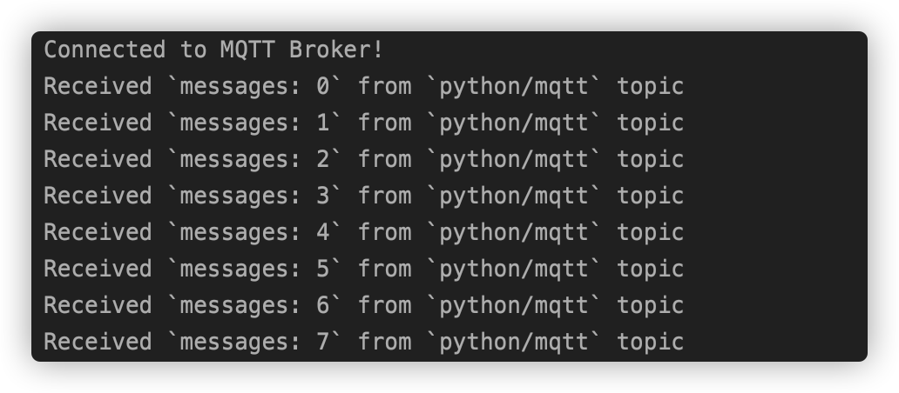

# Connect to the Deployment with Python SDK

This document describes how to use the **paho-mqtt** client library in Python projects to connect to the MQTT server, subscribe, unsubscribe, send and receive messages.

[Python](https://www.python.org/) is an interpreted, high-level, general-purpose programming language. 
Created by Guido van Rossum and first released in 1991, Python's design philosophy emphasizes code readability with its notable use of significant whitespace. 
Its language constructs and object-oriented approach aim to help programmers write clear, logical code for small and large-scale projects


## Preconditions

>1. The deployment has been created. You can view connection-related information under [Deployment Overview](../deployments/view_deployment.md). Please make sure that the deployment status is running. At the same time, you can use WebSocket to test the connection to the MQTT server.
>2. Set the user name and password in `Authentication & ACL` > `Authentication` for connection verification.

This project uses Python 3.8 to develop and test. Confirm the Python version by the following command.

```
➜  ~ python3 --version             
Python 3.8.6
```


## Install MQTT client

[paho-mqtt](https://www.eclipse.org/paho/clients/python/) is currently using more MQTT client library in Python.
It provides support for MQTT V5.0, V3.1, and V3.1.1 for client classes on Python 2.7.9+ or 3.6+. 
It also provides some helper functions to make publishing one off messages to an MQTT server very straightforward.

1. Pip is a package-management system written in Python used to install and manage software packages. Use the following command to install paho-mqtt.

```bash
pip install paho-mqtt
```

2. Import the Paho MQTT client

```python
from paho.mqtt import client as mqtt_client
```

## Connection

>Please find the relevant address and port information in the [Deployment Overview](../deployments/view_deployment.md) of the Console. Please note that if it is the basic edition, the port is not 1883 or 8883, please confirm the port.

### Connection Settings

Set the host, port and topic of MQTT Broker connection. At the same time, we call the Python function 'random.randint' to randomly generate the MQTT client id.

```python
broker = 'broker.emqx.io'
port = 1883
topic = 'python/mqtt'
client_id = f'python-mqtt-{random.randint(0, 1000)}'
username = 'emqx'
password = '**********'
```

### Write MQTT connection function

Write the connect callback function 'on_connect'. 
This function will be called after connecting the client, and we can determine whether the client is connected successfully according to 'rc' in this function.

```python
def connect_mqtt():
    def on_connect(client, userdata, flags, rc):
        if rc == 0:
            print("Connected to MQTT Broker!")
        else:
            print("Failed to connect, return code %d\n", rc)
    # Set Connecting Client ID
    client = mqtt_client.Client(client_id)
    client.username_pw_set(username, password)
    client.on_connect = on_connect
    client.connect(broker, port)
    return client
```

## Publish and Subscribe

### Publish messages

First, we define a while loop. In this loop, and we will set the MQTT client 'publish' function to send messages to the topic 'python/mqtt' every second.

```python
 def publish(client):
     msg_count = 0
     while True:
         time.sleep(1)
         msg = f"messages: {msg_count}"
         result = client.publish(topic, msg)
         # result: [0, 1]
         status = result[0]
         if status == 0:
             print(f"Send `{msg}` to topic `{topic}`")
         else:
             print(f"Failed to send message to topic {topic}")
         msg_count += 1
```

### Subscribe

Write the message callback function 'on_message'. This function will be called after the client received messages from the MQTT Broker. 
In this function, we will print out the name of subscribed topics and the received messages.

```python
def subscribe(client: mqtt_client):
    def on_message(client, userdata, msg):
        print(f"Received `{msg.payload.decode()}` from `{msg.topic}` topic")

    client.subscribe(topic)
    client.on_message = on_message
```

## The full code

**The code of publishing messages**

```python
# python 3.8

import random
import time

from paho.mqtt import client as mqtt_client


broker = 'broker.emqx.io'
port = 1883
topic = "python/mqtt"
# generate client ID with pub prefix randomly
client_id = f'python-mqtt-{random.randint(0, 1000)}'
username = 'emqx'
password = '**********'


def connect_mqtt():
    def on_connect(client, userdata, flags, rc):
        if rc == 0:
            print("Connected to MQTT Broker!")
        else:
            print("Failed to connect, return code %d\n", rc)

    client = mqtt_client.Client(client_id)
    client.username_pw_set(username, password)
    client.on_connect = on_connect
    client.connect(broker, port)
    return client


def publish(client):
    msg_count = 0
    while True:
        time.sleep(1)
        msg = f"messages: {msg_count}"
        result = client.publish(topic, msg)
        # result: [0, 1]
        status = result[0]
        if status == 0:
            print(f"Send `{msg}` to topic `{topic}`")
        else:
            print(f"Failed to send message to topic {topic}")
        msg_count += 1


def run():
    client = connect_mqtt()
    client.loop_start()
    publish(client)


if __name__ == '__main__':
    run()
```

**The code of subscribing**

```python
# python3.8

import random

from paho.mqtt import client as mqtt_client


broker = 'broker.emqx.io'
port = 1883
topic = "python/mqtt"
# generate client ID with pub prefix randomly
client_id = f'python-mqtt-{random.randint(0, 100)}'
username = 'emqx'
password = '**********'


def connect_mqtt() -> mqtt_client:
    def on_connect(client, userdata, flags, rc):
        if rc == 0:
            print("Connected to MQTT Broker!")
        else:
            print("Failed to connect, return code %d\n", rc)

    client = mqtt_client.Client(client_id)
    client.username_pw_set(username, password)
    client.on_connect = on_connect
    client.connect(broker, port)
    return client


def subscribe(client: mqtt_client):
    def on_message(client, userdata, msg):
        print(f"Received `{msg.payload.decode()}` from `{msg.topic}` topic")

    client.subscribe(topic)
    client.on_message = on_message


def run():
    client = connect_mqtt()
    subscribe(client)
    client.loop_forever()


if __name__ == '__main__':
    run()
```

## Test

### Publish messages

Run the code of publishing messages, we will see that the client connects and publishes messages successfully.



### Subscribe



## More

All of the above shows that how to use the paho-mqtt client library to connect to the EMQX Cloud.
You can download the source code to the example in [here](https://github.com/emqx/MQTT-Client-Examples/tree/master/mqtt-client-Python3/).
You can find more other languages in [GitHub](https://github.com/emqx/MQTT-Client-Examples).