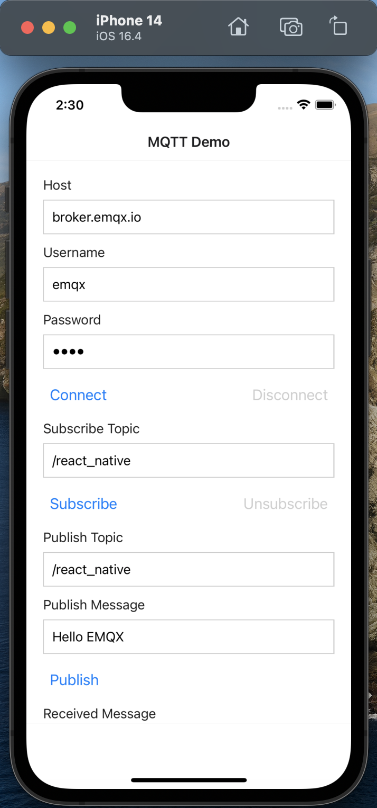
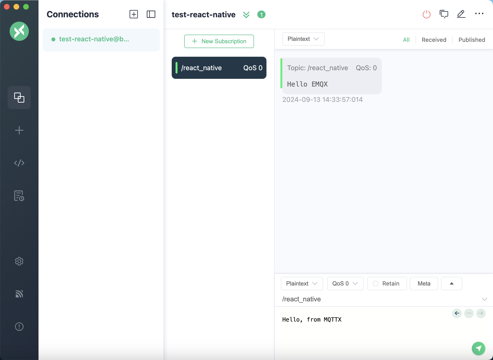
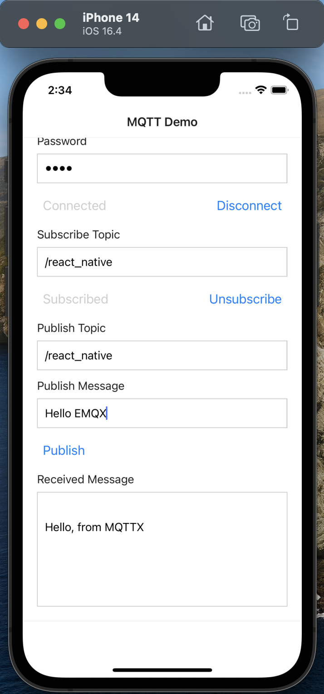

# Connect to Deployment using React Native via MQTT.js SDK

This article mainly introduces how to use MQTT.js in a React Native application built with Expo, and implement the connection, subscription, messaging, unsubscribing and other functions between the client and MQTT broker.

## Prerequisites

### Deploy MQTT Broker

- You can use the [free public MQTT broker](https://www.emqx.com/en/mqtt/public-mqtt5-broker) provided by EMQX. This service was created based on the [EMQX Platform](https://www.emqx.com/en). The information about broker access is as follows:
  - Address: **broker.emqx.io**
  - WebSocket Port: **8083**
  - WebSocket over TLS/SSL Port: **8084**
- You can also [create your own MQTT broker](../create/overview.md). After the deployment is in running status, you can find connection information on the deployment overview page. And for the username and password required in the later client connection stage, you can navigate to the **Access Control** -> **[Authentication](../deployments/default_auth.md)** for the setting.

### Creating a React Native Application

Reference link: [https://docs.expo.dev/get-started/create-a-project/](https://docs.expo.dev/get-started/create-a-project/)

- Creating new React Native applications with `Expo`

  ```shell
  npx create-expo-app@latest mqtt-test
  ```

## Install Dependencies

[MQTT.js](https://github.com/mqttjs/MQTT.js) is a fully open-source client-side library for the MQTT protocol, written in JavaScript and available for Node.js and browsers. For more information and usage of `MQTT.js`, please refer to the [MQTT.js GitHub](https://github.com/mqttjs/MQTT.js#table-of-contents).

MQTT.js can be installed via npm, yarn or pnpm,. This example will install MQTT.js through npm command.

1. Installation via the command line

   ```shell
    npm install mqtt
    # or
    yarn add mqtt
    # or
    pnpm add mqtt
   ```

2. Import MQTT.js where needed

   ```js
   import mqtt from "mqtt";
   ```

## Connect over WebSocket Port

You can set a client ID, username, and password with the following code. The client ID should be unique.

```js
const clientId =
  "emqx_react_native_" + Math.random().toString(16).substring(2, 8);
const username = "emqx_test";
const password = "emqx_test";
```

You can establish a connection between the client and the MQTT broker using the following code:

```js
const client = mqtt.connect("ws://broker.emqx.io:8083/mqtt", {
  clientId,
  username,
  password,
  // ...other options
});
```

## Connect over WebSocket Secure Port

If TLS/SSL encryption is enabled, the connection [parameter options](https://github.com/mqttjs/MQTT.js#mqttclientstreambuilder-options) are the same as for establishing a connection via the WebSocket port, you just need to be careful to change the protocol to `wss` and match the correct port number.

You can establish a connection between the client and the MQTT broker using the following code:

```js
const client = mqtt.connect("wss://broker.emqx.io:8084/mqtt", {
  clientId,
  username,
  password,
  // ...other options
});
```

## Subscribe and Publish

### Subscribe to Topics

Specify a topic and the corresponding [QoS level](https://www.emqx.com/zh/blog/introduction-to-mqtt-qos) to be subscribed.

```javascript
const doSubscribe = () => {
  setSubBtnText("Subscribing...");
  client?.subscribe(subTopic, { qos: 0 }, (error) => {
    if (error) {
      console.error("Failed to subscribe to topic:", subTopic, error);
      setSubBtnText("Subscribe");
    } else {
      setSubBtnText("Subscribed");
      console.log("Subscribed to topic:", subTopic);
    }
  });
};
```

### Unsubscribe to Topics

You can unsubscribe using the following code, specifying the topic to be unsubscribed.

```javascript
const doUnsubscribe = () => {
  client?.unsubscribe(subTopic, {}, (error) => {
    if (error) {
      console.error("Failed to unsubscribe from topic:", subTopic, error);
      setSubBtnText("Subscribe");
    } else {
      console.log("Unsubscribed from topic:", subTopic);
      setSubBtnText("Subscribe");
    }
  });
};
```

### Publish Messages

When publishing a message, the MQTT broker must be provided with information about the target topic and message content.

```javascript
const doPublish = () => {
  client?.publish(pubTopic, pubMessage, { qos: 0 }, (error) => {
    if (error) {
      console.error("Failed to publish message:", error);
    } else {
      console.log("Message published to topic:", pubTopic);
    }
  });
};
```

### Receive Messages

The following code listens for message events and save the received message.

```js
client.on("message", (topic, payload) => {
  setReceivedMsg((prevMsg) => {
    return prevMsg.concat(`\n${payload.toString()}`);
  });
});
```

### Disconnect from MQTT Broker

To disconnect the client from the broker, use the following code:

```javascript
const doDisconnect = () => {
  client?.end();
  setClient(null);
  setConnectBtnText("Connect");
};
```

The above section only shows some key code snippets, for the full project code, please refer to [MQTT Client - React-Native-Expo](https://github.com/emqx/MQTT-Client-Examples/tree/master/mqtt-client-React-Native-Expo). You can download and try it out yourself.

## Test the Connection

We have written the following simple application using React Native with the ability to create connections, subscribe to topics, send and receive messages, unsubscribe, and disconnect.



Use [MQTT 5.0 client tool - MQTTX](https://mqttx.app/) as another client to test sending and receiving messages.



You can see that MQTTX can receive messages from the React Native side normally, as can be seen when sending a message to the topic using MQTTX.



## More

In conclusion, we have implemented creating MQTT connections in a React Native project and simulated scenarios of subscribing, publishing messages, unsubscribing, and disconnecting between clients and MQTT servers.

You can download the complete example source code on the [MQTT Client - React-Native-Expo](https://github.com/emqx/MQTT-Client-Examples/tree/master/mqtt-client-React-Native-Expo), and we also welcome you to explore more demo examples in other languages on the [MQTT Client example page](https://github.com/emqx/MQTT-Client-Examples).
