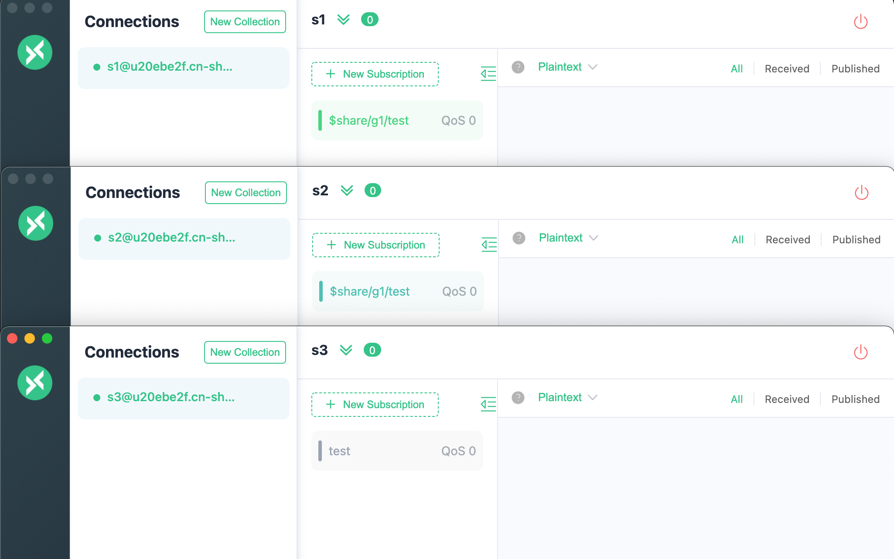
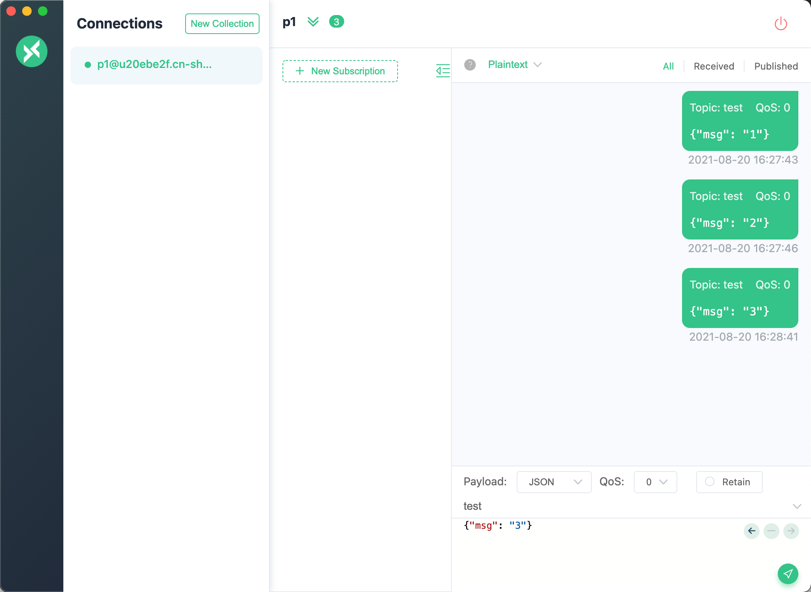
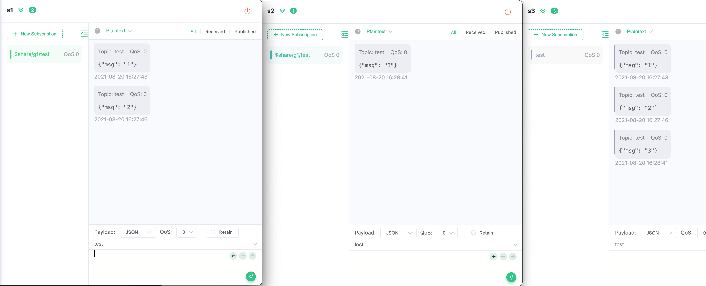

# Shared subscription

Shared subscription is a subscription method that achieves load balancing among multiple subscribers,
EMQX Cloud adopts a random balance strategy, select randomly among all subscribers.

::: tip
**Important Notice: Persistent Sessions (clean_session=false) and Shared Subscriptions Cannot Be Used Simultaneously**

If you are using shared subscription functionality, it is essential to set the client's clean_session to true.

**Reasons are as follows:**

1. **Persistent session functionality** allows subscribers to resume data flow immediately after reconnecting without losing messages, which is crucial for ensuring reliable message delivery. However, this conflicts with the concept of **load balancing**. Shared subscriptions typically allow another device within a group to take over data flow when one device goes offline. However, if a device remains offline for an extended period, the message buffer of the persistent session might overflow, resulting in message loss.

2. When clean_session is set to false, and a device remains offline for an extended period, messages may **continue to accumulate**. The persistent session keeps delivering messages to the device, but the device does not process them. Suppose a device goes offline due to some reason, but the session persists, and other message publishers continue to send messages to that device's session. As the device is offline, these messages cannot be processed promptly, leading to a continuous accumulation of messages in the session. Additionally, these accumulated messages won't be forwarded to other devices since they are considered part of the same device's session. Over time, message accumulation can become increasingly severe, ultimately consuming memory and storage resources, negatively impacting system stability and performance.

**To ensure system reliability and efficient resource utilization, it is essential to set clean_session to true when using shared subscriptions**. This ensures that messages can be appropriately shared among other devices when a device goes offline, avoiding continuous accumulation and resource wastage.
:::

## Shared subscription prefixes formats

EMQX Cloud supports shared subscription prefixes in two formats:
shared subscription with groups (prefixed with `$share/<group-name>/`) and shared subscription without group (prefixed with `$queue/`).

Examples of two shared subscription prefixes formats are as follows.

| prefixes formats                  | Example        | Prefix      | Real topic name |
| :-------------------------------- | :------------- | :---------- | :-------------- |
| Shared subscription with groups   | $share/abc/t/1 | $share/abc/ | t/1             |
| Shared subscription without group | $queue/t/1     | $queue/     | t/1             |

## Shared subscription with groups

Shared subscriptions prefixed with `$share/<group-name>/` are shared subscriptions with groups.
group-name can be any string. Subscribers who belong to the same group will receive messages with load balancing, but EMQX Cloud will broadcast messages to different groups.

### Example

* subscribers s1, s2, and s3 belong to group g1, subscribe topic `$share/g1/test`
* subscribers s4 and s5 belong to group g2, subscribe topic `$share/g2/test`
* subscriber s6 subscribe topic `test`

Then when publisher publishes a message with topic `test` to the EMQX Cloud (tip: this topic does not need to be prefixed).

* Only one of s1, s2, s3 will receive msg
* Only one of s4, s5 will receive msg
* s6 will receive msg

## Shared subscription without group

Shared subscriptions prefixed with `$queue/` are shared subscriptions without groups. 
It is a special case of $share subscription, which is quite similar to all subscribers in a subscription group.

### Example

* subscribers s1, s2, and s3 subscribe topic `$queue/test`
* subscriber s4 subscribe topic `test` 

Then when publisher publishes a message with topic `test` to the EMQX Cloud (tip: this topic does not need to be prefixed).

* Only one of s1, s2, s3 will receive msg
* s4 will receive msg

## Test shared subscription using MQTTX

Simulate client subscriptions using MQTTX.

* s1, s2 subscribe topic `$share/g1/test`
* s3 subscribe topic `test`

Create client P1 using MQTTX to send 3 messages to the topic `test`

s1 receive msg1, msg2, s2 receive msg3 and s3 receive all messages

