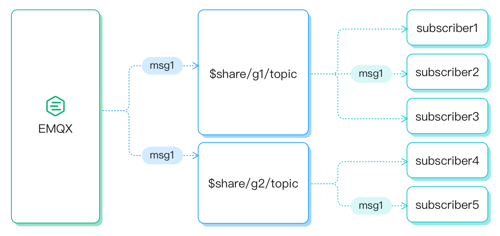
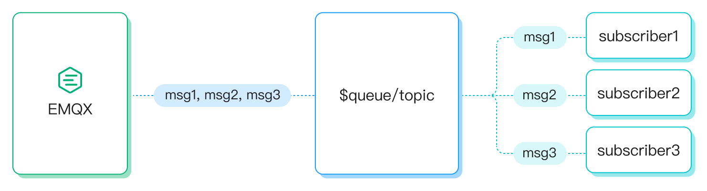

# Shared Subscription

A shared subscription is a subscription mode to implement load balancing among multiple subscribers. Clients can be divided into multiple subscription groups, and messages are still forwarded to all subscription groups, but only one client within each subscription group receives the message at a time. EMQX Cloud supports shared subscription prefixes in two formats: shared subscription for groups (prefixed with `$share/<group-name>/`) and shared subscription not for groups (prefixed with `$queue/`).

Examples of two shared subscription prefixes formats are as follows.

| prefixes formats                  | Example        | Prefix      | Real topic name |
| --------------------------------- | -------------- | ----------- | --------------- |
| Shared subscription for groups    | $share/abc/t/1 | $share/abc/ | t/1             |
| Shared subscription not for group | $queue/t/1     | $queue/     | t/1             |

You can use client tools to connect to EMQX Cloud and try this messaging service. This page introduces how shared subscription works and provides a demonstration of how to use the [MQTTX Desktop](https://mqttx.app/) to simulate clients and try the shared subscription feature.

## Shared Subscription for Groups

You can enable a shared subscription for groups of subscribers by adding the prefixed `$share/<group-name>` to the original topic. The group name can be any string. EMQX Cloud forwards messages to different groups at the same time and subscribers belonging to the same group receive messages with load balancing.

For example, if subscribers `s1`, `s2`, and `s3` are members of group `g1`, subscribers `s4` and `s5` are members of group `g2`, and all subscribers subscribe to the original topic `t1`. The shared subscription topics must be `$share/g1/t1` and `$share/g2/t1`. When EMQX publishes a message `msg1` to the original topic `t1`:

- EMQX Could sends `msg1` to both groups `g1` and `g2`.
- Only one of `s1`, `s2`, `s3` will receive `msg1`.
- Only one of `s4` and `s5` will receive `msg1`.

## Shared Subscription Not for Groups

Shared subscription topics prefixed with `$queue/` are for subscribers not in groups. It is a special case of a shared subscription topic with a `$share` prefix. You can understand it as all subscribers in a subscription group such as `$share/$queue`.

## Shared Subscription and Session

The concept of shared subscription and the use of a persistent session in MQTT clients presents a contradiction, making it impossible to use both features simultaneously. If you are using the shared subscription functionality, it is essential to enable the clean session feature on the client by setting the `clean_session` parameter to `true`.

The persistent session (`clean_session=false`) feature ensures that subscribers can resume data flow immediately after reconnecting without losing any messages. This is vital for maintaining reliable message delivery. By setting the `clean_session` parameter to `false`, the session persists even when the client goes offline, allowing the device to continue receiving messages. However, since the device is offline, it may not process the received messages promptly, leading to a potential accumulation of messages within the session over time.

When the shared subscription is enabled and another device within the same group takes over the data flow of the offline device, it won't receive any of the accumulated messages because they are considered part of the session of the original device. Consequently, if the device remains offline for an extended period, the message buffer of the persistent session could overflow, resulting in message loss. This situation can disrupt load balancing and eventually lead to the depletion of memory and storage resources, negatively impacting the system's stability and overall performance.

For more information on the persistent session, see [MQTT Persistent Session and Clean Session Explained](https://www.emqx.com/en/blog/mqtt-session).

## Test Shared Subscription Using MQTTX

Simulate client subscriptions using MQTTX.

* s1, s2 subscribe topic `$share/g1/test`
* s3 subscribe topic `test`

Create client P1 using MQTTX to send 3 messages to the topic `test`

s1 receive msg1, msg2, s2 receive msg3 and s3 receive all messages

