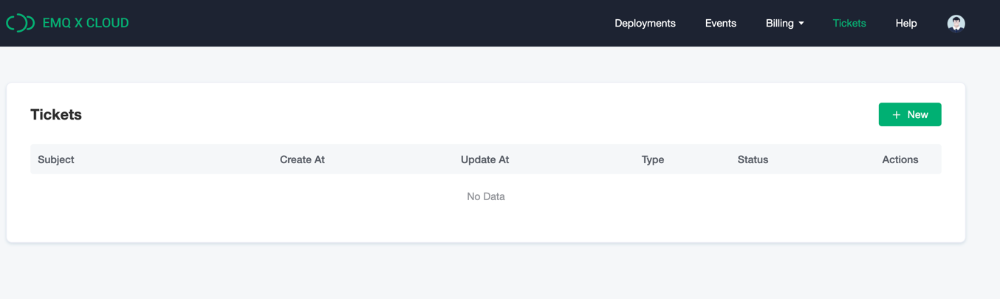

# Contact us

## Contact by tickets

You can enter the ticket system by following the steps below:

1. Login  [EMQ X Cloud console](https://cloud.emqx.io/console/)
2. Click the `Ticket` in the lower left corner

### Create tickets

1. Click `New` in the upper right corner
2. Enter `Title of Ticket` and `Description` in the pop-up page

### View tickets

You can click `ticket Status` to filter the status of the ticket.

