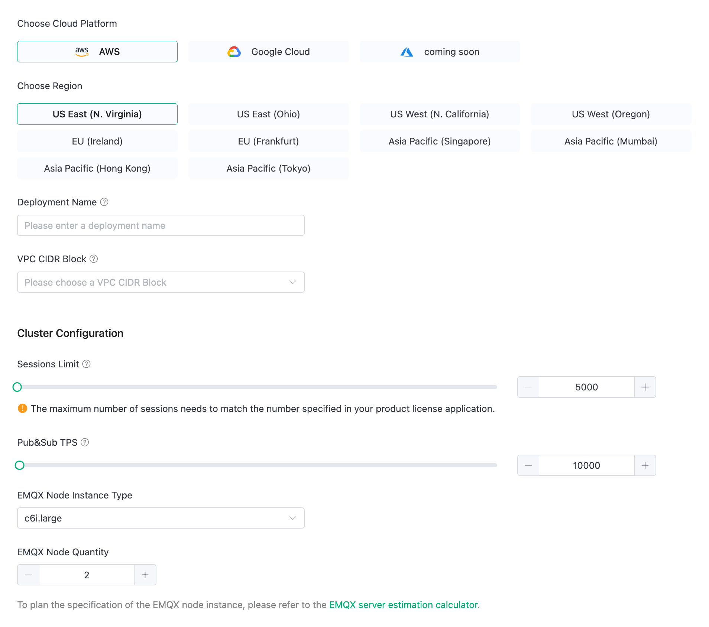
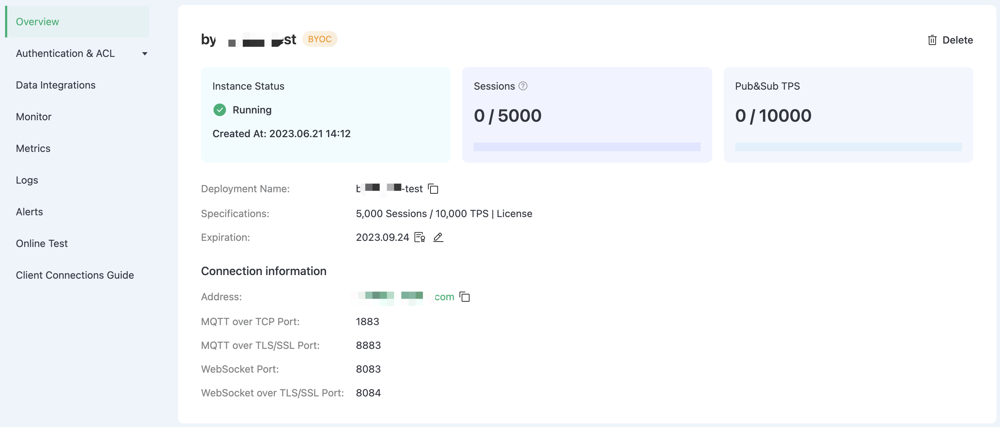

# Create BYOC Deployment

EMQX Cloud Bring Your Own Cloud (BYOC) plan supports creating deployments in your own cloud infrastructure to ensure that data is kept in your environment. This deployment improves data security and control while avoiding risks such as data leakage. In addition, EMQX Cloud BYOC deployment can provide better performance and scalability to meet the needs of different scenarios. This page describes how to create and use a BYOC deployment.

## Prerequisites

Before you create a BYOC deployment, you must prepare an account corresponding to the public cloud, plan cloud resources, and apply for an EMQX Cloud BYOC product license. For more information, see [Deployment Prerequisites](../deployments/byoc_prerequisite.md).

## Create Deployment

1. Log in to your account and enter the [EMQX Cloud console](https://cloud-intl.emqx.com/console/).

2. On the console homepage or the deployment list page, click **New Deployment**.

3. Click **Deploy Now** on the BYOC panel.

4. Configure the cloud platform and EMQX cluster according to your needs.

   

   **Cloud platform configuration**

   - **Choose Cloud Platform**: Select **AWS** or **Google Cloud**.

     If you want to deploy on other cloud platforms, you can contact us through a [ticket](../feature/tickets.md) or [email](mailto:cloud-support@emqx.io).

   - **Choose Region**: Select the region to be deployed.

     If you want to deploy in other regions, you can contact us through a [ticket](../feature/tickets.md) or [email](mailto:cloud-support@emqx.io).

   - **Deployment Name**: Enter a deployment name that has business meaning.

   - **VPC CIDR Block**: Select the private IP address range used to create the Virtual Private Cloud (VPC).

   **EMQX cluster configuration**
   ::: tip
   The maximum number of sessions must match the number specified in the EMQX Cloud BYOC license you request. After the deployment is complete, if you need to modify the sessions limit, you can contact us through a [ticket](../feature/tickets.md).
   :::

   - **Sessions Limit**: Specify the maximum number of concurrent sessions for MQTT devices connected at any given time.

   - **Pub&Sub TPS**: Specify the maximum number of transactions per second (TPS) for the messages sent and received.

   - **EMQX Node Instance Type**: Automatically selected based on the **sessions limit** and **Pub&Sub TPS**; You can also modify the instance type based on your actual business needs.

   - **EMQX Node Quantity**: Automatically filled based on the **sessions limit** and **Pub&Sub TPS**; You can also modify the number of nodes (2-5 nodes) based on your actual business needs.

5. Click **Next** to go to **Advanced Settings**. Add cloud resource tags according to your needs for resource management, with up to 10 tags supported.

6. Click **Next** to proceed to the **Confirm** page. Review and confirm the information specified in the steps above, and you can also change the project to which this deployment belongs. After confirming the information, click **Deploy**.

Next, we'll start the deployment by following the steps in the **Deployment Guide** panel on the right.

## Run Deployment

We will complete the deployment in an Ubuntu 20.04 (AMD64) environment with a public network connection. Before you start, copy your TLS/SSL certificates and BYOC license files required for deployment to your Ubuntu environment directory.

:::: tabs
::: tab "AWS"

1. Open the prepared Ubuntu 20.04 (AMD64) environment. This Ubuntu environment should be able to access the internet.

2. In the Ubuntu command line interface, use the command below to download the toolkit and save it to your Ubuntu directory.

   ```bash
   wget https://cloudassets.emqx.com/en/byoc-deployments/1.2/create-aws-byoc-deployment.tar.gz
   ```

3. Use the command line below to unzip the downloaded toolkit and navigate to the unzipped folder directory.

   ```bash
   tar -zxf create-aws-byoc-deployment.tar.gz && cd create-aws-byoc-deployment
   ```

4. Populate the actual parameters for the fields in the `./byoc create` command:

   ```bash
   ./byoc create \
         --platform aws \
         --accessKey <Your AccessKey> \
         --secretKey <Your SecretKey> \
         --domain <Your Domain> \
         --sslCertPath <Your Domain SSL Absolute Cert Path>  \
         --emqxLicPath <Your EMQX License Absolute Path> \
         --byocEndpoint https://cloud-intl.emqx.com \
         --byocKey abcdXXXXXXXXXX111
   ```

   - `--accessKey`: Enter your access key ID for your AWS IAM user.
   - `--secretKey`: Enter your access key secret for your AWS IAM user.
   - `--domain`: Enter the domain name (like your.domain.com) of the MQTT service in the deployment through which subsequent clients will access the MQTT service.
   - `--sslCertPath`: Specify the absolute path where the TLS/SSL certificate is located. Only CA-signed certificates are supported. For SSL certificate format requirements, refer to [Configure TLS/SSL](../deployments/byoc_ssl.md). Note: BYOC provides custom one-way TLS/SSL authentication.
   - `--emqxLicPath`: Enter the absolute path where the EMQX Cloud BYOC license file is located.

   Do not modify the following three values that are automatically filled in when the deployment guide is generated in the console.

   - `--platform` specifies the cloud provider.
   - `--byocEndpoint` is the EMQX Cloud access address.
   - `--byocKey` is the authentication key for BYOC deployment. The generated byocKey is valid for one hour, and should be executed as soon as possible after generating the script command.

5. Execute the `./byoc create` command and wait for a few minutes. The system prompts you to confirm the cloud resource that needs to be created. Enter `yes` to continue.

   ```bash
   Do you want to perform these actions?
     Terraform will perform the actions described above.
     Only 'yes' will be accepted to approve.
   
     Enter a value: 
   ```

:::
::: tab "Google Cloud"

1. Open the prepared Ubuntu 20.04 (AMD64) environment. This Ubuntu environment should be able to access the internet.

2. In the Ubuntu command line interface, use the command below to download the toolkit and save it to your Ubuntu directory.
	
	```bash
	wget https://cloudassets.emqx.com/en/byoc-deployments/1.2/create-gcp-byoc-deployment.tar.gz
	```

3. Use the command line below to unzip the downloaded toolkit and navigate to the unzipped folder directory.

   ```bash
   tar -zxf create-gcp-byoc-deployment.tar.gz && cd create-gcp-byoc-deployment
   ```

4. Populate the actual parameters for the fields in the `./byoc create` command:

   ```bash
   ./byoc create \
         --platform gcp \
         --projectID <Your Project ID> \
         --authJSONPath <The absolute path of your Service Account JSON file> \
         --domain <Your Domain> \
         --sslCertPath <Your Domain SSL Absolute Cert Path>  \
         --emqxLicPath <Your EMQX License Absolute Path> \
         --byocEndpoint https://cloud-intl.emqx.com \
         --byocKey abcdXXXXXXXXXX111
   ```

   - `--projectID`: Enter your Google Cloud project ID. You can find it in the project selector at the top bar of Google Cloud Console.
   - `--authJSONPath`: Enter the path to the JSON file for your [Google Cloud service account key](https://cloud.google.com/iam/docs/keys-create-delete#creating).
   - `--domain`: Enter the domain name (like your.domain.com) of the MQTT service in the deployment through which subsequent clients will access the MQTT service.
   - `--sslCertPath`: Specify the absolute path where the TLS/SSL certificate is located. Only CA-signed certificates are supported. For SSL certificate format requirements, refer to [Configure TLS/SSL](../deployments/byoc_ssl.md). Note: BYOC provides custom one-way TLS/SSL authentication.
   - `--emqxLicPath`：Enter the absolute path where the EMQX Cloud BYOC license file is located.

   Do not modify the following three values that are automatically filled in when the deployment guide is generated in the console.

   - `--platform` specifies the cloud provider.
   - `--byocEndpoint` is the EMQX Cloud access address.
   - `--byocKey` is the authentication key for BYOC deployment. The generated byocKey is valid for one hour, and should be executed as soon as possible after generating the script command. 

5. Execute the `./byoc create` command and wait for a few minutes. The system prompts you to confirm the cloud resource that needs to be created. Enter `yes` to continue.

   ```bash
   Do you want to perform these actions?
     Terraform will perform the actions described above.
     Only 'yes' will be accepted to approve.
   
     Enter a value: 
   ```
:::
::::

## Add DNS Record

When the deployment resources is created, the system returns the following information. Based on the returned IP address, you can add a domain name resolution record to the DNS service to bind the deployed public IP address to your domain name. For basic concepts such as DNS and domain name resolution, refer to [DNS Concepts](https://developers.cloudflare.com/dns/concepts/).

```bash
Apply complete! Resources: 30 added, 0 changed, 0 destroyed.

Outputs:
cloud_register_data = <sensitive>
jwt_token = <sensitive>
lb_address = "120.55.12.49"
vpc_id = "vpc-bp1wllXXXXXXXXX5j8i0"
*****************************
You need add a record to your DNS service provider.
IP address: 120.55.12.49
Domain: myexample.mqttce.com
*****************************
Checking if https://myexample.mqttce.com is resolved to the 120.55.12.49 of the load balancer
```

You can choose DNS resolution services provided by your cloud platforms or other managed DNS providers. Taking Cloud DNS of Google Cloud Platform as an example, you can follow the instruction: [Add, modify, and delete records | Cloud DNS | Google Cloud](https://cloud.google.com/dns/docs/records). 

When the DNS record takes effect, the system returns `HTTPS listener is ready`.

```bash
HTTPS listener is ready
```

## Complete Deployment
After the domain name resolution is completed, the Ubuntu command line interface will output the following to indicate that the deployment is successful.
```bash
The deployment is successful! Here is the service information:
--------------------------------------------------------
EMQX service connection address: <Your Custom Domain>
You can log in to the EMQX Cloud Console(https://cloud.emqx.com/console)
to manage your deployment.
--------------------------------------------------------
Thank you for choosing our service. Happy IoT!
```

## View Deployment

Return to the **Deployment Guide** page and click **Complete**. It will lead you to the EMQX Cloud console home page. Click the BYOC deployment card to enter the deployment overview page, and you can check the real-time status and connection information of the deployment.

   

* **Instance status**: Running status and duration of operation.
* **Sessions**: Current and maximum connection counts.
* **Pub&Sub TPS**: Current messages sent and received per second, as well as the TPS limit.
* **Deployment Name**: A customizable name for the deployment.
* **Specifications**: The maximum number of sessions, maximum Pub&Sub TPS, and billing mode of the current deployment.
* **Expiration**: The expiration day of applied EMQX Cloud BYOC License. You can check the license details and update the license here.
* **Address**: The domain name specified by the user at deployment time.
* By default, ports 1883 (MQTT), 8083 (WS), 8883 (MQTTS), and 8084 (WSS) are enabled. If you want to customize the port, you can contact us through a [ticket](../feature/tickets.md) or [email](mailto:cloud-support@emqx.io).


## Advanced Network Settings


### VPC Peering Configuration

A VPC peering is a network connection between two VPCs that allows two VPCs in different networks to communicate with each other. This feature is provided by a cloud service provider and supports peering connections between the VPC where the BYOC is deployed and other VPCs in the same cloud service provider. To configure the VPC peering, refer to the VPC Peering documentation for each public cloud: [Working with VPC Peering - Amazon Web Service](https://docs.aws.amazon.com/vpc/latest/peering/working-with-vpc-peering.html) and [VPC Network Peering - Google Cloud](https://cloud.google.com/vpc/docs/vpc-peering).
### NAT Gateway Configuration

The NAT gateway provided by the public cloud platform can provide network address translation services and provide BYOC deployments with the ability to access public network resources without the need for VPC peering connections. You can add NAT gateways in the VPC where BYOC is deployed. For more information, refer to the public cloud NAT gateway documentation: [NAT Gateways - Amazon Web Service](https://docs.aws.amazon.com/vpc/latest/userguide/vpc-nat-gateway.html) and [Cloud NAT - Google Cloud](https://cloud.google.com/nat/docs/overview).
## Connect to Deployment

You can connect to the deployment using any MQTT client tool for testing, for example, the recommended [MQTTX](../connect_to_deployments/mqttx.md).