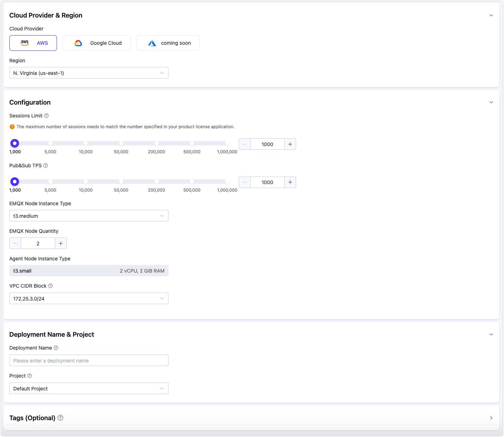
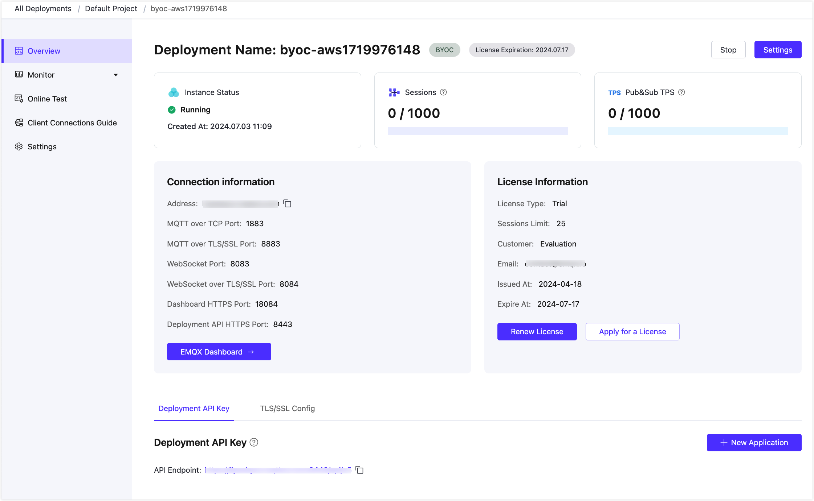

# Create BYOC Deployment

As an MQTT messaging middleware, EMQX Cloud BYOC supports creating deployments in your own cloud infrastructure to ensure that data is only in your environment and is secure and controllable. This deployment improves data security and control, while avoiding risks such as data leakage. In addition, EMQX Cloud BYOC can provide better performance and scalability to meet the needs of different scenarios. This section describes how to create and use a BYOC deployment.

## Prerequisite

Before you create a BYOC deployment, you must prepare the account corresponding to the public cloud, plan cloud resources, and apply for an EMQX Cloud BYOC product license. For more information, see [Deployment Prerequisite section](../deployments/byoc_prerequisite.md).

## Prepare for deployment

1. Log in to your account and enter the [EMQX Cloud console](https://cloud-intl.emqx.com/console/).

2. On the console homepage or the deployment list page, click **New Deployment**.

3. Click **Deploy Now** on the BYOC panel.

4. Choose the appropriate configuration according to your needs.

   

   **Cloud platform configuration**

   - **Choose Cloud Platform**: **Google Cloud**。

     If you want to deploy on other cloud platforms, you can contact us through a [ticket](../feature/tickets.md) or email (cloud-support@emqx.io).

   - **Choose Region**: Choose the region to be deployed。

     If you want to deploy in other regions, you can contact us through a [ticket](../feature/tickets.md) or email (cloud-support@emqx.io).

   - **Deployment Name**: Enter a deployment name that has business meaning.

   - **VPC CIDR Block**: Select the private IP address range used to create the VPC.

   **EMQX cluster configuration**
   ::: tip
   The maximum number of sessions needs to match the number specified in the EMQX Cloud BYOC license you are requesting. After the deployment is complete, if you need to modify the sessions limit, you can contact us through a [ticket](../feature/tickets.md).
   :::

   - **Sessions Limit**: Specify the maximum number of sessions of the MQTT devices connected at the same time.

   - **Pub&Sub TPS**: Specify the maximum number of transactions per second (TPS) for the messages sent and received.

   - **EMQX Node Instance Type**: The recommended instance type will be selected based on the **sessions limit** and **Pub&Sub TPS**. You can also modify the instance type based on your actual business needs.

   - **EMQX Node Quantity**: The recommended number of nodes will be filled based on the **sessions limit** and **Pub&Sub TPS**. You can also modify the number of nodes (2-5 nodes) based on your actual business needs.

5. Click **Next** to go to **Advanced Settings**, add cloud resource tags according to your needs for resource management, with up to 10 tags supported.

6. Click **Next** to proceed to the **Confirm** page. Review and confirm the information specified in the steps above, and you can also change the project to which this deployment belongs. After confirming the information, click **Deploy**.

Next, we'll start the deployment by following the steps in the right panel **Deployment Guide**.

## Run the deployment

We will complete the deployment in an Ubuntu 20.04 (AMD64) environment with public network connection, please copy your TLS/SSL certificates and BYOC license files required for deployment to your Ubuntu environment directory in advance.

1. Open the prepared Ubuntu 20.04 (AMD64) environment. Note: This Ubuntu should be able to access the internet.

2. On the Ubuntu command line interface, use the command below to download the toolkit and save it to your Ubuntu directory.
	
	```bash
	wget https://cloudassets.emqx.com/byoc/1.0/create-gcp-byoc-deployment.tar.gz
	```

3. On the Ubuntu command line interface, unzip the downloaded toolkit and navigate to the unzipped folder directory.

   ```bash
   tar -zxf create-gcp-byoc-deployment.tar.gz && cd create-gcp-byoc-deployment
   ```

4. Modify the value of the corresponding parameters according to the following command, and execute the command to deploy.

   ```bash
   ./byoc create \
         --platform gcp \
         --projectID <Your Project ID> \
         --authJSONPath <The absolute path of your Service Account JSON file> \
         --domain <Your Domain> \
         --sslCertPath <Your Domain SSL Absolute Cert Path>  \
         --emqxLicPath <Your EMQX License Absolute Path> \
         --byocEndpoint https://cloud-intl.emqx.com \
         --byocKey abcdXXXXXXXXXX111
   ```

   Note: Before executing `./byoc create` command, populate the following fields as actual parameters:

   - `--projectID`：Your Google Cloud project ID. You can find it in the project selector at the top bar of Google Cloud Console.
   - `--authJSONPath`：The path to the JSON file for your [Google Cloud service account key](https://cloud.google.com/iam/docs/keys-create-delete#creating).
   - `--domain` ：Enter the domain name of the MQTT service in the deployment through which subsequent clients will access the MQTT service.
   - `--sslCertPath`：Specifies the absolute path where the TLS/SSL certificate is located, self-signed certificates and CA-signed certificates are supported. For SSL certificate format requirements, refer to [TLS/SSL Configuration - Certificate Requirements](../deployments/tls_ssl.md#Certificate-Requirements). Note: BYOC provides custom one-way TLS/SSL authentication.
   - `--emqxLicPath`：Enter the absolute path where the EMQX Cloud BYOC license file is located.

   In addition, parameter `--platform` specifies the cloud provider, `--byocEndpoint` is the EMQX Cloud access address, `--byocKey` is the authentication key for BYOC deployment. The generated byocKey is valid for one hour, and should be executed as soon as possible after generating the script command. these three values have been automatically filled in when the deployment guide is generated in the console, please do not modify it.

5. Wait a few minutes, the system prompts you to confirm the cloud resource that needs to be created, enter `yes` to continue.

   ```bash
   Do you want to perform these actions?
     Terraform will perform the actions described above.
     Only 'yes' will be accepted to approve.
   
     Enter a value: 
   ```

## Add DNS records

When the deployment resources is created, the system returns the following information. Based on the returned IP address, you can add a domain name resolution record to the DNS service to bind the deployed public IP address to your domain name.

```bash
Apply complete! Resources: 30 added, 0 changed, 0 destroyed.

Outputs:
cloud_register_data = <sensitive>
jwt_token = <sensitive>
lb_address = "120.55.12.49"
vpc_id = "vpc-bp1wllXXXXXXXXX5j8i0"
*****************************
You need add a record to your DNS service provider.
IP address: 120.55.12.49
Domain: myexample.mqttce.com
*****************************
Checking if https://myexample.mqttce.com is resolved to the 120.55.12.49 of the load balancer
```

You can choose DNS resolution services provided by your cloud platforms or other managed DNS providers. We use Cloud DNS of Google Cloud Platform as an example, you can follow the instruction: [Add, modify, and delete records | Cloud DNS | Google Cloud](https://cloud.google.com/dns/docs/records). For basic concepts such as DNS and domain name resolution, refer to [DNS Concepts](https://developers.cloudflare.com/dns/concepts/).

When the DNS record takes effect, the system returns `HTTPS listener is ready`.

```bash
HTTPS listener is ready
```

## Complete the deployment
After the domain name resolution is completed, the Ubuntu command line interface will output the following to indicate that the deployment was successful.
```bash
The deployment is successful! Here is the service information:
--------------------------------------------------------
EMQX service connection address: <Your Custom Domain>
You can log in to the EMQX Cloud Console(https://cloud.emqx.com/console)
to manage your deployment.
--------------------------------------------------------
Thank you for choosing our service. Happy IoT!
```

## Check the deployment

Return to the **Deployment Guide** page and click **Complete**. It will jump to the EMQX Cloud console page, click the BYOC deployment card to enter the deployment overview page, and you can check the real-time status and connection information of the deployment:

   

* Instance status: Running status and duration of operation.
* Sessions: Current and maximum connection counts.
* Pub&Sub TPS: Current messages sent and received per second, as well as the TPS limit.
* Deployment name: A customizable name for the deployment.
* Specifications: The maximum number of sessions, maximum Pub&Sub TPS, and billing mode of the current deployment.
* Expiration: The expiration day of applied EMQX Cloud BYOC License. You can check the license details and update the license here.
* Address: The domain name specified by the user at deployment time.
* Ports: By default, ports 1883 (MQTT), 8083 (WS), 8883 (MQTTS), and 8084 (WSS) are enabled. If you want to customize the port, you can contact us through the [ticket](../feature/tickets.md) or email (cloud-support@emqx.io).


## Advanced network settings


### VPC peering configuration

A VPC peering is a network connection between two VPCs that allows two VPCs (Virtual Private Clouds) in different networks to communicate with each other. This feature is provided by a cloud service provider and supports peering connections between the VPC where the BYOC is deployed and other VPCs in the same service provider. Refer to the VPC Peering documentation for each public cloud to configure it:
- [VPC Network Peering | Google Cloud](https://cloud.google.com/vpc/docs/vpc-peering)

### NAT gateway configuration

The NAT gateway provided by the public cloud platform can provide network address translation services and provide BYOC deployments with the ability to access public network resources without the need for VPC peering connections. You can add NAT gateways in the VPC where BYOC is deployed, refer to the public cloud NAT gateway documentation:
- [Cloud NAT | Google Cloud](https://cloud.google.com/nat/docs/overview)

## Connect to the deployment

You can connect to the deployment using any MQTT client tool for testing, and we recommend using [MQTTX](../connect_to_deployments/mqttx.md) to connect to the deployment.