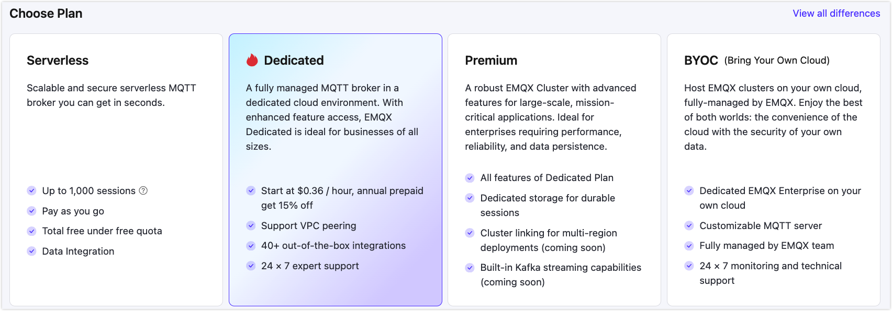

# Create Dedicated Deployment

EMQX Cloud's Dedicated Plan offers independent MQTT service clusters with with higher connection and Transactions Per Second (TPS) limits. It also supports more advanced features and complex network architectures. This guide uses the Dedicated Plan (Professional) as an example to walk you through the steps of creating and utilizing EMQX Cloud.

## Create a Deployment

1. Log in to [EMQX Cloud console](https://cloud-intl.emqx.com/console/). 

2. To initiate a new deployment for your project, navigate to either the Console's homepage or the Deployment List page. Here, click **+ New Deployment**.

3. Select the **Dedicated** tab.

   

4. Configure the specification according to your needs.

   - **Cloud Provider & Region**: See [Cloud Service Providers and Regions](../price/plans.md#supported-cloud-service-providers-and-regions) for support.
   - **Tier**: Select the specification from the drop-down box. Each specification limits a different maximum number of connections and TPS. If your requirements are not met, you can [contact us](https://www.emqx.com/contact?product=cloud).
   - **Billing Method**: You can select `Hourly billing` (to pay by the hour) or `Annual prepaid` (an annual billing plan).
   - **Deployment Name & Project**: Provide a name for your deployment and select the appropriate project.

5. Confirm the deployment information in the **Summary** area, and then click the **Deploy** button. This stage will prompt you to review and accept the *EMQX Cloud Services Agreement*. It's important to thoroughly read the agreement and accept its terms to proceed.

6. Upon accepting the terms, the deployment will begin. Once the deployment status changes to **Running**, your deployment is successfully created and ready for use.

## View Deployment

After the deployment is created, it will appear on the Cloud console home page. Click the Dedicated deployment card to enter the deployment overview page. On the overview page, you can check the real-time status and connection information for your deployment.

### Basic Information

- **Instance Status:** Running status and duration of operation.
- **Sessions:** Current and maximum connection counts.
- **Pub&Sub TPS:** Current messages sent and received per second, as well as the TPS limit.
- **Traffic:** Usage information for the deployed traffic, including monthly usage and free quota.

### Connection Information

- **Address**: The IP address
- **Ports**: `1883` (mqtt) and `8083` (ws) are enabled by default. You can configure TLS/SSL to enable `8883` (mqtts) and `8084` (wss) ports.

Check out the [Connection guide](../deployments/port_guide_dedicated.md) to learn more.

## Dedicated Deployment Features

To explore the advanced features of the Dedicated Plan, refer to the following links to the specific sections.

### [REST API](../api/introduction.md)

Provides REST APIs for integration with external systems, such as querying client information, publishing messages, and creating rules.

### [Configure TLS/SSL](../deployments/tls_ssl.md)

EMQX Cloud **Professional Deployment** provides custom one-way/two-way TLS/SSL configuration and supports self-signed and CA-signed certificates.

### [VPC Peering Connections](../deployments/vpc_peering.md)

VPC peering connection is a network connection between two VPCs. Through this connection, the instances in different VPCs can communicate with each other as if they are in the same network.

### [Configure PrivateLink](../deployments/privatelink.md)
PrivateLink enables the proprietary network VPC where the EMQX Cloud deployment is located to establish a secure and stable private connection to services on the public cloud. It simplifies the network architecture, enables private access to services, and avoids the potential security risks associated with accessing services over the public network.

### [Internal Load Balancers](../vas/intranet-lb.md)

Intranet load balancing is a service that distributes traffic on demand in the internal network, extending the throughput capacity of applications by distributing traffic to different back-end servers, and eliminating single points of failure in the system to improve the availability of applications.

### [NAT Gateway](../vas/nat-gateway.md)

NAT gateways can provide network address translation services to provide Professional deployments with the ability to access public network resources without the need for VPC peering connections.

## Connect to the Deployment

You can use any MQTT client tool to connect to the deployment for testing. It is recommended to use [MQTTX to connect to the deployment](../connect_to_deployments/mqttx.md).
