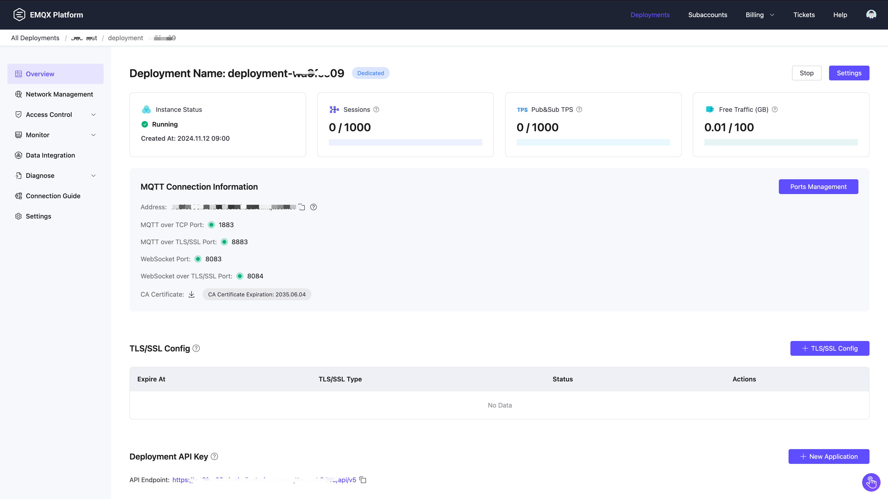

# Create Dedicated Deployment

EMQX Cloud's Dedicated Plan offers independent MQTT service instances/clusters with higher connection and TPS limits, as well as greater scalability. This guide will use the Dedicated Plan (Professional) as an example to walk you through the steps of creating and utilizing EMQX Cloud.

## Create a Deployment

1. Log in to [EMQX Cloud console](https://cloud-intl.emqx.com/console/). 

2. You can create a new deployment for a specific project from either the console homepage or the deployment list page. Click **+ New**.  

3. Click **Create Now** on the **Dedicated** tab.

   

4. Choose the appropriate tier and configurations based on your needs.

   - **Plan**: Choose the product plan.
- **Choose Cloud Platform**: You can choose from AWS, Azure, or Google Cloud. 
   - **Choose Region**: Choose the region to deploy EMQX Cloud. To deploy your EMQX Cloud in a different region, you can submit a request via a [ticket](../feature/tickets.md) or [email][cloud-support@emqx.io]. 
- **Choose Tier**: Each tier has different limits on the maximum number of connections and transactions per second (TPS), which can be upgraded or downgraded in later stages.
   - **Billing Method**: Choose between **Hourly billing** or Annual prepaid (with a 15% of discount).

   

5. Double-check your settings in the **New Deployment** tab, and click **Deploy**. 

6. As part of the deployment process, you'll be asked to agree to the *EMQX Cloud Services Agreement*, please review the agreement carefully and accept it if you agree with its terms. 

7. After agreeing to the agreement, the deployment process will begin and take about 5 minutes to complete. You can monitor the progress on the **Projects** page, and once the status changes to **Running**, your deployment has been successfully created and is ready for use.

## View Deployment

After the deployment is created, it will appear on the Cloud console home page. Click the Dedicated deployment card to enter the deployment overview page. On the overview page, you can check the real-time status and connection information for your deployment.

- **Instance status:** Running status and duration of operation.
- **Sessions:** Current and maximum connection counts.
- **Pub&Sub TPS:** Current messages sent and received per second, as well as the TPS limit.
- **Traffic:** Usage information for the deployed traffic, including monthly usage and free quota.
- **Deployment name:** A customizable name for the deployment.
- **Tiers:** The current tier of the deployment, including the ability to switch from hourly billing to annual billing.
- **Address:**
  - Professional Plan: IP
  - Standard Plan: Domain name ending with emqx.cloud
- **Ports:**
  - Professional Plan: `1883` (mqtt) and `8083` (ws) are enabled by default. You can configure TLS/SSL to enable 8883 (mqtts) and 8084 (wss) ports.
  - Standard Plan: `15xxx` (mqtt), `15xxx` (mqtts), `8083` (ws), and `8084` (wss) ports are enabled by default.

Check out the [Connection guide](../deployments/port_guide_dedicated.md) to learn more.

## Dedicated Deployment Features

To explore the advanced features of the Dedicated Plan, refer to the following links to the specific sections.

### [REST API](../api/introduction.md)

Provides REST APIs for integration with external systems, such as querying client information, publishing messages, and creating rules.

### [Configure TLS/SSL](../deployments/tls_ssl.md)

EMQX Cloud **Professional Deployment** provides custom one-way/two-way TLS/SSL configuration and supports self-signed and CA-signed certificates.

### [VPC Peering Connections](../deployments/vpc_peering.md)

VPC peering connection is a network connection between two VPCs. Through this connection, the instances in different VPCs can communicate with each other as if they are in the same network.

### [Configure PrivateLink](../deployments/privatelink.md)
PrivateLink enables the proprietary network VPC where the EMQX Cloud deployment is located to establish a secure and stable private connection to services on the public cloud. It simplifies the network architecture, enables private access to services, and avoids the potential security risks associated with accessing services over the public network.

### [Internal Load Balancers](../vas/intranet-lb.md)

Intranet load balancing is a service that distributes traffic on demand in the internal network, extending the throughput capacity of applications by distributing traffic to different back-end servers, and eliminating single points of failure in the system to improve the availability of applications.

### [NAT Gateway](../vas/nat-gateway.md)

NAT gateways can provide network address translation services to provide Professional deployments with the ability to access public network resources without the need for VPC peering connections.

## Connect to the Deployment

You can use any MQTT client tool to connect to the deployment for testing. It is recommended to use [MQTTX to connect to the deployment](../connect_to_deployments/mqttx.md).
