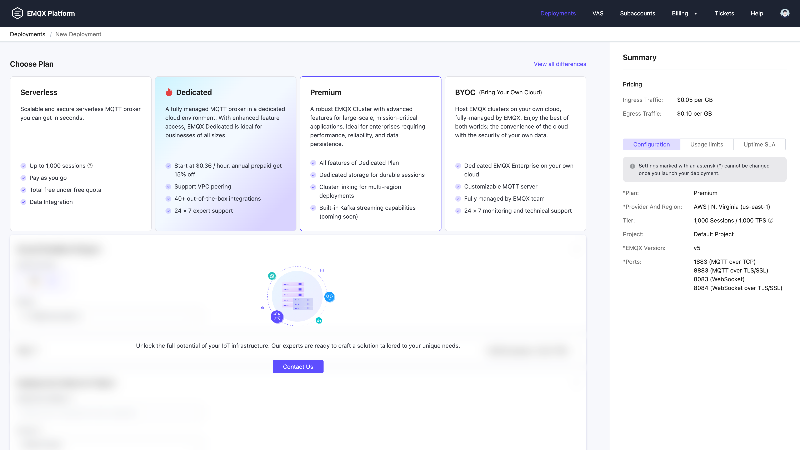
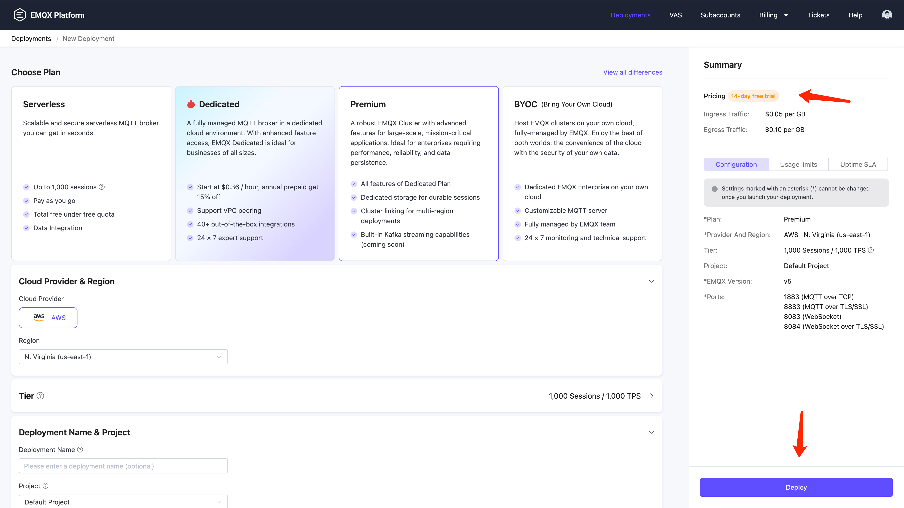

# Create a Premium Deployment

The EMQX Premium Plan offers a robust EMQX Cluster with advanced features for large-scale, mission-critical applications. This guide provides instructions on how to create a Premium deployment on the EMQX Platform.

## Apply for a Trial

EMQX Premium deployments can only be created by requesting a trial. Users cannot create them independently. You can contact us to request a trial period. Each user can create two trial Premium deployments during the trial period. If both deployments are deleted during the trial period, you cannot request the trial again. The trial period is free of charge, and you can enjoy all the features of the Premium Plan.

1. Log in to the [EMQX Platform Console](https://cloud-intl.emqx.com/console/).

2. To initiate a new deployment for your project, navigate to either the Console's homepage or the Deployment List page. Here, click **+ New Deployment**.

3. In **Choose Plan**, select **Premium**.

4. Click **Contact Us** at the bottom and you will be lead to the **Contact Sales** page where you can submit your trial application.

   

If your trial request is approved, you will receive an email with details about the trial period, deployment platform, and region, as well as the activation time.

## Create a Deployment

When your trial is activated, you can go to the Platform Console to deploy your Premium Plan.

1. Under the **Cloud Provider & Region**, select a deployment region.

1. Under the **Deployment Name & Project**, provide a name for your deployment and select the appropriate project.

2. Confirm the deployment information in the **Summary** area, and then click the **Deploy** button. This stage will prompt you to review and accept the *EMQX Platform Services Agreement*. It's important to thoroughly read the agreement and accept its terms to proceed.

   

3. Upon accepting the terms, the deployment will begin. Once the deployment status changes to **Running**, your deployment is successfully created and ready for use.

## View Deployment Information

After the deployment is created, it will appear on the EMQX Platform Console home page. Click the Premium deployment card to enter the deployment overview page. On the overview page, you can check the real-time status and connection information for your deployment.

### Basic Information

- **Instance Status**: Running status and deployment creation time.
- **Sessions**: Current and maximum connection counts.
- **Pub&Sub TPS**: Current messages sent and received per second, as well as the TPS limit.
- **Traffic**: Traffic usage information for the deployment, including all public network traffic that flows in and out of your deployment.
- **Storage**: The storage space can be used for Durable Sessions and Event History.

### Connection Information

- **Address**: The IP address.
- **Ports**: `1883` (mqtt), `8083` (ws), `8883` (mqtts), and `8084` (wss) ports are enabled by default.
- **Ports Management**: Allows you to disable or enable an individual port separately.

Check out the [Connection Guide](../deployments/port_guide_dedicated.md) to learn more.

## Premium Deployment Features

The Premium Plan provides you with the following advanced features.

### [Deployment API](https://docs.emqx.com/en/cloud/latest/api/dedicated)

Provides REST APIs for integration with external systems, such as querying client information, publishing messages, and creating rules.

### [Configure TLS/SSL](../deployments/tls_ssl.md)

The EMQX Premium deployment provides custom one-way/two-way TLS/SSL configuration and supports self-signed and CA-signed certificates.

### [VPC Peering Connections](../deployments/vpc_peering.md)

VPC peering connection is a network connection between two VPCs. Through this connection, the instances in different VPCs can communicate with each other as if they are in the same network.

### [Configure PrivateLink](../deployments/privatelink.md)

PrivateLink enables the proprietary network VPC where the EMQX Platform deployment is located to establish a secure and stable private connection to services on the public cloud. It simplifies the network architecture, enables private access to services, and avoids the potential security risks associated with accessing services over the public network.

### [Internal Endpoint](../vas/intranet-lb.md)

Internal Endpoint allows you to create an internal load-balancing service that distributes traffic on-demand within an internal network. It can expand the application system's throughput by distributing traffic to different backend servers.

### [NAT Gateway](../vas/nat-gateway.md)

NAT gateways can provide network address translation services to provide Premium deployments with the ability to access public network resources without the need for VPC peering connections.

### Dedicated Storage Layer

The Premium Plan provides a dedicated storage layer for each deployment, providing isolated and secure data storage. Data is stored across multiple availability zones for high availability, with automatic backups and easy restoration options, ensuring maximum reliability and data protection.

### Durable Sessions

Durable Session allows the EMQX Platform to persist client sessions to the built-in database instead of memory. Client session data is retained even after the server restarts, ensuring uninterrupted connectivity. 

### [Event History](../deployments/event_history.md)

The Event History service enables the EMQX Platform to record the client and message events for further monitoring and analysis.

### [Cluster Linking](../cluster_linking/cluster_linking.md)

The Cluster Linking feature facilitates client communication and message transmission between geographically distributed Premium deployments.

### [EMQX Streaming](../emqx_streaming/emqx_streaming.md)

The EMQX Streaming feature allows users to persistently store MQTT messages as data streams and consume them directly using Kafka clients.

## Connect to the Deployment

You can use any MQTT client tool to connect to the deployment for testing. It is recommended that MQTTX be used to [connect to the deployment](../connect_to_deployments/mqttx.md).

## Convert to a Commercial Deployment

At the end of the trial period, your trial deployment will be automatically stopped. If you wish to continue using the Premium deployment, please reach out to our [Sales](https://www.emqx.com/en/contact?product=cloud&productEdition=Premium) team to purchase the Premium Plan service. For detailed pricing information, refer to [Pricing - Premium Plan](../price/pricing.md#premium-plan).

::: tip

Users cannot convert a trial deployment to an annual subscription directly through the Platform Console. To make this conversion, please contact our Sales team, who will assist with the process in the backend.

:::