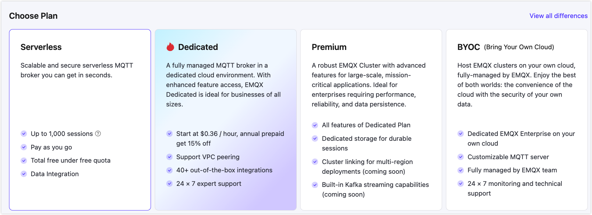
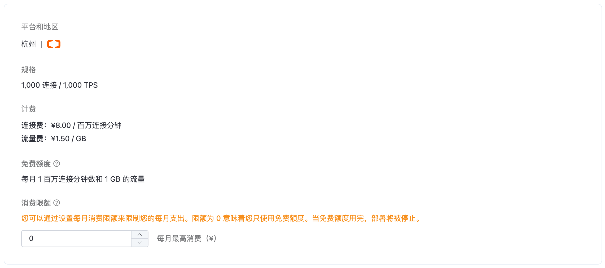
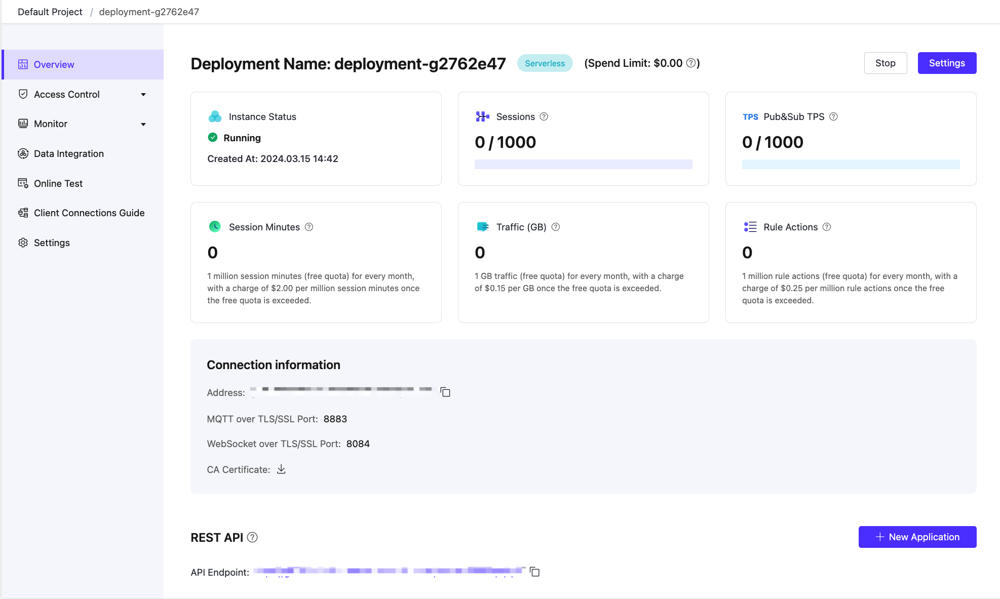
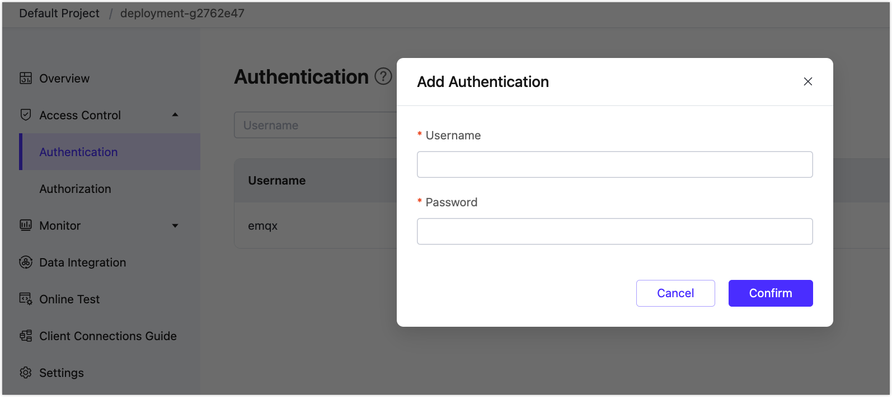
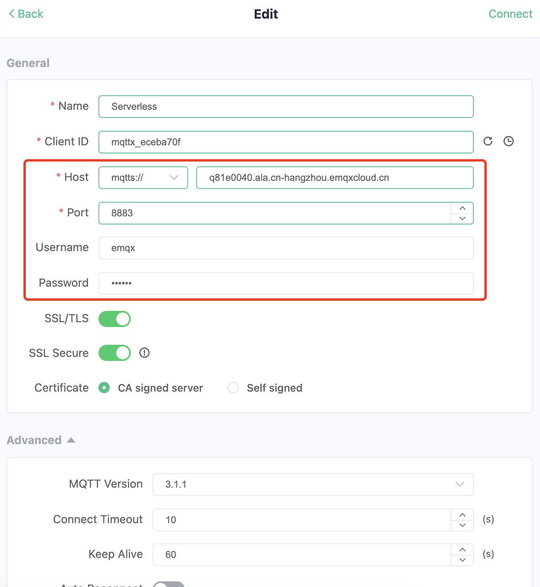

# Create Serverless Deployment

EMQX Cloud Serverless Plan offers a cost-effective and efficient way for developers or small businesses to test and develop IoT applications. This plan is based on secure and scalable clusters and can be easily deployed in just a few simple steps.

One of the biggest advantages of using Serverless deployment is that the billing for connection scenarios is based on actual usage. For more detailed information on the billing system, please refer to the pricing section in [Pricing and Billing](../price/pricing.md).

## Create Deployment

1. Log in to [EMQX Cloud console](https://cloud-intl.emqx.com/console/). 
2. You can create a new deployment for a specific project from either the Console homepage or the deployment list page. Click **+ New**.  
3. Click **Start for free** on the **Serverless** tab.

4. In the **New Deployment** page, you can set the monthly Spend Limit for your Serverless deployment to control usage and avoid unexpected charges beyond the free resources. It's initially set to 0, but can be modified after creation. Then click **Deploy** at the page bottom to start the process. 

5. As part of the deployment process, you'll be asked to agree to the *EMQX Cloud Services Agreement*, please review the agreement carefully and accept it if you agree with its terms. 
6. After agreeing to the agreement, the deployment process will begin. You can monitor the progress on the **Projects** page, and once the status changes to **Running**, your deployment has been successfully created and is ready for use.

## View Deployment

After the deployment is created, it will appear on the Cloud console home page. Click the Serverless deployment card to enter the deployment overview page. On the overview page, you can check the real-time status and connection information for your deployment.

   

- **Instance status:** Running status and duration of operation.
- **Sessions:** Current and maximum connection counts.
- **Pub&Sub TPS:** Current messages sent and received per second, as well as the TPS limit.
- **Session minutes**: Total number of session minutes used this month. This value is calculated with a one-hour delay.
- **Traffic:** Usage information for the deployed traffic, including monthly usage and free quota.
- **Deployment name:** A customizable name for the deployment.
- **Address:** The address for the client/terminal device to connect EMQX Cloud.
- **Ports:** `8883` (mqtts) and `8084` (wss) are enabled by default. Check out the [connection guide](../deployments/port_guide_serverless.md) to learn more.
- **Spend Limit**: Maximum spending limit for the current month. For more information, please refer to the [Spend Limit](../deployments/spend_limit.md) page.

::: warning
Serverless deployment only supports ports `8883` (mqtts) and `8084` (wss). If your client needs a CA file, you can click [here](https://assets.emqx.com/data/emqxsl-ca.crt) to download.

:::

## Test Connection for the Deployment

EMQX Cloud recommends using [MQTTX](https://mqttx.app) to test the connection to the deployment, but you can also use your preferred [SDK or other tools](../connect_to_deployments/overview.md) to connect to it. Before connecting to the deployment using MQTTX, you first need to obtain the deployment connection address (Host) and port (Port) and also use a user for authentication.

1. Get the connection information. Click **Overview** on the left navigation menu to find the deployment connection address and port. 

2. Add client authentication information. Go to the deployment overview page, and click **Authentication & ACL** -> **Authentication**. Then, click on the **Add** button, enter the username and password for the client or device, and click **Confirm**.

   

Now you can set up the connection information in MQTTX as follows and start to test the connection. 

After the connection succeeds, you can try to subscribe and publish. 

## Stopped and Deleted by the system

**Stopped by the system**: The deployment will be stopped if there are no active client connections for 30 consecutive days. If you want to continue using it, please manually enable it in the console. 

**Deleted by the system**: The deployment will be deleted if it still remains inactive for 30 days after being stopped.

