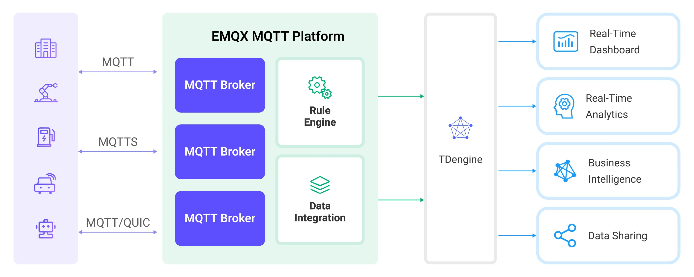

# Ingest MQTT Data into TDengine

[TDengine](https://tdengine.com/) is a big data platform, designed and optimized specifically for the Internet of Things (IoT) and Industrial Internet of Things (IIoT) scenarios. At its heart lies a high-performance time-series database, characterized by its cluster-oriented architecture, cloud-native design, and minimalistic approach. EMQX Cloud supports integration with TDengine, enabling massive data transmission, storage, analysis, and distribution from a large number of devices and data collectors. It provides real-time monitoring and early warning of business operation states, offering real-time business insights.

This page provides a comprehensive introduction to the data integration between EMQX Cloud and TDengine with practical instructions on creating and validating the data integration.

## How It Works

TDengine data integration is a built-in feature in EMQX Cloud. With a built-in [rule engine](./rules.md) component, the integration simplifies the process of ingesting data from EMQX Cloud to TDengine, eliminating the need for complex coding. EMQX Cloud forwards device data to TDengine through the rule engine and action. Through the TDengine data integration, MQTT messages and client events can be stored in TDengine. Additionally, data updates or deletions in TDengine can be triggered by events, thereby enabling the recording of information such as device online status and historical online/offline events.

The diagram below illustrates the typical architecture of EMQX Cloud and TDengine data integration in the industrial IoT:



Taking the industrial energy consumption management scenario as an example, the workflow is as follows:

1. **Message publication and reception**: Industrial devices establish successful connections to EMQX Cloud through the MQTT protocol and regularly publish energy consumption data using the MQTT protocol. This data includes production line identifiers and energy consumption values. When EMQX Cloud receives these messages, it initiates the matching process within its rules engine.  
2. **Rule Engine Processes Messages**: The built-in rule engine processes messages from specific sources based on topic matching. When a message arrives, it passes through the rule engine, which matches it with corresponding rules and processes the message data. This can include transforming data formats, filtering specific information, or enriching messages with context information.
3. **Data ingestion into TDengine**: Rules defined in the rule engine trigger operations to write messages to TDengine. The TDengine action provides SQL templates that allow flexible definitions of the data format to write specific message fields to the corresponding tables and columns in TDengine.

After energy consumption data is written to TDengine, you can analyze your data in real-time using standard SQL and powerful time-series extensions, seamlessly integrating with numerous third-party batch analyses, real-time analysis, reporting tools, AI/ML tools, and visualization tools. For example:

- Connect to visualization tools such as Grafana to generate charts and display energy consumption data.
- Connect to application systems such as ERP or Power BI for production analysis and production plan adjustments.
- Connect to business systems to perform real-time energy usage analysis, facilitating data-driven energy management.

## Features and Benefits

The TDengine data integration brings the following features and advantages to your business:

- **Efficient Data Handling**: EMQX Cloud can handle a large number of IoT device connections and message throughput efficiently. TDengine excels in data writing, storage, and querying, meeting the data processing needs of IoT scenarios without overwhelming the system.
- **Message Transformation**: Messages can undergo rich processing and transformation within EMQX Cloud rules before being written to TDengine.
- **Cluster and Scalability**: EMQX Cloud and TDengine support clustering capabilities and are built on cloud-native architecture, enabling full utilization of the cloud platform's elastic storage, computing, and network resources, allowing for flexible horizontal scaling as your business grows to meet expanding demands. 
- **Advanced Querying Capabilities**: TDengine provides optimized functions, operators, and indexing techniques for efficient querying and analysis of timestamp data, enabling precise insights to be extracted from IoT time-series data.

## Before You Start

This section describes the preparations you must complete before you start creating the TDengine data integration, including how to set up the TDengine server and create data tables.

### Prerequisites

- Knowledge about [data integration](./introduction.md)
- Knowledge about EMQX Cloud data integration [rules](./rules.md)

### Install TDengine

Install TDengine via Docker, and then run the docker image. 

```bash
# To start the TDengine docker image 
docker run --name TDengine -p 6041:6041 tdengine/tdengine

# Access the container
docker exec -it TDengine bash

# Locate the TDengine server in the container
taos

# Create and then select the database
CREATE DATABASE mqtt;

use mqtt;
```

### Create Data Tables in TDengine

Before you create data bridges for TDengine, you need to create a data tables in TDengine database for message storage. 

1. Use the following SQL statements to create data table `t_mqtt_msg` in TDengine database. The data table stores the client ID, topic, payload, and creation time of every message. 

```sql
   CREATE TABLE t_mqtt_msg (
       ts timestamp,
       msgid NCHAR(64),
       mqtt_topic NCHAR(255),
       qos TINYINT,
       payload BINARY(1024),
       arrived timestamp
     );
```

## Create a Connector

Before creating data integration rules, you need to first create a TDengine connector to access the TDengine server.

1.  Go to your deployment. Click **Data Integration** from the left-navigation menu.If it is the first time for you to create a connector, select **TDengine** under the **Data Persistence** category. If you have already created connectors, select **New Connector** and then select **TDengine** under the **Data Persistence** category.

2. **Connector Name**: The system will automatically generate a connector name.

3. Enter the connection information:

   - **Server Host**: Enter `http://127.0.0.1:6041`, or the actual URL if the TDengine server is running remotely.
   - **Username**: Enter `root`.
   - **Password**: Enter `taosdata`.
   - Configure advanced settings according to your business needs (optional).
4. Click the **Test** button. If the TDengine service is accessible, a prompt indicating **connector available** will be returned.

5. Click the **New** button to complete the creation.

Next, you can create data bridge rules based on this Connector.

## Create a Rule

This section demonstrates how to create a TDengine Rule and add action to the rule via the EMQX Cloud Console.

1. Click **New Rule** in Rules area or click the New Rule icon in the **Actions** column of the connector you just created.

2. Set the rules in the **SQL Editor** based on the feature to use, Our goal is to trigger the engine when the client sends a temperature and humidity message to the temp_hum/emqx topic. Here you need a certain process of SQL:

   ```sql
    SELECT
      *,
      now_timestamp('millisecond')  as ts
    FROM
      "temp_hum/emqx"
   ```

   ::: tip

   If you are a beginner user, click **SQL Examples** and **Enable Test** to learn and test the SQL rule.

   :::

3. Click **Next** to add an action.


4. Select the connector you just created from the **Connector** dropdown box.

5.  **Database Name**: Enter `mqtt`.

6.  Configure the **SQL Template** for the action. You can use the following SQL to complete data insertion. It also supports batch setting via CSV file. For details, refer to [Batch Setting](#batch-setting).

   ```sql
   INSERT INTO t_mqtt_msg(ts, msgid, mqtt_topic, qos, payload, arrived) 
       VALUES (${ts}, '${id}', '${topic}', ${qos}, '${payload}', ${timestamp})
   ```

7. Expand **Advanced Settings** to configure Sync/Async mode, queue and batch, and other parameters as appropriate Advanced Settings Options (optional)

8. Click the **Confirm** button to complete the rule creation.
   
9. In the **Successful new rule** pop-up, click **Back to Rules**, thus completing the entire data integration configuration chain.

## Test the Rule

You are recommended to use [MQTTX](https://mqttx.app/) to simulate temperature and humidity data reporting, but you can also use any other client.

1. Use MQTTX to connect to the deployment and send messages to the following Topic.

   - topic: `temp_hum/emqx`

   - client id: `test_client`

   - payload:

     ```json
     {
       "temp": "27.5",
       "hum": "41.8"
     }
     ```


2. Check the running status of the action, there should be 1 new incoming and 1 new outgoing message.

3. Check whether the data is written into the `t_mqtt_msg` data table. 

```bash
taos> select * from t_mqtt_msg;
           ts            |             msgid              |           mqtt_topic           | qos  |            payload             |         arrived         |
==============================================================================================================================================================
 2024-03-29 06:57:37.300 | 000614C727B230AE67180100069... | temp_hum/emqx                            |    1 | {
  "temp": "27.5",
  "hum"... | 2024-03-29 06:57:37.300 |
Query OK, 1 row(s) in set (0.002968s)
```


### Batch Setting

In TDengine, a single data entry may contain hundreds of data points, making the task of writing SQL statements challenging. To address this issue, EMQX Cloud offers a feature for batch setting SQL.

When editing the SQL template, you can use the batch setting feature to import fields for insertion operations from a CSV file.

1. Click the **Batch Setting** button below the **SQL Template** to open the **Import Batch Setting** popup.

2. Follow the instructions to download the batch setting template file, then fill in the key-value pairs of Fields in the template file. The default template file content is as follows:

   | Field      | Value             | Char Value | Remarks (Optional) |
   | ---------- | ----------------- | ---------- | ------------------ |
   | ts         | now               | FALSE      | Example Remark     |
   | msgid      | ${id}             | TRUE       |                    |
   | mqtt_topic | ${topic}          | TRUE       |                    |
   | qos        | ${qos}            | FALSE      |                    |
   | temp       | ${payload.temp}   | FALSE      |                    |
   | hum        | ${payload.hum}    | FALSE      |                    |
   | status     | ${payload.status} | FALSE      |                    |

   - **Field**: Field key, supports constants or ${var} format placeholders.
   - **Value**: Field value, supports constants or ${var} format placeholders. Although SQL requires character types to be wrapped in quotes, quotes are not needed in the template file, but whether the field is a character type is specified in the `Char Value` column.
   - **Char Value**: Used to specify whether the field is a character type, to add quotes to the field when generating SQL upon import. If the field is a character type, fill in `TRUE` or `1`; otherwise, fill in `FALSE` or `0`.
   - **Remarks**: Used only for notes within the CSV file, cannot be imported into EMQX Cloud.

   Note that the data in the CSV file for batch setting should not exceed 2048 rows.

3. Save the filled template file and upload it to the **Import Batch Setting** popup, then click **Import** to complete the batch setting.

4. After importing, you can further adjust the SQL in the **SQL Template**, such as setting table names, formatting SQL code, etc.