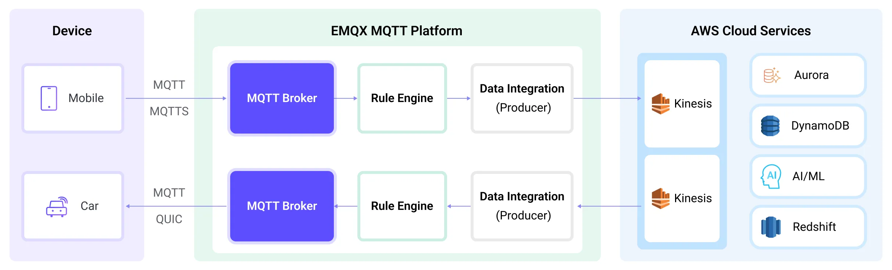
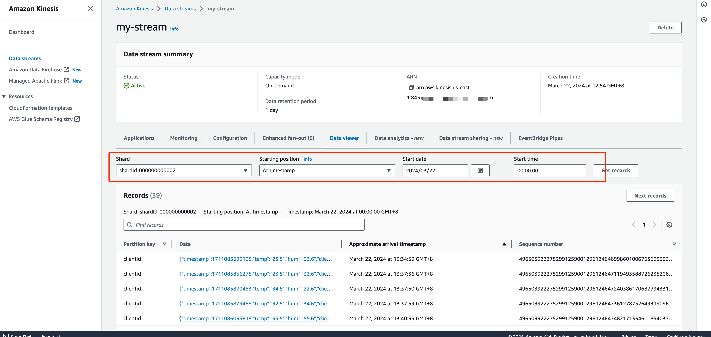

# Stream MQTT Data into Amazon Kinesis

[AWS Kinesis](https://aws.amazon.com/cn/kinesis/) is a fully managed real-time streaming data processing service on AWS that facilitates easy collection, processing, and analysis of streaming data. It can economically and efficiently handle streaming data of any scale in real-time and offers high flexibility, capable of low-latency processing of any amount of streaming data from hundreds of thousands of sources.

EMQX Cloud supports seamless integration with [Amazon Kinesis Data Streams](https://aws.amazon.com/kinesis/data-streams/), enabling the connection of massive IoT devices for real-time message collection and transmission. Through the data integration, it connects to Amazon Kinesis Data Streams for real-time data analysis and complex stream processing.

This page provides a detailed introduction to the functional features of Kafka Data Integration and offers practical guidance for creating it. The content includes creating Amazon Kinesis connectors, creating rules, and testing rules. It demonstrates how to report simulated temperature and humidity data to EMQX Cloud via the MQTT protocol and store the data in Amazon Kinesis through configured data integration.

## How It Works

Amazon Kinesis data integration is an out-of-the-box feature of EMQX designed to help users seamlessly integrate MQTT data streams with Amazon Kinesis and leverage its rich services and capabilities for IoT application development.



EMQX forwards MQTT data to Amazon Kinesis through the rule engine and Sink. The complete process is as follows:

1. **IoT Devices Publish Messages**: Devices publish telemetry and status data through specific topics, triggering the rule engine.
2. **Rule Engine Processes Messages**: Using the built-in rule engine, MQTT messages from specific sources are processed based on topic matching. The rule engine matches corresponding rules and processes messages, such as converting data formats, filtering specific information, or enriching messages with contextual information.
3. **Bridging to Amazon Kinesis**: The action triggered by rules to forward messages to Amazon Kinesis allows for custom configuration of partition keys, the data stream to write to, and message format, enabling flexible data integration.

After MQTT message data is written to Amazon Kinesis, you can perform flexible application development, such as:

- Real-time Data Processing and Analysis: Utilize powerful Amazon Kinesis data processing and analysis tools and its own streaming capabilities to perform real-time processing and analysis of message data, obtaining valuable insights and decision support.
- Event-Driven Functionality: Trigger Amazon event handling to achieve dynamic and flexible function triggering and processing.
- Data Storage and Sharing: Transmit message data to Amazon Kinesis storage services for secure storage and management of large volumes of data. This allows you to share and analyze this data with other Amazon services to meet various business needs.

## Features and Advantages

The data integration between EMQX Cloud and AWS Kinesis Data Streams can bring the following functionalities and advantages to your business:

- **Reliable Data Transmission and Sequence Guarantee**: Both EMQX and AWS Kinesis Data Streams provide reliable data transmission mechanisms. EMQX ensures the reliable transmission of messages through the MQTT protocol, while AWS Kinesis Data Streams uses partitions and sequence numbers to guarantee message ordering. Together, they ensure that messages sent from devices accurately reach their destination and are processed in the correct order.
- **Real-time Data Processing**: High-frequency data from devices can undergo preliminary real-time processing through EMQX's rule SQL, effortlessly filtering, extracting, enriching, and transforming MQTT messages. After sending data to AWS Kinesis Data Streams, further real-time analysis can be implemented by combining AWS Lambda and AWS-managed Apache Flink.
- **Elastic Scalability Support**: EMQX can easily connect millions of IoT devices and offers elastic scalability. AWS Kinesis Data Streams, on the other hand, employs on-demand automatic resource allocation and expansion. Applications built with both can scale with connection and data sizes, continuously meeting the growing needs of the business.
- **Persistent Data Storage**: AWS Kinesis Data Streams provides persistent data storage capabilities, reliably saving millions of incoming device data streams per second. It allows for the retrieval of historical data when needed and facilitates offline analysis and processing.

Utilizing AWS Kinesis Data Streams to build a streaming data pipeline significantly reduces the difficulty of integrating EMQX with the AWS platform, providing users with richer and more flexible data processing solutions. This can help EMQX users to build functionally complete and high-performance data-driven applications on AWS.

## Before You Start

This section introduces the preparatory work needed to create AWS Kinesis Data Integration in EMQX Cloud.

### Prerequisites

- Understand [rules](./rules.md).
- Understand [data integration](./introduction.md).

### Create Stream in Amazon Kinesis Data Streams

Follow the steps below to create a Stream via the AWS Management Console (see this [tutorial](https://docs.aws.amazon.com/streams/latest/dev/how-do-i-create-a-stream.html) for more details).

1. Sign in to the AWS Management Console and open the Kinesis console.

2. In the navigation bar, expand the Region selector and choose a Region.

3. Choose **Create data stream**.

4. On the Create Kinesis stream page, enter a name for your data stream and then choose the **On-demand** or **Provisioned** capacity mode.

### Emulate Amazon Kinesis Data Streams locally

To facilitate the development and test, you can emulate the Amazon Kinesis Data Streams service locally via LocalStack. With [LocalStack](https://www.localstack.cloud/), you can run your AWS applications entirely on your local machine without connecting to a remote cloud provider.

1. Install and run it using a Docker Image:

   ```bash
   # To start the LocalStack docker image locally
    docker run --name localstack -p '4566:4566' -e 'KINESIS_LATENCY=0' -d localstack/localstack:2.1

    # Access the container
    docker exec -it localstack bash
    ```

2. Create a stream named **my_stream** with only one shard:

    ```bash
    awslocal kinesis create-stream --stream-name "my_stream" --shard-count 1
    ```

## Create a Amazon Kinesis Connector

Before creating data integration rules, you need to first create a Amazon Kinesis connector to access the server.

1. Go to your deployment. Click **Data Integration** from the left-navigation menu.
2. If it is the first time for you to create a connector, select **Amazon Kinesis** under the **Data Forward** category. If you have already created connectors, select **New Connector** and then select **Amazon Kinesis** under the **Data Forward** category.
3. On the **New Connector** page, configure the following options:
   - Amazon Kinesis Endpoint: Enter the [Endpoint](https://docs.aws.amazon.com/general/latest/gr/ak.html) for the Kinesis service. Make sure to include the prefix "https://". If you are using LocalStack, use `http://localhost:4566`.
   - AWS Access Key ID: Enter the [Access key ID](https://docs.aws.amazon.com/powershell/latest/userguide/creds-idc.html). If using LocalStack, enter any value.
   - AWS Secret Access Key: Enter the [secret access key](https://docs.aws.amazon.com/powershell/latest/userguide/creds-idc.html). If using LocalStack, enter any value.
   - Use default values for other settings, or configure them according to your business needs.
4. Click the **Test** button. If the Kafka service is accessible, a success prompt will be returned.
5. Click the **New** button to complete the creation.

## Create Rules

Next, you need to create a rule to specify the data to be written and add corresponding actions in the rule to forward the processed data to Amazon Kinesis.

1. Click **New Rule** in Rules area or click the New Rule icon in the **Actions** column of the connector you just created.

2. Enter the rule matching SQL statement in the **SQL editor**. The following SQL example reads the message reporting time `up_timestamp`, client ID, and message body (Payload) from messages sent to the `temp_hum/emqx` topic, extracting temperature and humidity.

   ```sql
   SELECT 
   timestamp,
   clientid, 
   payload.temp as temp, 
   payload.hum as hum
   
   FROM
   "temp_hum/emqx"
   ```

   You can use **Enable Test** to simulate data input and test the results.

3. Click **Next** to add an action.

4. Select the connector you just created from the **Connector** dropdown box.

5. Configure the following information:

   - **Action Name**: The system will automatically generate an action name.
   - **Amazon Kinesis Stream**: Enter the stream name you created in Create Stream in Amazon Kinesis Data Streams.
   - **Partition Key**: Enter the Partition Key that shall be associated with records that are sent to this stream. Placeholders of the form ${variable_name} are allowed (see next step for example on placeholders).
   - In the **Payload Templat** field, leave it blank or define a template.
     - If left blank, it will encode all visible inputs from the MQTT message using JSON format, such as clientid, topic, payload, etc.
     - If using the defined template, placeholders in the format of ${variable_name} will be substituted with the corresponding values from the MQTT context. For instance, if the MQTT message topic is my/topic, ${topic} will be replaced with it. And you have the flexibility to adjust the template according to your requirements. Simply input the temperature and humidity values that need to be forwarded.

        ```bash
        {"timestamp": ${timestamp}, "client_id": ${client_id}, "temp": ${temp}, "hum": ${hum}}
        ```

   - Advanced settings (optional): Choose whether to use buffer queue and batch mode as needed.

6. Click the **Confirm** button to complete the rule creation.

7. In the **Successful new rule** pop-up, click **Back to Rules**, thus completing the entire data integration configuration chain.

## Test Rules

You are recommended to use [MQTTX](https://mqttx.app/) to simulate temperature and humidity data reporting, but you can also use any other client.

1. Use MQTTX to connect to the deployment and send messages to the following Topic.

   - topic: `temp_hum/emqx`

   - payload:

     ```json
     {"temp":"23.5","hum":"32.6"}
     ```

2. View operational data in the console. Click the rule ID in the rule list, and you can see the statistics of the rule and the statistics of all actions under this rule.

3. Go to [Amazon Kinesis Data Viewer](https://docs.aws.amazon.com/streams/latest/dev/data-viewer.html). You should see the message when getting records.

    

4. Use LocalStack to Check

    If you use LocalStack, follow the steps below to check the received data.

    ① Use the following command to get the ShardIterator before sending the message to the EMQX.

    ```bash
    awslocal kinesis get-shard-iterator --stream-name my_stream --shard-id shardId-000000000000 --shard-iterator-type LATEST
    {
    "ShardIterator": "AAAAAAAAAAG3YjBK9sp0uSIFGTPIYBI17bJ1RsqX4uJmRllBAZmFRnjq1kPLrgcyn7RVigmH+WsGciWpImxjXYLJhmqI2QO/DrlLfp6d1IyJFixg1s+MhtKoM6IOH0Tb2CPW9NwPYoT809x03n1zL8HbkXg7hpZjWXPmsEvkXjn4UCBf5dBerq7NLKS3RtAmOiXVN6skPpk="
    }
    ```

    ② Use MQTTX to send messages on the topic `temp_hum/emqx`.

    ③ Read the records and decode the received data.

    ```bash
    awslocal kinesis get-records n--shard-iterator="AAAAAAAAAAG3YjBK9sp0uSIFGTPIYBI17bJ1RsqX4uJmRllBAZmFRnjq1kPLrgcyn7RVigmH+WsGciWpImxjXYLJhmqI2QO/DrlLfp6d1IyJFixg1s+MhtKoM6IOH0Tb2CPW9NwPYoT809x03n1zL8HbkXg7hpZjWXPmsEvkXjn4UCBf5dBerq7NLKS3RtAmOiXVN6skPpk="
    {
        "Records": [
            {
                "SequenceNumber": "49642650476690467334495639799144299020426020544120356866",
                "ApproximateArrivalTimestamp": 1689389148.261,
                "Data": "eyAibXNnIjogImhlbGxvIEFtYXpvbiBLaW5lc2lzIiB9",
                "PartitionKey": "key",
                "EncryptionType": "NONE"
            }
        ],
        "NextShardIterator": "AAAAAAAAAAFj5M3+6XUECflJAlkoSNHV/LBciTYY9If2z1iP+egC/PtdVI2t1HCf3L0S6efAxb01UtvI+3ZSh6BO02+L0BxP5ssB6ONBPfFgqvUIjbfu0GOmzUaPiHTqS8nNjoBtqk0fkYFDOiATdCCnMSqZDVqvARng5oiObgigmxq8InciH+xry2vce1dF9+RRFkKLBc0=",
        "MillisBehindLatest": 0
    }

    echo 'eyAibXNnIjogImhlbGxvIEFtYXpvbiBLaW5lc2lzIiB9' | base64 -d
    {"temp":"23.5","hum":"32.6"}
    ```
